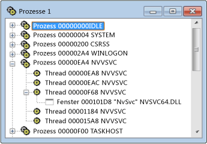

# Processes View
[!INCLUDE[vs2017banner](../code-quality/includes/vs2017banner.md)]

In der Prozessansicht wird eine Struktur aller aktiven Prozesse im System angezeigt.  Es werden die Prozess\-ID und der Modulname angezeigt.  Verwenden Sie die Prozessansicht, wenn Sie einen bestimmten Systemprozess untersuchen möchten. Ein Systemprozess entspricht normalerweise einem ausgeführten Programm.  Prozesse werden nach Modulnamen identifiziert, oder sie sind festgelegte Systemprozesse.  
  
 Microsoft Windows unterstützt mehrere Prozesse.  Jeder Prozess kann einen oder mehrere Threads aufweisen, und jedem Thread können ein oder mehrere Fenster der obersten Ebene zugeordnet sein.  Jedes Fenster der obersten Ebene kann Besitzer einer Reihe von Fenstern sein.  Das \+\-Symbol gibt an, dass eine Ebene reduziert ist.  Die reduzierte Ansicht besteht aus einer Zeile pro Prozess.  Klicken Sie auf das \+\-Symbol, um die Ebene zu erweitern.  
  
 Verwenden Sie die Prozessansicht, wenn Sie einen bestimmten Systemprozess untersuchen möchten. Ein Systemprozess entspricht normalerweise einem ausgeführten Programm.  Prozesse werden nach Modulnamen identifiziert, oder sie sind festgelegte Systemprozesse. Reduzieren Sie die Struktur, und durchsuchen Sie die Liste, um nach einem Prozess zu suchen.  
  
## Arbeitsschritte  
  
#### So öffnen Sie die Prozessansicht  
  
1.  Klicken Sie im Menü **Spy** auf **Prozesse**.  
  
   
Spy\+\+\-Prozessansicht  
  
 Die obige Abbildung zeigt die Prozessansicht mit erweiterten Prozess\- und Threadknoten.  
  
### In diesem Abschnitt  
 [Suchen nach einem Prozess in der Prozessansicht](../debugger/how-to-search-for-a-process-in-processes-view.md)  
 Erklärt, wie Sie einen bestimmten Prozess in der Prozessansicht finden.  
  
 [Anzeigen von Prozesseigenschaften](../debugger/how-to-display-process-properties.md)  
 Erklärt, wie weitere Informationen zu einer Meldung angezeigt werden.  
  
### Verwandte Abschnitte  
 [Spy\+\+\-Ansichten](../debugger/spy-increment-views.md)  
 Erklärt die Spy\+\+\-Strukturansichten von Fenstern, Meldungen, Prozessen und Threads.  
  
 [Verwenden von Spy\+\+](../debugger/using-spy-increment.md)  
 Stellt das Tool Spy\+\+ vor und erläutert die Verwendung.  
  
 [Dialogfeld "Prozesssuche"](../debugger/process-search-dialog-box.md)  
 Wird verwendet, um in der Prozessansicht den Knoten für einen bestimmten Prozess zu suchen.  
  
 [Dialogfeld "Prozesseigenschaften"](../debugger/process-properties-dialog-box.md)  
 Zeigt die Eigenschaften eines in der Prozessansicht ausgewählten Prozesses an.  
  
 [Spy\+\+\-Referenz](../debugger/spy-increment-reference.md)  
 Enthält Abschnitte mit Beschreibungen der einzelnen Spy\+\+\-Menüs und \-Dialogfelder.