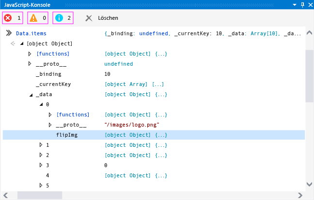
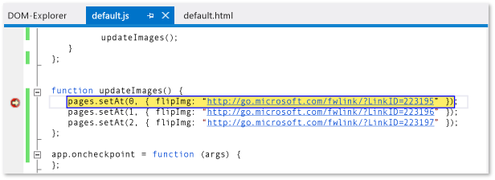
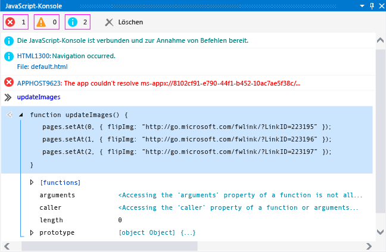
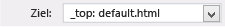

# <a name="debug-javascript-using-the-console-in-visual-studio"></a>Debuggen von JavaScript mithilfe der Konsole in Visual Studio

Sie können JavaScript-Konsolenfenster verwenden, zum interagieren mit und Debuggen von UWP-apps mit JavaScript erstellt wurden. Diese Funktionen werden für UWP-apps und erstellt mit Visual Studio-Tools für Apache Cordova-apps unterstützt. Die Konsolenbefehlsreferenz finden Sie unter [JavaScript Console commands](../debugger/javascript-console-commands.md).

Im JavaScript-Konsolenfenster können Sie:

- Objekte, Werte und Meldungen von der App an das Konsolenfenster senden.

- Werte lokaler und globaler Variablen in der ausgeführten App anzeigen und ändern.

- Objektschnellansichten anzeigen.

- JavaScript-Code im aktuellen Skriptkontext ausführen.

- JavaScript-Fehler und Ausnahmen, Document Objekt Model- (DOM) und Windows-Runtime-Ausnahmen anzeigen.

- Durchführen weiterer Aufgaben, wie z. B. das Löschen des Fensters. Unter [JavaScript Console commands](../debugger/javascript-console-commands.md) finden Sie eine vollständige Liste der Befehle.

> [!TIP]
> Wenn das JavaScript-Konsolenfenster geschlossen ist, wählen Sie **Debuggen**> **Windows** > **JavaScript-Konsole** aus, um es erneut zu öffnen. Das Fenster wird nur während einer Skriptdebugsitzung angezeigt.

Mit dem JavaScript-Konsolenfenster können Sie mit dem App-Code interagieren, ohne den Debugger zu beenden und neu zu starten. Weitere Informationen finden Sie unter [Aktualisieren einer app (JavaScript)](../debugger/refresh-an-app-javascript.md). Informationen zu anderen JavaScript-Debugfunktionen wie den DOM Explorer und das Einfügen von Haltepunkten finden Sie unter [Schnellstart: Debuggen von HTML und CSS-](../debugger/quickstart-debug-html-and-css.md) und [Debuggen von apps in Visual Studio](/visualstudio/debugger/debugging-windows-store-and-windows-universal-apps).

## <a name="InteractiveConsole"></a> Debuggen mithilfe des JavaScript-Konsolenfensters
Mit den folgenden Schritten wird eine `FlipView` -App erstellt und gezeigt, wie Sie einen JavaScript-Codefehler interaktiv debuggen.

> [!NOTE]
> Die Beispiel-app hier handelt es sich um eine UWP-app. Die hier beschriebenen Konsolenfunktionen gelten jedoch auch für Apps, die mithilfe von Visual Studio-Tools für Apache Cordova erstellt wurden.

#### <a name="to-debug-javascript-code-in-the-flipview-app"></a>So debuggen Sie den JavaScript-Code in der FlipView-App

1. Erstellen Sie in Visual Studio eine neue Projektmappe, indem Sie **Datei** > **Neues Projekt**.

2. Wählen Sie **JavaScript** > **Windows Universal**, und wählen Sie dann **WinJS-App**.

3. Geben Sie einen Namen für das Projekt ein, beispielsweise `FlipViewApp`, und wählen Sie **OK** aus, um die App zu erstellen.

4. Ersetzen Sie den vorhandenen HTML-Code im BODY-Element aus "Index.HTML" mit dem folgenden Code:

    ```html
    <div id="flipTemplate" data-win-control="WinJS.Binding.Template"
            style="display:none">
        <div class="fixedItem" >
            
        </div>
    </div>
    <div id="fView" data-win-control="WinJS.UI.FlipView" data-win-options="{
        itemDataSource: Data.items.dataSource, itemTemplate: flipTemplate }">
    </div>
    ```

5. Öffnen Sie "default.css", und fügen Sie den CSS-Code für den `#fView` -Selektor hinzu:

    ```css
    #fView {
        background-color:#0094ff;
        height: 500px;
        margin: 25px;
    }
    ```

6. Öffnen Sie "default.js", und ersetzen Sie den Code durch den folgenden JavaScript-Code:

    ```javascript
    (function () {
        "use strict";

        var app = WinJS.Application;
        var activation = Windows.ApplicationModel.Activation;

        var myData = [];
        for (var x = 0; x < 4; x++) {
            myData[x] = { flipImg: "/images/logo.png" }
        };

        var pages = new WinJS.Binding.List(myData, { proxy: true });

        app.onactivated = function (args) {
            if (args.detail.kind === activation.ActivationKind.launch) {
                if (args.detail.previousExecutionState !==
                activation.ApplicationExecutionState.terminated) {
                    // TODO: . . .
                } else {
                    // TODO: . . .
                }
                args.setPromise(WinJS.UI.processAll());

                updateImages();
            }
        };

        function updateImages() {

            pages.push(0, { flipImg: "http://public-domain-photos.com/free-stock-photos-1/flowers/cactus-76.jpg" });
            pages.push(1, { flipImg: "http://public-domain-photos.com/free-stock-photos-1/flowers/cactus-77.jpg" });
            pages.push(2, { flipImg: "http://public-domain-photos.com/free-stock-photos-1/flowers/cactus-78.jpg" });

        };

        app.oncheckpoint = function (args) {
        };

        app.start();

        var publicMembers = {
            items: pages
        };

        WinJS.Namespace.define("Data", publicMembers);

    })();
    ```

7. Wenn das Debugziel noch nicht ausgewählt ist, wählen Sie **lokalen Computer** aus der Dropdown-Liste neben der **Gerät** Schaltfläche der **Debuggen** Symbolleiste:

    

8. Drücken Sie F5, um den Debugger zu starten.

    Die App wird ausgeführt, aber es fehlen Bilder. APPHOST-Fehler im JavaScript-Konsolenfenster geben an, dass Bilder fehlen.

9. Mit der `FlipView` app ausgeführt wird, geben `Data.items` in der Eingabeaufforderung des Konsolenfensters (neben der ">>" Symbol), und drücken Sie die EINGABETASTE.

    Im Konsolenfenster wird eine Schnellansicht für das `items` -Objekt angezeigt. Dies weist darauf hin, dass das Objekt `items` instanziiert wurde und im aktuellen Skriptkontext verfügbar ist. Im Konsolenfenster können Sie auf die Knoten eines Objekts klicken (oder die Pfeiltasten verwenden), um die Eigenschaftswerte anzuzeigen. Wenn Sie wie in der folgenden Abbildung in das `items._data` -Objekt klicken, stellen Sie fest, dass die Bildquellverweise erwartungsgemäß falsch sind. Die Standardbilder ("logo.png") sind weiterhin im Objekt vorhanden, und mit den erwarteten Bildern sind fehlende Bilder vermischt.

    

    Außerdem gibt es viel mehr Elemente im Objekt `items._data` als erwartet.

10. Geben Sie an der Eingabeaufforderung `Data.items.push` ein, und drücken Sie die EINGABETASTE. Im Konsolenfenster wird eine Schnellansicht für die `push` -Funktion angezeigt, die in einer [!INCLUDE[winjs_long](../debugger/includes/winjs_long_md.md)] -Projektdatei implementiert ist. In diesem App-Code verwenden wir `push` , um die richtigen Elemente hinzuzufügen. Mit einer Prüfung mithilfe von IntelliSense lässt sich erkennen, dass zum Ersetzen der Standardbilder `setAt` verwendet werden sollte.

11. Um dieses Problem interaktiv und ohne Anhalten der Debugsitzung zu korrigieren, öffnen Sie "default.js", und wählen Sie diesen Code aus der `updateImages` -Funktion aus:

    ```javascript
    pages.push(0, { flipImg: "http://public-domain-photos.com/free-stock-photos-1/flowers/cactus-76.jpg" });
    pages.push(1, { flipImg: "http://public-domain-photos.com/free-stock-photos-1/flowers/cactus-77.jpg" });
    pages.push(2, { flipImg: "http://public-domain-photos.com/free-stock-photos-1/flowers/cactus-78.jpg" });
    ```

     Kopieren Sie diesen Code in die Eingabeaufforderung der JavaScript-Konsole.

    > [!TIP]
    > Wenn Sie mehrzeiligen Code in die Eingabeaufforderung der JavaScript-Konsole einfügen, wechselt die Eingabeaufforderung der Konsole automatisch in den Mehrzeilenmodus. Sie können STRG+ALT+M drücken, um den Mehrzeilenmodus zu aktivieren und zu deaktivieren. Um ein Skript im Mehrzeilenmodus auszuführen, drücken Sie STRG+EINGABE, oder wählen Sie das Pfeilsymbol in der rechten unteren Fensterecke aus. Weitere Informationen finden Sie unter [Einzel- und Mehrzeilenmodus im JavaScript-Konsolenfenster](#SinglelineMultilineMode).

12. Korrigieren Sie die `push` -Funktionsaufrufe in der Eingabeaufforderung, indem Sie `pages.push` durch `Data.items.setAt`ersetzen. Der korrigierte Code sollte wie folgt aussehen:

    ```javascript
    Data.items.setAt(0, { flipImg: "http://public-domain-photos.com/free-stock-photos-1/flowers/cactus-76.jpg" });
    Data.items.setAt(1, { flipImg: "http://public-domain-photos.com/free-stock-photos-1/flowers/cactus-77.jpg" });
    Data.items.setAt(2, { flipImg: "http://public-domain-photos.com/free-stock-photos-1/flowers/cactus-78.jpg" });
    ```

    > [!TIP]
    > Wenn Sie das `pages` -Objekt anstelle von `Data.items`verwenden möchten, müssen Sie im Code einen Haltepunkt festlegen, um den Bereich des `pages` -Objekts beizubehalten.

13. Wählen Sie das grüne Pfeilsymbol aus, um das Skript auszuführen.

14. Drücken Sie die Tastenkombination STRG+ALT+M, um in der Konsoleneingabeaufforderung in den einzeiligen Modus zu wechseln. Wählen Sie dann **Eingabe löschen** (das rote „X“) aus, um den Code aus der Eingabeaufforderung zu löschen.

15. Geben Sie an der Eingabeaufforderung `Data.items.length = 3` ein, und drücken Sie dann die EINGABETASTE. Auf diese Weise werden die äußeren Elemente aus den Daten entfernt.

16. Überprüfen Sie die app erneut aus, und sehen Sie, dass die richtigen Bilder auf den richtigen werden `FlipView` Seiten.

17. Im Dom Explorer wird das aktualisierte DIV-Element angezeigt, und Sie können in die Teilstruktur navigieren, um die erwarteten IMG-Elemente zu suchen.

18. Beenden Sie das Debuggen, indem Sie **Debuggen** > **Debuggen beenden** auswählen, oder indem Sie UMSCHALT+F5 drücken, und korrigieren Sie anschließend den Quellcode.

    Die vollständige Seite „default.html“ mit dem korrigierten Beispielcode finden Sie unter [Debuggen von Beispielcode für HTML, CSS und JavaScript](../debugger/debug-html-css-and-javascript-sample-code.md).

## <a name="InteractiveDebuggingBreakMode"></a> Interaktiver Debug- und Unterbrechungsmodus
Sie können Haltepunkte verwenden und Einzelschritte im Code durchführen, während Sie JavaScript-Debugtools wie z. B. das JavaScript-Konsolenfenster verwenden. Wenn ein im Debugger ausgeführtes Programm einen Haltepunkt erreicht, unterbricht der Debugger vorübergehend die Ausführung des Programms. Wenn die Ausführung angehalten wird, wechselt das Programm vom Ausführungs- in den Unterbrechungsmodus. Sie können die Ausführung jederzeit wieder fortsetzen.

Wenn sich ein Programm im Unterbrechungsmodus befindet, können Sie im JavaScript-Konsolenfenster Skripts und Befehle ausführen, die im aktuellen Skriptausführungskontext gültig sind. In diesem Verfahren wird anhand der korrigierten Version der `FlipView` -App, die Sie zuvor erstellt haben, die Verwendung des Unterbrechungsmodus gezeigt.

#### <a name="to-set-a-breakpoint-and-debug-the-app"></a>So legen Sie einen Haltepunkt fest und debuggen die App

1. Öffnen Sie in der Datei "default.html" der von Ihnen erstellten `FlipView` -App das Kontextmenü für die `updateImages()` -Funktion. Wählen Sie dann **Haltepunkt** > **Haltepunkt einfügen**.

2. Wählen Sie **lokalen Computer** in der Dropdown-Liste neben der **Debuggen starten** Schaltfläche der **Debuggen** Symbolleiste.

3. Wählen Sie **Debuggen** > **Lokaler Computer**aus, oder drücken Sie F5.

    Die App wechselt in den Unterbrechungsmodus, wenn die Ausführung die `updateImages()` -Funktion erreicht. Die aktuelle Zeile der Programmausführung wird gelb hervorgehoben.

    

    Sie können Variablenwerte ändern, um den Programmzustand sofort zu beeinflussen, ohne die aktuelle Debugsitzung zu beenden.

4. Geben Sie an der Eingabeaufforderung `updateImages` ein, und drücken Sie die EINGABETASTE. Im Konsolenfenster wird eine Schnellansicht für die Funktion angezeigt.

5. Wählen Sie die Funktion im Konsolenfenster aus, um die Funktionsimplementierung anzuzeigen.

    In der folgenden Abbildung wird das Konsolenfenster an dieser Stelle angezeigt.

    

6. Kopieren Sie eine Zeile der Funktion aus dem Ausgabefenster in die Eingabeeingabeaufforderung, und ändern Sie den Indexwert auf 3:

    ```javascript
    pages.setAt(3, { flipImg: "http://public-domain-photos.com/free-stock-photos-1/flowers/cactus-76.jpg" });
    ```

7. Drücken Sie die EINGABETASTE, um die Codezeile auszuführen.

    Wenn Sie den Code zeilenweise durchlaufen möchten, drücken Sie F11. Drücken Sie andernfalls F5, um die Programmausführung fortzusetzen.

8. Drücken Sie F5, um die Ausführung des Programms fortzusetzen. Die `FlipView` -App wird jetzt angezeigt. Auf allen vier Seiten wird eines der Nicht-Standardbilder angezeigt.

    Um wieder zu Visual Studio zu wechseln, drücken Sie F12 oder ALT+TAB.

## <a name="SinglelineMultilineMode"></a> Einzel- und Mehrzeilenmodus im JavaScript-Konsolenfenster
Die Eingabeaufforderung des JavaScript-Konsolenfensters unterstützt den Einzel- und den Mehrzeilenmodus. Die interaktive Debugprozedur in diesem Thema enthält jeweils ein Beispiel für die Verwendung beider Modi. Sie können STRG+ALT+M drücken, um zwischen den Modi zu wechseln.

Der Einzelzeilenmodus stellt den Eingabeverlauf bereit. Sie können durch den Eingabeverlauf navigieren, indem Sie die NACH-OBEN- und NACH-UNTEN-TASTEN verwenden. Im Einzelzeilenmodus wird die Eingabeeingabeaufforderung beim Ausführen von Skripts gelöscht. Um ein Skript im Einzelzeilenmodus auszuführen, drücken Sie die EINGABETASTE.

Im Mehrzeilenmodus wird die Eingabeeingabeaufforderung beim Ausführen von Skripts nicht gelöscht. Wenn Sie vom Mehr- in den Einzelzeilenmodus wechseln, können Sie die Eingabezeile löschen, indem Sie **Eingabe löschen** (das rote „X“) drücken. Um ein Skript im Mehrzeilenmodus auszuführen, drücken Sie STRG+EINGABE, oder wählen Sie das Pfeilsymbol in der rechten unteren Fensterecke aus.

## <a name="Switching"></a> Ändern des Skriptausführungskontexts
Sie können im JavaScript-Konsolenfenster mit jeweils einem einzelnen Ausführungskontext interagieren, der eine Einzelinstanz des Webplattform-Hosts (WWAHost.exe) darstellt. In einigen Szenarien kann Ihre App jedoch eine weitere Instanz des Hosts starten, wenn Sie beispielsweise einen `iframe`, einen Freigabevertrag, einen Web-Worker oder ein `WebView` -Steuerelement verwenden. Sofern eine weitere Instanz des Hosts ausgeführt wird, können Sie einen anderen Ausführungskontext zum Ausführen der App auswählen, indem Sie den Ausführungskontext in der Liste **Ziel** auswählen.

In der folgenden Abbildung wird die Zielliste des JavaScript-Konsolenfensters gezeigt.



Sie können den Ausführungskontext auch mithilfe des Befehls `cd` wechseln, dazu müssen Sie jedoch den Namen des anderen Ausführungskontexts kennen, und die verwendete Referenz muss im Bereich liegen. Die Liste **Ziel** bietet besseren Zugriff auf andere Ausführungskontexte.

## <a name="see-also"></a>Siehe auch
- [Debuggen von Apps in Visual Studio](/visualstudio/debugger/debugging-windows-store-and-windows-universal-apps)
- [JavaScript-Konsolenbefehle](../debugger/javascript-console-commands.md)
- [Aktualisieren einer App (JavaScript)](../debugger/refresh-an-app-javascript.md)
- [Tastenkombinationen](../debugger/keyboard-shortcuts-html-and-javascript.md)
- [Debuggen von Beispielcode für HTML, CSS und JavaScript](../debugger/debug-html-css-and-javascript-sample-code.md)
- [Schnellstart: Debuggen von HTML und CSS](../debugger/quickstart-debug-html-and-css.md)
- [Debuggen eines WebView-Steuerelements](../debugger/debug-a-webview-control.md)
- [Produktsupport und Barrierefreiheit](https://visualstudio.microsoft.com/vs/support/)
