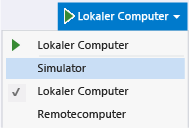

# Aktualisieren Sie eine UWP-app in Visual Studio
  
 Sie können Änderungen am Code vornehmen, während Sie debuggen möchten, und Sie dann eine UWP-app mit JavaScript aktualisieren durch Auswählen der **Aktualisieren von Windows-app** Schaltfläche der **Debuggen** Symbolleiste. Durch Auswählen dieser Schaltfläche wird die App erneut geladen, ohne den Debugger zu beenden und erneut zu starten. Die Aktualisierungsfunktion ermöglicht es Ihnen, HTML, CSS und JavaScript-Code zu ändern und das Ergebnis schnell anzuzeigen. Dieses Feature wird für UWP-apps unterstützt.  
  
 Aktualisieren hält weder den App-Zustand aufrecht noch reflektiert es die folgenden Änderungen zur App:  
  
-   Paketmanifestdateiänderungen, einschließlich Änderungen an den im Paketmanifest angegebenen Bildern.  
  
-   Verweisänderungen, wie das Hinzufügen oder Entfernen eines SDK-Verweises, oder Änderungen an den Komponenten für Windows-Runtime (.winmd-Dateien).  
  
-   Ressourcenänderungen, wie Änderungen an den Zeichenfolgen in .resjson-Dateien.  
  
-   Projektdateiänderungen, die zu Pfadnamenänderungen, neuen Projektdateien oder gelöschten Dateien führen.  
  
-   Projekt- und Elementeigenschaftenänderungen, wie Änderungen am ausgewählten Debugging-Gerät oder Änderungen an der Paketaktion für eine Datei (im Eigenschaftenfenster).  
  
> [!IMPORTANT]
>  Wenn Sie Verweise oder das Paketmanifest ändern oder andere Änderungen vornehmen, die in der vorangehenden Liste aufgeführt sind, müssen Sie den Debugger beenden und neu starten, um HTML-, CSS- und JavaScript-Quelldateien zu aktualisieren.  
  
### So aktualisieren Sie eine App  
  
1.  Wählen Sie Ihr UWP-Projekt in Visual Studio geöffnet, **lokalen Computer** als Debugziel.
  
       
  
3.  Drücken Sie F5, um die App im Debugmodus auszuführen.  
  
4.  Wechseln Sie zu Visual Studio. 
  
5.  Bearbeiten Sie auf der Startseite Ihrer UWP-App Teil der HTML-Code aus.
  
7.  Klicken Sie auf die Schaltfläche Windows-App aktualisieren **, die wie folgt aussieht:** . . (Oder drücken Sie F4)  
  
8.  Wechseln Sie zur App. Die app wird erneut geladen, und das aktualisierte HTML zum Rendern der app verwendet wird.
  
## Siehe auch  
 [Schnellstart: Debug HTML and CSS (Schnellstart: Debuggen von HTML und CSS)](../debugger/quickstart-debug-html-and-css.md)