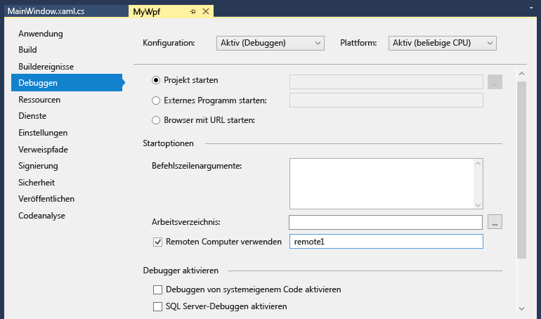

# Ein C#- oder Visual Basic-Projekt in Visual Studio für das Remotedebuggen
Um eine Visual Studio-Anwendung zu debuggen, die auf einem anderen Computer bereitgestellt wurde, installieren Sie und führen Sie der Remotetools auf dem Computer aus, auf denen Sie Ihre app bereitgestellt haben, konfigurieren Sie das Projekt von Visual Studio eine Verbindung mit dem Remotecomputer, und führen Sie die app.

  
Informationen zum Remotedebuggen von universellen Windows-Apps (UWP) finden Sie unter [ein installiertes App-Paket Debuggen](debug-installed-app-package.md).

## Anforderungen

Der Remotedebugger wird unterstützt, unter Windows 7 und höher (kein Telefon) und Versionen von Windows Server mit Windows Server 2008 Service Pack 2 gestartet. Eine vollständige Liste der Anforderungen, finden Sie unter [Anforderungen](../debugger/remote-debugging.md#requirements_msvsmon).

> [!NOTE]
> Debuggen zwischen zwei Computern über einen Proxy verbunden wird nicht unterstützt. Remotedebuggen über eine hohe Latenz oder niedriger Bandbreite, wie z. B. DFÜ, Internet oder über das Internet Ländern wird nicht empfohlen und möglicherweise fehl oder sehr langsam sein.
  
## Herunterladen und Installieren der Remotetools

[!INCLUDE [remote-debugger-download](../debugger/includes/remote-debugger-download.md)]

> [!TIP]
> In einigen Szenarien kann es am effizientesten, führen Sie den Remotedebugger aus einer Dateifreigabe sein. Weitere Informationen finden Sie unter [führen Sie den Remotedebugger aus einer Dateifreigabe](../debugger/remote-debugging.md#fileshare_msvsmon).
  
## Einrichten des Remotedebuggers

[!INCLUDE [remote-debugger-configuration](../debugger/includes/remote-debugger-configuration.md)]

> [!NOTE]
> Wenn Sie benötigen Berechtigungen für zusätzliche Benutzer hinzufügen ändern den Authentifizierungsmodus oder Portnummer für den Remotedebugger, finden Sie unter [Konfigurieren des Remotedebuggers](../debugger/remote-debugging.md#configure_msvsmon).
  
## Remote-Debuggen des Projekts
Der Debugger kann Visual C#- oder Visual Basic-Desktopanwendungen nicht auf einem Remotecomputer bereitstellen, aber Sie können diese trotzdem wie folgt remotedebuggen. Das folgende Verfahren wird davon ausgegangen, dass Sie auf dem Computer debuggen möchten **MJO DL**, wie in der Abbildung unten gezeigt.
  
1.  Erstellen Sie ein WPF-Projekt mit dem Namen **MyWpf**.  
  
2.  Legen Sie einen leicht erreichbaren Haltepunkt an einer beliebigen Stelle im Code fest.  
  
     Beispielsweise können Sie einen Haltepunkt in einem Schaltflächenhandler festlegen. Zu diesem Zweck öffnen Sie "MainWindow.xaml", fügen Sie ein Button-Steuerelement aus der Toolbox, und doppelklicken Sie auf die Schaltfläche, um deren Ereignishandler zu öffnen.
  
3.  Klicken Sie im Projektmappen-Explorer mit der rechten Maustaste des Projekts, und wählen Sie **Eigenschaften**.  
  
4.  Auf der **Eigenschaften** Seite, und wählen Sie die **Debuggen** Registerkarte.  
  
       
  
5.  Stellen Sie sicher, dass die **Arbeitsverzeichnis** Textfeld leer ist.  
  
6.  Wählen Sie **Remotecomputer**, und geben **MJO-DL:4022** in das Textfeld. (4022 ist die Portnummer im Remotedebugger-Fenster angezeigt. Die Nummer des Ports erhöht die Angabe 2 in jeder Version von Visual Studio).
  
7.  Stellen Sie sicher, dass **Debuggen von systemeigenem Code aktivieren** nicht ausgewählt ist.  
  
8.  Erstellen Sie das Projekt.  
  
9. Erstellen Sie einen Ordner auf dem Remotecomputer, die den gleichen Pfad wie die **Debuggen** Ordner auf dem Visual Studio-Computer:  **\<Quellpfad > \MyWPF\MyWPF\bin\Debug**.  
  
10. Kopieren Sie die ausführbare Datei, die Sie soeben erstellt haben, vom Visual Studio-Computer in den neu erstellten Ordner auf dem Remotecomputer.
  
    > [!CAUTION]
    >  Nehmen Sie keine Änderungen an den Code oder neu erstellen (oder Sie müssen diesen Schritt wiederholen). Die ausführbare Datei, die Sie auf den Remotecomputer kopiert haben, muss genau mit der lokalen Quelle und den lokalen Symbolen übereinstimmen.

    Sie können das Projekt manuell kopieren, verwenden Sie Xcopy, Robocopy, Powershell oder andere Optionen.
  
11. Stellen Sie sicher, dass der Remotedebugger auf dem Zielcomputer ausgeführt wird (wenn es nicht der Fall ist, suchen Sie nach **Remotedebugger** in der **starten** Menü). Remotedebugger-Fenster sieht wie folgt.  
  
       
  
12. Debuggen in Visual Studio starten (**Debuggen > Debuggen starten**, oder **F5**).  
  
13. Wenn Sie aufgefordert werden, geben Sie die Netzwerkanmeldeinformationen zum Verbinden mit dem Remotecomputer.  
  
     Die erforderlichen Anmeldeinformationen variieren je nach Sicherheitskonfiguration des Netzwerks. Beispielsweise können Sie auf einem Domänencomputer Ihren Domänennamen und Ihr Kennwort eingeben. Auf einem Computer außerhalb der Domäne Sie möglicherweise Geben Sie den Computernamen und einen gültigen Benutzernamen ein Konto, z. B.  **MJO-DL\name@something.com** , zusammen mit dem richtigen Kennwort.

     Daraufhin sollte im Hauptfenster der WPF-Anwendung auf dem Remotecomputer geöffnet sein.
  
14. Führen Sie gegebenenfalls die Aktion aus, um den Haltepunkt. Es sollte angezeigt werden, dass der Haltepunkt aktiv ist. Wenn dies nicht der Fall, noch nicht die Symbole für die Anwendung geladen. Wiederholen Sie dann, und wenn dies nicht funktioniert, Abrufen von Informationen zum Laden von Symbolen und wie sie Fehler bei der [Understanding Symbol Files und Visual Studio-symbol Settings](http://blogs.msdn.com/b/visualstudioalm/archive/2015/01/05/understanding-symbol-files-and-visual-studio-s-symbol-settings.aspx).
  
15. Auf dem Visual Studio-Computer sollte angezeigt werden, dass die Ausführung am Haltepunkt angehalten wurde.
  
 Wenn bestimmte Dateien ohne Code von der Anwendung benötigt werden, müssen Sie diese zum Visual Studio-Projekt hinzufügen. Erstellen eines Projektordners für die zusätzlichen Dateien (in der **Projektmappen-Explorer**, klicken Sie auf **hinzufügen > neuen Ordner**). Klicken Sie dann die Dateien in den Ordner hinzuzufügen (in der **Projektmappen-Explorer**, klicken Sie auf **hinzufügen > Vorhandenes Element**, wählen Sie die Dateien). Auf der **Eigenschaften** Seite für jede Datei **in Ausgabeverzeichnis kopieren** auf **immer kopieren**.

## Einrichten des Debuggings mit Remotesymbolen 

[!INCLUDE [remote-debugger-symbols](../debugger/includes/remote-debugger-symbols.md)]  
  
## Siehe auch  
 [Debuggen in Visual Studio](../debugger/index.md)  
 [Debugger – Featuretour](../debugger/debugger-feature-tour.md)   
 [Konfigurieren der Windows-Firewall für Remotedebuggen](../debugger/configure-the-windows-firewall-for-remote-debugging.md)   
 [Remotedebugger-Portzuweisungen](../debugger/remote-debugger-port-assignments.md)   
 [Remotedebuggen von ASP.NET auf einem Remotecomputer mit IIS](../debugger/remote-debugging-aspnet-on-a-remote-iis-computer.md)  
 [Remotedebuggen – Fehler und Problembehandlung](../debugger/remote-debugging-errors-and-troubleshooting.md)