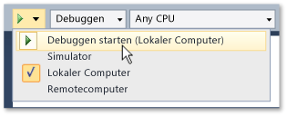

# Ausführen von uwp-apps aus Visual Studio
Uwp-apps werden auf einer breiten Auswahl an Geräten ausgeführt, und Visual Studio bietet Ihnen eine Reihe von Möglichkeiten, die ausgeführt werden und mit diesen interagieren. Die F5-Funktion wird erweitert, um ein einfaches Debuggen, Profilieren und Testen von Apps während der Entwicklung zu ermöglichen.  
  
   
  
## In diesem Abschnitt  
  
|||  
|-|-|  
|[Führen Sie die uwp-apps auf dem lokalen Computer](../debugger/run-windows-store-apps-on-the-local-machine.md)|Führen Sie die uwp-app auf dem Visual Studio-Gerät.|  
|[Uwp-apps im Simulator ausführen](../debugger/run-windows-store-apps-in-the-simulator.md)|Führen Sie die uwp-app in einem Desktopfenster aus, die simuliert [!INCLUDE[win8_appname_long](../debugger/includes/win8_appname_long_md.md)] -Funktionen wie Toucheingabe und Ausrichtung.|  
|[Führen Sie die uwp-apps auf einem Remotecomputer](../debugger/run-windows-store-apps-on-a-remote-machine.md)|Bereitstellen Sie und führen Sie Ihrer uwp-app auf einem Gerät, das mit dem Visual Studio-Computer über ein Netzwerk oder direkt über ein Ethernet-Kabel verbunden ist aus.|  
|[Ausführen von Windows Phone-Apps im Emulator](../debugger/run-windows-phone-apps-in-the-emulator.md)|Führen Sie die uwp-app in einem Desktopfenster aus, die eine Windows Phone simuliert.|  
|[Bereitstellen von uwp-apps aus Visual Studio](../debugger/deploy-windows-store-apps-from-visual-studio.md)|Bereitstellen Sie und registrieren Sie die uwp-app für Ad-hoc-Tests auf einem Gerät.|