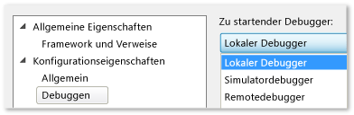

# Ausf&#252;hren von Windows Store-Apps auf einem lokalen Computer
[!INCLUDE[vs2017banner](../code-quality/includes/vs2017banner.md)]

  
  
 Zum Debuggen, Testen oder Durchführen einer Leistungsanalyse für eine Windows Store\-App können Sie die App auf demselben Computer ausführen, auf dem Visual Studio gehostet wird.  Falls das Geräte\-Display ein Touchscreen ist, können Sie alle Funktionen der App ausführen; andernfalls sind Sie auf Tastatur\- und Mausgesten beschränkt.  
  
##   In diesem Thema  
 Erfahren Sie:  
  
 [Ausführen auf einem lokalen Computer](#BKMK_How_to_run_on_a_local_machine)  
  
 [Wechseln zwischen der Windows Store-App und Visual Studio auf einem Monitor](#BKMK_How_to_switch_between_a_Windows_Store_app_and_Visual_Studio_on_a_single_monitor)  
  
##   Ausführen auf einem lokalen Computer  
 Um die App auf dem lokalen Computer auszuführen, wählen Sie auf der Debugger\-Standardsymbolleiste in der Dropdownliste neben der Schaltfläche **Debugging starten** den Eintrag **Lokaler Computer** aus.  
  
   
  
 Falls die Symbolleiste **Standard** nicht angezeigt wird, klicken Sie auf das Menü **Ansicht**, zeigen auf **Symbolleisten** und klicken dann auf **Standard**.  
  
 Die von Ihnen in der Dropdownliste getroffene Auswahl wird in die Projekteigenschaftendatei übernommen und als Standardausführungsziel verwendet.  
  
 Sie können das Ausführungsziel auch direkt in der Projekteigenschaftendatei festlegen.  Klicken Sie im **Projektmappen\-Explorer** mit der rechten Maustaste auf den Projektnamen und dann auf **Eigenschaften**.  Führen Sie dann eine der folgenden Aktionen aus:  
  
-   Klicken Sie in C\#\- und Visual Basic\-Projekten auf **Debuggen**, und wählen Sie dann in der Dropdownliste **Zielgeräte** die Option **Lokaler Computer** aus.  
  
       
  
-   Erweitern Sie in C\+\+\- und JavaScript\-Projekten den Knoten **Konfigurationseigenschaften**, klicken Sie auf **Debugging**, und wählen Sie dann **Lokaler Debugger** aus der Liste **Zu startender Debugger** aus.  
  
       
  
##   Wechseln zwischen der Windows Store\-App und Visual Studio auf einem Monitor  
 **So wechseln Sie von einer ausgeführten Windows Store\-App\-Instanz zu Visual Studio**  
  
 Wenn Sie eine Windows Store\-App auf einem lokalen Computer ausführen und nur einen Monitor haben, möchten Sie ggf. zu Visual Studio zurückkehren, während die App weiter läuft.  Möglicherweise befindet sich die App in einem Zustand, der nicht durch einen Haltepunkt erreicht werden kann, wie das Warten auf ein Ereignis oder Festhängen in einer langen bzw. Endlosschleife.  Um zu Visual Studio zurückzukehren, drücken Sie ALT \+ TAB.