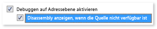
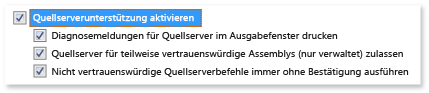

# Angeben von Symbol(PDB)- und Quelldateien im Visual Studio-Debugger (C#, C++, Visual Basic F#)

Programmdatenbank (*PDB*) Dateien, Symboldateien, so genannte zuordnen, Bezeichner und die Anweisungen im Quellcode Ihres Projekts, zu der entsprechenden IDs und die Anweisungen im kompilierten apps. 

Wenn Sie ein Projekt aus Visual Studio-IDE mit dem Standard Debugbuild-Konfiguration erstellen, erstellt der Compiler die entsprechenden Symboldateien. Sie können auch [Symboloptionen im Code festlegen](#compiler-symbol-options). 

Die *PDB* -Datei enthält, Debuggen und projekstatusinformationen, die inkrementelle Verknüpfung einer Debugkonfiguration Ihrer App ermöglichen. Visual Studio-Debugger verwendet *PDB* Dateien auf zwei wichtige Informationen während des Debuggens zu bestimmen:

* Die Quelle und die Zeilennummer Dateinummer in der Visual Studio-IDE angezeigt.
* Die Position, in der app für einen Haltepunkt zu beenden.

Symboldateien zeigen auch den Speicherort der Quelldateien und optional den Server aus, um daraus abzurufen.
  
Der Debugger nur lädt *PDB-Datei* Dateien, die genau entsprechen der *PDB-Datei* Dateien erstellt, wenn eine app erstellt wurde (d. h. das Original *PDB-Datei* Dateien oder Kopien). Diese genaue Duplizierung ist erforderlich, da das Layout von apps ändern kann, selbst wenn der Code selbst nicht geändert hat. Weitere Informationen finden Sie unter [Why does Visual Studio require debugger symbol files to exactly match the binary files that they were built with? (Wieso benötigt Visual Studio Debugsymboldateien, die mit den Binärdateien für die Erstellung exakt übereinstimmen?)](https://blogs.msdn.microsoft.com/jimgries/2007/07/06/why-does-visual-studio-require-debugger-symbol-files-to-exactly-match-the-binary-files-that-they-were-built-with/)

> [!TIP]
> Zum Debuggen von Code außerhalb von Projekt-Quellcode, z. B. Windows-Code oder Drittanbieter-code die projektaufrufe müssen Sie den Speicherort des externen Codes angeben *PDB* (und optional die Quelldateien), die muss genau übereinstimmen. die Builds in Ihrer app. 

## Speicherorte für Symboldateien und des Ladeverhaltens

> [!NOTE]
> Beim Debuggen von verwalteten Codes auf einem Remotegerät alle Symboldateien muss sich entweder auf dem lokalen Computer oder an einem Ort [angegeben, die in den Debuggeroptionen](#BKMK_Specify_symbol_locations_and_loading_behavior).  
  
Wenn Sie ein Projekt in Visual Studio-IDE debuggen, lädt der Debugger automatisch Symboldateien, die im Projektordner befinden. 

Der Debugger sucht auch nach Symboldateien in den folgenden Speicherorten:

1. Der Speicherort, der in die DLL oder ausführbaren Datei angegeben ist (*.exe*) Datei.  
   
   In der Standardeinstellung, wenn Sie eine DLL-Datei erstellt haben oder ein *.exe* Datei auf Ihrem Computer, die der Linker platziert, den vollständigen Pfad und Dateiname der zugeordneten *PDB* -Datei in die DLL oder *.exe* Datei. Der Debugger überprüft, um festzustellen, ob die Symboldatei an diesem Speicherort vorhanden ist.  
   
2. Im gleichen Ordner wie die DLL oder *.exe* Datei.
   
3. Alle Standorte in den Debuggeroptionen nach Symboldateien angegeben. Zum Hinzufügen und aktivieren die Speicherorte für Symboldateien, finden Sie unter [Orte für Symboldateien konfigurieren, und Laden Sie die Optionen](#BKMK_Specify_symbol_locations_and_loading_behavior). 
   
   - Ein beliebiger Symbolcacheordner.  
  
   - Netzwerk, Internet oder lokale Symbolserver und Speicherorte, z. B. die Microsoft-Symbolserver angegeben werden, wenn ausgewählt. [!INCLUDE[vsprvs](../code-quality/includes/vsprvs_md.md)] kann Debugsymboldateien von Symbolservern, die implementieren Herunterladen der `symsrv` Protokoll. [Visual Studio Team Foundation Server](/azure/devops/pipelines/tasks/build/index-sources-publish-symbols) und [Debugging-Tools für Windows](/windows-hardware/drivers/debugger/index) sind zwei Tools, die Symbolserver verwenden können.
      
     Sind Symbolserver, die Sie verwenden können:  
      
     **Öffentliche Microsoft-Symbolserver**: Um einen Absturz zu debuggen, die während eines Aufrufs einer System-DLL oder einer Drittanbieter-Bibliothek auftritt, benötigen Sie häufig System *PDB* Dateien. System *PDB* Dateien enthalten die Symbole für Windows-DLLs, *.exe* Dateien und Gerätetreiber. Erhalten Sie Symbole für Windows-Betriebssysteme, MDAC, IIS, ISA, und die [!INCLUDE[dnprdnshort](../code-quality/includes/dnprdnshort_md.md)] von den öffentlichen Microsoft-Symbolservern. 
      
     **Symbolserver auf einem internen Netzwerk oder auf Ihrem lokalen Computer**: Ihr Team oder Ihr Unternehmen kann Symbolserver für eigene Produkte und als Cache für Symbole aus externen Quellen erstellen. Sie haben möglicherweise einen Symbolserver auf dem eigenen Computer. 
      
     **Symbolserver von Drittanbietern**: Drittanbieter von Windows-Anwendungen und Bibliotheken können Zugriff auf Symbolserver im Internet gewähren. 
    
     > [!WARNING]
     > Wenn Sie einen anderen Symbolserver als die öffentlichen Microsoft-Symbolserver verwenden, stellen Sie sicher, dass der Symbolserver und den Pfad vertrauenswürdig sind. Da Symboldateien beliebigen ausführbaren Code enthalten können, können Sie in Bezug auf Sicherheitsrisiken verfügbar gemacht werden.  

### Konfigurieren Sie die Speicherorte für Symboldateien und Optionen für das Laden

Auf der **Tools** > **Optionen** > **Debuggen** > **Symbole** Seite können Sie:

- Geben Sie an, und wählen Sie die Suchpfade und Symbolserver für Microsoft, Windows oder Komponenten von Drittanbietern.
- Geben Sie die Module, oder keine der Debugger automatisch Symbole laden soll.
- Ändern Sie diese Einstellungen, während Sie aktiv Debuggen. Finden Sie unter [Verwaltung von Symbolen beim Debuggen](#manage-symbols-while-debugging). 
  
**Um die Orte für Symboldateien und die Optionen für das Laden angeben:**

1. Öffnen Sie in Visual Studio **Tools** > **Optionen** > **Debuggen** > **Symbole** (oder **Debuggen** > **Optionen** > **Symbole**).  
   
     
   
2. Klicken Sie unter **Symboldateien (.pdb) Orte für Symboldateien**,
   - Verwenden der **Microsoft-Symbolserver**, aktivieren Sie das Kontrollkästchen.  
   
   - Um einen neuen Speicherort der Symbol-Server hinzufügen,
     1. Wählen Sie die **+** in der Symbolleiste. 
     1. Geben Sie die URL oder Ordner-Pfad des Symbolservers oder des symbolspeicherorts in das Textfeld ein. Durch Anweisungsvervollständigung wird Ihnen die Bestimmung des richtigen Formats erleichtert.
     
     >[!NOTE]
     >Nur die angegebene Ordner wird durchsucht. Sie müssen die Einträge für alle Unterordner hinzufügen, die Sie suchen möchten.  
   
   - Um einen neuen Speicherort für den VSTS-Symbolserver hinzufügen 
     1. Wählen Sie die  Symbol auf der Symbolleiste. 
     1. In der **Herstellen einer Verbindung mit VSTS-Symbolserver** Dialogfeld Wählen Sie eines der verfügbaren Symbolserver und **Connect**.  
   
   - Verwenden Sie zum Ändern der Reihenfolge geladen, für die Orte für Symboldateien **STRG**+**einrichten** und **STRG**+**unten**, oder die **einrichten** und **unten** Pfeilsymbole angezeigt. 
   - Um eine URL oder einen Pfad bearbeiten möchten, doppelklicken Sie auf den Eintrag, oder wählen Sie ihn aus, und drücken Sie **F2**.  
   - Um einen Eintrag zu entfernen, wählen Sie ihn, und wählen Sie dann die **-** Symbol.
  
3. (Optional) Zur Verbesserung der Leistung beim Laden Symbol, unter **Symbole in diesem Verzeichnis zwischenspeichern**, Typ, der ein lokalen Ordnerpfad an, die Symbolserver kopieren können, Symbole.  
  
   > [!NOTE]
   > Platzieren Sie den lokalen Symbolcache nicht in einem geschützten Ordner, z. B. C:\Windows oder einen Unterordner. Verwenden Sie stattdessen einen Ordner mit Lese-/Schreibzugriff.  
  
   > [!NOTE]
   > Für C++-Projekte, wenn Sie haben die `_NT_SYMBOL_PATH` -Umgebungsvariable festgelegt, wird der Wert unter Gruppe überschrieben **Symbole in diesem Verzeichnis zwischenspeichern**.
  
4. Geben Sie die Module, die der Debugger beim Laden aus soll die **Symboldateien (.pdb) Orte für Symboldateien** Wenn gestartet wurde.  
  
   -  Wählen Sie **alle Module zu laden, es sei denn, der ausgeschlossen** (Standard), um alle Symbole für alle Module auf den Speicherort der Symboldatei, mit Ausnahme von Modulen zu laden, Sie explizit ausschließen. Wählen Sie zum Ausschließen bestimmter Module **Ausgeschlossene Module angeben**, wählen die **+** Symbol, geben Sie die Namen der Module zum ausschließen, und wählen Sie **OK**.  
  
   -  Um nur Module laden Sie aus der Speicherorte für Symboldateien angeben, wählen **Laden nur angegebene Module**. Wählen Sie **eingeschlossene Module angeben**, wählen die **+** Symbol, geben Sie die Namen der Module, und wählen Sie dann **OK**. Die Symboldateien für andere Module werden nicht geladen werden.  
  
5. Klicken Sie auf **OK**.

## Andere Symboloptionen für das Debuggen
  
Sie können auswählen, zusätzlicher Symboloptionen in **Tools** > **Optionen** > **Debuggen** > **Allgemein** (oder **Debuggen** > **Optionen** > **allgemeine**):  

- **DLL-Exporte laden (nur native)**  
  
  C/C++-export Tabellen geladen. Weitere Informationen finden Sie unter [DLL-Exporttabellen](#use-dumpbin-exports). Lesen von DLL-Exportinformationen umfasst ein gewisser Overhead –, damit das Laden von Exporttabellen in der Standardeinstellung deaktiviert ist. Sie können auch `dumpbin /exports` in einer C/C++-Build-Befehlszeile.  
  
- **Auf Adressebene aktivieren** und **Disassembly anzeigen, wenn die Quelle nicht verfügbar.**  
  
  Zeigt die Disassembly immer an, wenn Quell-oder Symboldateien nicht gefunden werden.  
  
    
  
- **Quellserverunterstützung aktivieren**  
  
  Verwendet von Source Server können Sie eine app zu debuggen, wenn kein Quellcode vorhanden, auf dem lokalen Computer ist oder die *PDB* Datei entspricht nicht den Quellcode. Source Server akzeptiert Anforderungen für Dateien und gibt die tatsächlichen Dateien aus der quellcodeverwaltung. Quellserver wird ausgeführt, indem Sie eine DLL, die mit dem Namen *srcsrv.dll* , Lesen der app *PDB* Datei. Die *PDB* Datei enthält Verweise auf das Quellcoderepository sowie Befehle zum Abrufen von Quellcode aus dem Repository verwendet. 
  
  Sie können die Befehle einschränken, *srcsrv.dll* können aus der app ausführen *PDB* Datei durch Auflisten der zulässigen Befehle in einer Datei namens *srcsrv.ini*. Ort der *srcsrv.ini* -Datei im gleichen Ordner wie *srcsrv.dll* und *devenv.exe*.  
  
  >[!IMPORTANT]
  >Beliebige Befehle eingebettet werden können, in der app- *PDB* -Datei verwenden, also stellen Sie sicher, dass nur die Befehle hinzufügen in ausgeführt werden soll eine *srcsrv.ini* Datei. Beim Versuch, einen nicht in der Datei *srcsvr.ini* enthaltenen Befehl auszuführen, wird ein Bestätigungsdialogfeld geöffnet. Weitere Informationen finden Sie unter [Sicherheitswarnung: Der Debugger muss diesen nicht vertrauenswürdigen Befehl ausführen](../debugger/security-warning-debugger-must-execute-untrusted-command.md). 
  >
  >Es wird keine Validierung für Befehlsparameter durchgeführt, seien Sie deshalb bei vertrauenswürdigen Befehlen vorsichtig. Angenommen, Sie aufgeführten *cmd.exe* in Ihre *srcsrv.ini*, könnte ein böswilliger Benutzer Parameter angeben, auf *cmd.exe* , das würde machen es gefährlich.  
  
  Wählen Sie dieses Element aus, und die gewünschten untergeordneten Elemente. **Quellserver für teilweise vertrauenswürdige Assemblys (nur verwaltet) zulassen** und **immer, die nicht vertrauenswürdigen Quellserverbefehle ohne Aufforderung ausführen** Sicherheitsrisiken erhöhen können.  
  
    

## Compilerfehler Symboloptionen  

Wenn Sie ein Projekt erstellen, aus der Visual Studio-IDE mit dem Standard **Debuggen** Buildkonfiguration, die C++- und verwalteten Compiler, erstellen Sie die entsprechenden Symboldateien für Ihren Code. Sie können Compileroptionen auch im Code festlegen. 

### C/C++-Optionen 

- *VC\<x > pdb* und  *\<Projekt > pdb* Dateien
  
  Ein *PDB* Datei C/C++ erstellt wird, während des Buildvorgangs mit [/Zi oder/Zi](/cpp/build/reference/z7-zi-zi-debug-information-format). In [!INCLUDE[vcprvc](../code-quality/includes/vcprvc_md.md)], [/FD](/cpp/build/reference/fd-program-database-file-name) option Namen der *PDB* Datei, die der Compiler erstellt. Beim Erstellen eines Projekts in [!INCLUDE[vsprvs](../code-quality/includes/vsprvs_md.md)] mithilfe der IDE, die **/FD** Option wird festgelegt, zum Erstellen einer *PDB-Datei* Datei mit dem Namen  *\<Projekt > pdb*.  
  
  Wenn Sie die C/C++-Anwendung mithilfe einer Makefile erstellen, und Sie geben **"/ Zi"** oder **"/ Zi"** ohne **/FD**, erstellt der Compiler zwei *PDB*Dateien:  
  
  - *VC\<x.pdb*, wobei *\<x>* die Visual C++-Version darstellt, beispielsweise *VC11.pdb*. 
    
    Die *VC\<x > pdb* Datei speichert alle Debuginformationen für die einzelnen Objektdateien und befindet sich im selben Verzeichnis wie das projektmakefile. Jedes Mal eine Objektdatei erstellt wird, führt der C/C++-Compiler Debuginformationen in *VC\<x > pdb*. Selbst wenn jede Quelldatei allgemeine Headerdateien enthält, wie beispielsweise  *\<windows.h >*, die Typdefinitionen aus diesen Headerdateien nur einmal statt in jedem Objektdatei gespeichert. Die eingefügten Informationen umfassen zwar Typinformationen, jedoch wie Funktionsdefinitionen keine Symbolinformationen.  
  
  - *\<project>.pdb* 
    
    Die  *\<Projekt > pdb* Datei werden alle Debuginformationen für des Projekts des *.exe* Datei, und befindet sich in der *\debug* Unterverzeichnis. Die Datei *\<project>.pdb* enthält nicht nur die in *VC\<x>.pdb* gespeicherten Typinformationen, sondern alle Debuginformationen, einschließlich der Funktionsprototypen. 
  
  Sowohl die *VC\<x > pdb* und  *\<Projekt > pdb* Dateien unterstützen inkrementelle Aktualisierungen. Der Linker bettet den Pfad zu der *PDB-Datei* Dateien in die *.exe* oder *DLL* Datei, die sie erstellt.  
  
- DLL-Exporttabellen
  
  Verwendung `dumpbin /exports` auf die Symbole in der Exporttabelle einer DLL verfügbar sind, finden Sie unter. Symbolinformationen aus DLL-Exporttabellen kann für die Arbeit mit Windows-Meldungen, Windows-Prozeduren (WindowProcs), COM-Objekten, Marshalling oder einer DLL, die Ihnen keine Symbole für nützlich sein. Symbole sind für alle 32-Bit-System-DLLs verfügbar. Die Aufrufe werden in der Reihenfolge des Aufrufs angezeigt, wobei die aktuelle Funktion (die, die sich in der Schachtelungshierarchie auf der untersten Ebene befindet) ganz oben angezeigt wird. 
  
  Durch Lesen der `dumpbin /exports` auszugeben, sehen Sie die genaue Funktionsnamen, einschließlich nicht alphanumerischer Zeichen. Sehen die genaue Funktionsnamen ist hilfreich, für das Festlegen eines Haltepunkts in einer Funktion, da es sich bei Funktionsnamen an anderer Stelle im Debugger abgeschnitten werden können. Weitere Informationen hierzu finden Sie unter [dumpbin /exports](/cpp/build/reference/dash-exports).  
  
### .NET Framework-Optionen 
  
Erstellen Sie mit **/debug** zum Erstellen einer *PDB* Datei. Sie können Anwendungsentwicklung mit **/debug:full** oder **/debug:pdbonly**erstellen. Beim Erstellen mit **/debug:full** wird debugfähiger Code generiert. Beim Erstellen mit **/debug:pdbonly** werden *PDB*-Dateien generiert, nicht jedoch das `DebuggableAttribute`-Attribut, das den JIT-Compiler darüber informiert, dass die Debuginformationen verfügbar sind. Verwenden Sie **/debug:pdbonly**, wenn Sie *PDB*-Dateien für einen Releasebuild generieren möchten, der nicht debugfähig sein soll. Weitere Informationen finden Sie unter [/debug (C#-Compileroptionen)](/dotnet/csharp/language-reference/compiler-options/debug-compiler-option) oder [/debug (Visual Basic)](/dotnet/visual-basic/reference/command-line-compiler/debug).  
  
### Webanwendungen  
  
Legen Sie die *"Web.config"* Datei der ASP.NET-Anwendung auf den Debugmodus. Der Debugmodus veranlasst ASP.NET zum Erstellen von Symbolen für dynamisch generierte Dateien und ermöglicht dem Debugger das Anfügen an die ASP.NET-Anwendung. Visual Studio legt dies automatisch beim Starten des Debuggen, wenn Sie Ihr Projekt aus der Webprojekte-Vorlage erstellt haben.  

##  Verwaltung von Symbolen beim Debuggen 

Können Sie die **Module**, **Aufrufliste**, **"lokal"**, **"Auto"**, oder ein beliebiges **Watch** Fenster geladen Symbole, oder Ändern der Symboloptionen während des Debuggens. Weitere Informationen finden Sie unter [mit, wie der Debugger an Ihre app angefügt vertrauter machen](../debugger/debugger-tips-and-tricks.md#modules_window).

### Verwenden des Modulfensters

Während des Debuggens die **Module** Fenster zeigt die Codemodule, die der Debugger wird als Benutzercode oder mein Code und die Laden der Status der Symbole behandelt. Sie können auch Überwachen des Status der Symbol-Laden von Symbole laden und Ändern der Symboloptionen in der **Module** Fenster.

**Um zu überwachen, oder Ändern von Optionen oder Speicherorte für Symboldateien während des Debuggens:**

1. Zum Öffnen der **Module** wählen Sie im Fenster während des Debuggens **Debuggen** > **Windows** > **Module**. 
1. In der **Module** Fenster mit der rechten Maustaste die **Symbolstatus** oder **Symboldatei** Header oder jedes Modul. 
1. Wählen Sie im Kontextmenü eine der folgenden Optionen aus:  
  
|Option|Beschreibung|  
|------------|-----------------|  
|**Symbole laden**|Wird für Module mit wurde übersprungen, wurde nicht gefunden oder nicht geladenen Symbole angezeigt. Lädt Symbole von den Speicherorten auf dem **Optionen** > **Debuggen** > **Symbole** Seite. Wenn die Symboldatei wurde nicht gefunden oder nicht geladen wird, startet **Datei-Explorer** damit Sie einen neuen zu suchenden Speicherort angeben können.|  
|**Symbolladeinformationen**|Zeigt den Speicherort einer geladenen Symboldatei oder die Speicherorte, die durchsucht wurden, wenn der Debugger die Datei nicht finden.|  
|**Symboleinstellungen**|Öffnet die **Optionen** > **Debuggen** > **Symbole** Seite können Sie bearbeiten und Symbolspeicherorte hinzufügen.|  
|**Immer automatisch laden**|Fügt die ausgewählte Symboldatei zur Liste der Dateien, die automatisch vom Debugger geladen werden.|  

### Verwenden Sie die Seiten keine Symbole Loaded/No Quelle geladen

Es gibt mehrere Möglichkeiten für den Debugger zu unterbrechen im Code, der keine verfügbaren Symbol- oder Quelldateien Dateien:  

-  Code in Einzelschritten ausführen.  
-  Unterbrechen Sie im Code von einem Haltepunkt oder einer Ausnahme.  
-  Wechseln Sie zu einem anderen Thread.  
-  Ändern Sie den Stapelrahmen durch Doppelklicken auf einen Frame in der **Aufrufliste** Fenster.  
   
In diesem Fall zeigt der Debugger die **keine Symbole geladen** oder **keine Quelle geladen** Seiten können Sie ermitteln und laden die erforderlichen Symbole oder Quelle aus.  
  
   
  
**So verwenden Sie die Dokumentseite keine Symbole geladen, ermitteln und Laden Symbole fehlen:**  
  
-   Um den Suchpfad zu ändern, wählen Sie einen nicht markierten Pfad aus, oder wählen Sie **neuen Pfad** oder **neuer VSTS-Pfad** und geben Sie ein oder wählen Sie einen neuen Pfad. Wählen Sie **laden** die Pfade erneut zu suchen und die Symboldatei zu laden, wenn es gefunden wird.  
-   Um alle Symboloptionen zu überschreiben und die Suchpfade erneut zu versuchen, wählen Sie **navigieren und suchen Sie nach \<Name der ausführbaren Datei >**. Die Symboldatei wird geladen, wenn es gefunden wird, oder **Datei-Explorer** wird geöffnet, sodass Sie die Symboldatei manuell auswählen können.  
-   Zum Öffnen der **Optionen** > **Debuggen** > **Symbole** Seite **Symboleinstellungen ändern**.  
-   Um die Disassembly in einem neuen Fenster einmal anzuzeigen, wählen Sie **Disassembly anzeigen**, oder wählen Sie **Dialogfeld "Optionen"** , legen Sie die Option, um die Disassembly immer anzuzeigen, wenn Quell-oder Symboldateien nicht gefunden werden. 
-   Um die Speicherorte durchsucht und das Ergebnis anzuzeigen, erweitern Sie **Symbolladeinformationen**. 

Wenn der Debugger sucht nach der *PDB-Datei* Datei, nachdem Sie eine der Optionen ausführen und können abrufen, die Quelldatei, die anhand der Informationen in der *PDB-Datei* -Datei, es zeigt die Quelle. Andernfalls zeigt er eine **keine Quelle geladen** Seite das Problem, mit Links zu Aktionen beschrieben, die das Problem möglicherweise behoben.

**Zum Hinzufügen von quelldateisuchpfaden zu einer Projektmappe:**
  
Sie können Geben Sie die Speicherorte, die der Debugger nach Quelldateien sucht, und schließen Sie bestimmte Dateien von der Suche.

1. Wählen Sie die Projektmappe in **Projektmappen-Explorer**, und wählen Sie dann die **Eigenschaften** Symbol, drücken Sie **Alt**+**EINGABETASTE**, oder mit der rechten Maustaste, und wählen Sie **Eigenschaften**.
   
1. Wählen Sie **Quelldateien debuggen**.
   
1. Klicken Sie unter **Verzeichnisse mit Quellcode**ein, oder wählen Sie die quellspeicherorte dann Code zu suchen. Verwenden der **Zeilenumbruch** Symbol zum Hinzufügen von mehreren Standorten, die **einrichten** und **nach unten** Pfeilsymbole auf, die sie neu anzuordnen oder **X** Symbol, um sie zu löschen.
   
   >[!NOTE]
   >Der Debugger durchsucht nur das angegebene Verzeichnis. Sie müssen Einträge für alle Unterverzeichnisse hinzufügen, die durchsucht werden sollen.
   
1. Klicken Sie unter **Quelldateien nicht suchen**, geben Sie die Namen der Quelldateien, Suche ausgeschlossen werden sollen. 
   
1. Wählen Sie **OK** oder **anwenden**.

## Siehe auch  
[Grundlegendes zu Symboldateien und symboleinstellungen für Visual Studio](https://blogs.msdn.microsoft.com/devops/2015/01/05/understanding-symbol-files-and-visual-studios-symbol-settings/)

[.NET remote symbol loading changes in Visual Studio 2012 and 2013 (Änderungen am Remoteladen von Symboldateien mit .NET in Visual Studio 2012 und 2013)](https://blogs.msdn.microsoft.com/devops/2013/10/16/net-remote-symbol-loading-changes-in-visual-studio-2012-and-2013/)
