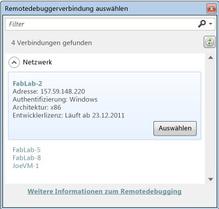

# Starten einer Debugsitzung f&#252;r Store-Apps in Visual Studio (JavaScript)
[!INCLUDE[vs2017banner](../code-quality/includes/vs2017banner.md)]

  
  
 In diesem Thema wird beschrieben, wie Sie eine Debugsitzung für in JavaScript und HTML5 geschriebene Windows Store\-Apps starten können. Sie können das Debuggen mit einer einzigen Tastatureingabe starten, oder Sie können die Debugsitzung für bestimmte Szenarien konfigurieren und dann die Methode auswählen, mit der die App gestartet wird.  
  
> [!NOTE]
>  Für in XAML und Visual C\#, Visual C\+\+ oder Visual Basic geschriebene Apps finden Sie unter [Starten einer Debugsitzung \(VB, C\#, C\+\+ und XAML\)](../debugger/start-a-debugging-session-for-a-store-app-in-visual-studio-vb-csharp-cpp-and-xaml.md) weitere Informationen.  
  
##   In diesem Thema  
 [In diesem Thema](#BKMK_In_this_topic)  
  
 [Die einfache Methode zum Starten des Debuggings](#BKMK_The_easy_way_to_start_debugging)  
  
 [Konfigurieren der Debugsitzung](#BKMK_Configure_the_debugging_session)  
  
-   [Öffnen Sie die Debugeigenschaftenseite für das Projekt](#BKMK_Open_the_debugging_property_page_for_the_project)  
  
-   [Wählen Sie die Buildkonfigurationsoptionen aus.](#BKMK_Choose_the_build_configuration_options)  
  
-   [Auswählen des Bereitstellungsziels](#BKMK_Choose_the_deployment_target)  
  
-   [Auswahl des zu verwendenden Debuggers](#BKMK_Choose_the_debugger_to_use)  
  
-   [(Optional) Verzögertes Starten der App in der Debugsitzung](#BKMK__Optional__Delay_starting_app_in_the_debug_session)  
  
-   [(Optional) Netzwerkloopbacks deaktivieren](#BKMK__Optional__Disable_network_loopbacks)  
  
 [Starten der Debugsitzung](#BKMK_Start_the_debugging_session)  
  
-   [Debuggen starten (F5)](#BKMK_Start_debugging__F5_)  
  
-   [Starten des Debuggens (F5) jedoch verzögerter Anwendungsstart](#BKMK_Start_debugging__F5__but_delay_the_app_start)  
  
 [Starten einer installierten App im Debugger](#BKMK_Start_an_installed_app_in_the_debugger)  
  
 [Anfügen des Debuggers an eine ausgeführte Anwendung](#BKMK_Attach_the_debugger_to_a_running_app_)  
  
-   [Festlegen der Ausführung der Anwendung im Debugmodus](#BKMK_Set_the_app_to_run_in_debug_mode)  
  
-   [Fügen Sie den Debugger an.](#BKMK_Attach_the_debugger)  
  
##   Die einfache Methode zum Starten des Debuggings  
   
  
1.  Öffnen Sie in Visual Studio die Anwendungsprojektmappe.  
  
2.  Wenn die Projektmappe Projekte für Windows Store\- und Windows Phone Store\-Apps enthält, muss das zu debuggende Projekt das Startprojekt sein. Wählen Sie im Projektmappen\-Explorer das Projekt aus, und wählen Sie dann im Kontextmenü **Als Startprojekt festlegen**.  
  
3.  Drücken Sie F5.  
  
   
  
 In Visual Studio wird die Anwendung mit dem angefügten Debugger erstellt und gestartet. Die Ausführung wird fortgeführt, bis ein Haltepunkt erreicht wird, bis Sie diese manuell anhalten, bis eine unbehandelte Ausnahme auftritt, oder bis die Anwendung beendet ist. Weitere Informationen finden Sie unter [Schnellstart: Debuggen von HTML und CSS](../debugger/quickstart-debug-html-and-css.md).  
  
##   Konfigurieren der Debugsitzung  
 Da das Skript nicht kompiliert wird, sind die Einstellungen der Buildkonfiguration und \-plattform nicht anwendbar. Wenn Sie eine C\+\+\-Komponente oder eine verwaltete Komponente debuggen, legen Sie die **Konfiguration** auf **Debug** fest, und wählen Sie im dem Dialogfeld **Konfiguration** die Zielplattform aus.  
  
###   Öffnen Sie die Debugeigenschaftenseite für das Projekt  
  
1.  Wählen Sie im Projektmappen\-Explorer das Projekt aus. Wählen Sie im Kontextmenü **Eigenschaften** aus.  
  
2.  Erweitern Sie den Knoten **Konfigurationseigenschaften**, und wählen Sie dann **Debuggen** aus.  
  
###   Wählen Sie die Buildkonfigurationsoptionen aus.  
  
1.  Wählen Sie in der Liste **Konfiguration** den Eintrag **Debuggen** oder **Aktive Konfiguration** aus.  
  
2.  Wählen Sie in der Liste **Plattform** die Zielplattform aus, in der der Build erfolgen soll. In den meisten Fällen ist **Beliebige CPU** die beste Wahl.  
  
###   Auswählen des Bereitstellungsziels  
 Sie können eine App auf dem Visual Studio\-Computer, im Visual Studio\-Simulator auf dem lokalen Computer oder auf einem Remotecomputer bereitstellen und debuggen. Sie wählen das Ziel in der Liste **Zu startender Debugger** auf der Eigenschaftenseite **Debuggen** für das Projekt aus.  
  
   
  
 Für eine Windows Store\-App wählen Sie eine der folgenden Optionen in der Liste **Zielgerät** aus:  
  
|||  
|-|-|  
|**Lokaler Computer**|Debuggen Sie die Anwendung in der aktuellen Sitzung auf dem lokalen Computer. Weitere Informationen finden Sie unter [Ausführen von Windows Store\-Apps auf einem lokalen Computer](../debugger/run-windows-store-apps-on-the-local-machine.md).|  
|**Simulator**|Debuggen Sie die Anwendung im Visual Studio\-Simulator für [!INCLUDE[win8_appname_long](../debugger/includes/win8_appname_long_md.md)]\-Apps. Der Simulator ist ein Desktopfenster mit dem Sie Gerätefunktionen wie z. B. die Fingereingabe und Gerätedrehung debuggen können, die nicht auf dem lokalen Computer verfügbar sind. Weitere Informationen finden Sie unter [Ausführen von Windows Store\-Apps im Simulator](../debugger/run-windows-store-apps-in-the-simulator.md).|  
|**Remotecomputer**|Debuggen Sie die Anwendung auf einem Gerät, das mit dem lokalen Computer über ein Intranet oder direkt über ein Ethernetkabel verbunden ist. Zum Remotedebuggen müssen die Visual Studio\-Remotetools installiert sein und auf dem Remotegerät ausgeführt werden. Weitere Informationen finden Sie unter [Ausführen von Windows Store\-Apps auf einem Remotecomputer](../debugger/run-windows-store-apps-on-a-remote-machine.md).|  
  
 Wenn Sie **Remotecomputer** auswählen, geben Sie den Namen oder die IP\-Adresse des Remotecomputers auf eine der folgenden Weisen an:  
  
-   Geben Sie im Feld **Computername** den Namen oder die IP\-Adresse des Remotecomputers ein.  
  
-   Klicken Sie im Feld **Computername** auf den Pfeil nach unten, und wählen Sie **\<Suchen...\>** aus. Wählen Sie dann im Dialogfeld **Remotedebuggerverbindung auswählen** den Remotecomputer aus.  
  
       
  
    > [!NOTE]
    >  Im Dialogfeld "Remotedebuggerverbindung auswählen" werden Computer im lokalen Subnetz sowie solche Computer angezeigt, die mit dem Visual Studio\-Computer durch ein Ethernetkabel direkt verbunden sind. Um einen anderen Computer anzugeben, geben Sie den Namen im Feld **Computername** ein.  
  
   
  
 Für eine Windows Phone Store\-App wählen Sie **Gerät** oder einen der Emulatoren aus der Liste **Zielgerät** aus.  
  
###   Auswahl des zu verwendenden Debuggers  
 Standardmäßig wird der Debugger an den JavaScript\-Code in der App angefügt. Sie können auswählen, ob Sie den systemeigenen C\+\+\-Code und den verwalteten Code von Komponenten der App anstelle des JavaScript\-Codes debuggen möchten. Sie geben den zu debuggenden Code in der Liste **Debuggertyp** auf der Eigenschaftenseite **Debuggen** des App\-Projekts an.  
  
 Wählen Sie einen dieser Debugger in der Liste **Debuggertyp** aus:  
  
|||  
|-|-|  
|**Nur Skript**|Für das Debuggen des JavaScript\-Codes der Anwendung. Verwalteter und systemeigener Code werden ignoriert.|  
|**Nur systemeigen**|Für das Debuggen des systemeigenen C\/C\+\+\-Codes der Anwendung. Verwalteter und JavaScript\-Code werden ignoriert.|  
|**Systemeigen mit Skript**|Für das Debuggen des systemeigenen C\+\+\-Codes und des JavaScript\-Codes der Anwendung.|  
|**Nur verwaltet**|Für das Debuggen des verwalteten Codes der Anwendung. JavaScript\- und systemeigener C\/C\+\+\-Code werden ignoriert.|  
|**Gemischt \(verwaltet und systemeigen\)**|Für das Debuggen des systemeigenen C\/C\+\+\- und des verwalteten Codes der Anwendung. JavaScript\-Code wird ignoriert.|  
  
###   \(Optional\) Verzögertes Starten der App in der Debugsitzung  
 In der Standardeinstellung wird die Anwendung in Visual Studio sofort gestartet, wenn Sie das Debuggen starten. Sie können zudem eine Debugsitzung starten, den Start der App jedoch verzögern. Die App wird im Debugger gestartet, wenn sie über das Startmenü oder durch einen Aktivierungsvertrag bzw. durch einen anderen Prozess oder eine andere Methode gestartet wird. Mit einem verzögerten Start können Sie auch Hintergrundereignisse in der App debuggen, die auftreten sollen, wenn die App nicht ausgeführt wird.  
  
 Ob der Start der App verzögert werden soll, geben Sie in der Liste **Anwendung starten** auf der Eigenschaftenseite **Debuggen** des App\-Projekts an. Wählen Sie eine der folgenden Optionen aus:  
  
-   Wählen Sie **Nein** aus, um den Start der App zu verzögern.  
  
-   Wählen Sie **Ja** aus, um die App sofort zu starten.  
  
###   \(Optional\) Netzwerkloopbacks deaktivieren  
   
  
 Aus Sicherheitsgründen wird einer im Standardverfahren installierten Windows Store\-App nicht erlaubt, Netzwerkaufrufe an das Gerät auszuführen, auf dem sie installiert wurde. Standardmäßig wird durch die Visual Studio\-Bereitstellung eine Ausnahme von dieser Regel für die bereitgestellte App erstellt. Diese Ausnahme ermöglicht das Testen von Kommunikationsverfahren auf einem einzelnen Computer. Bevor Sie die App an Windows Store senden, sollten Sie die App ohne die Ausnahme testen.  
  
 Um die Netzwerkloopbackausnahme zu entfernen, wählen Sie auf der Eigenschaftenseite **Debuggen** in der Liste **Netzwerkloopback zulassen** den Eintrag **Nein** aus.  
  
##   Starten der Debugsitzung  
  
###   Debuggen starten \(F5\)  
 Wenn Sie im Menü **Debuggen** die Option **Debuggen starten** \(Tastatur: F5\) auswählen, wird in Visual Studio die App mit dem angefügten Debugger gestartet. Die Ausführung wird fortgeführt, bis ein Haltepunkt erreicht wird, bis Sie diese manuell anhalten, bis eine unbehandelte Ausnahme auftritt, oder bis die Anwendung beendet ist.  
  
###   Starten des Debuggens \(F5\) jedoch verzögerter Anwendungsstart  
 Sie können die App so einrichten, dass sie im Debugmodus ausgeführt wird, aber mit einer anderen Methode als dem Debugger gestartet werden kann. Beispielsweise, um den über das Startmenü ausgeführten Start der App zu debuggen, oder um einen Hintergrundprozess aus der App zu debuggen, ohne sie zu starten. Um den App\-Start zu verzögern, gehen Sie folgendermaßen vor:  
  
1.  Wählen Sie auf der Seite **Debuggen** der App\-Projekteigenschaften **Nein** in der Liste **Anwendung starten** aus.  
  
2.  Wählen Sie im Menü **Debuggen** die Option **Debuggen starten** aus \(Tastatur: F5\).  
  
3.  Starten Sie die Anwendung vom Startmenü aus, über einen Ausführungsvertrag oder von einer anderen Prozedur.  
  
 Die Anwendung wird im Debugmodus gestartet. Die Ausführung wird fortgeführt, bis ein Haltepunkt erreicht wird, bis Sie diese manuell anhalten, bis eine unbehandelte Ausnahme auftritt, oder bis die Anwendung beendet ist.  
  
 Weitere Informationen zum Debuggen von Hintergrundaufgaben finden Sie unter [Auslösen von Anhalte\-, Fortsetzungs\- und Hintergrundereignissen für Windows Store](../debugger/how-to-trigger-suspend-resume-and-background-events-for-windows-store-apps-in-visual-studio.md).  
  
##   Starten einer installierten App im Debugger  
 Wenn Sie das Debugging mit F5 beginnen, erstellt Visual Studio die App, stellt sie bereit, aktiviert den Debugmodus für die App und startet sie. Um eine App zu starten, die bereits auf dem Gerät installiert ist, verwenden Sie das Dialogfeld "Installiertes App\-Paket debuggen". Diese Prozedur ist nützlich, wenn Sie eine App debuggen müssen, die aus dem Windows Store installiert wurde, oder wenn Sie zwar über die Quelldateien der App, nicht jedoch über ein Visual Studio\-Projekt für die App verfügen. So kann beispielsweise ein benutzerdefiniertes Buildsystem vorhanden sein, das keine Visual Studio\-Projekte oder \-Projektmappen verwendet.  
  
 Die App kann auf dem lokalen Gerät oder einem Remotegerät installiert sein. Sie können die App sofort starten oder festlegen, dass sie im Debugger ausgeführt wird, wenn ein anderer Prozess oder eine andere Methode sie startet, z. B. das Startmenü oder ein Aktivierungskontrakt. Auch um einen Hintergrundprozess zu debuggen, können Sie festlegen, dass die App im Debugmodus ausgeführt wird. Weitere Informationen finden Sie unter [Auslösen von Anhalte\-, Fortsetzungs\- und Hintergrundereignissen für Windows Store](../debugger/how-to-trigger-suspend-resume-and-background-events-for-windows-store-apps-in-visual-studio.md).  
  
 Gehen Sie folgendermaßen vor, um festzulegen, dass die App im Debugmodus ausgeführt wird:  
  
> [!NOTE]
>  Die App darf nicht ausgeführt werden, wenn Sie mit dieser Prozedur beginnen.  
  
1.  Wählen Sie im Menü **Debuggen** die Option **Installiertes App\-Paket debuggen** aus.  
  
2.  Wählen Sie eine der folgenden Optionen aus der Liste:  
  
    |||  
    |-|-|  
    |**Lokaler Computer**|Debuggen Sie die Anwendung in der aktuellen Sitzung auf dem lokalen Computer. Weitere Informationen finden Sie unter [Ausführen von Windows Store\-Apps auf einem lokalen Computer](../debugger/run-windows-store-apps-on-the-local-machine.md).|  
    |**Simulator**|Debuggen Sie die Anwendung im Visual Studio\-Simulator für [!INCLUDE[win8_appname_long](../debugger/includes/win8_appname_long_md.md)]\-Apps. Der Simulator ist ein Desktopfenster mit dem Sie Gerätefunktionen wie z. B. die Fingereingabe und Gerätedrehung debuggen können, die nicht auf dem lokalen Computer verfügbar sind. Weitere Informationen finden Sie unter [Ausführen von Windows Store\-Apps im Simulator](../debugger/run-windows-store-apps-in-the-simulator.md).|  
    |**Remotecomputer**|Debuggen Sie die Anwendung auf einem Gerät, das mit dem lokalen Computer über ein Intranet oder direkt über ein Ethernetkabel verbunden ist. Zum Remotedebuggen müssen die Visual Studio\-Remotetools installiert sein und auf dem Remotegerät ausgeführt werden. Weitere Informationen finden Sie unter [Ausführen von Windows Store\-Apps auf einem Remotecomputer](../debugger/run-windows-store-apps-on-a-remote-machine.md).|  
  
3.  Wählen Sie die App aus der Liste **Installierte App\-Pakete**.  
  
4.  Wählen Sie das Debugmodul aus der Liste **Diesen Codetyp debuggen**.  
  
5.  \(Optional\). Wählen Sie **Eigenen Code zunächst nicht starten sondern debuggen**, um die App zu debuggen, wenn Sie von einer anderen Methode gestartet wird, oder um einen Hintergrundprozess zu debuggen.  
  
 Wenn Sie auf **Starten** klicken, wird die App gestartet oder festgelegt, dass sie im Debugmodus ausgeführt werden soll.  
  
##   Anfügen des Debuggers an eine ausgeführte Anwendung  
 Um den Debugger an eine [!INCLUDE[win8_appname_long](../debugger/includes/win8_appname_long_md.md)]\-App anzufügen, müssen Sie im Manager für debugfähige Pakete festlegen, dass die App im Debugmodus ausgeführt wird. Der Manager für debugfähige Pakete wird mit den Visual Studio\-Remotetools installiert.  
  
 Das Anfügen des Debuggers an eine App ist nützlich zum Debuggen einer bereits installierten App, beispielsweise einer App, die aus dem Windows Store installiert wurde. Das Anfügen ist erforderlich, wenn Sie über die Quelldateien für die Anwendung, nicht jedoch über ein Visual Studio\-Projekt für die Anwendung verfügen. So kann beispielsweise ein benutzerdefiniertes Buildsystem vorhanden sein, das keine Visual Studio\-Projekte oder \-Projektmappen verwendet.  
  
 So fügen Sie den Debugger an eine App an  
  
1.  Legen Sie die Ausführung der Anwendung im Debugmodus fest. Dies muss erfolgen, wenn die Anwendung nicht ausgeführt wird.  
  
2.  Starten Sie die Anwendung. Sie können die App über das Startmenü, einen Ausführungsvertrag oder eine andere Methode starten.  
  
3.  Fügen Sie den Debugger an die ausgeführte Anwendung an.  
  
###   Festlegen der Ausführung der Anwendung im Debugmodus  
  
1.  Installieren Sie die Visual Studio\-Remotetools auf dem Gerät, auf dem die Anwendung installiert wurde. Weitere Informationen finden Sie unter [Installieren der Remotetools](http://msdn.microsoft.com/DE/library/windows/apps/hh441469.aspx#BKMK_Installing_the_Remote_Tools).  
  
2.  Suchen Sie im Startmenü nach `Debuggable Package Manager`, und starten Sie diesen.  
  
     Es wird ein ordnungsgemäß für das AppxDebug\-Cmdlet konfiguriertes PowerShell\-Fenster angezeigt.  
  
3.  Um das Debuggen einer Anwendung zu aktivieren, müssen Sie den PackageFullName\-Bezeichner der App angeben. Um eine Liste aller Apps anzuzeigen, die den PackageFullName enthält, geben Sie an der PowerShell\-Eingabeaufforderung `Get-AppxPackage` ein.  
  
4.  Geben Sie an der PowerShell\-Eingabeaufforderung `Enable-AppxDebug` *PackageFullName* ein, wobei *PackageFullName* der PackageFullName\-Bezeichner der App ist.  
  
###   Fügen Sie den Debugger an.  
  
> [!TIP]
>  JavaScript\-Apps werden in einer Instanz des wwahost.exe\-Prozesses ausgeführt. Wenn andere JavaScript\-Apps ausgeführt werden, während Sie an die App anfügen, müssen Sie die numerische Prozess\-ID \(PID\) des wwahost.exe\-Prozesses kennen, in dem die App ausgeführt wird.  
>   
>  Die einfachste Möglichkeit in dieser Situation besteht darin, alle anderen JavaScript\-Apps zu schließen. Andernfalls können Sie vor dem Starten der App den Windows Task\-Manager öffnen und sich die IDs der wwahost.exe\-Prozesse notieren. Wenn Sie den Prozess zum Anfügen im Dialogfeld **Verfügbare Prozesse** angeben, erhält der wwahost.exe\-Prozess der App eine ID, die sich von den notierten IDs unterscheidet.  
  
 So fügen Sie den Debugger an  
  
1.  Wählen Sie im Menü **Debuggen** die Option **An den Prozess anhängen** aus.  
  
     Das Dialogfeld **An den Prozess anhängen** wird angezeigt.  
  
2.  Um an eine Anwendung auf einem Remotegerät anzufügen, geben Sie das Remotegerät im Feld **Qualifizierer** an. Sie haben folgende Möglichkeiten:  
  
    -   Geben Sie im Feld **Qualifizierer** den gewünschten Anzeigenamen ein.  
  
    -   Klicken Sie im Feld **Qualifizierer** auf den Pfeil nach unten, und wählen Sie das Gerät aus einer Liste von Geräten aus, an die Sie zuvor angefügt haben.  
  
    -   Wählen Sie **Suchen** aus, um das Gerät aus einer Liste von Geräten im lokalen Subnetz auszuwählen.  
  
3.  Geben Sie den Typ des Codes, den Sie debuggen möchten, im Feld **Anfügen an** an.  
  
     Wählen Sie **Auswählen**, und führen Sie dann eine der folgenden Aktionen aus:  
  
    -   Wählen Sie **Zu debuggenden Codetyp automatisch bestimmen** aus.  
  
    -   Wählen Sie **Diese Codetypen debuggen** und anschließend mindestens einen Typ aus der Liste aus.  
  
4.  Wählen Sie in der Liste **Verfügbare Prozesse** den betreffenden **wwahost.exe**\-Prozess aus. Verwenden Sie die Spalte **Titel**, um die App zu identifizieren.  
  
5.  Wählen Sie **Anfügen** aus.  
  
 Der Debugger wird in Visual Studio an den Prozess angefügt. Die Ausführung wird fortgeführt, bis ein Haltepunkt erreicht wird, bis Sie diese manuell anhalten, bis eine unbehandelte Ausnahme auftritt, oder bis die Anwendung beendet ist.  
  
## Siehe auch  
 [Steuern der Ausführung in einer Debugsitzung \(JavaScript\)](../debugger/control-execution-of-a-store-app-in-a-visual-studio-debug-session-for-windows-store-apps-javascript.md)   
 [Schnellstart: Debuggen von HTML und CSS](../debugger/quickstart-debug-html-and-css.md)   
 [Auslösen von Anhalte\-, Fortsetzungs\- und Hintergrundereignissen für Windows Store](../debugger/how-to-trigger-suspend-resume-and-background-events-for-windows-store-apps-in-visual-studio.md)   
 [Debuggen von Apps in Visual Studio](../debugger/debug-store-apps-in-visual-studio.md)