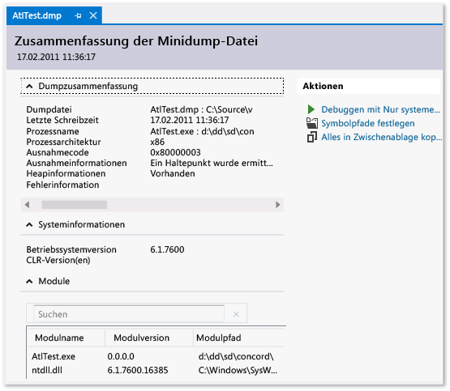

# Verwenden von Dumpdateien mit Visual Studio
Dumpdateien Sie mit oder ohne Heaps; Erstellen Sie eine Dumpdatei. Öffnen einer Dumpdatei; Suchen Sie die Binärdateien, die PDB-Datei und Quelldatei für eine Dumpdatei.
  
##   Was ist eine Dumpdatei?  
 Ein *Dumpdatei* ist eine Momentaufnahme einer Anwendung, an dem Punkt, Zeitpunkt der dumperstellung dar. Sie zeigt, welche Prozesse ausgeführt und welche Module geladen wurden. Wenn der Dump mit Heapinformationen gespeichert wurde, enthält die Dumpdatei eine Momentaufnahme des Inhalts im Speicher der Anwendung zu diesem Zeitpunkt. Das Öffnen einer Dumpdatei mit einem Heap in Visual Studio ist vergleichbar mit dem Anhalten an einem Haltepunkt in einer Debugsitzung. Obwohl die Ausführung nicht fortgesetzt werden kann, können Sie die Stapel-, Threads- und Variablenwerte der Anwendung zum Zeitpunkt des Auftretens des Dumps überprüfen.  
  
 Dumps dienen in erster Linie für das Debuggen von Problemen, die auf Computern, auf die der Entwickler nicht zugreifen. Beispielsweise können Sie eine Dumpdatei vom Computer eines Kunden der Absturz des kundencomputers reproduzieren oder Ihr Computer blockiert werden kann. Dumpdateien werden auch von Testern erstellt, um Absturz- oder Blockierungsdaten zu sichern, sodass der Testcomputer für weitere Tests verwendet werden kann. Der Visual Studio-Debugger kann Dumpdateien für verwalteten oder nativen Code speichern. Der Debugger kann Dumpdateien, die von Visual Studio oder von anderen Programmen, das Speichern von Dateien in erstellt wurden, laden die *Minidump* Format.  
  
##   Dumpdateien mit oder ohne heaps  
 Sie können Dumpdateien mit oder ohne Heapinformationen erstellen.  
  
-   **Dumpdateien mit Heaps** enthalten eine Momentaufnahme des Speichers der Anwendung. Dies umfasst die Werte der Variablen zum Zeitpunkt der Dumperstellung. Wenn Sie eine mit Heaps gespeicherte Dumpdatei laden, können die Symbole in Visual Studio geladen werden, auch wenn die Binärdateien der Anwendung nicht gefunden werden. Visual Studio speichert auch die Binärdateien der geladenen systemeigenen Module in der Dumpdatei, wodurch das Debugging wesentlich vereinfacht wird.  
  
-   **Dumpdateien ohne Heaps** sind wesentlich kleiner als Dumpdateien mit Heapinformationen. Allerdings muss der Debugger die Binärdateien der Anwendung laden, um die Symbolinformationen zu finden. Die Binärdateien müssen exakt mit den Binärdateien übereinstimmen, die für die Erstellung der Dumpdatei verwendet wurden. In den Dumpdateien ohne Heapdaten werden nur die Werte von Stapelvariablen gespeichert.  
  
##   Anforderungen und Einschränkungen  
  
-   Das Debuggen von Dumpdateien mit optimiertem Code kann unübersichtlich sein. Beispielsweise kann das Compiler-Inlining von Funktionen unerwartete Aufruflisten ergeben, und andere Optimierungen könnten die Lebensdauer der Variablen beeinflussen.  
  
-   Dumpdateien von 64-Bit-Computern müssen auf einer Instanz von Visual Studio debuggt werden, das auf einem 64-Bit-Computer ausgeführt wird.  
  
-   In Visual Studio-Versionen vor Visual Studio 2013 konnten Dumps von 32-Bit-Apps, die auf 64-Bit-Computern ausgeführt und mit einigen Tools erfasst wurden (z. B. Task-Manager und 64-Bit WinDbg), nicht in Visual Studio geöffnet werden. Diese Einschränkung wurde in Visual Studio 2013 aufgehoben.  
  
-   Visual Studio kann Dumpdateien systemeigener Anwendungen von ARM-Geräten debuggen. Visual Studio kann auch Dumpdateien verwalteter Anwendungen von ARM-Geräten debuggen, jedoch nur im nativen Debugger.  
  
-   So debuggen Sie [Kernelmodus-](http://msdn.microsoft.com/library/windows/hardware/ff551880.aspx) Dumpdateien, laden Sie die Debugtools für Windows, die Teil der [Windows Treiber Treiberkits (WDK)](/windows/hardware/windows-driver-kit). 
  
-   Visual Studio kann nicht die debugdumpdateien im älteren dumpformat genannt gespeichert eine [vollständiger benutzermodusdump](http://msdn.microsoft.com/library/windows/hardware/ff545506.aspx). Beachten Sie, dass ein vollständiger Benutzermodusdump nicht mit einer Dumpdatei mit Heapinformationen identisch ist.  
  
-   So debuggen Sie mit der [SOS.dll (SOS-Debugerweiterung)](/dotnet/framework/tools/sos-dll-sos-debugging-extension) in Visual Studio müssen Sie die Debugtools für Windows, die Teil der Installieren der [Windows Treiber Treiberkits (WDK)](/windows/hardware/windows-driver-kit) 
  
##   Erstellen einer Dumpdatei  
 So erstellen Sie eine Dumpdatei mit Visual Studio  
  
-   Beim Debuggen eines Prozesses in Visual Studio können Sie eine Dumpdatei speichern, wenn der Debugger an einer Ausnahme oder an einem Haltepunkt angehalten wurde. Wählen Sie **Debuggen**, klicken Sie dann **Dump speichern unter**, klicken Sie dann **Debuggen**. In der **Dump speichern unter** Dialogfeld die **Dateityp** Liste, wählen Sie **Minidump** oder **Minidump mit Heap** (Standard).  
  
-   Mit [Just-in-Time-Debuggen](../debugger/just-in-time-debugging-in-visual-studio.md) aktiviert, Sie können fügen Sie den Debugger an einen abgestürzten Prozess, der außerhalb des Debuggers ausgeführt wird, und klicken Sie dann eine Dumpdatei speichern. Finden Sie unter [Anfügen an laufende Prozesse](../debugger/attach-to-running-processes-with-the-visual-studio-debugger.md)  
  
 Dumpdateien können auch mit jedem Programm erstellt werden, das das Windows-Minidumpformat unterstützt. Z. B. die **Procdump** Befehlszeilen-Hilfsprogramm von [Windows Sysinternals](http://technet.microsoft.com/sysinternals/default) Dumpdateien zu Prozessabstürzen basierend auf Triggern oder bedarfsgesteuert erstellen können. Finden Sie unter [Anforderungen und Einschränkungen](../debugger/using-dump-files.md#BKMK_Requirements_and_limitations) in dieses Thema enthält zusätzliche Informationen zur Verwendung anderer Tools zum Erstellen von Dumpdateien. 
  
##   Öffnen einer Dumpdatei  
  
1.  Wählen Sie in Visual Studio **Datei**, **öffnen**, **Datei**.  
  
2.  In der **Dateiöffnungsmodus** Dialogfeld Suchen und wählen Sie die Dumpdatei. Die Dateierweiterung lautet in der Regel .dmp. Wählen Sie dann **OK**.  
  
3.  Die **Zusammenfassung der Minidump-Datei** Fenster wird angezeigt. In diesem Fenster können Sie Debug-Zusammenfassungsinformationen für die Dumpdatei anzeigen, den Symbolpfad festlegen, den Debugvorgang starten und die Zusammenfassungsinformationen in die Zwischenablage kopieren.  
  
       
  
4.  Debuggen starten, indem Sie die **Aktionen** Abschnitt, und wählen Sie entweder **Debuggen mit nur verwaltet**, **ausschließlich systemeigenem Code Debuggen** oder **Debuggen von gemischtem Code**.  
  
##   Suchen von Binär-, Symboldateien (.pdb) und Quelldateien  
 Um die vollständigen Funktionen von Visual Studio zum Debuggen von Dumpdateien zu nutzen, benötigen Sie Zugriff auf die folgenden Dateien:  
  
-   Die EXE-Datei, für die der Dump erstellt wurde, sowie andere Binärdateien (DLLs, usw.), die im Dumpprozess verwendet wurden.  
  
     Wenn Sie eine Dumpdatei mit Heapdaten debuggen, kann Visual Studio mit fehlenden Binärdateien für einige Module umgehen, es müssen jedoch Binärdateien für genügend Module vorhanden sein, um gültige Aufruflisten generieren zu können. Visual Studio schließt die systemeigenen Module in einer Dumpdatei mit Heapinformationen ein.  
  
-   Symboldateien (PDB-Dateien) für die EXE-Datei und andere Binärdateien.  
  
-   Quelldateien für die Module, die Sie interessieren.  
  
     Die ausführbaren Dateien und die PDB-Dateien müssen exakt mit der Version und dem Build der Dateien übereinstimmen, die für die Erstellung der Dumpdatei verwendet wurden.  
  
     Sie können Debuggen, mithilfe der disassemblys der Module aus, wenn Sie die Quelldateien nicht finden können,  
  
 **Standardsuchpfade für ausführbare Dateien**  
  
 Visual Studio sucht automatisch diese Speicherorte für ausführbare Dateien, die in der Dumpdatei enthalten sind:  
  
1.  Das Verzeichnis mit der Dumpdatei.  
  
2.  Der Pfad des Moduls, der in der Dumpdatei angegeben ist. Dies ist der Modulpfad auf dem Computer, auf dem das Speicherabbild erfasst wurde.  
  
3.  Die Symbolpfade, die im angegebenen der **Debuggen**, **Optionen**, **Symbole** Seite der Visual Studio **Tools**, **Optionen**  (Dialogfeld). Sie können mehr Speicherorte für die Suche auf dieser Seite hinzufügen.  
  
 **Verwenden keine binären > Symbol > Quelle Seiten**  
  
 Gefunden in Visual Studio die Dateien, die zum Debuggen eines Moduls im Dump erforderlich sind, wird eine entsprechende Seite angezeigt (**keine Binärdatei gefunden**, **keine Symbole gefunden**, oder **Quelle nicht gefunden**). Diese Seiten enthalten ausführliche Informationen zu den Ursachen des Problems und stellen Aktionslinks bereit, mit denen Sie den richtigen Speicherort der Dateien identifizieren können. Finden Sie unter [angeben von Symbol(PDB)- und Quelldateien](../debugger/specify-symbol-dot-pdb-and-source-files-in-the-visual-studio-debugger.md).  
  
## Siehe auch  
 [Just-in-Time-Debuggen](../debugger/just-in-time-debugging-in-visual-studio.md)   
 [Angeben von Symbol(PDB)- und Quelldateien](../debugger/specify-symbol-dot-pdb-and-source-files-in-the-visual-studio-debugger.md)   
 [IntelliTrace](../debugger/intellitrace.md)