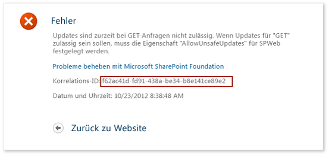
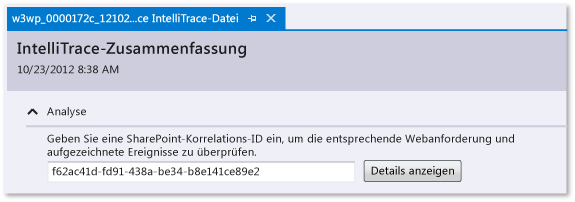
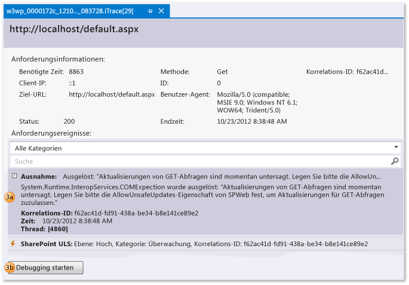
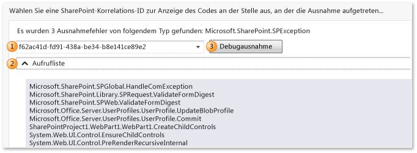

# Verwenden gespeicherter IntelliTrace-Daten
Wechseln Sie zu bestimmten Punkten in der Ausführung Ihrer Anwendung, wenn Sie das Debuggen von einer IntelliTrace-Protokoll-(.iTrace)-Datei aus beginnen. Diese Datei kann Leistungsereignisse, Ausnahmen, Threads, Testschritte, Module und weitere Systeminfo enthalten, die IntelliTrace erfasst, während Ihre App ausgeführt wird.  
  
 Stellen Sie sicher, dass Sie über Folgendes verfügen:  
  
-   Quelldateien und Symboldateien (PDB-Dateien) für Ihren Anwendungscode abgleichen. Andernfalls kann Visual Studio die Quellspeicherorte nicht auflösen und zeigt eine Meldung an, die darauf hinweist, dass die Symbole nicht gefunden wurden. Finden Sie unter [angeben von Symboldateien (.pdb) und Quelldateien](../debugger/specify-symbol-dot-pdb-and-source-files-in-the-visual-studio-debugger.md) und [Diagnostizieren von Problemen nach der Bereitstellung](../debugger/diagnose-problems-after-deployment.md).  
  
-   Visual Studio Enterprise (nicht Professional oder Community Editions) auf Ihrem Entwicklungscomputer oder einem anderen Computer zum Öffnen von ITRACE-Dateien  
  
-   Eine ITRACE-Datei aus einer der folgenden Quellen:  
  
    |**Quelle**|**Weitere Informationen finden Sie unter**|  
    |----------------|-------------|  
    |Eine IntelliTrace-Sitzung in Visual Studio Enterprise (nicht in Professional oder Community Editions)|[IntelliTrace-Funktionen](../debugger/intellitrace-features.md)|  
    |Eine Testsitzung in Microsoft Test Manager. Dadurch wird einer Team Foundation Server-Arbeitsaufgabe eine ITRACE-Datei angefügt.|[Sammeln weiterer Diagnosedaten in manuellen Tests](/vsts/manual-test/mtm/collect-more-diagnostic-data-in-manual-tests)|  
    |Microsoft Monitoring Agent, entweder allein oder mit System Center 2012 R2 Operations Manager für ASP.NET-Webanwendungen und SharePoint-Anwendungen, bei der Bereitstellung ausgeführt|-   [Diagnostizieren von Problemen nach der Bereitstellung](../debugger/diagnose-problems-after-deployment.md) -   [What's New for System Center 2012 R2 Operations Manager](http://technet.microsoft.com/library/dn249700.aspx)|  
  
##   Wie möchten Sie vorgehen?  
  
-   [Öffnen eines IntelliTrace-Protokolls](#Open)  
  
-   [Verstehen des IntelliTrace-Protokolls](#Understand)  
  
-   [Starten des Debuggen von einem IntelliTrace-Protokoll aus](#StartDebugging)  
  
##   Öffnen eines IntelliTrace-Protokolls  
 Öffnen Sie die ITRACE-Datei auf einen Computer mit Visual Studio Enterprise.  
  
-   Doppelklicken Sie außerhalb von Visual Studio auf die ITRACE-Datei, oder öffnen Sie die Datei aus Visual Studio heraus.  
  
     \- oder –  
  
-   Wenn die ITRACE-Datei einer Team Foundation Server-Arbeitsaufgabe angefügt ist, führen Sie folgende Schritte in der Arbeitsaufgabe durch:  
  
    -   Suchen Sie in **Alle Links**die ITRACE-Datei. Öffnen Sie sie.  
  
         \- oder –  
  
    -   Wählen Sie unter **Reproduktionsschritte**den Link **IntelliTrace** aus.  
  
> [!TIP]
>  Wenn Sie die IntelliTrace-Datei während des Debuggens geschlossen haben, können Sie sie einfach erneut öffnen. Wechseln Sie zum Menü **Debuggen** , wählen Sie die Option **IntelliTrace**, **Protokollzusammenfassung anzeigen**aus. Sie können **Protokollzusammenfassung anzeigen** auch im Fenster **IntelliTrace** auswählen. Dieser Befehl ist nur beim Debuggen mit IntelliTrace verfügbar.  
  
##   Verstehen des IntelliTrace-Protokolls  
 Einige der folgenden Abschnitte in der ITRACE-Datei werden nur angezeigt, wenn Sie Daten von einer bestimmten Quelle, beispielsweise Test Manager oder SharePoint-Anwendungen, gesammelt wurden.  
  
|**Bereich**|**Enthält**|**Sammelquelle**|  
|-----------------|------------------|---------------------------|  
|[Leistungsverletzungen](#Performance)|Leistungsereignisse mit Funktionsaufrufen, die den konfigurierten Schwellenwert überschreiten|Microsoft Monitoring Agent, entweder eigenständiger Auflistung oder mit System Center 2012 R2 Operations Manager für ASP.NET-Webanwendungen, gehostet auf IIS|  
|[Ausnahmedaten](#ExceptionData)|Ausnahmen, einschließlich der vollständigen Aufrufliste für jede Ausnahme|Alle Quellen|  
|[Analyse](#Analysis)|Nur für SharePoint 2010- und SharePoint 2013-Anwendungen. Diagnostizieren Sie IntelliTrace- und SharePoint-Ereignisse, wie z. B. Debugger-Ereignisse, ULS-Ereignisse, Ausnahmefehler und andere Daten, die der Microsoft Monitoring Agent aufgezeichnet hat.|Microsoft Monitoring Agent, entweder eigenständiger Auflistung oder mit System Center 2012 R2 Operations Manager|  
|[Systeminfo](#SystemInfo)|Einstellungen und Spezifikationen des Hostsystems|Alle Quellen|  
|[Threadliste](#ThreadsList)|Threads, die während der Auflistung ausgeführt wurden|Alle Quellen|  
|[Testdaten](#TestData)|Testschritte und ihre Ergebnisse aus einer Testsitzung|Test-Manager|  
|[Module](#Modules)|Module, die der Zielprozess in der Reihenfolge geladen hat, in der sie geladen wurden.|Alle Quellen| 
|[Webanforderung](#Modules)|Anforderungsdaten für die Produktion IIS Web-Webanwendungen und SharePoint 2010 und SharePoint 2013|Microsoft Monitoring Agent und eigenständiger Auflistung| 
  
 Im Folgenden einige Tipps, mit deren Hilfe Sie Informationen in einem der Abschnitte finden können:  
  
-   Wählen Sie einen Spaltenheader zum Sortieren der Daten aus.  
  
-   Verwenden Sie das Suchfeld zum Filtern der Daten. Nur-Text-Suche funktioniert bei allen Spalten mit Ausnahme der Zeitspalten. Sie können auch Suchen in einer bestimmten Spalte filtern, mit einem Filter pro Spalte. Geben Sie den Spaltennamen ohne Leerzeichen ein, mit einem Doppelpunkt (**:**) und dem Suchwert. Setzen Sie danach ein Semikolon (**;**), um eine weitere Spalte und einen weiteren Suchwert hinzuzufügen.  
  
     Um beispielsweise Leistungsereignisse zu suchen, die das Wort "langsam" in der Spalte **Beschreibung** haben, geben Sie ein:  
  
     `Description:slow`  
  
##   Starten des Debuggen von einem IntelliTrace-Protokoll aus  
  
###   Leistungsverletzungen  
 Überprüfen Sie die Leistungsereignisse, die für Ihre App aufgezeichnet wurden. Sie können diese Ereignisse ausblenden, die nicht häufig vorkommen.  
  
##### So starten Sie das Debuggen von einem Leistungsereignis aus  
  
1.  Unter **Leistungsverletzungen**überprüfen Sie die aufgezeichneten Leistungsereignisse, ihre Gesamtausführungszeiten und andere Ereignisinformationen. Sehen Sie sich anschließend die Details der Methoden näher an, die während eines bestimmten Leistungsereignisses aufgerufen wurden.  
  
       
  
     Sie können auch einfach auf das Ereignis doppelklicken.  
  
2.  Überprüfen Sie auf der Ereignisseite die Ausführungszeiten für diese Aufrufe. Suchen Sie einen langsamen Aufruf in der Ausführungsstruktur.  
  
     Die langsamsten Aufrufe werden in einem eigenen Bereich angezeigt, wenn Sie mehrere, geschachtelte oder andere Aufrufe haben.  
  
3.  Erweitern Sie diesen Aufruf, um alle geschachtelten Aufrufe und Parameterwerte zu überprüfen, die zu diesem Zeitpunkt aufgezeichnet wurden.  
  
     (Tastatur: Um einen geschachtelten Aufruf anzuzeigen oder auszublenden, drücken Sie die **NACH-RECHTS-TASTE** , bzw. die **NACH-LINKS-TASTE** . Um Parameterwerte für einen geschachtelten Aufruf anzuzeigen und auszublenden, drücken Sie die **LEERTASTE** .)  
  
     Starten Sie das Debuggen über diesen Aufruf.  
  
       
  
     Sie können auch einfach auf den Aufruf doppelklicken oder die **EINGABETASTE** drücken.  
  
     Wenn die Methode in Ihrem Anwendungscode enthalten ist, wechselt Visual Studio zu dieser Methode.  
  
       
  
     Jetzt können Sie andere aufgezeichnete Werte und die Aufrufliste überprüfen, den Code schrittweise durchlaufen oder das Fenster **IntelliTrace** verwenden, um [sich zwischen anderen Methoden zeitlich rückwärts oder vorwärts zu bewegen](../debugger/intellitrace.md) , die während dieses Leistungsereignisses aufgerufen wurden.  
  
###   Ausnahmedaten  
 Überprüfen Sie die Ausnahmen, die für die Anwendung ausgelöst und aufgezeichnet wurden. Sie können Ausnahmen gruppieren, die denselben Typ und dieselbe Aufrufliste haben, damit nur die letzte Ausnahme angezeigt wird.  
  
##### So starten Sie das Debuggen aus einer Ausnahme heraus  
  
1.  Überprüfen Sie unter **Ausnahmedaten**die aufgezeichneten Ausnahmeereignisse, deren Typen und Meldungen und wann die Ausnahmen aufgetreten sind. Um tiefer in den Code zu vorzudringen, starten Sie das Debuggen des letzten Ereignisses in einer Gruppe von Ausnahmen.  
  
       
  
     Sie können auch einfach auf das Ereignis doppelklicken. Wenn die Ereignisse nicht gruppiert werden, wählen Sie **Dieses Ereignis debuggen**aus.  
  
     Wenn die Ausnahme im Anwendungscode aufgetreten ist, wechselt Visual Studio zu der Stelle, an der die Ausnahme aufgetreten ist.  
  
       
  
     Jetzt können Sie andere aufgezeichnete Werte und die Aufrufliste überprüfen oder das Fenster **IntelliTrace** verwenden, um [sich zwischen anderen aufgezeichneten Ereignissen](../debugger/intellitrace.md), zugehörigem Code und den Werten zu bewegen, die zu diesen Zeitpunkten erfasst wurden.  
  
    |**Spalte**|**Enthält Folgendes**|  
    |----------------|-------------------|  
    |**Typ**|.NET-Typ der Ausnahme|  
    |**Neueste Meldung** für gruppierte Ausnahmen oder **Meldung** für nicht gruppierte Ausnahmen|Die von der Ausnahme bereitgestellte Meldung|  
    |**Anzahl** für gruppierte Ausnahmen|Die Anzahl, wie oft die Ausnahme ausgelöst wurde|  
    |**Thread-ID** für nicht gruppierte Ausnahmen|ID des Threads, der die Ausnahme ausgelöst hat|  
    |**Neueste Ereigniszeit** oder **Ereigniszeit**|Der beim Auslösen der Ausnahme aufgezeichnete Zeitstempel|  
    |**Aufrufliste**|Aufrufliste für eine Ausnahme.   Wählen Sie zum Anzeigen der Aufrufliste eine Ausnahme in der Liste aus. Die Aufrufliste wird unter der Ausnahmeliste angezeigt.|  
  
###   Analyse  
 Diagnostizieren Sie Probleme mit SharePoint 2010- und SharePoint 2013-Anwendungen, indem Sie eine SharePoint-Korrelations-ID verwenden, oder überprüfen Sie alle Ausnahmefehler, die Microsoft Monitoring Agent gefunden hat.  
  
-   Verwenden einer SharePoint-Korrelations-ID, um die entsprechende Webanforderung und Ereignisse zu suchen Wählen Sie ein Ereignis aus, und beginnen Sie dann an dem Punkt mit dem Debuggen, an dem das Ereignis aufgetreten ist.  
  
-   Wenn Microsoft Monitoring Agent Ausnahmefehler gefunden hat, können Sie eine Ausnahme auswählen und dann an dem Punkt mit dem Debuggen beginnen, an dem die Ausnahme aufgetreten ist.  
  
##### Das Debuggen mit einer SharePoint-Korrelations-ID starten  
  
1.  Kopieren der SharePoint-Korrelations-ID aus der Quelle  
  
     Zum Beispiel:  
  
       
  
2.  Öffnen Sie die ITRACE-Datei, wählen Sie dann **Analyse** aus, und geben Sie die SharePoint-Korrelations-ID ein, um die entsprechende Webanforderung und aufgezeichneten Ereignisse zu überprüfen.  
  
       
  
3.  Überprüfen Sie die Ereignisse unter **Angeforderte Ereignisse**. Ereignisse werden von oben nach unten in der Reihenfolge ihres Auftretens angezeigt.  
  
    1.  Wählen Sie zum Anzeigen von Details ein Ereignis aus.  
  
    2.  Wählen Sie **Debugging starten** , um das Debuggen an dem Punkt zu starten, an dem das Ereignis aufgetreten ist.  
  
       
  
 Sie können diese Art von SharePoint-Ereignissen zusammen mit IntelliTrace-Ereignissen anzeigen:  
  
-   **Benutzerprofilereignisse**  
  
     Diese Ereignisse treten auf, wenn SharePoint ein Benutzerprofil lädt und wenn Benutzerprofileigenschaften gelesen oder geändert werden.  
  
-   **Einheitliche Ereignisse des Protokollierungs-Systems (ULS)**  
  
     Microsoft Monitoring Agent zeichnet eine Teilmenge von SharePoint ULS-Ereignissen und diese Felder auf:  
  
    |**IntelliTrace-Feld**|**SharePoint ULS-Feld**|  
    |----------------------------|------------------------------|  
    |**Id**|**EventID**|  
    |**Ebene**|**Ebene**|  
    |**Kategorie-ID**|**Kategorie-ID**|  
    |**Kategorie**|**Kategorie**|  
    |**Bereich**|**Produkt**|  
    |**Ausgabe**|**Meldung**|  
    |**Korrelations-ID**|**Korrelations-ID**|  
  
##### Das Debuggen von einem Ausnahmefehler aus starten  
  
1.  Wählen Sie eine SharePoint-Korrelations-ID für eine Ausnahme aus. Ausnahmen werden nach Typ und Aufrufliste gruppiert.  
  
2.  (Optional) Erweitern Sie die **Aufrufliste** , um die Aufrufliste für eine Ausnahmengruppe anzuzeigen.  
  
3.  Wählen Sie **Ausnahme debuggen** aus, um das Debuggen an dem Punkt zu starten, an dem die Ausnahme aufgetreten ist.  
  
       
  
 Eine exemplarische Vorgehensweise finden Sie unter [Exemplarische Vorgehensweise: Debuggen einer SharePoint-Anwendung durch Verwenden von IntelliTrace](../sharepoint/walkthrough-debugging-a-sharepoint-application-by-using-intellitrace.md). Für die Arten von Daten, die vom Agent aufgezeichnet werden, finden Sie unter [IntelliTrace-Features](../debugger/intellitrace-features.md).  
  
###   Threadliste  
 Untersuchen Sie die aufgezeichneten Threads, die im Zielprozess ausgeführt wurden. Sie können das Debuggen vom ersten gültigen IntelliTrace-Ereignis in einem ausgewählten Thread starten.  
  
##### So starten Sie das Debuggen über einen bestimmten Thread  
  
1.  Wählen Sie unter **Threadliste**einen Thread aus.  
  
2.  Wählen Sie am unteren Rand von **Threadliste**die Option **Debuggen starten**aus. Sie können auch auf einen Thread doppelklicken.  
  
     Doppelklicken Sie auf **Hauptthread**, um das Debuggen vom Anfang der Anwendung aus zu starten. Finden Sie unter [IntelliTrace-Features](../debugger/intellitrace-features.md).  
  
 Von einem Benutzer erstellte Threaddaten sind möglicherweise nützlicher, als Threads, die von einem Server für IIS-gehostete Webanwendungen erstellt und verwaltet werden.  
  
|**Spalte**|**Enthält Folgendes**|  
|----------------|-------------------|  
|**ID**|Thread-ID-Nummer|  
|**Name**|Threadname. Unbenannte Threads werden als "\<kein Name >".|  
|**Startzeit**|Zeitpunkt der Threaderstellung.|  
|**Endzeit**|Zeitpunkt des Threadabschlusses|  
  
###   Testdaten  
 Überprüfen Sie die von Test Manager aufgezeichneten IntelliTrace-Daten, während Sie Ihre App testen.  
  
##### So starten Sie das Debuggen über einen bestimmten Testschritt  
  
1.  Erweitern Sie **Testschritte-Raster**. Wählen Sie einen Testschritt aus.  
  
2.  Wählen Sie am unteren Rand von **Testschritte-Raster**die Option **Debuggen starten**aus. Sie können auch auf einen Testschritt doppelklicken.  
  
     Hierdurch wird das Debuggen über das erste gültige IntelliTrace-Ereignis nach dem ausgewählten Testschritt gestartet.  
  
     Wenn Testdaten vorhanden sind, versucht IntelliTrace, den zugeordneten Team Foundation Server-Build aufzulösen, der zum Ausführen des Testlaufs verwendet wurde. Wenn der Build gefunden wird, werden die zugeordneten Symbole für die Anwendung automatisch aufgelöst.  
  
|**Feld**|**Enthält Folgendes**|  
|---------------|-------------------|  
|**Testsitzung**|Testsitzungen, die aufgezeichnet wurden. In der Regel ist nur eine vorhanden. Diese Liste ist leer, wenn Testdaten mithilfe eines manuellen explorativen Tests erstellt wurden.|  
|**Testfall**|Testfälle aus der ausgewählten Testsitzung. Diese Liste ist leer, wenn Testdaten mithilfe eines manuellen explorativen Tests erstellt wurden.|  
|**Testschritte-Raster**|Testschritte, die mit dem Testergebnis "Erfolgreich" oder "Fehler" aufgezeichnet wurden|  
  
###   Systeminfo  
 Dieser Abschnitt zeigt Informationen über das System, das die Anwendung gehostet hat, wie z. B. Hardware, Betriebssystem, umgebungsbedingte und prozessspezifische Informationen.  
  
###   Module  
 In diesem Abschnitt werden die Module angezeigt, die vom Zielprozess geladen wurden. Module werden in der Reihenfolge angezeigt, in der sie geladen wurden.  
  
|**Spalte**|**Enthält Folgendes**|  
|----------------|-------------------|  
|**Modulname**|Moduldateiname|  
|**Modulpfad**|Speicherort auf einem Datenträger, in dem das Modul geladen wurde|  
|**Modul-ID**|Eindeutiger Bezeichner des Moduls, der versionsspezifisch ist und zu den übereinstimmenden Symboldateien (PDB) beiträgt. Siehe [Finding symbol (.pdb) files and source files](http://msdn.microsoft.com/en-us/05384c85-d264-4e18-abaa-aa482ab25470).|  
  
### Wo kann ich weitere Informationen abrufen?  
 [Verwenden des eigenständigen IntelliTrace-Collectors](../debugger/using-the-intellitrace-stand-alone-collector.md)  
  
 [IntelliTrace-Funktionen](../debugger/intellitrace-features.md)  
  
 [Sammeln weiterer Diagnosedaten in manuellen Tests](/vsts/manual-test/mtm/collect-more-diagnostic-data-in-manual-tests)  
  
 [IntelliTrace](../debugger/intellitrace.md)  
  
#### Foren  
 [Visual Studio Debugger](http://go.microsoft.com/fwlink/?LinkId=262263)  
  
#### Empfehlungen  
 [Tests für fortlaufende Übermittlung mit Visual Studio 2012 – Kapitel 6: Testwerkzeugkasten](http://go.microsoft.com/fwlink/?LinkID=255203)