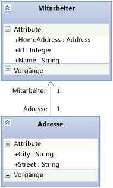

# <a name="using-the-intellitrace-stand-alone-collector"></a>Verwenden des eigenständigen IntelliTrace-Collectors
Mit dem **eigenständigen IntelliTrace Collector** können Sie IntelliTrace-Diagnosedaten für Ihre Anwendungen auf Produktionsservern oder anderen Umgebungen erfassen, ohne Visual Studio auf dem Zielcomputer zu installieren oder Änderungen an der Zielsystemumgebung vorzunehmen. Die eigenständige IntelliTrace Collector kann für Web-, SharePoint-, WPF- und Windows Forms-Webanwendungen verwendet werden. Nachdem die Daten gesammelt wurden, kann der Collector mit einem Löschvorgang deinstalliert werden.

 Sehen Sie IntelliTrace in Aktion: [Sammeln und Analysieren von Daten in der Produktion (Channel 9-Video)](http://go.microsoft.com/fwlink/?LinkID=251851)

> [!NOTE]
>  Sie können IntelliTrace-Daten auf Remotecomputern auch für Web- und SharePoint-Anwendungen mithilfe des **Microsoft Monitoring Agent** im **Ablaufverfolgungs** modus erfassen.
>
>  Sie können leistungsbezogene Ereignisse in den IntelliTrace-Daten erfassen, indem Sie den Agenten im **Überwachungs** modus ausführen. Der**Überwachungs** modus hat weniger Auswirkungen auf die Leistung als der **Ablaufverfolgungs** modus oder der **IntelliAblaufverfolgungs stand-alone collector**. Durch die Installation von Microsoft Monitoring Agent ändert sich nicht die Zielsystemumgebung. Finden Sie unter [mithilfe von Microsoft Monitoring Agent](../debugger/using-the-microsoft-monitoring-agent.md).
>  Die eigenständige IntelliTrace Collector unterstützt-Prozess-Momentaufnahmen nicht.

 **Anforderungen**

- .NET Framework 3.5, 4 oder 4.5

- Visual Studio Enterprise (nicht Professional oder Community Editions) auf einem Entwicklungscomputer oder einem anderen Computer zum Öffnen von ITRACE-Dateien

  > [!NOTE]
  >  Achten Sie darauf, die Symboldateien (.pdb) zu speichern. Um mit IntelliTrace debuggen und Code schrittweise ausführen zu können, müssen Sie über die entsprechenden Quelldateien und Symboldateien verfügen. Finden Sie unter [Diagnostizieren von Problemen nach der Bereitstellung](../debugger/diagnose-problems-after-deployment.md).

  **FAQ**

- [Welche Apps arbeiten mit dem Collector?](#WhatApps)

- [Wie fange ich an?](#GetStarted)

- [Wie kann ich möglichst viele Daten abrufen, ohne die App zu verlangsamen?](#Minimizing)

- [Wo kann ich IntelliTrace-Daten außerdem abrufen?](#WhereElse)

##  <a name="WhatApps"></a> Welche Apps arbeiten mit dem Collector?

-   Auf Internetinformationsdienste (IIS) Version 7.0, 7.5 und 8.0 gehostete ASP.NET-Webanwendungen

-   SharePoint 2010- und SharePoint 2013-Anwendungen

-   Windows Presentation Foundation (WPF) und Windows Forms-Anwendungen.

##  <a name="GetStarted"></a> Wie fange ich an?

1.  [Installieren von Collector](#BKMK_Install_the_IntelliTrace_Stand_Alone_Collector)

2.  [Berechtigungen für das Sammlungsverzeichnis](#ConfigurePermissionsRunningCollector)

3.  [IntelliTrace-PowerShell-Cmdlets installieren, um Daten für Webapps oder SharePoint-Anwendungen zu sammeln](#BKMK_Set_up_the_IntelliTrace_PowerShell_commandlets)

4.  [Berechtigungen für das ITRACE-Dateiverzeichnis einrichten](#BKMK_Create_and_Configure_a_Log_File_Directory)

5.  [Daten von einer Webapp oder SharePoint-Anwendung sammeln](#BKMK_Collect_Data_from_IIS_Application_Pools)

     - oder - 

     [Sammeln von Daten aus einer verwalteten Anwendung](#BKMK_Collect_Data_from_Executables)

6.  [Öffnen der ITRACE-Datei in Visual Studio Enterprise](#BKMK_View_IntelliTrace_Log_Files)

##  <a name="BKMK_Install_the_IntelliTrace_Stand_Alone_Collector"></a> Installieren von Collector

1. Erstellen Sie das Collector-Verzeichnis auf dem Server der App, beispielsweise:  **C:\IntelliTraceCollector**

2. Sie finden den Collector im Microsoft Download Center oder dem Installationsordner von Visual Studio 2013 Update 3. [IntelliTrace-Collector für Visual Studio 2013 Update 4](https://www.microsoft.com/en-us/download/details.aspx?id=44909):

   - **Microsoft Download Center**:

     1. Wählen Sie neben **IntelliTraceCollector.exe**die Option **Herunterladen**aus.

     2. Speichern Sie IntelliTraceCollector.exe im Collector-Verzeichnis, beispielsweise:  **C:\IntelliTraceCollector**

     3. Führen Sie die IntelliTraceCollector.exe aus. Dadurch wird die IntelliTraceCollection.cab-Datei extrahiert.

        \- oder –

   - **Visual Studio-Installationsordner**:

     1.  Kopieren Sie die Datei "IntelliTraceCollection.cab" aus dem folgenden Ordner:

          **.. \Microsoft visual Studio 12.0\Common7\IDE\CommonExtensions\Microsoft\IntelliTrace\12.0.0**

     2.  Legen Sie IntelliTraceCollection.cab im Collector-Verzeichnis ab, beispielsweise:  **C:\IntelliTraceCollector**

3. Erweitern Sie die Datei "IntelliTraceCollection.cab":

   1.  Öffnen Sie auf dem Server der App ein Eingabeaufforderungsfenster als Administrator.

   2.  Wechseln Sie zum Collector-Verzeichnis, beispielsweise:  **C:\IntelliTraceCollector**

   3.  Verwenden Sie den Befehl **expand** , einschließlich des Punkts (**.**) am Ende, zum Erweitern der IntelliTraceCollection.cab-Datei:

        `expand  /f:* IntelliTraceCollection.cab .`

       > [!NOTE]
       >  Durch den Punkt (**.**) werden die Unterordner mit den lokalisierten Auflistungsplänen beibehalten.

##  <a name="ConfigurePermissionsRunningCollector"></a> Berechtigungen für das Sammlungsverzeichnis

1.  Öffnen Sie auf dem Server der App ein Eingabeaufforderungsfenster als Administrator.

2.  Verwenden Sie den Windows-Befehl **icacls** , um dem Serveradministrator vollständige Berechtigungen für das Collector-Verzeichnis einzuräumen. Beispiel:

     `icacls "C:\IntelliTraceCollector" /grant "` *\<Domain\AdministratorID >* `":F`

3.  So sammeln Sie Daten für eine Web App oder eine SharePoint-Anwendung:

    1.  Räumen Sie der Person, die die IntelliTrace-PowerShell-Cmdlets ausführen soll, vollständige Berechtigungen für das Collector-Verzeichnis ein.

         Beispiel:

         `icacls "C:\IntelliTraceCollector" /grant "` *\<Domain\UserID-Paar >* `":F`

    2.  Räumen Sie dem Anwendungspool für die Webanwendung oder SharePoint-Anwendung Lese-/Schreib-Berechtigungen für das Collector-Verzeichnis ein.

         Beispiel:

        -   Für eine Web App im **DefaultAppPool** -Anwendungspool:

             `icacls "C:\IntelliTraceCollector" /grant "IIS APPPOOL\DefaultAppPool":RX`

        -   Für eine SharePoint-Anwendung im **SharePoint - 80** -Anwendungspool:

             `icacls "C:\IntelliTraceCollector" /grant "IIS APPPOOL\SharePoint - 80":RX`

##  <a name="BKMK_Set_up_the_IntelliTrace_PowerShell_commandlets"></a> IntelliTrace-PowerShell-Cmdlets installieren, um Daten für Webapps oder SharePoint-Anwendungen zu sammeln

1.  Stellen Sie sicher, dass PowerShell auf dem Server der App aktiviert ist. Bei den meisten Versionen von Windows Server, können Sie diese Funktion im **Server-Manager** -Verwaltungsprogramm hinzufügen.

     

2.  Installieren Sie die IntelliTrace-PowerShell-cmdlets.

    1.  Öffnen Sie ein PowerShell-Befehlsfenster als Administrator.

        1.  Wählen Sie **Start**, **Alle Programme**, **Zubehör**, **Windows PowerShell**aus.

        2.  Wählen Sie einen der folgenden Schritte aus:

            -   Unter 64-Bit-Betriebssystemen: öffnen Sie das Kontextmenü für **Windows PowerShell**. Wählen Sie **Als Administrator ausführen**.

            -   Unter 32-Bit-Betriebssystemen: öffnen Sie das Kontextmenü für **Windows PowerShell (x86)**. Wählen Sie **Als Administrator ausführen**.

    2.  Verwenden Sie im PowerShell-Befehlsfenster den Befehl **Import-Module** , um die **Microsoft.VisualStudio.IntelliTrace.PowerShell.dll**zu importieren.

         Beispiel:

         `Import-Module "C:\IntelliTraceCollector\Microsoft.VisualStudio.IntelliTrace.PowerShell.dll"`

##  <a name="BKMK_Create_and_Configure_a_Log_File_Directory"></a> Berechtigungen für das ITRACE-Dateiverzeichnis einrichten

1. Erstellen Sie das .iTrace-Dateiverzeichnis auf dem Server der App, beispielsweise:  **C:\IntelliTraceLogFiles**

   > [!NOTE]
   > - Um eine Verlangsamung der App zu vermeiden, wählen Sie einen Speicherort auf einem lokalen Hochgeschwindigkeitsdatenträger, der nicht sehr aktiv ist.
   >   -   Die ITRACE-Dateien und die Collector-Dateien können am selben Speicherort abgelegt werden. Achten Sie aber bei einer Web App oder SharePoint-Anwendung darauf, dass der Speicherort außerhalb des Verzeichnisses liegt, indem die Anwendung gehostet wird.
   > 
   > [!IMPORTANT]
   > - Beschränken Sie den Zugriff auf das Verzeichnis der ITRACE-Datei auf die Identitäten, die den Collector für ihre Arbeit benötigen. Eine ITRACE-Datei kann möglicherweise vertrauliche Informationen enthalten, wie beispielsweise Daten von Benutzern, Datenbanken, anderen Quellspeicherorten und von den Verbindungszeichenfolgen, da IntelliTrace sowohl alle Daten, die an Methodenparameter übergeben werden, aufzeichnen kann, als auch als Rückgabewerte.
   >   -   Stellen Sie sicher, dass die Personen, die ITRACE-Dateien öffnen können, über die Befugnis verfügen, vertraulichen Daten einzusehen. Seien Sie bei der Freigabe von ITRACE-Dateien vorsichtig. Wenn andere Personen Zugriff benötigen, kopieren Sie die Dateien an einen sicheren freigegebenen Speicherort.

2. Für eine Web App oder SharePoint-Anwendung geben Sie dem Anwendungspool vollständige Berechtigungen zum ITRACE-Dateiverzeichnis. Sie können den Windows-Befehl **icacls** oder den Windows-Explorer (bzw. den Datei-Explorer) verwenden.

    Beispiel:

   - So legen Sie Berechtigungen mit dem Windows-Befehl **icacls** fest:

     - Für eine Web App im **DefaultAppPool** -Anwendungspool:

        `icacls "C:\IntelliTraceLogFiles" /grant "IIS APPPOOL\DefaultAppPool":F`

     - Für eine SharePoint-Anwendung im **SharePoint - 80** -Anwendungspool:

        `icacls "C:\IntelliTraceLogFiles" /grant "IIS APPPOOL\SharePoint - 80":F`

       - oder - 

   - So legen Sie die Berechtigungen mit dem Windows-Explorer (bzw. dem Datei-Explorer) fest:

     1.  Öffnen Sie die **Eigenschaften** für das ITRACE-Dateiverzeichnis.

     2.  Wählen Sie auf der Registerkarte **Sicherheit** die Option **Bearbeiten**, **Hinzufügen**aus.

     3.  Stellen Sie sicher, dass im Feld **Diesen Objekttyp auswählen** die Option **Integrierte Sicherheitsprinzipale** angezeigt wird. Wenn sie nicht vorhanden ist, wählen Sie **Objekttypen**, um sie hinzuzufügen.

     4.  Versichern Sie sich, dass der lokale Computer im Feld **Aus diesem Speicherort** angezeigt wird. Wenn er nicht vorhanden ist, wählen Sie **Speicherorte** aus, um es zu ändern.

     5.  Fügen Sie im Feld **Geben Sie die Namen der auszuwählenden Objekte ein** den Anwendungspool für die Web App oder die SharePoint-Anwendung hinzu.

     6.  Wählen Sie **Namen überprüfen** aus, um den Namen aufzulösen. Klicken Sie auf **OK**.

     7.  Stellen Sie sicher, dass der Anwendungspool über **Vollzugriff**verfügt.

##  <a name="BKMK_Collect_Data_from_IIS_Application_Pools"></a> Daten von einer Webapp oder SharePoint-Anwendung sammeln

1.  Um mit dem Sammeln von Daten zu beginnen, öffnen Sie ein PowerShell-Befehlsfenster als Administrator, dann führen Sie diesen Befehl aus:

     `Start-IntelliTraceCollection` `"` *\<ApplicationPool >* `"`  *\<PathToCollectionPlan >*  *\<FullPathToITraceFileDirectory >*

    > [!IMPORTANT]
    >  Nach Ausführen dieses Befehls, geben Sie **Y** ein, um zu bestätigen, dass Sie mit dem Sammeln von Daten beginnen möchten.

     So sammeln Sie beispielsweise Daten aus einer SharePoint-Anwendung in den **SharePoint - 80** -Anwendungspool:

     `Start-IntelliTraceCollection "SharePoint - 80" "C:\IntelliTraceCollector\collection_plan.ASP.NET.default.xml" "C:\IntelliTraceLogFiles"`

    |||
    |-|-|
    |*ApplicationPool*|Der Name des Anwendungspools, in dem die Anwendung ausgeführt wird|
    |*PathToCollectionPlan*|Der Pfad zu einem Auflistungsplan, einer XML-Datei, über die die Einstellungen für den Collector konfiguriert werden.<br /><br /> Sie können einen Plan angeben, der mit dem Collector ausgeführt wird. Die folgenden Pläne funktionieren bei Web Apps und SharePoint-Anwendungen:<br /><br /> – collection_plan.ASP.NET.default.xml<br />     Sammelt nur IntelliTrace-Ereignisse und SharePoint-Ereignisse, einschließlich Ausnahmen, Datenbankaufrufen und Webserveranforderungen.<br />– collection_plan.ASP.NET.trace.xml<br />     Sammelt Funktionsaufrufe und alle Daten in der Datei collection_plan.ASP.NET.de fault.xml. Dieser Plan ist für detaillierte Analysen geeignet, aber er verlangsamt möglicherweise die Anwendung mehr als collection_plan.ASP.NET.de fault.xml.<br /><br /> Um eine Verlangsamung der App zu vermeiden, passen Sie diese Pläne an, oder erstellen Sie sich einen eigenen. Aus Sicherheitsgründen legen Sie alle benutzerdefinierten Pläne am gleichen sicheren Speicherort ab wie die Collector-Dateien. Siehe [Erstellen und Anpassen von IntelliTrace-Auflistungsplänen](http://go.microsoft.com/fwlink/?LinkId=227871) und [Wie rufe ich die möglichst viele Daten ab, ohne die App zu verlangsamen?](#Minimizing) **Hinweis**:  Standardmäßig liegt die maximale Größe der ITRACE-Datei bei 100 MB. Wenn die .iTrace-Datei diese Grenze erreicht, werden die frühesten Einträge in der Datei vom Collector gelöscht, um Platz für neuere Einträge zu schaffen. Zum Ändern dieses Limits bearbeiten Sie das `MaximumLogFileSize`-Attribut des Sammlungsplans. <br /><br /> *Wo finde ich lokalisierte Versionen dieser Sammlungspläne?*<br /><br /> Sie finden lokalisierte Pläne in den Collector-Installationsunterordnern.|
    |*FullPathToITraceFileDirectory*|Der vollständige Pfad zum ITRACE-Dateiverzeichnis. **Sicherheitshinweis:**  Stellen Sie den vollständigen Pfad, keinen relativen Pfad bereit.|

     Der Collector wird an den Anwendungspool angefügt und startet die Datensammlung.

     *Kann ich die ITRACE-Datei zu diesem Zeitpunkt öffnen?* Nein, die Datei ist während der Datensammlung gesperrt.

2.  Reproduzieren Sie das Problem.

3.  Verwenden Sie zum Erstellen eines Prüfpunkts der ITRACE-Datei die folgende Syntax:

     `Checkpoint-IntelliTraceCollection` `"` *\<ApplicationPool>* `"`

4.  Um den Auflistungsstatus zu überprüfen, verwenden Sie die folgende Syntax:

     `Get-IntelliTraceCollectionStatus`

5.  Zum Beenden der Datensammlung verwenden Sie die folgende Syntax:

     `Stop-IntelliTraceCollection` `"` *\<ApplicationPool>* `"`

    > [!IMPORTANT]
    >  Nach Ausführen dieses Befehls, geben Sie **J** ein, um zu bestätigen, dass Sie das Sammeln von Daten beenden möchten. Andernfalls setzt der Collector das Sammeln von Daten möglicherweise fort, die iTrace Datei bleibt gesperrt, oder die Datei enthält eventuell keine nützlichen Daten.

6.  [Öffnen der ITRACE-Datei in Visual Studio Enterprise](#BKMK_View_IntelliTrace_Log_Files)

##  <a name="BKMK_Collect_Data_from_Executables"></a> Sammeln von Daten aus einer verwalteten Anwendung

1.  Um die App zu starten und gleichzeitig Daten zu erfassen, verwenden Sie die folgende Syntax:

     *\<FullPathToIntelliTraceCollectorExecutable >* `\IntelliTraceSC.exe launch /cp:`  *\<PathToCollectionPlan >* `/f:`  *\< FullPathToITraceFileDirectoryAndFileName >*  *\<PathToAppExecutableFileAndFileName >*

     So sammeln Sie beispielsweise Daten von einer App namens **MyApp**:

     `C:IntelliTraceCollectorIntelliTraceSC.exe launch /cp:"C:IntelliTraceCollectorcollection_plan.ASP.NET.default.xml" /f:"C:IntelliTraceLogFilesMyApp.itrace" "C:MyAppMyApp.exe"`

    |||
    |-|-|
    |*FullPathToIntelliTraceCollectorExecutable*|Der vollständige Pfad zur ausführbaren IntelliTraceSC.exe-Datei des Collectors|
    |*PathToCollectionPlan*|Der Pfad zu einem Auflistungsplan, einer XML-Datei, über die die Einstellungen für den Collector konfiguriert werden.<br /><br /> Sie können einen Plan angeben, der mit dem Collector ausgeführt wird. Die folgende Pläne funktionieren bei verwalteten Apps:<br /><br /> – collection_plan.ASP.NET.default.xml<br />     Sammelt nur IntelliTrace-Ereignisse, einschließlich Ausnahmen, Datenbankaufrufe und Webserveranforderungen.<br />– collection_plan.ASP.NET.trace.xml<br />     Sammelt Funktionsaufrufe und alle Daten in der Datei collection_plan.ASP.NET.de fault.xml. Dieser Plan ist für detaillierte Analysen geeignet, aber er verlangsamt möglicherweise die Anwendung mehr als collection_plan.ASP.NET.de fault.xml.<br /><br /> Um eine Verlangsamung der App zu vermeiden, passen Sie diese Pläne an, oder erstellen Sie sich einen eigenen. Aus Sicherheitsgründen legen Sie alle benutzerdefinierten Pläne am gleichen sicheren Speicherort ab wie die Collector-Dateien. Siehe [Erstellen und Anpassen von IntelliTrace-Auflistungsplänen](http://go.microsoft.com/fwlink/?LinkId=227871) und [Wie rufe ich die möglichst viele Daten ab, ohne die App zu verlangsamen?](#Minimizing) **Hinweis**:  Standardmäßig liegt die maximale Größe der ITRACE-Datei bei 100 MB. Wenn die .iTrace-Datei diese Grenze erreicht, werden die frühesten Einträge in der Datei vom Collector gelöscht, um Platz für neuere Einträge zu schaffen. Zum Ändern dieses Limits bearbeiten Sie das `MaximumLogFileSize`-Attribut des Sammlungsplans. <br /><br /> *Wo finde ich lokalisierte Versionen dieser Sammlungspläne?*<br /><br /> Sie finden lokalisierte Pläne in den Collector-Installationsunterordnern.|
    |*FullPathToITraceFileDirectoryAndFileName*|Der vollständige Pfad zum ITRACE-Dateiverzeichnis und dem ITRACE-Dateinamen mit der Erweiterung **.itrace** . **Sicherheitshinweis:**  Stellen Sie den vollständigen Pfad, keinen relativen Pfad bereit.|
    |*PathToAppExecutableFileAndFileName*|Pfad und Dateiname der verwalteten App|

2.  Beenden Sie die Datensammlung, indem Sie die Anwendung verlassen.

3.  [Öffnen der ITRACE-Datei in Visual Studio Enterprise](#BKMK_View_IntelliTrace_Log_Files)

##  <a name="BKMK_View_IntelliTrace_Log_Files"></a> Öffnen der ITRACE-Datei in Visual Studio Enterprise

> [!NOTE]
>  Um mit IntelliTrace debuggen und Code schrittweise ausführen zu können, müssen Sie über die entsprechenden Quelldateien und Symboldateien verfügen. Finden Sie unter [Diagnostizieren von Problemen nach der Bereitstellung](../debugger/diagnose-problems-after-deployment.md).

1.  Verschieben oder kopieren Sie die ITRACE-Datei auf einen Computer mit Visual Studio Enterprise (nicht mit Professional oder Community Editions).

2.  Doppelklicken Sie außerhalb von Visual Studio auf die ITRACE-Datei, oder öffnen Sie die Datei aus Visual Studio heraus.

     Visual Studio zeigt die Seite **IntelliTrace-Zusammenfassung** an. In den meisten Abschnitten können Sie Ereignisse oder andere Elemente überprüfen, ein Element auswählen, und mit IntelliTrace an dem Punkt mit dem Debuggen beginnen, an dem ein Ereignis aufgetreten ist. Finden Sie unter [Verwenden gespeicherter IntelliTrace-Daten](../debugger/using-saved-intellitrace-data.md).

    > [!NOTE]
    >  Um mit IntelliTrace debuggen und Code schrittweise ausführen zu können, müssen auf dem Entwicklungscomputer die entsprechenden Quelldateien und Symboldateien vorhanden sein. Finden Sie unter [Diagnostizieren von Problemen nach der Bereitstellung](../debugger/diagnose-problems-after-deployment.md).

##  <a name="Minimizing"></a> Wie rufe ich die möglichst viele Daten ab, ohne die App zu verlangsamen?
 IntelliTrace kann sehr viele Daten sammeln, daher sind die Auswirkungen auf die Leistung der App von den mit IntelliTrace gesammelten Daten und von der Art der analysierten Codes abhängig. Siehe [Optimieren der IntelliTrace-Auflistung auf Produktionsservern](http://go.microsoft.com/fwlink/?LinkId=255233).

 Es gibt folgende Möglichkeiten, möglichst viele Daten abzurufen, ohne die App zu verlangsamen:

- Führen Sie den Collector nur dann aus, wenn Sie ein Problem vermuten oder das Problem reproduzieren können.

   Starten Sie die Sammlung, reproduzieren Sie das Problem, und beenden Sie dann Sammlung. Öffnen Sie die ITRACE-Datei in Visual Studio Enterprise, und überprüfen Sie die Daten. Siehe [Öffnen der ITRACE-Datei in Visual Studio Enterprise](#BKMK_View_IntelliTrace_Log_Files).

- Für Web Apps und für SharePoint-Anwendungen zeichnet der Collector Daten für alle Anwendungen auf, die den angegebenen Anwendungspool gemeinsam verwenden. Dies verlangsamt möglicherweise die Leistung jeder App, die den gleichen Anwendungspool verwendet, obwohl Sie nur Module für eine einzelne App in einem Sammlungsplan angeben können.

   Um zu verhindern, dass der Collector andere Apps verlangsamt, hosten Sie jede App in ihrem eigenen Anwendungspool.

- Überprüfen Sie die Ereignisse im Sammlungsplan, für die IntelliTrace Daten sammelt. Bearbeiten Sie den Sammlungsplan, um nicht relevante Ereignisse zu deaktivieren.

   Um ein Ereignis zu deaktivieren, legen Sie das `enabled` -Attribut für das `<DiagnosticEventSpecification>` -Element auf `false`fest:

   `<DiagnosticEventSpecification enabled="false">`

   Wenn das `enabled` -Attribut nicht vorhanden ist, wird das Ereignis aktiviert.

   *Wie wird dadurch die Leistung verbessert?*

  -   Sie können die Startzeit reduzieren, indem Sie Ereignisse deaktivieren, die für die App nicht relevant sind. Deaktivieren Sie beispielsweise Windows Workflow-Ereignisse für Apps, die Windows Workflow nicht verwenden.

  -   Sie können die Start- und Laufzeitleistung verbessern, indem Sie Registrierungsereignisse für Apps deaktivieren, die auf die Registrierung zugreifen, aber keine Probleme mit Registrierungseinstellungen anzeigen.

- Überprüfen Sie die Module im Sammlungsplan, für die IntelliTrace Daten sammelt. Bearbeiten Sie den Sammlungsplan, um nur für Sie interessante Module einzuschließen:

  1. Öffnen Sie den Sammlungsplan. Suchen Sie das `<ModuleList>` -Element.

  2. Legen Sie in `<ModuleList>`das `isExclusionList` -Attribut auf `false`fest.

  3. Verwenden Sie das `<Name>`-Element, um jedes Modul mit einer der folgenden Informationen anzugeben: Dateiname, Zeichenfolgenwert, um jedes Modul einzuschließen, das diese Zeichenfolge enthält, oder öffentlicher Schlüssel.

     Um beispielsweise nur Daten aus dem Haupt-Webmodul der Fabrikam Fiber-Webanwendung zu sammeln, erstellen Sie eine Liste wie diese:

  ```xml
  <ModuleList isExclusionList="false">
     <Name>FabrikamFiber.Web.dll</Name>
  </ModuleList>
  ```

   Um Daten aus jedem Modul zu sammeln, dessen Name "Fabrikam" enthält, erstellen Sie eine Liste wie diese:

  ```xml
  <ModuleList isExclusionList="false">
     <Name>Fabrikam</Name>
  </ModuleList>
  ```

   Um Daten aus Modulen zu sammeln, indem Sie deren öffentliche Schlüsseltoken angeben, erstellen Sie eine Liste wie diese:

  ```xml
  <ModuleList isExclusionList="false">
     <Name>PublicKeyToken:B77A5C561934E089</Name>
     <Name>PublicKeyToken:B03F5F7F11D50A3A</Name>
     <Name>PublicKeyToken:31BF3856AD364E35</Name>
     <Name>PublicKeyToken:89845DCD8080CC91</Name>
     <Name>PublicKeyToken:71E9BCE111E9429C</Name>
  </ModuleList>
  ```

   *Wie wird dadurch die Leistung verbessert?*

   Dadurch wird die Menge der Methodenaufrufinformationen und anderer Instrumentationsdaten reduziert, die IntelliTrace sammelt, wenn die Anwendung gestartet und ausgeführt wird. Diese Daten bieten folgende Möglichkeiten:

  - Durchlaufen von Code nach dem Sammeln der Daten.

  - Überprüfen von Werten, die an Funktionsaufrufe übergeben und von diesen zurückgegeben wurden.

    *Warum sollten Module nicht stattdessen ausgeschlossen werden?*

    Standardmäßig schließen Sammlungspläne Module aus, indem das `isExclusionList` -Attribut auf `true`festgelegt wird. Das Ausschließen von Modulen kann jedoch dazu führen, dass Daten aus Modulen gesammelt werden, die die Kriterien in der Liste nicht erfüllen und für Sie nicht relevant sind, wie etwa Drittanbieter- oder Quellenmodule.

- *Gibt es dabei Daten, die von IntelliTrace nicht gesammelt werden?*

   Ja. Um Leistungseinbußen zu reduzieren, beschränkt IntelliTrace die Datensammlung auf die Werte primitiver Datentypen, die an Methoden übergeben und von ihnen zurückgegebenen werden, und auf Werte primitiver Datentypen in Feldern von Objekten der obersten Ebene, die an Methoden übergeben und von ihnen zurückgegeben werden.

   Angenommen, Sie verfügen über eine `AlterEmployee`-Methodensignatur, die eine Ganzzahl-`id` und ein `Employee`-Objekt `oldemployee` akzeptiert:

   `public Employee AlterEmployee(int id, Employee oldemployee)`

   Der `Employee` -Typ verfügt über die folgenden Attribute: `Id`, `Name`und `HomeAddress`. Eine Zuordnungsbeziehung besteht zwischen dem `Employee` - und dem `Address` -Typ.

   

   Der Collector zeichnet Werte für `id`, `Employee.Id`, `Employee.Name` und das `Employee` -Objekt auf, das von der `AlterEmployee` -Methode zurückgegeben wird. Der Collector zeichnet jedoch keine Informationen zum `Address` -Objekt (außer NULL oder keine) auf. Der Collector zeichnet auch keine Daten zu lokalen Variablen in der `AlterEmployee` -Methode auf, es sei denn, andere Methoden verwenden diese lokalen Variablen als Parameter. An diesem Punkt werden sie als Methodenparameter aufgezeichnet.

##  <a name="WhereElse"></a> Wo kann ich IntelliTrace-Daten außerdem abrufen?

-   Aus einer IntelliTrace Debugsitzung in Visual Studio Enterprise, finden Sie unter [IntelliTrace-Funktionen](../debugger/intellitrace-features.md).

-   Aus einer testsitzung in Microsoft Test Manager, finden Sie unter [Vorgehensweise: Erfassen von IntelliTrace-Daten zum Beheben schwieriger Probleme](../test/how-to-collect-intellitrace-data-to-help-debug-difficult-issues.md)

## <a name="where-can-i-get-more-information"></a>Wo kann ich weitere Informationen abrufen?
 [Verwenden gespeicherter IntelliTrace-Daten](../debugger/using-saved-intellitrace-data.md)

 [IntelliTrace](../debugger/intellitrace.md)

### <a name="blogs"></a>Blogs
 [Remoteverwendung des eigenständigen IntelliTrace Collector](http://go.microsoft.com/fwlink/?LinkId=262277)

 [Erstellen und Anpassen von IntelliTrace-Auflistungsplänen](http://go.microsoft.com/fwlink/?LinkId=227871)

 [Optimieren der IntelliTrace-Auflistung auf Produktionsservern](http://go.microsoft.com/fwlink/?LinkId=255233)

 [Microsoft DevOps](https://blogs.msdn.microsoft.com/devops/)

### <a name="forums"></a>Foren
 [Visual Studio Debugger](http://go.microsoft.com/fwlink/?LinkId=262263)

### <a name="videos"></a>Videos
 [Channel 9-Video: Sammeln und Analysieren von IntelliTrace-Daten](http://go.microsoft.com/fwlink/?LinkID=251851)
