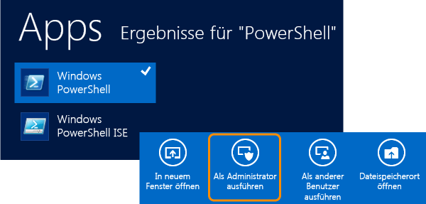
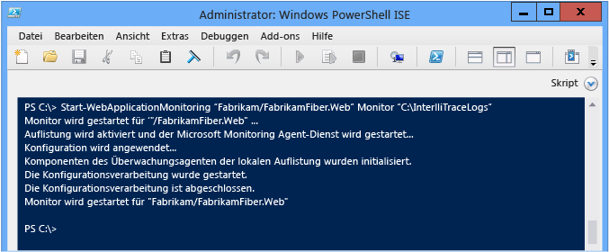
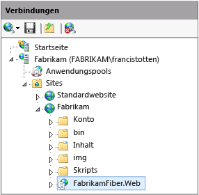

# Verwenden von Microsoft Monitoring Agent
[!INCLUDE[vs2017banner](../code-quality/includes/vs2017banner.md)]

Sie können von IIS gehostete ASP.NET\-Webanwendungen sowie SharePoint 2010\- oder 2013\-Anwendungen lokal auf Fehler, Leistungsprobleme und andere Probleme überwachen, indem Sie **Microsoft Monitoring Agent** verwenden. Sie können Diagnoseereignisse vom Agent in einer IntelliTrace\-Protokoll\-\(.iTrace\)\-Datei speichern. Sie können dann das Protokoll in Visual Studio Enterprise \(jedoch nicht in den Versionen Professional oder Community\) öffnen, um Probleme mit allen Visual Studio\-Diagnosetools zu debuggen. Sie können auch IntelliTrace\-Diagnosedaten und Methodendaten erfassen, indem Sie den Agenten im **Ablaufverfolgungs**modus ausführen. Microsoft Monitoring Agent kann mit [Application Insights](http://www.visualstudio.com/get-started/find-performance-problems-vs.aspx) und [System Center Operation Manager](http://technet.microsoft.com/library/hh205987.aspx) integriert werden. Durch die Installation von Microsoft Monitoring Agent ändert sich nicht die Zielsystemumgebung.  
  
> [!NOTE]
>  Sie können mithilfe des **eigenständigen IntelliTrace Collector** auch IntelliTrace\-Diagnose\- und Methodendaten für Web\-, SharePoint\-, WPF\- und Windows\-Formularanwendungen auf Remotecomputern sammeln, ohne die Zielumgebung zu ändern. Der eigenständige Collector hat größere Auswirkungen auf die Leistung als die Ausführung von Microsoft Monitoring Agent im **Überwachungs**modus. Siehe [Verwenden des eigenständigen IntelliTrace\-Collectors](../debugger/using-the-intellitrace-stand-alone-collector.md).  
  
 Wenn Sie System Center 2012 verwenden, verwenden Sie Microsoft Monitoring Agent mit Operations Manager, um Warnungen zu Problemen abzurufen und Team Foundation Server\-Arbeitsaufgaben mit Links zu gespeicherten IntelliTrace\-Protokollen zu erstellen. Sie können dann diese Arbeitsaufgaben anderen zum weiteren Debuggen zuweisen. Weitere Informationen finden Sie unter [Integration von Operations Manager in Entwicklungsprozesse](http://technet.microsoft.com/library/jj614609.aspx) und [Überwachen mit Microsoft Monitoring Agent](http://technet.microsoft.com/en-us/library/dn465153.aspx).  
  
 Bevor Sie beginnen, überprüfen Sie, ob Sie die entsprechende Quelle und die Symbole für den erstellten und bereitgestellten Code haben. Dies hilft Ihnen dabei, direkt auf den Anwendungscode zuzugreifen, wenn Sie das Debuggen starten und das IntelliTrace\-Protokoll nach Diagnoseereignissen durchsuchen.[Installieren Sie die Builds](../debugger/diagnose-problems-after-deployment.md), sodass Visual Studio die entsprechende Quelle für den bereitgestellten Code automatisch suchen und öffnen kann.  
  
1.  [Schritt 1: Microsoft Monitoring Agent installieren](#SetUpMonitoring)  
  
2.  [Schritt 2: Die Überwachung Ihrer App starten](#MonitorEvents)  
  
3.  [Schritt 3: Speichern von aufgezeichneten Ereignissen](#SaveEvents)  
  
##  <a name="SetUpMonitoring"></a> Schritt 1: Microsoft Monitoring Agent installieren  
 Installieren Sie den eigenständigen Agent auf dem Webserver, um eine lokale Überwachung auszuführen, ohne Ihre Anwendung zu ändern. Wenn Sie System Center 2012 verwenden, erhalten Sie weitere Informationen unter [Microsoft Monitoring Agent installieren](http://technet.microsoft.com/library/dn465156.aspx).  
  
###  <a name="SetUpStandaloneMMA"></a> Installieren Sie den eigenständigen Agent.  
  
1.  Stellen Sie Folgendes sicher:  
  
    -   Auf Ihrem Webserver werden [unterstützte Versionen von Internet Information Services \(IIS\)](http://technet.microsoft.com/en-us/library/dn465154.aspx) ausgeführt.  
  
    -   Ihr Webserver verfügt über .NET Framework 3.5, 4 oder 4.5.  
  
    -   Auf Ihrem Webserver wird Windows PowerShell 3.0 oder höher ausgeführt.[F: Was geschieht, wenn ich Windows PowerShell 2.0 verwende?](#PowerShell2)  
  
    -   Sie verfügen über Administratorberechtigungen auf dem Webserver, um PowerShell\-Befehle auszuführen und den Anwendungspool wiederzuverwenden, wenn Sie die Überwachung starten.  
  
    -   Sie haben alle vorherigen Versionen von Microsoft Monitoring Agent deinstalliert.  
  
2.  [Laden Sie den kostenlosen Microsoft Monitoring Agent](http://go.microsoft.com/fwlink/?LinkId=320384) \(entweder die 32\-Bit\-Version **MMASetup\-i386.exe** oder die 64\-Bit\-Version **MMASetup\-AMD64.exe**\) vom Microsoft Download Center auf Ihren Webserver herunter.  
  
3.  Führen Sie die heruntergeladene ausführbare Datei aus, um den Installations\-Assistenten zu starten.  
  
4.  Erstellen Sie ein sicheres Verzeichnis auf Ihrem Webserver, um die IntelliTrace\-Protokolle zu speichern, beispielsweise **C:\\IntelliTraceLogs**.  
  
     Achten Sie darauf, dass Sie dieses Verzeichnis erstellen, bevor Sie die Überwachung starten. Um eine Verlangsamung der App zu vermeiden, wählen Sie einen Speicherort auf einem lokalen Hochgeschwindigkeitsdatenträger, der nicht sehr aktiv ist.  
  
    > [!IMPORTANT]
    >  IntelliTrace\-Protokolle enthalten möglicherweise persönliche und vertrauliche Daten. Beschränken Sie den Zugriff auf dieses Verzeichnis auf die Identitäten, die die Dateien für die Arbeit benötigen. Überprüfen Sie Datenschutzrichtlinien des Unternehmens.  
  
5.  Um eine ausführliche Funktionsebenenüberwachung auszuführen oder um SharePoint\-Anwendungen zu überwachen, erteilen Sie dem Anwendungspool, der Ihre Web App oder SharePoint\-Anwendung hostet, Lese\- und Schreibberechtigungen für das IntelliTrace\-Protokollverzeichnis.[F: Wie richte ich Berechtigungen für den Anwendungspool ein?](#FullPermissionsITLog)  
  
### Fragen und Antworten  
  
####  <a name="PowerShell2"></a> F: Was geschieht, wenn ich Windows PowerShell 2.0 verwende?  
 **A:** Wir empfehlen dringend, PowerShell 3.0 zu verwenden. Andernfalls müssen Sie jedes Mal, wenn Sie PowerShell ausführen, die Microsoft Monitoring Agent\-PowerShell\-Cmdlets importieren. Sie haben auch keinen Zugriff auf den Hilfeinhalt zum Herunterladen.  
  
1.  Öffnen Sie ein **Windows PowerShell**\- oder **Windows PowerShell ISE**\-Eingabeaufforderungsfenster als Administrator.  
  
2.  Importieren Sie das PowerShell\-Modul für Microsoft Monitoring Agent über den Standardinstallationspfad:  
  
     **PS C:\>Import\-Module "C:\\Program Files\\Microsoft Monitoring Agent\\Agent\\PowerShell\\Microsoft.MonitoringAgent.PowerShell\\Microsoft.MonitoringAgent.PowerShell.dll"**  
  
3.  Um die neuesten Hilfeinhalte abzurufen, [besuchen Sie TechNet](http://technet.microsoft.com/systemcenter/default).  
  
####  <a name="FullPermissionsITLog"></a> F: Wie richte ich Berechtigungen für den Anwendungspool ein?  
 **A:** Verwenden Sie den Windows\-Befehl **icacls** oder den Windows\-Explorer \(bzw. den Datei\-Explorer\). Beispiel:  
  
-   So legen Sie Berechtigungen mit dem Windows\-Befehl **icacls** fest:  
  
    -   Für eine Web App im **DefaultAppPool**\-Anwendungspool:  
  
         `icacls "C:\IntelliTraceLogs" /grant "IIS APPPOOL\DefaultAppPool":RX`  
  
    -   Für eine SharePoint\-Anwendung im **SharePoint \- 80**\-Anwendungspool:  
  
         `icacls "C:\IntelliTraceLogs" /grant "IIS APPPOOL\SharePoint - 80":RX`  
  
     \- oder \-  
  
-   So legen Sie die Berechtigungen mit dem Windows\-Explorer \(bzw. dem Datei\-Explorer\) fest:  
  
    1.  Öffnen Sie die **Eigenschaften** für das IntelliTrace\-Protokollverzeichnis.  
  
    2.  Wählen Sie auf der Registerkarte **Sicherheit** die Option **Bearbeiten**, **Hinzufügen** aus.  
  
    3.  Stellen Sie sicher, dass im Feld **Diesen Objekttyp auswählen** die Option **Integrierte Sicherheitsprinzipale** angezeigt wird. Wenn sie nicht vorhanden ist, wählen Sie **Objekttypen**, um sie hinzuzufügen.  
  
    4.  Versichern Sie sich, dass der lokale Computer im Feld **Aus diesem Speicherort** angezeigt wird. Wenn er nicht vorhanden ist, wählen Sie **Speicherorte** aus, um es zu ändern.  
  
    5.  Fügen Sie im Feld **Geben Sie die Namen der auszuwählenden Objekte ein** den Anwendungspool für die Web App oder die SharePoint\-Anwendung hinzu.  
  
    6.  Wählen Sie **Namen überprüfen** aus, um den Namen aufzulösen. Klicken Sie auf **OK**.  
  
    7.  Stellen Sie sicher, dass der Anwendungspool über Berechtigungen zum **Lesen und Ausführen** verfügt.  
  
##  <a name="MonitorEvents"></a> Schritt 2: Die Überwachung Ihrer App starten  
 Verwenden Sie den Windows PowerShell\-Befehl [Start\-WebApplicationMonitoring](http://go.microsoft.com/fwlink/?LinkID=313686), um die Überwachung der App zu starten. Wenn Sie System Center 2012 verwenden, erhalten Sie weitere Informationen unter [Überwachung von Webanwendungen mit Microsoft Monitoring Agent](http://technet.microsoft.com/library/dn465157.aspx).  
  
1.  Öffnen Sie auf dem Webserver ein **Windows PowerShell**\- oder **Windows PowerShell ISE**\-Eingabeaufforderungsfenster als Administrator.  
  
       
  
2.  Führen Sie den Befehl [Start\-WebApplicationMonitoring](http://go.microsoft.com/fwlink/?LinkID=313686) aus, um die Überwachung Ihrer App zu starten. Dies startet alle Web Apps auf Ihrem Webserver neu.  
  
     Hier ist die kurze Syntax:  
  
     **Start\-WebApplicationMonitoring** *"\<Anwendungsname\>"* *\<monitoringMode\>* *"\<Ausgabepfad\>"* *\<UInt3 \>* *"\<CollectionPlanPathAndFileName\>"*  
  
     Im Folgenden ein Beispiel, bei dem nur der Web App\-Name und der Lightweight\-**Monitor**\-Modus verwendet wird:  
  
     **PS C:\\\>Start\-WebApplicationMonitoring "Fabrikam\\FabrikamFiber.Web" Monitor "C:\\IntelliTraceLogs"**  
  
     Im Folgenden ein Beispiel, bei dem der IIS\-Pfad\- und der Lightweight\-**Monitor**\-Modus verwendet wird:  
  
     **PS C:\\\>Start\-WebApplicationMonitoring "IIS:\\sites\\Fabrikam\\FabrikamFiber.Web" Monitor "C:\\IntelliTraceLogs"**  
  
     Nachdem Sie die Überwachung gestartet haben, wird Microsoft Monitoring Agent während des Neustarts der Apps möglicherweise angehalten.  
  
       
  
    |||  
    |-|-|  
    |*"\<appName\>"*|Geben Sie den Pfad zur Website und dem Namen der Web App in IIS an. Sie können auch den IIS\-Pfad einschließen, falls gewünscht.<br /><br /> *"\<IISWebsiteName\>\\\<IISWebAppName\>"*<br /><br /> \- oder \-<br /><br /> **"IIS:\\sites** *\\\<IISWebsiteName\>\\\<IISWebAppName\>"*<br /><br /> Sie können diesen Pfad im IIS\-Manager finden. Zum Beispiel:<br /><br /> <br /><br /> Sie können auch die Befehle [Get\-WebSite](http://technet.microsoft.com/library/ee807832.aspx) und [Get WebApplication](http://technet.microsoft.com/library/ee790554.aspx) verwenden.|  
    |*\<monitoringMode\>*|Legen Sie den Überwachungsmodus fest:<br /><br /> <ul><li>**Monitor**: Zeichnen Sie minimale Details über Ausnahmeereignisse und Leistungsereignisse auf. Dieser Modus verwendet den Standardauflistungsplan.</li><li>**Trace**: Zeichnen Sie Funktionsebenendetails auf, oder überwachen Sie SharePoint 2010\- und SharePoint 2013\-Anwendungen mithilfe des angegebenen Auflistungsplans. Durch diesen Modus wird Ihre App möglicherweise langsamer ausgeführt.<br /><br /> <ul><li>[F: Wie richte ich Berechtigungen für den Anwendungspool ein?](#FullPermissionsITLog)</li><li>[F: Wie rufe ich möglichst viele Daten ab, ohne die App zu verlangsamen?](#Minimizing)</li></ul><br />     Dieses Beispiel zeichnet Ereignisse für eine SharePoint\-App auf, die auf einer SharePoint\-Website gehostet wird:<br /><br />     **Start\-WebApplicationMonitoring "FabrikamSharePointSite\\FabrikamSharePointApp" Trace "C:\\Program Files\\Microsoft Monitoring Agent\\Agent\\IntelliTraceCollector\\collection\_plan.ASP.NET.default.xml" "C:\\IntelliTraceLogs"**</li><li>**Custom**: Zeichnen Sie benutzerdefinierte Details mithilfe des angegebenen benutzerdefinierten Auflistungsplans auf. Sie müssen die Überwachung neu starten, wenn Sie den Auflistungsplan bearbeiten, nachdem die Überwachung bereits gestartet wurde.</li></ul>|  
    |*"\<outputPath\>"*|Geben Sie den vollständigen Verzeichnispfad zum Speichern der IntelliTrace\-Protokolle an. Achten Sie darauf, dass Sie dieses Verzeichnis erstellen, bevor Sie die Überwachung starten.|  
    |*\<UInt32\>*|Geben Sie die maximale Größe für das IntelliTrace\-Protokoll an. Die standardmäßige maximale Größe der IntelliTrace\-Datei beträgt 250 MB.<br /><br /> Wenn das Protokoll diese Grenze erreicht, überschreibt der Agent die frühesten Einträge, um Platz für mehr Einträge zu schaffen. Um diese Beschränkung zu ändern, verwenden Sie die Option **\-MaximumFileSizeInMegabytes** oder bearbeiten Sie das `MaximumLogFileSize`\-Attribut im Auflistungsplan.|  
    |*"\<collectionPlanPathAndFileName\>"*|Geben Sie den vollständigen Pfad oder den relativen Pfad und den Dateiname des Auflistungsplans an. Dieser Plan ist eine XML\-Datei, die Einstellungen für den Agent konfiguriert.<br /><br /> Diese Pläne werden mit dem Agent eingeschlossen und funktionieren mit Web Apps und SharePoint\-Anwendungen:<br /><br /> -   **collection\_plan.ASP.NET.default.xml**<br />     Sammelt nur Ereignisse, wie z. B. Ausnahmen, Leistungsereignisse, Datenbankaufrufe und Webserveranforderungen.<br />-   **collection\_plan.ASP.NET.trace.xml**<br />     Sammelt Funktionsebenenaufrufe sowie alle Daten im Standardauflistungsplan. Dieser Plan ist gut für eine ausführliche Analyse. Er verlangsamt jedoch möglicherweise die App.<br /><br /> Sie können lokalisierte Versionen dieser Pläne in Unterordnern des Agents finden. Um eine Verlangsamung der App zu vermeiden, können Sie auch [diese Pläne anpassen oder Ihre eigenen Pläne erstellen](http://go.microsoft.com/fwlink/?LinkId=227871). Legen Sie alle benutzerdefinierten Pläne am gleichen sicheren Speicherort ab wie den Agenten.<br /><br /> [F: Wie rufe ich möglichst viele Daten ab, ohne die App zu verlangsamen?](#Minimizing)|  
  
     Für weitere Informationen über die vollständige Syntax und andere Beispiele, führen Sie den **get\-help Start\-WebApplicationMonitoring –detailed**\-Befehl oder den **get\-help Start\-WebApplicationMonitoring –examples**\-Befehl aus.  
  
3.  Um den Status aller überwachten Web Apps zu überprüfen, führen Sie den Befehl [GET\-WebApplicationMonitoringStatus](http://go.microsoft.com/fwlink/?LinkID=313685) aus.  
  
### Fragen und Antworten  
  
####  <a name="Minimizing"></a> F: Wie rufe ich möglichst viele Daten ab, ohne die App zu verlangsamen?  
 **A:** Microsoft Monitoring Agent kann viele Daten sammeln und wirkt sich auf die Leistung der App aus, abhängig von den Daten, die Sie sammeln möchten und wie sie diese sammeln. Es gibt folgende Möglichkeiten, möglichst viele Daten abzurufen, ohne die App zu verlangsamen:  
  
-   Für Web Apps und für SharePoint\-Anwendungen zeichnet der Agent Daten für alle Anwendungen auf, die den angegebenen Anwendungspool gemeinsam verwenden. Dies verlangsamt möglicherweise die Leistung jeder App, die den gleichen Anwendungspool verwendet, obwohl Sie die Sammlung auf die Module für eine einzelne App beschränken können. Um zu verhindern, dass andere Apps verlangsamt werden, hosten Sie jede App in ihrem eigenen Anwendungspool.  
  
-   Überprüfen Sie die Ereignisse, für die der Agent Daten im Sammlungsplan sammelt. Bearbeiten Sie den Sammlungsplan, um nicht relevante Ereignisse zu deaktivieren. Dies kann die Startleistung und Laufzeitleistung verbessern.  
  
     Um ein Ereignis zu deaktivieren, legen Sie das `enabled`\-Attribut für das `<DiagnosticEventSpecification>`\-Element auf `false` fest:  
  
     `<DiagnosticEventSpecification enabled="false">`  
  
     Wenn das `enabled`\-Attribut nicht vorhanden ist, wird das Ereignis aktiviert.  
  
     Beispiel:  
  
    -   Deaktivieren Sie Windows Workflow\-Ereignisse für Apps, die Windows Workflow nicht verwenden.  
  
    -   Deaktivieren Sie Registrierungsereignisse für Apps, die auf die Registrierung zugreifen, jedoch keine Probleme mit den Registrierungseinstellungen haben.  
  
-   Überprüfen Sie die Module, für die der Agent Daten im Sammlungsplan sammelt. Bearbeiten Sie den Sammlungsplan, um nur für Sie interessante Module einzuschließen.  
  
     Dadurch wird die Menge der Methodenaufrufinformationen und anderer Instrumentationsdaten reduziert, die der Agent sammelt, wenn die Anwendung gestartet und ausgeführt wird. Diese Daten ermöglichen es Ihnen, den Code schrittweise durchzugehen, wenn Sie debuggen und Werte überprüfen, die an Funktionsaufrufe übergeben werden und von ihnen zurückgegeben werden.  
  
    1.  Öffnen Sie den Sammlungsplan. Suchen Sie das `<ModuleList>`\-Element.  
  
    2.  Legen Sie in `<ModuleList>` das `isExclusionList`\-Attribut auf `false` fest.  
  
    3.  Verwenden Sie das `<Name>`\-Element, um jedes Modul mit einer der folgenden Informationen anzugeben: Dateiname, Zeichenfolgenwert, um jedes Modul einzuschließen, das diese Zeichenfolge enthält, oder öffentlicher Schlüssel.  
  
     Dieses Beispiel erstellt eine Liste, die Daten nur vom Hauptmodul der "Fabrikam Fiber"\-Web App sammelt:  
  
    ```xml  
    <ModuleList isExclusionList="false"> <Name>FabrikamFiber.Web.dll</Name> </ModuleList>  
  
    ```  
  
     Um Daten aus jedem Modul zu sammeln, dessen Name "Fabrikam" enthält, erstellen Sie eine Liste wie diese:  
  
    ```xml  
    <ModuleList isExclusionList="false"> <Name>Fabrikam</Name> </ModuleList>  
  
    ```  
  
     Um Daten aus Modulen zu sammeln, indem Sie deren öffentliche Schlüsseltoken angeben, erstellen Sie eine Liste wie diese:  
  
    ```xml  
    <ModuleList isExclusionList="false"> <Name>PublicKeyToken:B77A5C561934E089</Name> <Name>PublicKeyToken:B03F5F7F11D50A3A</Name> <Name>PublicKeyToken:31BF3856AD364E35</Name> <Name>PublicKeyToken:89845DCD8080CC91</Name> <Name>PublicKeyToken:71E9BCE111E9429C</Name> </ModuleList>  
  
    ```  
  
     **F: Warum sollten Module stattdessen nicht nur ausgeschlossen werden?**  
  
     **A:** Standardmäßig schließen Sammlungspläne Module aus, indem das `isExclusionList`\-Attribut auf `true` festgelegt wird. Dieses kann jedoch möglicherweise immer noch Daten aus Modulen sammeln, die die Kriterien in der Liste nicht erfüllen oder für Sie nicht relevant sind, wie etwa Module von Drittanbietern oder Open Source\-Module.  
  
#### F: Welche Werte sammelt der Agent?  
 **A:** Um die Auswirkungen auf die Leistung zu reduzieren, sammelt der Agent nur diese Werte:  
  
-   Primitive Datentypen, die an Methoden übergeben und von ihnen zurückgegeben werden  
  
-   Primitive Datentypen in Feldern für Objekte auf oberster Ebene, die an Methoden übergeben und von ihnen zurückgegeben werden  
  
 Angenommen, Sie verfügen über eine `AlterEmployee`\-Methodensignatur, die eine Ganzzahl\-`id` und ein `Employee`\-Objekt `oldemployee` akzeptiert:  
  
 `public Employee AlterEmployee(int id, Employee oldemployee)`  
  
 Der `Employee`\-Typ verfügt über die folgenden Attribute: `Id`, `Name` und `HomeAddress`. Eine Zuordnungsbeziehung besteht zwischen dem `Employee`\- und dem `Address`\-Typ.  
  
   
  
 Der Agent zeichnet Werte für `id`, `Employee.Id`, `Employee.Name` und das `Employee`\-Objekt auf, das von der `AlterEmployee`\-Methode zurückgegeben wird. Der Agent zeichnet jedoch keine Informationen zum `Address`\-Objekt \(außer NULL oder keine\) auf. Der Agent zeichnet auch keine Daten zu lokalen Variablen in der `AlterEmployee`\-Methode auf, es sei denn, andere Methoden verwenden diese lokalen Variablen als Parameter. An diesem Punkt werden sie als Methodenparameter aufgezeichnet.  
  
##  <a name="SaveEvents"></a> Schritt 3: Speichern von aufgezeichneten Ereignissen  
 Wenn Sie einen Fehler oder ein Leistungsproblem finden, speichern Sie die aufgezeichneten Ereignisse in einem IntelliTrace\-Protokoll. Der Agent erstellt das Protokoll nur, wenn Ereignisse aufgezeichnet wurden. Wenn Sie System Center 2012 verwenden, erhalten Sie weitere Informationen unter [Überwachung von Webanwendungen mit Microsoft Monitoring Agent](http://technet.microsoft.com/library/dn465157.aspx).  
  
### Speichern Sie aufgezeichnete Ereignisse, aber setzen Sie die Überwachung fort.  
 Befolgen Sie diese Schritte, wenn Sie das IntelliTrace\-Protokoll erstellen möchten, aber nicht möchten, dass die App neu startet oder die Überwachung beendet wird. Der Agent setzt die Überwachung auch dann fort, wenn der Server oder die Anwendung neu gestartet wird.  
  
1.  Öffnen Sie auf dem Webserver ein Windows PowerShell\-Eingabeaufforderungsfenster als Administrator.  
  
2.  Führen Sie den Befehl [Checkpoint\-WebApplicationMonitoring](http://go.microsoft.com/fwlink/?LinkID=313684) aus, um eine Momentaufnahme des IntelliTrace\-Protokolls zu speichern:  
  
     **Checkpoint\-WebApplicationMonitoring** *"\<IISWebsiteName\>\\\<IISWebAppName\>"*  
  
     \- oder \-  
  
     **Checkpoint\-WebApplicationMonitoring "IIS:\\sites** *\\\<IISWebsiteName\>\\\<IISWebAppName\>"*  
  
     Zum Beispiel:  
  
     **PS C:\\\>Checkpoint\-WebApplicationMonitoring "Fabrikam\\FabrikamFiber.Web"**  
  
     \- oder \-  
  
     **PS C:\\\>Checkpoint\-WebApplicationMonitoring "IIS:\\sites\\Fabrikam\\FabrikamFiber.Web"**  
  
     Für weitere Informationen führen Sie den **get\-help Checkpoint\-WebApplicationMonitoring –detailed**\-Befehl oder den **get\-help Checkpoint\-WebApplicationMonitoring –examples**\-Befehl aus.  
  
3.  Kopieren Sie das Protokoll in einen sicheren Ordner, und öffnen Sie das Protokoll auf einem Computer, auf dem Visual Studio Enterprise \(nicht Professional oder Community\) installiert ist.  
  
    > [!IMPORTANT]
    >  Seien Sie vorsichtig, wenn Sie IntelliTrace\-Protokolle freigeben, da diese eventuell persönliche und vertrauliche Daten enthalten. Stellen Sie sicher, dass Personen mit Zugriff auf diese Protokolle auch die Berechtigungen zu deren Anzeige haben. Überprüfen Sie Datenschutzrichtlinien des Unternehmens.  
  
 **Nächstes Thema:** [Diagnose von aufgezeichneten Ereignissen in Visual Studio Enterprise](../debugger/diagnose-problems-after-deployment.md#InvestigateEvents)  
  
### Speichern von aufgezeichneten Ereignissen und Beenden der Überwachung  
 Führen Sie folgende Schritte aus, wenn das Abrufen von Diagnoseinformationen nur beim Reproduzieren eines bestimmten Problems erwünscht ist. Dies startet alle Web Apps auf Ihrem Webserver neu.  
  
1.  Öffnen Sie auf dem Webserver ein Windows PowerShell\-Eingabeaufforderungsfenster als Administrator.  
  
2.  Führen Sie den Befehl [Stop\-WebApplicationMonitoring](http://go.microsoft.com/fwlink/?LinkID=313687) aus, um das IntelliTrace\-Protokoll zu erstellen und die Überwachung einer bestimmten Webanwendung zu beenden:  
  
     **Stop\-WebApplicationMonitoring** *"\<IISWebsiteName\>\\\<IISWebAppName\>"*  
  
     \- oder \-  
  
     **Stop\-WebApplicationMonitoring "IIS:\\sites** *\\\<IISWebsiteName\>\\\<IISWebAppName\>"*  
  
     Oder, um die Überwachung aller Web\-Apps zu beenden:  
  
     **Stop\-WebApplicationMonitoring \-All**  
  
     Zum Beispiel:  
  
     **PS C:\\\>Stop\-WebApplicationMonitoring "Fabrikam\\iFabrikamFiber.Web"**  
  
     \- oder \-  
  
     **PS C:\\\>Stop\-WebApplicationMonitoring "IIS:\\sites\\Fabrikam\\FabrikamFiber.Web"**  
  
     Für weitere Informationen führen Sie den **get\-help Stop\-WebApplicationMonitoring –detailed**\-Befehl oder den **get\-help Stop\-WebApplicationMonitoring –examples**\-Befehl aus.  
  
3.  Kopieren Sie das Protokoll in einen sicheren Ordner, und öffnen Sie das Protokoll auf einem Computer, auf dem Visual Studio Enterprise installiert ist.  
  
 **Nächstes Thema:** [Diagnose von aufgezeichneten Ereignissen in Visual Studio Enterprise](../debugger/diagnose-problems-after-deployment.md#InvestigateEvents)  
  
## Fragen und Antworten  
  
### F: Wo erhalte ich weitere Informationen?  
  
#### Blogs  
 [Einführung in Microsoft Monitoring Agent](http://blogs.msdn.com/b/visualstudioalm/archive/2013/09/20/introducing-microsoft-monitoring-agent.aspx)  
  
 [Optimieren der IntelliTrace\-Auflistung auf Produktionsservern](http://go.microsoft.com/fwlink/?LinkId=255233)  
  
#### Foren  
 [Visual Studio\-Diagnose](http://go.microsoft.com/fwlink/?LinkId=262263)