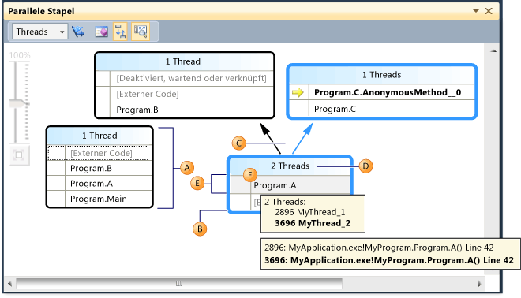
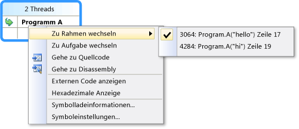
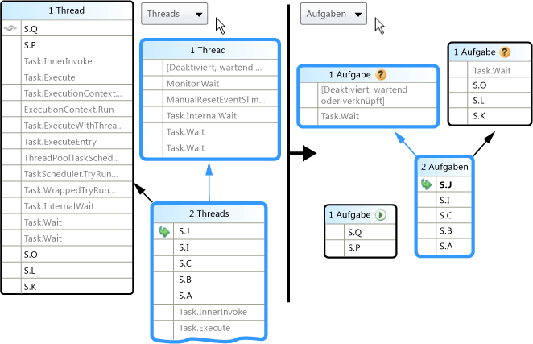
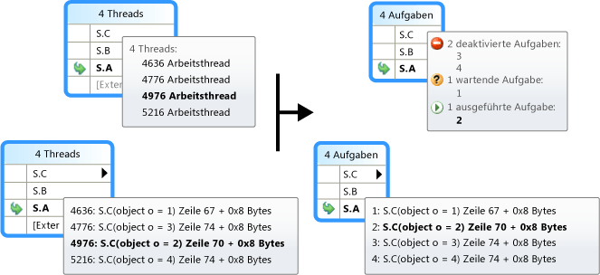
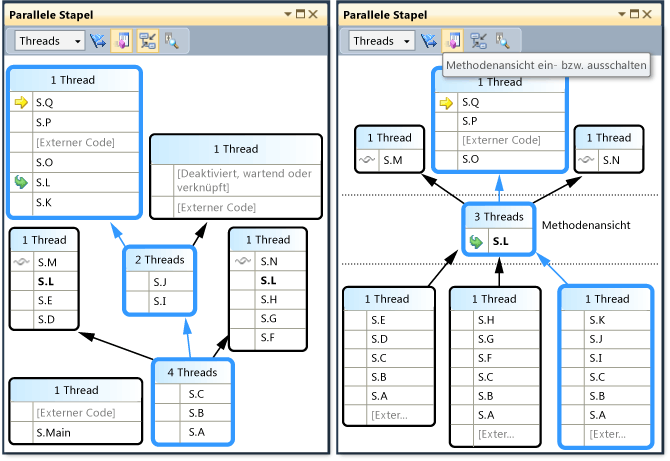

# Verwenden des Fensters &quot;Parallele Stapel&quot;
[!INCLUDE[vs2017banner](../code-quality/includes/vs2017banner.md)]

Das Fenster **Parallele Stapel** ist hilfreich beim Debuggen von Multithreadanwendungen.  In der zugehörigen Threadansicht werden Aufruflisteninformationen für alle Threads in der Anwendung angezeigt.  Im Fenster können Sie zwischen Threads und Stapelrahmen in diesen Threads navigieren.  In verwaltetem Code werden in der **Aufgabenansicht** Aufruflisten von <xref:System.Threading.Tasks.Task?displayProperty=fullName>\-Objekten angezeigt.  In systemeigenem Code werden in der **Aufgabenansicht** Aufruflisten von [Aufgabengruppen](/visual-cpp/parallel/concrt/task-parallelism-concurrency-runtime), [parallelen Algorithmen](/visual-cpp/parallel/concrt/parallel-algorithms), [asynchronen Agents](/visual-cpp/parallel/concrt/asynchronous-agents) und [einfachen Aufgaben](/visual-cpp/parallel/concrt/task-scheduler-concurrency-runtime) angezeigt.  
  
## Threadansicht  
 In der folgenden Abbildung wird ein Thread dargestellt, der vom Hauptthread zu A und zu B und anschließend zu externem Code gewechselt ist.  Zwei andere Threads starteten in externem Code und wechselten zu A. Einer der Threads fuhr jedoch mit B und anschließend mit externem Code fort, während der andere Thread mit C und dann mit einer AnonymousMethod fortfuhr.  
  
   
  
 In der Abbildung wird der Aufrufpfad des aktuellen Threads blau hervorgehoben, und der aktive Stapelrahmen wird durch den gelben Pfeil angegeben.  Sie können den aktuellen Stapelrahmen ändern, indem Sie im Fenster **Parallele Stapel** eine andere Methode auswählen.  Dies kann auch zu einem Wechsel des aktuellen Threads führen, je nachdem, ob die ausgewählte Methode bereits zum aktuellen Threads oder zu einem anderen Thread gehört.  In der folgenden Tabelle werden die Hauptmerkmale des Fensters **Parallele Stapel** beschrieben, das in der Abbildung dargestellt wird.  
  
|Legendenbuchstabe|Elementname|Beschreibung|  
|-----------------------|-----------------|------------------|  
|A|Aufruflistensegment oder \-knoten|Enthält eine Reihe von Methodenkontexten für einen oder mehrere Threads.  Wenn mit dem Knoten keine Pfeillinien verbunden sind, stellt er den gesamten Aufrufpfad für den Thread bzw. die Threads dar.|  
|B|Blaue Hervorhebung|Gibt den Aufrufpfad des aktuellen Threads an.|  
|C|Pfeillinien|Diese verbinden Knoten, um den gesamten Aufrufpfad für den Thread bzw. die Threads darzustellen.|  
|D|QuickInfo zum Knotenheader|Zeigt die ID sowie den benutzerdefinierten Namen der einzelnen Threads an, deren Aufrufpfad diesen Knoten enthält.|  
|E|Methodenkontext|Stellt einen oder mehrere Stapelrahmen in derselben Methode dar.|  
|F|QuickInfo zum Methodenkontext|In der Threadansicht werden alle Threads in einer Tabelle ähnlich wie im Fenster **Threads** angezeigt.  In der Aufgabenansicht werden alle Aufgaben in einer Tabelle ähnlich wie im Fenster **Parallele Aufgaben** angezeigt.|  
  
 Außerdem wird im Fenster **Parallele Stapel** im Hauptbereich ein Symbol für die Vogelperspektive angezeigt, wenn das Diagramm zu groß ist, um in das Fenster zu passen.  Sie können auf das Symbol klicken, um das ganze Diagramm im Fenster zu sehen.  
  
## Methodenkontextsymbole  
 In der folgenden Tabelle werden die Symbole beschrieben, die Informationen zu aktiven Stapelrahmen und zum aktuellen Stapelrahmen liefern:  
  
|||  
|-|-|  
|Symbol|Beschreibung|  
||Gibt an, dass der Methodenkontext den aktiven Stapelrahmen des aktuellen Threads enthält.|  
||Gibt an, dass der Methodenkontext den aktiven Stapelrahmen eines nicht\-aktuellen Threads enthält.|  
||Gibt an, dass der Methodenkontext den aktuellen Stapelrahmen enthält.  Dieser Methodenname ist in allen Knoten fett formatiert, in denen er angezeigt wird.|  
  
## Symbolleisten\-Steuerelemente  
 In der folgenden Abbildung und der Tabelle werden die verfügbaren Steuerelemente auf der Symbolleiste Parallele Stapel beschrieben.  
  
   
  
|Legendenbuchstabe|Steuerelement|Beschreibung|  
|-----------------------|-------------------|------------------|  
|A|Kombinationsfeld Threads\/Aufgaben|Schaltet die Ansicht zwischen Aufruflisten von Threads und Aufruflisten von Aufgaben um.  Weitere Informationen finden Sie unter Aufgabenansicht und Threadansicht.|  
|B|Nur gekennzeichnete Elemente anzeigen|Zeigt nur Aufruflisten für die Threads an, die in anderen Debug\-Fenster, wie dem Fenster **GPU\-Threads** und dem Fenster **Parallele Überwachung** gekennzeichnet werden.|  
|C|Methodenansicht ein\- bzw. ausschalten|Wechselt zwischen Stapelansicht und Methodenansicht.  Weitere Informationen finden Sie unter Methodenansicht.|  
|D|Automatischen Bildlauf zu aktuellem Stapelrahmen durchführen|Führt einen automatischen Bildlauf durch das Diagramm aus, sodass der aktuelle Stapelrahmen angezeigt wird.  Diese Funktion ist hilfreich beim Ändern des aktuellen Stapelrahmens aus anderen Fenstern oder beim Erreichen eines neuen Haltepunkts in großen Diagrammen.|  
|E|Zoomsteuerung ein\- bzw. ausschalten|Blendet die Zoomsteuerung ein oder aus.  Sie können die Ansicht auch unabhängig von der Sichtbarkeit der Zoomsteuerung vergrößern bzw. verkleinern, indem Sie STRG gedrückt halten und das Mausrad drehen.|  
  
### Elemente des Kontextmenüs  
 In der folgenden Abbildung und der Tabelle werden die verfügbaren Kontextmenüelemente beschrieben. Das Kontextmenü wird aufgerufen, wenn Sie in der Threadansicht oder in der Aufgabenansicht mit der rechten Maustaste auf einen Methodenkontext klicken.  Die letzten sechs Elemente sind direkt aus dem Fenster Aufrufliste übernommen, und sie weisen kein neues Verhalten auf.  
  
   
  
|MenuItem|Beschreibung|  
|--------------|------------------|  
|Flag|Kennzeichnet das ausgewählte Element.|  
|Kennzeichnung aufheben|Hebt die Kennzeichnung des ausgewählten Elements auf.|  
|Einfrieren|Friert das ausgewählte Element ein.|  
|Reaktivieren|Reaktiviert das ausgewählte Element.|  
|Zu Aufgabe wechseln \(Zu Thread wechseln\)|Führt dieselbe Funktion wie das Kombinationsfeld auf der Symbolleiste aus, dabei bleibt jedoch derselbe Stapelrahmen hervorgehoben.|  
|Gehe zu Quellcode|Navigiert zu der Position im Quellcode, die dem Stapelrahmen entspricht, auf den der Benutzer mit der rechten Maustaste geklickt hat.|  
|Zu Rahmen wechseln|Identisch mit dem entsprechenden Menübefehl im Fenster Aufrufliste.  Bei Parallele Stapel dürfen jedoch mehrere Frames einem Methodenkontext entsprechen.  Daher weist das Menüelement Untermenüs auf, von denen jedes einen bestimmten Stapelrahmen darstellt.  Wenn sich einer der Stapelrahmen im aktuellen Thread befindet, wird das Menü ausgewählt, das diesem Stapelrahmen entspricht.|  
|Gehe zu Disassembly|Navigiert zu der Position im Disassemblyfenster, die dem Stapelrahmen entspricht, auf den der Benutzer mit der rechten Maustaste geklickt hat.|  
|Externen Code anzeigen|Blendet externen Code ein bzw. aus.|  
|Hexadezimale Anzeige|Schaltet zwischen dezimaler und hexadezimaler Anzeige um.|  
|Symbolladeinformationen|Zeigt das entsprechende Dialogfeld an.|  
|Symboleinstellungen|Zeigt das entsprechende Dialogfeld an.|  
  
## Aufgabenansicht  
 Wenn die Anwendung Parallelität mit <xref:System.Threading.Tasks.Task?displayProperty=fullName>\-Objekten \(verwalteter Code\) oder `task_handle`\-Objekten \(systemeigener Code\) ausdrückt, können Sie über das Kombinationsfeld auf der Symbolleiste des Fensters Parallele Stapel zur *Aufgabenansicht* wechseln.  In der Aufgabenansicht werden Aufruflisten von Aufgaben anstatt von Threads angezeigt.  Die Aufgabenansicht unterscheidet sich von der Threadansicht wie folgt:  
  
-   Aufruflisten von Threads, die keine Aufgaben ausführen, werden nicht angezeigt.  
  
-   Aufruflisten von Threads, die Aufgaben ausführen, sind oben und unten abgeschnitten, um die Frames anzuzeigen, die für die Aufgabe die größte Relevanz besitzen.  
  
-   Wenn sich mehrere Aufgaben in einem Thread befinden, werden die Aufruflisten dieser Aufgaben auf separate Knoten aufgeteilt.  
  
 In der folgenden Abbildung wird rechts die Aufgabenansicht von Parallele Stapel angezeigt, und auf der linken Seite ist die entsprechende Threadansicht dargestellt.  
  
   
  
 Wenn die gesamte Aufrufliste angezeigt werden soll, wechseln Sie einfach zur Threadansicht zurück. Klicken Sie dazu mit der rechten Maustaste auf einen Stapelrahmen, und klicken Sie anschließend auf **Zu Thread wechseln**.  
  
 Wie bereits in der obigen Tabelle erläutert, können Sie weitere Informationen aufrufen, indem Sie mit dem Mauszeiger auf einen Methodenkontext zeigen.  In der folgenden Abbildung werden die Informationen in der QuickInfo für die Threadansicht und die Aufgabenansicht dargestellt.  
  
   
  
## Methodenansicht  
 Sowohl in der Threadansicht als auch in der Aufgabenansicht können Sie das Diagramm zur aktuellen Methode pivotieren, indem Sie auf der Symbolleiste auf das Symbol Methodenansicht klicken.  In der Methodenansicht sind auf einen Blick alle Methoden für sämtliche Threads angezeigt, die entweder Aufrufer oder Aufgerufene der aktuellen Methode sind.  Die folgende Abbildung zeigt eine Threadansicht. Zudem wird veranschaulicht, wie dieselben Informationen in der Methodenansicht dargestellt werden.  
  
   
  
 Durch das Wechseln in einen neuen Stapelrahmen legen Sie diese Methode als aktuelle Methode fest, und im Fenster werden alle Aufrufer und Aufgerufenen für die neue Methode angezeigt.  Dabei werden möglicherweise einige Threads in der Ansicht eingeblendet oder ausgeblendet, je nachdem, ob die betreffende Methode in ihren Aufruflisten enthalten ist.  Wenn Sie in die Stapelansicht zurückwechseln möchten, klicken Sie erneut auf die Symbolleistenschaltfläche Methodenansicht.  
  
## Siehe auch  
 [Exemplarische Vorgehensweise: Debuggen einer parallelen Anwendung](../debugger/walkthrough-debugging-a-parallel-application.md)   
 [Debugger – Grundlagen](../debugger/debugger-basics.md)   
 [Debuggen von verwaltetem Code](../debugger/debugging-managed-code.md)   
 [Parallel Programming](../Topic/Parallel%20Programming%20in%20the%20.NET%20Framework.md)   
 [Verwenden des Fensters "Aufgaben"](../debugger/using-the-tasks-window.md)   
 [Exemplarische Vorgehensweise: Debuggen einer parallelen Anwendung](../debugger/walkthrough-debugging-a-parallel-application.md)   
 [Task\-Klasse](../extensibility/debugger/task-class-internal-members.md)