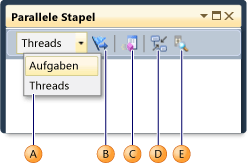

# Anzeigen von Threads und Tasks in das Fenster "Parallele Stapel"

Die **parallele Stapel** Fenster eignet sich zum Debuggen von Multithreadanwendungen. Er hat mehrere Ansichten:

- [Threadansicht](#threads-view) Aufruflisteninformationen für alle Threads in der app. Sie können zwischen Threads und Stapelrahmen in diesen Threads navigieren. 

- [Aufgabenansicht](#tasks-view) Aufruflisteninformationen Aufgabe zentriert wird. 
  - In verwaltetem Code **Aufgaben** Ansicht zeigt Aufruflisten von <xref:System.Threading.Tasks.Task?displayProperty=fullName> Objekte. 
  - In nativem Code **Aufgaben** Ansicht zeigt Aufruflisten von [Aufgabengruppen](/cpp/parallel/concrt/task-parallelism-concurrency-runtime), [parallele Algorithmen](/cpp/parallel/concrt/parallel-algorithms), [asynchrone Agents](/cpp/parallel/concrt/asynchronous-agents), und [einfache Aufgaben](/cpp/parallel/concrt/task-scheduler-concurrency-runtime).  
  
- [Methodenansicht](#method-view) Aufrufliste für eine ausgewählte Methode pivotiert. 

## Verwenden des Fensters „Parallele Stapel“ 

Zum Öffnen der **parallele Stapel** Fenster müssen Sie in einer Debugsitzung sein. Wählen Sie **Debuggen** > **Windows** > **parallele Stapel**. 

### Symbolleisten-Steuerelemente

Die **parallele Stapel** Fenster hat die folgenden Symbolleisten-Steuerelemente: 

  
  
|Symbol|Steuerelement|Beschreibung|  
|-|-|-|  
||**Threads**/**Aufgaben** Kombinationsfeld|Schaltet die Ansicht zwischen Aufruflisten von Threads und Aufruflisten von Aufgaben um. Weitere Informationen finden Sie unter [Aufgabenansicht](#tasks-view) und [Threadansicht](#threads-view).|  
||Nur gekennzeichnete Elemente anzeigen|Zeigt nur Aufruflisten für die Threads, die in anderen Debuggerfenster, z. B. gekennzeichnet sind die **GPU-Threads** Fenster und die **parallele Überwachung** Fenster.|  
||**Methodenansicht** umschalten|Wechselt zwischen der Aufruflistenansicht und **Methodenansicht**. Weitere Informationen finden Sie unter [Methodenansicht](#method-view).|  
||Automatischen Bildlauf zu aktuellem Stapelrahmen durchführen|Bildlauf des Diagramms wird so, dass der aktuelle Stapelrahmen angezeigt. Diese Funktion ist nützlich, wenn Sie den aktuellen Stapelrahmen aus anderen Fenstern ändern oder wenn Sie einen neuen Haltepunkt in großen Diagrammen erreichen.|  
||Zoomsteuerung ein- bzw. ausschalten|Anzeigen oder Ausblenden des Zoom-Steuerelements auf der linken Seite des Fensters.   Unabhängig von der Sichtbarkeit der zoomsteuerung, Sie können Sie auch Zoomen durch Drücken von **STRG** und das Mausrad drehen, oder indem Sie bei **STRG**+**UMSCHALT** + **+** zum Verkleinern die Tasten und **STRG**+**UMSCHALT** + **-** zum Verkleinern. |  
  
### Stack-Frame-Symbole
Die folgenden Symbole geben Informationen über die aktiven und den aktuellen Stapelrahmen in allen Ansichten:

|Symbol|Beschreibung|  
|-|-|  
||Gibt den aktuellen Speicherort (aktiven Stapelrahmen) des aktuellen Threads.|
||Gibt den aktuellen Speicherort (aktiven Stapelrahmen) eines nicht-aktuellen Threads.|
||Gibt den aktuellen Stapelrahmen (der aktuelle Debuggerkontext) an. Der Name der Methode ist fett formatiert, sobald es angezeigt wird.|  

### Kontextmenüelemente  
Die folgenden Elemente des Kontextmenüs sind verfügbar, wenn Sie eine Methode in der Maustaste **Threads** anzeigen oder **Aufgaben** anzeigen. Die letzten sechs Elemente sind identisch wie in der [Fenster "Aufrufliste"](how-to-use-the-call-stack-window.md).  

  

|Menüelement|Beschreibung|  
|-|-|  
|**Kennzeichnen**|Kennzeichnet das ausgewählte Element.|  
|**Kennzeichnung aufheben**|Hebt die Kennzeichnung des ausgewählten Elements auf.|  
|**Einfrieren**|Friert das ausgewählte Element ein.|  
|**Reaktivieren**|Reaktiviert das ausgewählte Element.|  
|**Zu Rahmen wechseln**|Identisch mit dem entsprechenden Menü-Befehl in der **Aufrufliste** Fenster. In der **parallele Stapel** Fenster möglicherweise eine Methode in mehrere Frames. Sie können die gewünschten Frames auswählen, in das Untermenü für dieses Element. Wenn einer der Stapelrahmen im aktuellen Thread ist, wird dieser Rahmen wird standardmäßig im Untermenü ausgewählt.|  
|**Wechseln Sie zum Task** oder **zu Thread wechseln**|Wechselt in den **Aufgabe** oder **Threads** anzeigen und behält den gleichen Stapelrahmen hervorgehoben.|  
|**Gehe zu Quellcode**|Wird an der entsprechenden Position in das Quellcodefenster. |  
|**Zu Disassemblierung wechseln**|Wird an der entsprechenden Position in der **Disassembly** Fenster.|  
|**Externen Code anzeigen**|Blendet externen Code ein bzw. aus.|  
|**Hexadezimale Anzeige**|Schaltet zwischen dezimaler und hexadezimaler Anzeige um.|  
|**Threads in Quelle anzeigen**|Bitflags, die den Speicherort der der Thread im Quellcodefenster. |  
|**Symbolladeinformationen**|Öffnet die **Symbolladeinformationen** Dialogfeld.|  
|**Symboleinstellungen**|Öffnet die **Symboleinstellungen** Dialogfeld. |  
  
## Threadansicht  

In **Threads** anzuzeigen, auf den Stapelrahmen und Aufrufpfad des aktuellen Threads blau hervorgehoben sind. Die aktuelle Position des Threads wird durch den gelben Pfeil angezeigt. 

Doppelklicken Sie auf eine andere Methode, um den aktuellen Stapelrahmen zu ändern. Dies kann auch den aktuellen Thread, je nachdem, ob die Methode, die Sie auswählen, den aktuellen Thread oder ein anderer Thread wechseln. 

Wenn die **Threads** Diagramm anzeigen ist zu groß für in das Fenster und eine **Vogelperspektive** Steuerelement angezeigt wird, klicken Sie im Fenster. Sie können den Frame im Steuerelement zu verschiedenen Teilen des Diagramms Navigieren verschieben.  
  
Die folgende Abbildung zeigt einen Thread, die von Main gesendet, um einen verwalteten nativen Code wechseln wird. Sechs Threads sind in der aktuellen Methode. Eine Thread.Sleep weiterhin, und eine andere fortgesetzt werden, um Console.WriteLine und klicken Sie dann SyncTextWriter.WriteLine.  

   

Die folgende Tabelle beschreibt die wichtigsten Funktionen des die **Threads** anzeigen:  
  
|Legende|Elementname|Beschreibung|  
|-|-|-|  
|1|Aufruflistensegment oder -knoten|Enthält eine Reihe von Methoden für einen oder mehrere Threads. Wenn der Frame keine Pfeillinien verbunden hat, zeigt der Frame den Aufrufpfad für den gesamten Aufrufpfad.|  
|2|Blaue Hervorhebung|Gibt den Aufrufpfad des aktuellen Threads an.|  
|3|Pfeillinien|Diese verbinden Knoten, um den gesamten Aufrufpfad für den Thread bzw. die Threads darzustellen.|  
|4|Der Header des hierarchieknotens|Zeigt die Anzahl von Prozessen und Threads für den Knoten.|  
|5|Methode|Stellt einen oder mehrere Stapelrahmen in derselben Methode dar.|  
|6|QuickInfo für die Methode|Wird angezeigt, wenn Sie auf eine Methode zeigen. In **Threads** anzeigen, die QuickInfo zeigt alle Threads in einer Tabelle ähnelt der **Threads** Fenster. |  

## Aufgabenansicht  
Wenn Ihre app verwendet <xref:System.Threading.Tasks.Task?displayProperty=fullName> -Objekten (verwalteter Code) oder `task_handle` Objekte (nativer Code) ausdrückt, können Sie **Aufgaben** anzeigen. In der **Aufgabenansicht** werden Aufruflisten von Aufgaben anstelle von Threads angezeigt. 

In **Aufgaben** anzeigen:  
  
- Aufruflisten von Threads, die Aufgaben ausgeführt werden, werden nicht angezeigt.  
- Aufruflisten von Threads, die Aufgaben ausgeführt werden, werden oben und unten, um die relevantesten Frames für Aufgaben anzuzeigen visuell abgeschnitten.  
- Wenn mehrere Aufgaben in einem Thread befinden, werden die Aufruflisten dieser Aufgaben in separate Knoten angezeigt.  

Um eine gesamte Aufrufliste anzuzeigen, wechseln Sie zurück zum **Threads** anzeigen, indem Sie mit der rechten Maustaste in einem Stapelrahmen und auswählen **zu Thread wechseln**.  

Die folgende Abbildung zeigt die **Threads** Ansicht im oberen Bereich und den entsprechenden **Aufgaben** Ansicht unten.  

  

Zeigen Sie auf eine Methode, um eine QuickInfo mit weiteren Informationen anzuzeigen. In **Aufgaben** anzeigen, die QuickInfo zeigt alle Aufgaben in einer Tabelle ähnelt der **Aufgaben** Fenster. 

Die folgende Abbildung zeigt die QuickInfo für eine Methode in der **Threads** anzeigen, die Sie am oberen und für den entsprechenden **Aufgaben** Ansicht unten.  

  

## Methodenansicht  
Entweder **Threads** anzeigen oder **Aufgaben** anzeigen, Sie können das Diagramm auf der aktuellen Methode Pivotieren, dazu die **Methodenansicht** auf der Symbolleiste auf das Symbol. In der **Methodenansicht** werden alle Methoden für sämtliche Threads in einem Blick angezeigt, die entweder Aufrufer oder Aufgerufene der aktuellen Methode sind. Die folgende Abbildung zeigt, wie die gleiche Informationen sucht im **Threads** zeigen Sie auf der linken Seite und im **Methodenansicht** auf der rechten Seite.  

  
  
Wenn Sie einen neuen Stapelrahmen wechseln, Sie stellen diese Methode die aktuelle Methode ist und **Methodenansicht** werden alle Aufrufer und aufgerufenen für die neue Methode angezeigt. Dabei werden möglicherweise einige Threads in der Ansicht eingeblendet oder ausgeblendet, je nachdem, ob die betreffende Methode in ihren Aufruflisten enthalten ist. Um auf die Aufruf-Stapel-Ansicht zurückzukehren, wählen Sie die **Methodenansicht** Symbol auf der Symbolleiste erneut aus.  
  
## Siehe auch  
 [Erste Schritte zum Debuggen einer Multithreadanwendung](../debugger/get-started-debugging-multithreaded-apps.md)   
 [Exemplarische Vorgehensweise: Debuggen einer parallelen Anwendung](../debugger/walkthrough-debugging-a-parallel-application.md)   
 [Ein erster Blick auf der Debugger](../debugger/debugger-feature-tour.md) [Debuggen von verwaltetem Code](../debugger/debugging-managed-code.md)   
 [Parallele Programmierung](/dotnet/standard/parallel-programming/index)   
 [Use the Tasks window (Verwenden des Aufgabenfensters)](../debugger/using-the-tasks-window.md)   
 [Task class (Task-Klasse)](../extensibility/debugger/task-class-internal-members.md)
