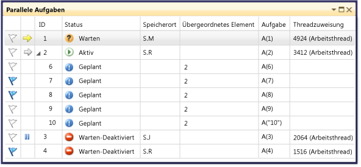

# Verwenden des Fensters &quot;Aufgaben&quot;
[!INCLUDE[vs2017banner](../code-quality/includes/vs2017banner.md)]

Das Fenster **Aufgaben** ähnelt dem Fenster **Threads**, es werden jedoch statt für jeden einzelnen Thread Informationen zu den Objekten <xref:System.Threading.Tasks.Task?displayProperty=fullName>, [task\_handle](../Topic/task_group%20Class.md) oder [WinJS.Promise](http://msdn.microsoft.com/library/windows/apps/br211867.aspx) angezeigt.  Wie Threads stellen auch Aufgaben asynchrone Vorgänge dar, die gleichzeitig ausgeführt werden können. Es dürfen jedoch mehrere Aufgaben im selben Thread ausgeführt werden.  Weitere Informationen finden Sie unter [Asynchrone Programmierung in JavaScript \(Windows Store\-Apps\)](http://msdn.microsoft.com/library/windows/apps/hh700330.aspx).  
  
 In verwaltetem Code können Sie das Fenster **Aufgaben** verwenden, wenn Sie mit <xref:System.Threading.Tasks.Task?displayProperty=fullName>\-Objekten oder mit den **await**\- und **async**\-Schlüsselwörtern arbeiten \(**Await** und **Async** in Visual Basic\).  Weitere Informationen zu Aufgaben in verwaltetem Code finden Sie unter  [Parallel Programming](../Topic/Parallel%20Programming%20in%20the%20.NET%20Framework.md).  
  
 In systemeigenem Code können Sie das Fenster **Aufgaben** verwenden, wenn Sie mit [Aufgabengruppen](/visual-cpp/parallel/concrt/task-parallelism-concurrency-runtime), [parallelen Algorithmen](/visual-cpp/parallel/concrt/parallel-algorithms), [asynchronen Agents](/visual-cpp/parallel/concrt/asynchronous-agents) und [einfachen Aufgaben](/visual-cpp/parallel/concrt/task-scheduler-concurrency-runtime) arbeiten.  Weitere Informationen zu Aufgaben in systemeigenem Code finden Sie unter [Concurrency Runtime](/visual-cpp/parallel/concrt/concurrency-runtime).  
  
 In JavaScript können Sie das Fenster "Aufgaben" verwenden, wenn Sie mit dem "promise .then"\-Code arbeiten.  
  
 Sie können das Fenster **Aufgaben** immer dann verwenden, wenn die Ausführung im Debugger unterbrochen wird.  Sie können darauf zugreifen, indem Sie im Menü **Debuggen** auf **Fenster** und anschließend auf **Aufgaben** klicken.  In der folgenden Abbildung wird das Fenster **Aufgaben** im Standardmodus dargestellt.  
  
   
  
> [!NOTE]
>  In verwaltetem Code wird ein <xref:System.Threading.Tasks.Task>\-Objekt mit dem Status <xref:System.Threading.Tasks.TaskStatus>, <xref:System.Threading.Tasks.TaskStatus> oder <xref:System.Threading.Tasks.TaskStatus> möglicherweise nicht im Aufgabenfenster angezeigt, wenn sich verwaltete Threads in einem Standby\- oder Verknüpfungszustand befinden.  
  
## Informationen in der Spalte "Aufgaben"  
 In den Spalten im Fenster **Aufgaben** sind die folgenden Informationen angegeben.  
  
|Spaltenname|Beschreibung|  
|-----------------|------------------|  
|**Flags**|Zeigt an, welche Aufgaben gekennzeichnet sind. Zudem können Sie Aufgaben kennzeichnen bzw. deren Kennzeichnung aufheben.|  
|**Symbole**|Ein gelber Pfeil gibt die aktuelle Aufgabe an.  Die aktuelle Aufgabe ist die oberste Aufgabe im aktuellen Thread.   Ein weißer Pfeil gibt die unterbrechende Aufgabe an, d. h., die Aufgabe, die beim Aufrufen des Debuggers aktuell war.   Das Pausensymbol gibt eine Aufgabe an, die vom Benutzer eingefroren wurde.  Sie können eine Aufgabe einfrieren und deaktivieren, indem Sie in der Liste mit der rechten Maustaste darauf klicken.|  
|**ID**|Eine vom System bereitgestellte Nummer für die Aufgabe.  In systemeigenem Code ist diese Nummer die Adresse der Aufgabe.|  
|**Status**|Der aktuelle Zustand der Aufgabe \(geplant, aktiv, blockiert, wartend oder abgeschlossen\).  Eine geplante Aufgabe wurde noch nicht ausgeführt und verfügt daher noch über keine Aufrufliste, keinen zugewiesenen Thread oder weitere Informationen.   Eine aktive Aufgabe hat vor dem Unterbrechen im Debugger Code ausgeführt.   Eine wartende Aufgabe ist blockiert, da sie auf das Signalisieren eines Ereignisses, das Aufheben einer Sperre oder das Abschließen einer anderen Aufgabe wartet.   Eine blockierte Aufgabe ist eine wartende Aufgabe, deren Thread an einem anderen Thread blockiert ist.   Zeigen Sie auf die Statuszelle für eine blockierte oder wartende Aufgabe, um weitere Informationen zum Block anzuzeigen. **Warning:**  Im Fenster **Aufgaben** werden Deadlocks nur für eine blockierte Aufgabe gemeldet, bei der eine Synchronisierungsprimitive verwendet wird, die von Wait Chain Traversal \(WCT\) unterstützt wird.  Für ein <xref:System.Threading.Tasks.Task>\-Objekt mit Deadlock, für das WCT verwendet wird, meldet der Debugger **Waiting\-deadlocked**.  Für eine Aufgabe mit Deadlock, die von der Concurrency Runtime verwaltet wird, die nicht WCT verwendet, meldet der Debugger **Warten**.  Weitere Informationen zu WCT finden Sie unter [Wait Chain Traversal](http://msdn.microsoft.com/library/ms681622\(VS.85\).aspx).|  
|**Startzeit**|Die Uhrzeit, zu der die Aufgabe aktiviert wurde.|  
|**Dauer**|Die Anzahl von Sekunden, die die Aufgabe aktiv war.|  
|**Abschlusszeit**|Die Uhrzeit, zu der die Aufgabe abgeschlossen wurde.|  
|**Speicherort**|Die aktuelle Position in der Aufrufliste der Aufgabe.  Zeigen Sie auf diese Zelle, um die gesamte Aufrufliste für die Aufgabe anzuzeigen.  Für geplante Aufgaben ist in dieser Spalte kein Wert vorhanden.|  
|**Aufgabe**|Die ursprüngliche Methode und Argumente, die beim Erstellen an die Aufgabe übergeben wurden.|  
|**Übergeordnetes Element**|Die ID der Aufgabe, von der diese Aufgabe erstellt wurde.  Wenn diese Spalte leer ist, verfügt die Aufgabe über kein übergeordnetes Element.  Dies gilt nur für verwaltete Programme.|  
|**Threadzuweisung**|Die ID und der Name des Threads, in dem die Aufgabe ausgeführt wird.|  
|**Rückgabestatus**|Der Status der Aufgabe zum Zeitpunkt des Abschlusses.  Die Werte des Rückgabestatus lauten **Erfolgreich**, **Abgebrochen** und **Fehler**.|  
|**AppDomain**|Für verwalteten Code die Anwendungsdomäne, in der die Aufgabe ausgeführt wird.|  
|**task\_group**|Für systemeigenen Code die Adresse des [task\_group](../Topic/task_group%20Class.md)\-Objekts, von dem die Aufgabe geplant wurde.  Für asynchrone Agents und einfache Aufgaben wird diese Spalte auf 0 festgelegt.|  
|Prozess|Die ID des Prozesses, in dem die Aufgabe ausgeführt wird.|  
|Asynchroner Zustand|Für verwalteten Code ist dies der Aufgabenstatus.  Standardmäßig ist diese Spalte ausgeblendet.  Um diese Spalte anzuzeigen, öffnen Sie das Kontextmenü für einen der Spaltenheader.  Wählen Sie **Spalten**, **AsyncState** aus.|  
  
 Sie können der Ansicht Spalten hinzufügen, indem Sie mit der rechten Maustaste auf eine Spaltenüberschrift klicken und die gewünschten Spalten auswählen.  \(Entfernen Sie Spalten, indem Sie die jeweilige Auswahl aufheben.\) Sie können auch die Anordnung der Spalten ändern, indem Sie sie nach links oder rechts ziehen.  Das Kontextmenü für Spalten wird in der folgenden Abbildung veranschaulicht.  
  
   
  
## Sortieren von Aufgaben  
 Wenn Sie Aufgaben nach Spaltenkriterien sortieren möchten, klicken Sie auf den Spaltenheader.  Wenn Sie z. B. auf den Spaltenheader **ID** klicken, können Sie die Aufgaben nach Aufgaben\-ID sortieren: 1,2,3,4,5 usw.  Klicken Sie erneut auf den Spaltenheader, um die Sortierreihenfolge umzukehren.  Die aktuelle Sortierspalte und die Sortierreihenfolge werden durch einen Pfeil in der Spalte angegeben.  
  
## Gruppieren von Aufgaben  
 Sie können Aufgaben nach jeder Spalte in der Listenansicht gruppieren.  Wenn Sie beispielsweise mit der rechten Maustaste auf den Spaltenheader **Status** klicken und anschließend auf **Gruppieren nach Status** klicken, können Sie alle Aufgaben gruppieren, die denselben Status aufweisen.  So können Sie z. B. schnell wartende Aufgaben anzeigen lassen, damit Sie untersuchen können, aus welchen Gründen diese blockiert sind.  Sie können auch Gruppen reduzieren, die während der Debugsitzung nicht von Interesse sind.  Auf die gleiche Weise können Sie nach den anderen Spalten gruppieren.  Eine Gruppe kann gekennzeichnet bzw. die Kennzeichnung einer Gruppe kann aufgehoben werden, indem Sie auf die Schaltfläche neben dem Gruppenheader klicken.  In der folgenden Abbildung wird das Fenster **Aufgaben** im gruppierten Modus dargestellt.  
  
   
  
## Ansicht über\- und untergeordneter Elemente  
 \(Diese Ansicht ist nur für verwalteten Code verfügbar.\) Wenn Sie mit der rechten Maustaste auf eine Spaltenüberschrift klicken und anschließend auf **Ansicht über\- und untergeordneter Elemente** klicken, können Sie die Liste der Aufgaben in eine hierarchische Ansicht ändern, in der jede untergeordnete Aufgabe einen Unterknoten darstellt, der unter seinem übergeordneten Element ein\- bzw. ausgeblendet werden kann.  In der folgenden Abbildung werden die Aufgaben in der Ansicht übergeordneter und untergeordneter Elemente angezeigt.  
  
   
  
## Kennzeichnen von Aufgaben  
 Sie können den Thread der Aufgabe kennzeichnen, auf dem eine Aufgabe ausgeführt wird. Wählen Sie hierzu das Aufgabenlistenelement aus und klicken dann im Kontextmenü auf **Flag**. Sie können aber auch auf das Flagsymbol in der ersten Spalte klicken.  Wenn Sie mehrere Aufgaben kennzeichnen, können Sie nach der Flagspalte sortieren, um alle gekennzeichneten Aufgaben an oberster Stelle anzuzeigen, sodass Sie sich auf die betreffenden Aufgaben konzentrieren können.  Sie können auch das Fenster **Parallele Stapel** verwenden, um ausschließlich gekennzeichnete Aufgaben anzuzeigen.  Damit können Sie Aufgaben herausfiltern, die für das Debugging nicht von Interesse sind.  Flags werden nicht zwischen Debugsitzungen beibehalten.  
  
## Einfrieren und Reaktivieren von Aufgaben  
 Sie können den Thread einfrieren, in dem eine Aufgabe ausgeführt wird. Klicken Sie dazu mit der rechten Maustaste auf das Aufgabenlistenelement, und klicken Sie anschließend auf **Zugewiesenen Thread einfrieren**.  \(Wenn eine Aufgabe bereits eingefroren ist, heißt der Befehl **Zugewiesenen Thread entsperren**.\) Wenn Sie einen Thread einfrieren, wird dieser Thread nicht ausgeführt, wenn Sie Code nach dem aktuellen Haltepunkt schrittweise durchlaufen.  Durch den Befehl **Alle Threads mit Ausnahme des vorliegenden einfrieren** werden alle Threads mit Ausnahme des Threads eingefroren, der das Aufgabenlistenelement ausführt.  
  
 In der folgenden Abbildung werden die anderen Menüelemente für die einzelnen Aufgaben angezeigt.  
  
   
  
## Siehe auch  
 [Debugger – Grundlagen](../debugger/debugger-basics.md)   
 [Debuggen von verwaltetem Code](../debugger/debugging-managed-code.md)   
 [Parallel Programming](../Topic/Parallel%20Programming%20in%20the%20.NET%20Framework.md)   
 [Concurrency Runtime](/visual-cpp/parallel/concrt/concurrency-runtime)   
 [Verwenden des Fensters "Parallele Stapel"](../debugger/using-the-parallel-stacks-window.md)   
 [Exemplarische Vorgehensweise: Debuggen einer parallelen Anwendung](../debugger/walkthrough-debugging-a-parallel-application.md)