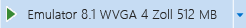
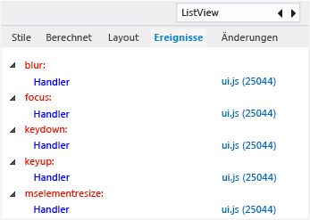

# Anzeigen von DOM-Ereignislistenern
[!INCLUDE[vs2017banner](../code-quality/includes/vs2017banner.md)]

  
  
 Die Registerkarte **Ereignisse** von DOM Explorer enthält die Ereignisse, die einem DOM\-Element zugeordnet werden. Jeder oberste Knoten auf der Registerkarte **Ereignisse** repräsentiert ein Ereignis, das über aktive Abonnenten verfügt. Der oberste Knoten enthält untergeordnete Knoten, die die registrierten Ereignislistener für das spezifische Ereignis darstellen. Zusätzlich zur Anzeige der Ereignislistener können Sie mithilfe dieser Registerkarte zum Speicherort des Ereignislisteners im JavaScript\-Code navigieren. Die Informationen in diesem Thema gelten für Store\-Apps, die mit HTML und JavaScript erstellt werden.  
  
 Die Liste auf der Registerkarte **Ereignisse** ist dynamisch. Wenn Sie einen Ereignislistener hinzufügen, während die App ausgeführt wird, wird der neue Ereignislistener dort angezeigt. Informationen zum Hinzufügen und Entfernen von Ereignislistenern finden Sie in diesem Thema unter [Tipps zur Problembehebung bei Ereignislistenern](#Tips).  
  
> [!NOTE]
>  Ereignislistener für Codeelemente, die keine DOM\-Elemente sind, wie beispielsweise `xhr`, werden nicht auf der Registerkarte **Ereignisse** angezeigt.  
  
## Anzeigen von Ereignislistenern für DOM\-Elemente  
 Dieses Beispiel zeigt eine Windows Phone\-App. Die hier beschriebenen DOM Explorer\-Funktionen werden auch für Windows Store\-Apps unterstützt.  
  
#### So zeigen Sie Ereignislistener an  
  
1.  Erstellen Sie in Visual Studio eine JavaScript\-App auf Grundlage der Projektvorlage "Windows Phone Pivot Application".  
  
2.  Wählen Sie mit der geöffneten Vorlage im Debugger in Visual Studio die Option **Emulator 8.1 WVGA 4in 512MB** in der Dropdownliste auf der Symbolleiste "Debuggen" aus:  
  
       
  
3.  Drücken Sie F5, um die App im Debugmodus auszuführen.  
  
4.  Wechseln Sie in der ausgeführten App zum Pivot\-Element **Section 3**.  
  
5.  Wechseln Sie zu Visual Studio \(ALT\+TAB oder F12\).  
  
6.  Klicken Sie im DOM Explorer in der rechten oberen Ecke auf `Find`.  
  
7.  Geben Sie `ListView` ein, und drücken Sie dann die EINGABETASTE.  
  
8.  Klicken Sie ggf. auf die Schaltfläche **Weiter**, um das `DIV`\-Element, das das `ListView`\-Steuerelement darstellt \(dieses Element hat einen `data-win-control`\-Wert von `WinJS.UI.ListView`\), zu suchen.  
  
     Das `DIV`\-Element sollte nun im DOM Explorer ausgewählt werden.  
  
9. Klicken Sie auf die Registerkarte **Ereignisse** im Bereich auf der rechten Seite des DOM Explorers.  
  
     Ihnen werden die Ereignisse angezeigt, die aktive Abonnenten für das `DIV`\-Element haben, wie an dieser Stelle dargestellt.  
  
       
  
10. Um die Ereignislistener für diese Ereignisse zu suchen, klicken Sie auf die zugeordneten JavaScript\-Dateilinks.  
  
11. Um die Ereignislistener für übergeordnete Elemente in der DOM\-Hierarchie schnell zu identifizieren, wählen Sie ein übergeordnetes Element in der Hierarchieliste unten im DOM Explorer aus.  
  
       
  
     Auf der Registerkarte **Ereignisse** werden die Ereignislistener für jedes in der Hierarchieliste ausgewählte Element angezeigt.  
  
###  <a name="Tips"></a> Tipps zur Problembehebung bei Ereignislistenern  
 In einigen App\-Szenarien müssen Ereignislistener explizit mithilfe von [removeEventListener](http://msdn.microsoft.com/library/ie/ff975250\(v=vs.85\).aspx) entfernt werden. Verwenden Sie die Registerkarte **Ereignisse** im DOM Explorer, um zu testen, ob Ereignislistener beim Ausführen von Code aus den DOM\-Elementen entfernt wurden. Hier sind einige Tipps, wie diese Probleme gelöst werden können:  
  
-   Für Apps, welche das in Visual Studio [Projektvorlagen](http://msdn.microsoft.com/library/windows/apps/hh758331.aspx) implementierte Navigationsmodell für Einzelseiten verwenden, ist es in der Regel nicht erforderlich, für Objekte wie DOM\-Elemente, die Teil einer Seite sind, registrierte Ereignislistener zu entfernen. In diesem Szenario haben das DOM\-Element und die zugehörigen Ereignislistener dieselbe Lebensdauer und können per Garbage Collection bereinigt werden.  
  
-   Falls die Lebensdauer des DOM\-Elements oder des Objekts kürzer oder länger ist als die des zugehörigen Ereignislisteners, müssen Sie ggf. die Methode `removeEventListener` aufrufen. Wenn Sie beispielsweise das Ereignis `window.onresize` verwenden, müssen Sie den Ereignislistener entfernen, sobald Sie zur Ereignisbehandlung weg von der Seite navigieren.  
  
-   Wenn `removeEventListener` den angegebenen Listener nicht entfernen kann, kann dieser in einer anderen Instanz des Objekts aufgerufen werden. Sie können die [bind\-Methode \(Funktion\)](../Topic/bind%20Method%20\(Function\)%20\(JavaScript\).md)\-Methode verwenden, um dieses Problem zu beheben, wenn Sie den Listener hinzufügen.  
  
-   Um einen Ereignislistener zu entfernen, der entweder mit [bind\-Methode \(Funktion\)](../Topic/bind%20Method%20\(Function\)%20\(JavaScript\).md) oder mit einer anonymen Funktion hinzugefügt wurde, speichern Sie eine Instanz der Funktion, wenn Sie den Listener hinzufügen. Dies ist eine sichere Methode zur Verwendung dieser Vorgehensweise:  
  
    ```javascript  
    // You could use the following code within the constructor function of an object, or  
    // in the ready function of a PageControl object (Store app).  
    this.storedHandler = this._handlerFunc.bind(this);  
    elem.addEventListener('mouseup', this.storedHandler);  
  
    // In this example, add the following code in the PageControl object's unload function.  
    elem.removeEventListener('mouseup', this.storedHandler);  
  
    ```  
  
     Wenn Sie den folgenden Code verwenden, statt einen Verweis auf die gebundene Funktion zu speichern, können Sie den Ereignislistener nicht explizit entfernen:  
  
    ```javascript  
    // Avoid this pattern. No reference to the bound function is available.  
    elem.addEventListener('mouseup', this._handlerFunc.bind(this));  
    ```  
  
-   Sie können einen Ereignislistener nicht mithilfe von `removeEventListener` entfernen, wenn Sie ihn mit dem `obj.on<eventname>`\-Attribut hinzugefügt haben, z. B. `window.onresize = handlerFunc`.  
  
-   Verwenden Sie die JavaScript\-Speicheranalyse zum [JavaScript\-Speicher](../profiling/javascript-memory.md) in Ihrer App. Ereignislistener, die explizit entfernt werden müssen, erscheinen möglicherweise als Speicherverlust.  
  
## Siehe auch  
 [Schnellstart: Debuggen von HTML und CSS](../debugger/quickstart-debug-html-and-css.md)   
 [Debuggen von CSS\-Stilen mithilfe von DOM Explorer](../debugger/debug-css-styles-using-dom-explorer.md)   
 [Debuggen von Layout mithilfe von DOM Explorer](../debugger/debug-layout-using-dom-explorer.md)