# Exemplarische Vorgehensweise: Debuggen einer parallelen Anwendung
[!INCLUDE[vs2017banner](../code-quality/includes/vs2017banner.md)]

In dieser exemplarischen Vorgehensweise wird das Debuggen einer parallelen Anwendung mithilfe der Fenster **Parallele Aufgaben** und **Parallele Stapel** erläutert.  Diese Fenster unterstützen Sie dabei, das Laufzeitverhalten von Code zu verstehen und zu überprüfen, der die [Task Parallel Library \(TPL\)](../Topic/Task%20Parallel%20Library%20\(TPL\).md) oder die [Concurrency Runtime](/visual-cpp/parallel/concrt/concurrency-runtime) verwendet.  Diese exemplarische Vorgehensweise bietet Beispielcode mit integrierten Haltepunkte.  Nach dem Unterbrechen der Ausführung des Codes wird erläutert, wie er mithilfe der Fenster **Parallele Aufgaben** und **Parallele Stapel** untersucht wird.  
  
 In dieser exemplarischen Vorgehensweise werden die folgenden Aufgaben erklärt:  
  
-   Anzeigen der Aufruflisten aller Threads in einer Ansicht.  
  
-   Anzeigen der Liste der `System.Threading.Tasks.Task`\-Instanzen, die in der Anwendung erstellt werden.  
  
-   Anzeigen der tatsächlichen Aufruflisten mit Aufgaben anstelle von Threads.  
  
-   Navigieren von den Fenstern **Parallele Aufgaben** und **Parallele Stapel** aus zu Code.  
  
-   Skalieren der Fenster durch Gruppieren, Vergrößern\/Verkleinern und sonstigen entsprechenden Funktionen.  
  
## Vorbereitungsmaßnahmen  
 In dieser exemplarischen Vorgehensweise wird davon ausgegangen, dass **Nur eigenen Code** aktiviert ist.  Klicken Sie im Menü **Extras** auf **Optionen**, und erweitern Sie den Knoten **Debugging**. Wählen Sie **Allgemein** aus, und wählen Sie dann **Nur eigenen Code aktivieren \(nur verwaltet\)** aus.  Wenn Sie diese Funktion nicht festlegen, können Sie die vorliegende exemplarische Vorgehensweise zwar verwenden, Ihre Ergebnisse weichen jedoch möglicherweise von den Abbildungen ab.  
  
## C\#\-Beispiel  
 Wenn Sie das C\#\-Beispiel verwenden, wird in dieser exemplarischen Vorgehensweise auch davon ausgegangen, dass externer Code ausgeblendet ist.  Um die Anzeige von externem Code umzuschalten, klicken Sie mit der rechten Maustaste im Fenster **Aufrufliste** auf den Tabellenheader **Name**, und aktivieren bzw. deaktivieren Sie **Externen Code anzeigen**.  Wenn Sie diese Funktion nicht festlegen, können Sie die vorliegende exemplarische Vorgehensweise zwar verwenden, Ihre Ergebnisse weichen jedoch möglicherweise von den Abbildungen ab.  
  
## C\+\+\-Beispiel  
 Wenn Sie das C\+\+\-Beispiel verwenden, können Sie Verweise auf externen Code in diesem Thema ignorieren.  Externer Code bezieht sich ausschließlich auf das C\#\-Beispiel.  
  
## Abbildungen  
 Die Abbildungen in diesem Thema wurden auf einem Quad\-Core\-Computer aufgezeichnet, auf dem das C\#\-Beispiel ausgeführt wird.  Sie können diese exemplarische Vorgehensweise auch mit anderen Konfigurationen durcharbeiten. Die Abbildungen unterscheiden sich jedoch möglicherweise von der Anzeige auf Ihrem Computer.  
  
## Erstellen des Beispielprojekts  
 Der Beispielcode in dieser exemplarischen Vorgehensweise ist für eine Anwendung ohne konkrete Aufgaben.  Das Ziel besteht lediglich darin zu erläutern, wie mit den Toolfenstern parallele Anwendungen gedebuggt werden.  
  
#### So erstellen Sie das Beispielprojekt  
  
1.  Zeigen Sie in Visual Studio im Menü **Datei** auf **Neu**, und klicken Sie auf **Projekt**.  
  
2.  Wählen Sie im Bereich **Installierte Vorlagen** entweder Visual C\#, Visual Basic oder Visual C\+\+ aus.  Stellen Sie für verwaltete Sprachen sicher, dass im Frameworkfeld [!INCLUDE[net_v40_short](../code-quality/includes/net_v40_short_md.md)] angezeigt wird.  
  
3.  Wählen Sie **Konsolenanwendung** aus, und klicken Sie dann auf **OK**.  Behalten Sie die Debugkonfiguration bei \(Standardeinstellung\).  
  
4.  Öffnen Sie die CPP\-, CS\- oder VB\-Codedatei im Projekt.  Löschen Sie den Dateiinhalt, um eine leere Codedatei zu erstellen.  
  
5.  Fügen Sie den folgenden Code für die ausgewählte Sprache in die leere Codedatei ein.  
  
 [!code-cs[Debugger#1](../debugger/codesnippet/CSharp/walkthrough-debugging-a-parallel-application_1.cs)]
 [!code-cpp[Debugger#1](../debugger/codesnippet/CPP/walkthrough-debugging-a-parallel-application_1.cpp)]
 [!code-vb[Debugger#1](../debugger/codesnippet/VisualBasic/walkthrough-debugging-a-parallel-application_1.vb)]  
  
1.  Klicken Sie im Menü **Datei** auf **Alle speichern**.  
  
2.  Klicken Sie im Menü **Erstellen** auf **Projektmappe neu erstellen**.  
  
     Beachten Sie, dass es vier Aufrufe zu `Debugger.Break` \(`DebugBreak` im C\+\+\-Beispiel\) gibt. Daher müssen keine Haltepunkte eingefügt werden; wenn nur die Anwendung ausgeführt wird, hat dies bis zu vier Unterbrechungen im Debugger zur Folge.  
  
## Verwenden des Fensters Parallele Stapel: Threadansicht  
 Klicken Sie im Menü **Debuggen** auf **Debuggen starten**.  Warten Sie, bis der erste Haltepunkt erreicht wird.  
  
#### So zeigen Sie die Aufrufliste eines einzelnen Threads an  
  
1.  Zeigen Sie im Menü **Debuggen** auf **Fenster**, und klicken Sie auf **Threads**.  Docken Sie das Fenster **Threads** am unteren Rand von Visual Studio an.  
  
2.  Zeigen Sie im Menü **Debuggen** auf **Fenster**, und klicken Sie dann auf **Aufrufliste**.  Docken Sie das Fenster **Aufrufliste** am unteren Rand von Visual Studio an.  
  
3.  Doppelklicken Sie im Fenster **Threads** auf einen Thread, um diesen als aktuellen Thread festzulegen.  Aktuelle Threads sind durch einen gelben Pfeil gekennzeichnet.  Wenn Sie den aktuellen Thread ändern, wird seine Aufrufliste im Fenster **Aufrufliste** angezeigt.  
  
#### So untersuchen Sie das Fenster Parallele Stapel  
  
1.  Zeigen Sie im Menü **Debuggen** auf **Fenster**, und klicken Sie dann auf **Parallele Stapel**.  Vergewissern Sie sich, dass im Feld in der oberen linken Ecke **Threads** ausgewählt ist.  
  
     Im Fenster **Parallele Stapel** können Sie mehrere Aufruflisten gleichzeitig in einer Ansicht anzeigen.  In der folgenden Abbildung wird das Fenster **Parallele Stapel** über dem Fenster **Aufrufliste** angezeigt.  
  
     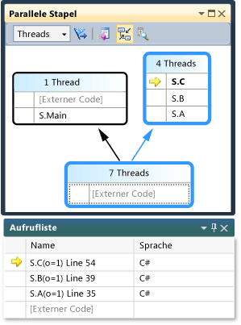  
  
     Die Aufrufliste des Hauptthreads wird in einem Feld angezeigt, während die Aufruflisten für die anderen vier Threads als Gruppe in einem anderen Feld angezeigt werden.  Vier Threads werden als Gruppe angezeigt, da für ihre Stapelrahmen dieselben Methodenkontexte verwendet werden; d. h., sie befinden sich in denselben Methoden: `A`, `B` und `C`.  Um die Thread\-IDs und die Namen der Threads anzuzeigen, die im selben Feld enthalten sind, zeigen Sie mit dem Mauszeiger auf den Header \(**4 Threads**\).  Der aktuelle Thread wird fett formatiert angezeigt, wie in der folgenden Abbildung veranschaulicht.  
  
     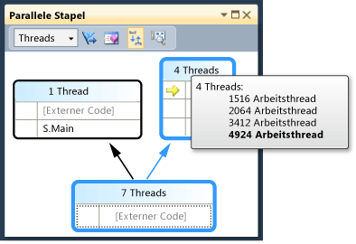  
  
     Der gelbe Pfeil gibt den aktiven Stapelrahmen des aktuellen Threads an.  Zeigen Sie mit dem Mauszeiger darauf, um weitere Informationen anzuzeigen.  
  
     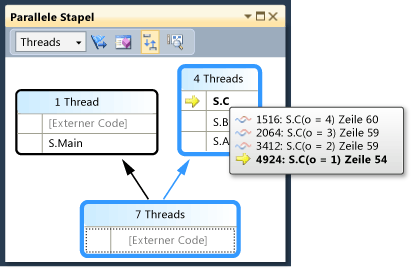  
  
     Sie können festlegen, wie viele Details für die Stapelrahmen angezeigt werden sollen \(**Modulnamen**, **Parametertypen**, **Parameternamen**, **Parameterwerte**, **Zeilennummern** und **Byte\-Offsets**\), indem Sie mit der rechten Maustaste in das Fenster **Aufrufliste** klicken.  
  
     Durch eine blaue Hervorhebung um ein Feld wird angegeben, dass der aktuelle Thread zu diesem Feld gehört.  Der aktuelle Thread wird auch durch den fett formatierten Stapelrahmen in der QuickInfo angegeben.  Wenn Sie im Fenster Threads auf den Hauptthread doppelklicken, können Sie beobachten, wie die blaue Hervorhebung im Fenster **Parallele Stapel** entsprechend verschoben wird.  
  
     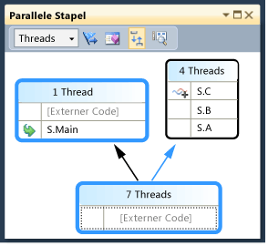  
  
#### So setzen Sie die Ausführung bis zum zweiten Haltepunkt fort  
  
1.  Um die Ausführung bis zum zweiten Haltepunkt fortzusetzen, klicken Sie im Menü **Debuggen** auf **Weiter**.  In der folgenden Abbildung wird die Threadstruktur beim zweiten Haltepunkt dargestellt.  
  
     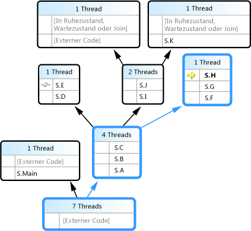  
  
     Beim ersten Haltepunkt gingen alle vier Threads von den Methoden S.A zu S.B zu S.C über.  Diese Informationen werden im Fenster **Parallele Stapel** immer noch angezeigt, die vier Threads wurden jedoch weiter ausgeführt.  Ein Thread ist zu S.D und dann zu S.E übergegangen.  Ein anderer hat mit S.F, S.G und S.H fortgefahren.  Zwei andere wechselten zu S.I und S.J. Von dort ging einer zu S.K über, während der andere zu nicht vom Benutzer stammendem externen Code wechselte.  
  
     Sie können mit dem Mauszeiger auf den Header des Felds zeigen \(beispielsweise **1 Thread** oder **2 Threads**\), um die Thread\-IDs der Threads anzuzeigen.  Sie können mit dem Mauszeiger auf Stapelrahmen zeigen, um die Thread\-IDs sowie andere Details zum Rahmen zu überprüfen.  Die blaue Hervorhebung gibt den aktuellen Thread an, während mit dem gelben Pfeil der aktive Stapelrahmen des aktuellen Threads angegeben wird.  
  
     Mit dem Faden\-Symbol \(einander überlappenden blauen und roten Wellenlinien\) werden die aktiven Stapelrahmen der nicht aktuellen Threads angegeben.  Doppelklicken Sie im Fenster **Aufrufliste** auf S.B, um zwischen Frames zu wechseln.  Im Fenster **Parallele Stapel** wird der aktuelle Stapelrahmen des aktuellen Threads mit einem grünen gekrümmten Pfeilsymbol angegeben.  
  
     Schalten Sie im Fenster **Threads** zwischen Threads um. Sie stellen fest, dass die Ansicht des Fensters **Parallele Stapel** aktualisiert wird.  
  
     Sie können über das Kontextmenü im Fenster **Parallele Stapel** zu einem anderen Thread oder zu einem anderen Frame eines anderen Threads wechseln.  Klicken Sie z. B. mit der rechten Maustaste auf S.J, zeigen Sie auf **Zu Rahmen wechseln**, und klicken Sie dann auf einen Befehl.  
  
     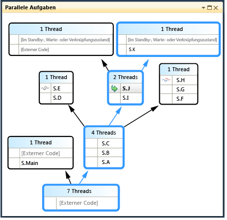  
  
     Klicken Sie mit der rechten Maustaste auf S.C, und zeigen Sie auf **Zu Rahmen wechseln**.  Ein Befehl ist mit einem Häkchen versehen, das den Stapelrahmen des aktuellen Threads angibt.  Sie können zu diesem Frame desselben Threads \(nur der grüne Pfeil wird verschoben\) wechseln, oder Sie können zum anderen Thread \(die blaue Hervorhebung wird ebenfalls verschoben\) wechseln.  Die folgende Abbildung zeigt das Untermenü.  
  
       
  
     Wenn ein Methodenkontext nur einem Stapelrahmen zugeordnet ist, wird im Feldheader **1 Thread** angezeigt, und Sie können durch Doppelklicken zu diesem wechseln.  Wenn Sie auf einen Methodenkontext doppelklicken, dem mehrere Frames zugeordnet sind, wird das Menü automatisch aufgerufen.  Wie Sie mit dem Mauszeiger auf die Methodenkontexte zeigen, wird rechts ein schwarzes Dreieck angezeigt.  Wenn Sie auf dieses Dreieck klicken, wird ebenfalls das Kontextmenü geöffnet.  
  
     Bei großen Anwendungen mit einer Vielzahl von Threads kann es sich empfehlen, sich nur auf eine Teilmenge von Threads zu konzentrieren.  Im Fenster **Parallele Stapel** können Aufruflisten nur für gekennzeichnete Threads angezeigt werden.  Klicken Sie auf der Symbolleiste neben dem Listenfeld auf die Schaltfläche **Nur gekennzeichnete Elemente anzeigen**.  
  
       
  
     Kennzeichnen Sie anschließend im Fenster **Threads** die einzelnen Threads, um die zugehörigen Aufruflisten im Fenster **Parallele Stapel** anzeigen zu lassen.  Verwenden Sie zum Kennzeichnen von Threads das Kontextmenü oder die erste Zelle eines Threads.  Klicken Sie erneut auf die Symbolleistenschaltfläche **Nur gekennzeichnete Elemente anzeigen**, um wieder alle Threads anzuzeigen.  
  
#### So setzen Sie die Ausführung bis zum dritten Haltepunkt fort  
  
1.  Um die Ausführung bis zum dritten Haltepunkt fortzusetzen, klicken Sie im Menü **Debuggen** auf **Weiter**.  
  
     Wenn mehrere Threads in derselben Methode enthalten sind, diese sich jedoch nicht am Anfang der Aufrufliste befand, wird die Methode in verschiedenen Feldern angezeigt.  Ein Beispiel am aktuellen Haltepunkt ist S.L. Hierin sind drei Threads enthalten, und die Methode wird in drei Feldern angezeigt.  Doppelklicken Sie auf S.L.  
  
     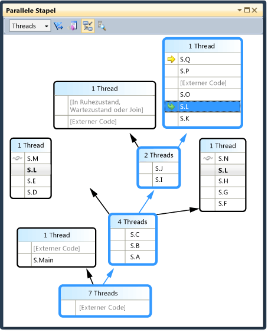  
  
     Beachten Sie, dass S.L in den anderen beiden Feldern fett formatiert ist, damit dort ersichtlich ist, an welcher Stelle die Methode außerdem angezeigt wird.  Wenn Sie bestimmen möchten, welche Frames S.L aufrufen und welche Frames von der Methode aufgerufen werden, klicken Sie auf der Symbolleiste auf die Schaltfläche **Methodenansicht ein\- bzw. ausschalten**.  In der folgenden Abbildung wird die Methodenansicht des Fensters **Parallele Stapel**  angezeigt.  
  
     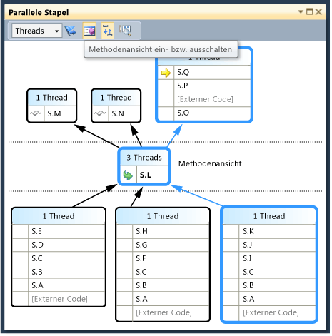  
  
     Das Diagramm wurde für die ausgewählte Methode pivotiert, und diese wurde in einem eigenen Feld in der Mitte der Ansicht positioniert.  Die Aufgerufenen und die Aufrufer werden am oberen und unteren Rand angezeigt.  Klicken Sie auf die Schaltfläche **Methodenansicht ein\- bzw. ausschalten**, um diesen Modus wieder zu verlassen.  
  
     Das Kontextmenü des Fensters **Parallele Stapel** weist zudem die folgenden weiteren Elemente auf.  
  
    -   Mit **Hexadezimale Anzeige** wird die Anzeige der Zahlen in den QuickInfos Dezimal\- und Hexadezimaldarstellung umgeschaltet.  
  
    -   Mit **Symbolladeinformationen** and **Symboleinstellungen** werden die entsprechenden Dialogfelder geöffnet.  
  
    -   Mit **Gehe zu Quellcode** und **Gehe zu Disassembly** wird im Editor zur ausgewählten Methode navigiert.  
  
    -   Mit **Externen Code anzeigen** werden alle Frames angezeigt, auch wenn sie sich nicht im Benutzercode befinden.  Das Diagramm wird erweitert, um die zusätzlichen Frames aufzunehmen \(die möglicherweise abgeblendet dargestellt werden, da keine Symbole dafür vorhanden sind\).  
  
     Wenn Sie bei großen Diagrammen zum nächsten Haltepunkt wechseln, können Sie einen automatischen Bildlauf der Anzeige zum aktiven Stapelrahmen des aktuellen Threads ausführen lassen \(d. h. des Threads, der den Haltepunkt zuerst erreicht hat\).  Vergewissern Sie sich, dass im Fenster **Parallele Stapel** die Symbolleistenschaltfläche **Automatischen Bildlauf zu aktuellem Stapelrahmen durchführen** aktiviert ist.  
  
     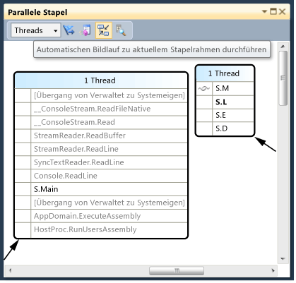  
  
2.  Führen Sie vor dem Fortfahren im Fenster **Parallele Stapel** zunächst einen Bildlauf ganz nach links und ganz nach unten aus.  
  
#### So setzen Sie die Ausführung bis zum vierten Haltepunkt fort  
  
1.  Um die Ausführung bis zum vierten Haltepunkt fortzusetzen, klicken Sie im Menü **Debuggen** auf **Weiter**.  
  
     Beachten Sie, wie ein automatischer Bildlauf der Ansicht an die korrekte Position stattfindet.  Schalten Sie zwischen Threads im Fenster **Threads** um, oder schalten Sie zwischen Stapelrahmen im Fenster **Aufrufliste** um. Sie stellen fest, dass immer ein automatischer Bildlauf der Ansicht zum richtigen Frame erfolgt.  Deaktivieren Sie Option **Automatischen Bildlauf zu aktuellem Stapelrahmen durchführen**, und beobachten Sie den Unterschied.  
  
     Die **Vogelperspektive** ist auch hilfreich bei großen Diagrammen im Fenster **Parallele Stapel**.  Sie können die **Vogelperspektive** einblenden, indem Sie auf die Schaltfläche zwischen den Bildlaufleisten in der rechten unteren Ecke des Fensters klicken, wie in der folgenden Abbildung dargestellt.  
  
       
  
     Sie können das Rechteck verschieben, um einen schnellen Schwenk um das Diagramm auszuführen.  
  
     Eine weitere Möglichkeit, das Diagramm in beliebiger Richtung zu verschieben, besteht darin, auf einen leeren Bereich des Diagramms zu klicken und das Diagramm an die gewünschte Stelle zu ziehen.  
  
     Zum Vergrößern und Verkleinern der Ansicht des Diagramms halten Sie STRG gedrückt, während Sie das Mausrad drehen.  Sie können auch auf der Symbolleiste auf die Schaltfläche Zoom klicken und das Tool Zoom verwenden.  
  
     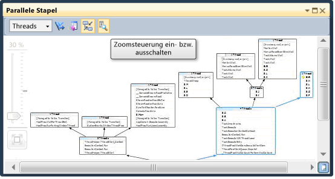  
  
     Sie können die Stapel auch von oben nach unten angeordnet anstatt von unten nach oben anzeigen. Klicken Sie dazu im Menü **Extras** auf **Optionen**, und aktivieren bzw. deaktivieren Sie anschließend die Option unter dem Knoten **Debuggen**.  
  
2.  Klicken Sie vor dem Fortfahren im Menü **Debuggen** auf **Debugging beenden**, um die Ausführung zu beenden.  
  
## Verwenden des Fensters Parallele Aufgaben und der Aufgabenansicht des Fensters Parallele Stapel  
 Es empfiehlt sich, vor dem Fortfahren die früheren Prozeduren abzuschließen.  
  
#### So starten Sie die Anwendung neu, bis der erste Haltepunkt erreicht wird  
  
1.  Klicken Sie im Menü **Debuggen** auf **Debugging starten**, und warten Sie, bis der erste Haltepunkt erreicht wird.  
  
2.  Zeigen Sie im Menü **Debuggen** auf **Fenster**, und klicken Sie auf **Threads**.  Docken Sie das Fenster **Threads** am unteren Rand von Visual Studio an.  
  
3.  Zeigen Sie im Menü **Debuggen** auf **Fenster**, und klicken Sie auf **Aufrufliste**.  Docken Sie das Fenster **Aufrufliste** am unteren Rand von Visual Studio an.  
  
4.  Doppelklicken Sie im Fenster **Threads** auf einen Thread, um diesen als aktuellen Thread festzulegen.  Aktuelle Threads sind durch einen gelben Pfeil gekennzeichnet.  Wenn Sie den aktuellen Thread ändern, werden die anderen Fenster aktualisiert.  Nun werden Aufgaben untersucht.  
  
5.  Zeigen Sie im Menü **Debuggen** auf **Fenster**, und klicken Sie dann auf **Parallele Aufgaben**.  In der folgenden Abbildung wird das Fenster **Parallele Aufgaben** dargestellt.  
  
     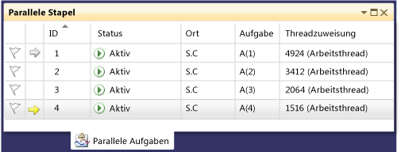  
  
     Für jede ausgeführte Aufgabe können Sie die zugehörige ID lesen. Diese wird zusammen mit der gleichnamigen Eigenschaft, der ID und dem Namen des ausführenden Threads und ihrer Position zurückgegeben \(wenn Sie mit dem Mauszeiger darauf zeigen, wird eine QuickInfo mit der gesamten Aufrufliste angezeigt\).  Unter der Spalte **Aufgabe** wird auch die Methode angezeigt, die in die Aufgabe übergeben wurde \(mit anderen Worten den Ausgangspunkt\).  
  
     Alle Spalten können sortiert werden.  Beachten Sie das Sortiersymbol, das Sortierspalte und \-richtung angibt.  Sie können auch die Anordnung der Spalten ändern, indem Sie sie nach links oder rechts ziehen.  
  
     Der gelbe Pfeil gibt die aktuelle Aufgabe an.  Sie können zwischen Aufgaben wechseln, indem Sie auf eine Aufgabe doppelklicken oder indem Sie das Kontextmenü aufrufen.  Beim Wechseln zwischen Aufgaben wird der zugrunde liegende Thread zum aktuellen Thread, und die übrigen Fenster werden aktualisiert.  
  
     Wenn Sie manuell von einer Aufgabe zu einer anderen wechseln, wird der gelbe Pfeil verschoben. Ein weißer Pfeil zeigt jedoch weiterhin die Aufgabe an, die die Unterbrechung des Debuggers verursacht hat.  
  
#### So setzen Sie die Ausführung bis zum zweiten Haltepunkt fort  
  
1.  Um die Ausführung bis zum zweiten Haltepunkt fortzusetzen, klicken Sie im Menü **Debuggen** auf **Weiter**.  
  
     Zuvor wurden in der Spalte **Status** alle Aufgaben als Aktiv angezeigt, nun weisen jedoch zwei Aufgaben den Status Wartend auf.  Aufgaben können aus vielen anderen Gründen blockiert werden.  Zeigen Sie in der Spalte **Status** auf eine wartende Aufgabe, um den Grund für ihre Blockierung anzuzeigen.  In der folgenden Abbildung wartet beispielsweise Aufgabe 3 auf Aufgabe 4.  
  
     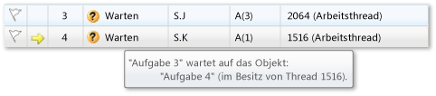  
  
     Aufgabe 4 wiederum wartet auf einen Monitor, der zu dem Thread gehört, der Aufgabe 2 zugewiesen ist.  
  
     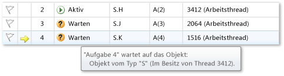  
  
     Sie können eine Aufgabe kennzeichnen, indem Sie in der ersten Spalte des Fensters **Parallele Aufgaben** auf das Flag klicken.  
  
     Durch das Kennzeichnen können Sie Aufgaben zwischen den verschiedenen Haltepunkten einer Debugsitzung verfolgen oder Aufgaben filtern, deren Aufruflisten im Fenster **Parallele Stapel** angezeigt werden.  
  
     Bei Ihrer früheren Verwendung des Fensters **Parallele Stapel** haben Sie die Anwendungsthreads angezeigt.  Rufen Sie das Fenster **Parallele Stapel** erneut auf, zeigen Sie dieses Mal jedoch die Anwendungsaufgaben an.  Wählen Sie dazu im Feld in der oberen linken Ecke **Aufgaben** auf.  In der folgenden Abbildung wird die Aufgabenansicht dargestellt.  
  
     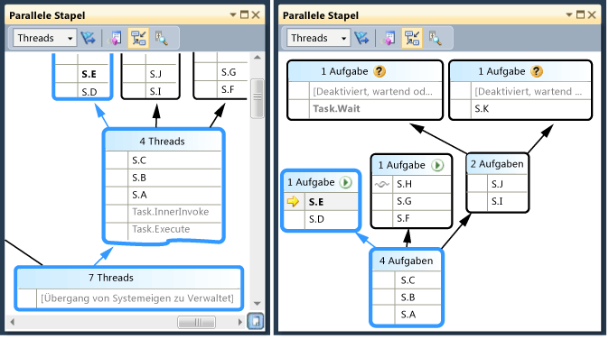  
  
     Threads, die derzeit keine Aufgaben ausführen, werden in der Aufgabenansicht des Fensters **Parallele Stapel** nicht angezeigt.  Auch für Threads, die Aufgaben ausführen, werden einige der für Aufgaben irrelevanten Stapelrahmen im Stapel von oben und unten gefiltert.  
  
     Rufen Sie das Fenster **Parallele Aufgaben** erneut auf.  Klicken Sie mit der rechten Maustaste auf einen Spaltenheader, um das Kontextmenü für die betreffende Spalte aufzurufen.  
  
     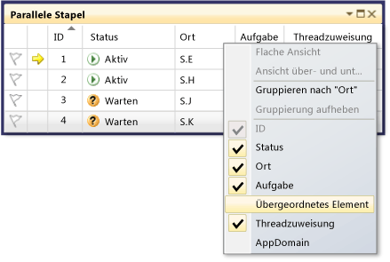  
  
     Über das Kontextmenü können Spalten hinzugefügt und entfernt werden.  Die Spalte AppDomain ist z. B. nicht ausgewählt. Daher wird sie in der Liste nicht aufgeführt.  Klicken Sie auf **Übergeordnetes Element**.  Die Spalte **Übergeordnetes Element** wird ohne Werte für die vier Aufgaben angezeigt.  
  
#### So setzen Sie die Ausführung bis zum dritten Haltepunkt fort  
  
1.  Um die Ausführung bis zum dritten Haltepunkt fortzusetzen, klicken Sie im Menü **Debuggen** auf **Weiter**.  
  
     Eine neue Aufgabe, Aufgabe 5, wird nun ausgeführt, und Aufgabe 4 ist nun wartend.  Sie können dies überprüfen, indem Sie im Fenster **Status** mit dem Mauszeiger auf die wartende Aufgabe zeigen.  Beachten Sie in der Spalte **Übergeordnetes Element**, dass Aufgabe 4 das übergeordnete Element von Aufgabe 5 ist.  
  
     Um die Beziehung zwischen übergeordneten und untergeordneten Daten besser zu veranschaulichen, klicken Sie mit der rechten Maustaste auf den Spaltenheader **Übergeordnetes Element**, und klicken Sie anschließend auf **Ansicht über\- und untergeordneter Elemente**.  Die Anzeige entspricht der folgenden Abbildung:  
  
     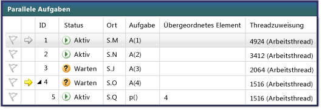  
  
     Sie stellen fest, dass Aufgabe 4 und Aufgabe 5 im selben Thread ausgeführt werden.  Diese Informationen werden im Fenster **Threads** nicht angezeigt. Ihre Anzeige an dieser Stelle ist ein weiterer Vorteil des Fensters **Parallele Aufgaben**.  Vergewissern Sie sich davon, indem Sie das Fenster **Parallele Stapel** öffnen.  Stellen Sie sicher, dass Sie **Aufgaben** anzeigen.  Suchen Sie die Aufgaben 4 und 5, indem Sie im Fenster **Parallele Aufgaben** darauf doppelklicken.  In diesem Fall wird die blaue Hervorhebung im Fenster **Parallele Stapel** aktualisiert.  Sie können die Aufgaben 4 und 5 auch suchen, indem Sie die QuickInfos im Fenster **Parallele Stapel** überprüfen.  
  
     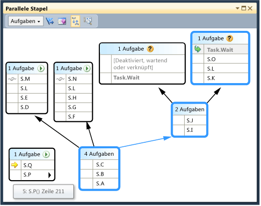  
  
     Klicken Sie im Fenster **Parallele Stapel** mit der rechten Maustaste auf S.P, und klicken Sie anschließend auf **Zu Thread wechseln**.  Das Fenster wechselt zur Threadansicht, und der entsprechende Frame wird angezeigt.  Sie können beide Aufgaben im selben Thread sehen.  
  
     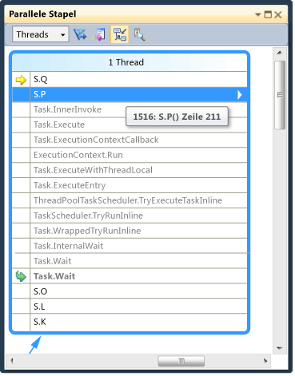  
  
     Dies ist ein weiterer Vorteil der Aufgabenansicht im Fenster **Parallele Stapel** gegenüber dem Fenster **Threads**.  
  
#### So setzen Sie die Ausführung bis zum vierten Haltepunkt fort  
  
1.  Um die Ausführung bis zum dritten Haltepunkt fortzusetzen, klicken Sie im Menü **Debuggen** auf **Weiter**.  Klicken Sie auf den Spaltenheader **ID**, um die Einträge nach ID zu sortieren.  Die Anzeige entspricht der folgenden Abbildung:  
  
     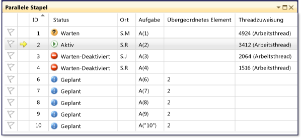  
  
     Da Aufgabe 5 abgeschlossen wurde, wird sie nicht mehr angezeigt.  Wenn dies auf Ihrem Computer nicht der Fall ist und der Deadlock nicht angezeigt wird, führen Sie einen Schritt aus, indem Sie F11 drücken.  
  
     Aufgabe 3 und Aufgabe 4 warten nun auf einander, und für sie ist ein Deadlock eingetreten.  Es sind auch fünf neue Aufgaben vorhanden, die untergeordnete Elemente von Aufgabe 2 darstellen und nun geplant sind.  Geplante Aufgaben sind Aufgaben, die im Code gestartet, jedoch noch nicht ausgeführt wurden.  Daher sind ihre Spalten **Speicherort** und **Threadzuweisung** leer.  
  
     Rufen Sie das Fenster **Parallele Stapel** erneut auf.  Der Header der einzelnen Felder weist jeweils eine QuickInfo auf, in der die Thread\-IDs und \-Namen angegeben werden.  Wechseln Sie im Fenster **Parallele Stapel** zur Aufgabenansicht.  Zeigen Sie auf einen Header, um die Aufgaben\-ID sowie den Namen und den Status der Aufgabe anzuzeigen, wie in der folgenden Abbildung veranschaulicht.  
  
     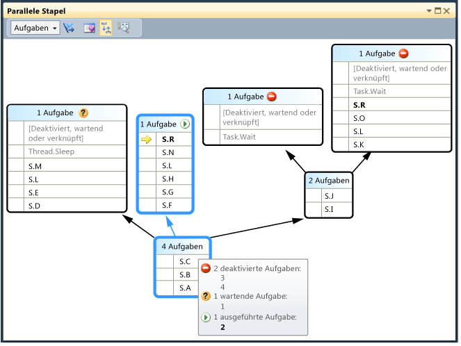  
  
     Sie können die Aufgaben nach Spalten gruppieren.  Klicken Sie im Fenster **Parallele Aufgaben** mit der rechten Maustaste auf den Spaltenheader **Status**, und klicken Sie dann auf **Gruppieren nach Status**.  In der folgenden Abbildung ist das nach Status gruppierte Fenster **Parallele Aufgaben** dargestellt.  
  
     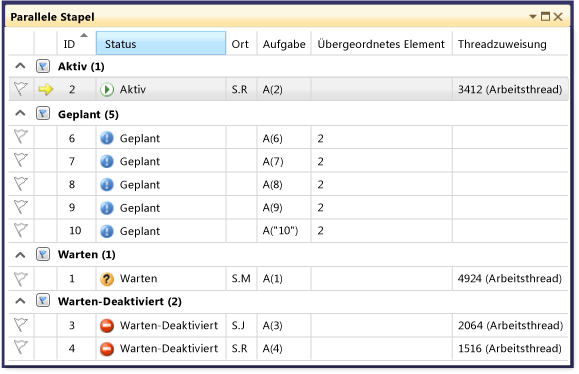  
  
     Sie können auch nach einer beliebigen anderen Spalte gruppieren.  Durch das Gruppieren von Aufgaben können sich auf eine Teilmenge von Aufgaben konzentrieren.  Jede reduzierbare Gruppe weist eine Anzahl von Elementen auf, die zu einer Gruppe gehören.  Sie können auch alle Elemente in der Gruppe schnell kennzeichnen, indem Sie auf die Schaltfläche **Flag** rechts neben der Schaltfläche **Reduzieren** klicken.  
  
     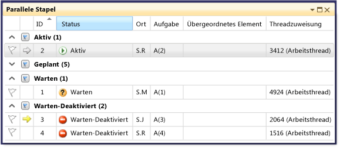  
  
     Die letzte behandelte Funktion des Fensters **Parallele Aufgaben** ist das Kontextmenü, das aufgerufen wird, wenn Sie mit der rechten Maustaste auf eine Aufgabe klicken.  
  
     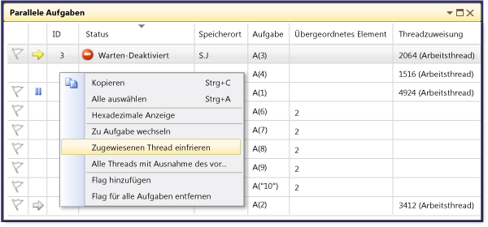  
  
     Im Kontextmenü sind weitere Befehle enthalten, die vom Status der Aufgabe abhängen.  Zu diesen können folgende Befehle zählen: **Kopieren**, **Alle auswählen**, **Hexadezimale Anzeige**, **Zu Aufgabe wechseln**, **Zugewiesenen Thread einfrieren**, **Alle Threads mit Ausnahme des vorliegenden einfrieren** und **Zugewiesenen Thread entsperren** sowie **Flag**.  
  
     Sie können den zugrunde liegenden Thread einer Aufgabe oder mehrerer Aufgaben einfrieren, oder Sie können alle Threads außer dem zugewiesenen Thread einfrieren.  Ein eingefrorener Thread wird im Fenster **Parallele Aufgaben** wie im Fenster **Threads** durch ein blaues *Pausensymbol* dargestellt.  
  
## Zusammenfassung  
 In dieser exemplarischen Vorgehensweise wurden die Debuggerfenster **Parallele Aufgaben** und **Parallele Stapel** veranschaulicht.  Verwenden Sie diese Fenster für tatsächliche Projekte, in denen Code mit mehreren Threads enthalten ist.  Sie können parallelen Code in C\+\+, C\# oder Visual Basic untersuchen.  
  
## Siehe auch  
 [Debugging Multithreaded Applications](../debugger/walkthrough-debugging-a-parallel-application.md)   
 [Debugger – Grundlagen](../debugger/debugger-basics.md)   
 [Debuggen von verwaltetem Code](../debugger/debugging-managed-code.md)   
 [Parallel Programming](../Topic/Parallel%20Programming%20in%20the%20.NET%20Framework.md)   
 [Concurrency Runtime](/visual-cpp/parallel/concrt/concurrency-runtime)   
 [Verwenden des Fensters "Parallele Stapel"](../debugger/using-the-parallel-stacks-window.md)   
 [Verwenden des Fensters "Aufgaben"](../debugger/using-the-tasks-window.md)