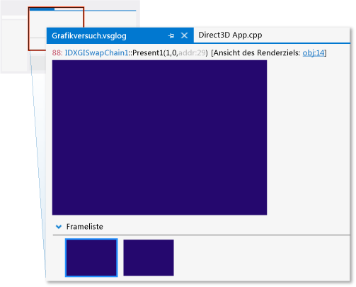
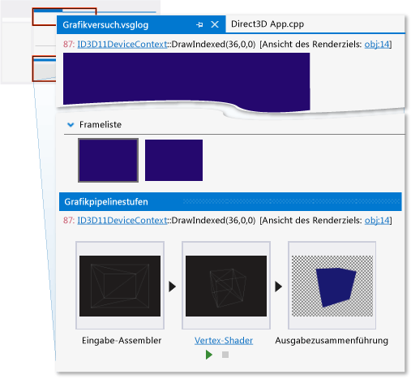
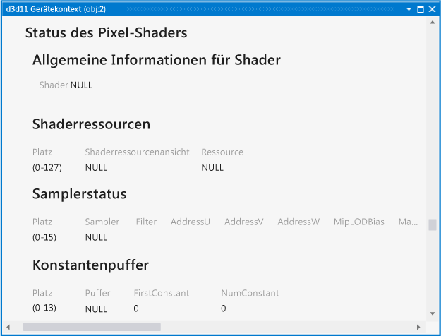
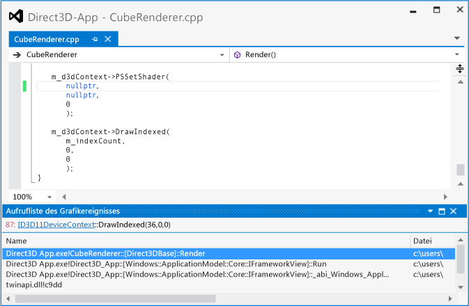

# Exemplarische Vorgehensweise: Fehlende Objekte durch falsch konfigurierte Pipeline
[!INCLUDE[vs2017banner](../code-quality/includes/vs2017banner.md)]

Diese exemplarische Vorgehensweise veranschaulicht, wie die [!INCLUDE[vsprvs](../code-quality/includes/vsprvs_md.md)]\-Grafikdiagnosetools zum Untersuchen eines Objekts verwendet werden, das aufgrund eines nicht festgelegten Pixelshaders fehlt.  
  
 In dieser exemplarischen Vorgehensweise werden die folgenden Aufgaben beschrieben:  
  
-   Verwenden der **Grafikereignisliste**, um mögliche Quellen des Problems zu suchen.  
  
-   Verwenden des Fensters **Grafikpipelinestufen** zum Untersuchen der Wirkung des `DrawIndexed`\-Direct3D\-API\-Aufrufs.  
  
-   Untersuchen des Gerätekontexts, um zu bestätigen, dass keine Shaderstufe festgelegt wurde.  
  
-   Verwenden des Fensters **Grafikpipelinestufen** in Kombination mit der **Aufrufliste des Grafikereignisses**, um die Suche nach der Ursache des nicht festgelegten Pixelshaders zu unterstützen.  
  
## Szenario  
 Wenn ein Objekt in einer 3D\-App fehlt, hat das manchmal die Ursache, dass eine der Shaderstufen vor dem Rendern des Objekts nicht festgelegt wurde. In Apps mit einfachen Ansprüchen an das Rendering liegt die Ursache für diesen Fehler normalerweise irgendwo in der Aufrufliste des Zeichnen\-Befehls des Objekts. Zur Optimierung fassen einige Apps Objekte mit gemeinsamen Shaderprogrammen, Texturen oder anderen Daten allerdings zu Batches zusammen, um Mehraufwand durch häufige Statuswechsel zu minimieren. In diesen Apps kann sich die Ursache des Fehlers im Batchsystem statt in der Aufrufliste des Zeichnen\-Befehls verstecken. Das Szenario dieser exemplarischen Vorgehensweise bildet eine App, die einfache Anforderungen an das Rendering stellt, daher lässt sich die Ursache des Fehlers in der Aufrufliste finden.  
  
 In diesem Szenario wird beim Ausführen der App zu Testzwecken der Hintergrund erwartungsgemäß gerendert, eins der Objekte wird jedoch nicht dargestellt. Mithilfe der Grafikdiagnose erfassen Sie das Problem in einer Grafikprotokolldatei, um die App zu debuggen. Das Problem sieht in der App wie folgt aus:  
  
   
  
## Untersuchung  
 Mithilfe der Grafikdiagnosetools können Sie das Grafikprotokolldokument laden, um die Frames zu untersuchen, die während des Tests erfasst wurden.  
  
#### So überprüfen Sie einen Frame in einem Grafikprotokoll  
  
1.  Laden Sie in [!INCLUDE[vsprvs](../code-quality/includes/vsprvs_md.md)] ein Grafikprotokolldokument, das einen Frame enthält, der das Problem des fehlenden Objekts aufweist. Eine neue Grafikprotokoll\-Registerkarte wird in [!INCLUDE[vsprvs](../code-quality/includes/vsprvs_md.md)] angezeigt. Ganz oben auf dieser Registerkarte befindet sich die Renderingzielausgabe des ausgewählten Frames. Im unteren Teil befindet sich die **Frameliste**, in der alle aufgezeichneten Frames als Miniaturansichten angezeigt werden.  
  
2.  Wählen Sie in der **Frameliste** einen Frame aus, der veranschaulicht, dass das Objekt nicht angezeigt wird. Das Renderziel wird aktualisiert und gibt den ausgewählten Frame wieder. In diesem Szenario sieht die Grafikprotokoll\-Registerkarte wie folgt aus:  
  
       
  
 Wenn Sie einen Frame ausgewählt haben, der das Problem demonstriert, können Sie die **Grafikereignisliste** verwenden, um das Problem zu diagnostizieren. Die **Grafikereignisliste** enthält jeden Direct3D\-API\-Aufruf, der zum Rendern des aktiven Frames erfolgt ist – z. B. zum Einrichten des Gerätestatus, zum Erstellen und Aktualisieren von Puffern und zum Zeichnen von Objekten, die im Frame dargestellt werden. Viele Arten von Aufrufen – z. B. Draw\-, Dispatch\-, Copy\- oder Clear\-Befehle – sind interessant, weil sie häufig \(aber nicht immer\) mit einer entsprechenden Änderung beim Renderziel einhergehen, wenn die App erwartungsgemäß funktioniert. Draw\-Befehle sind besonders interessant, da sich jeder auf von der App gerenderte Geometrie bezieht.  
  
 Da Sie wissen, dass das Renderziel das fehlende Objekt nicht enthält, aber dass darüber hinaus keine weiteren Fehler vorzuliegen scheinen, können Sie die **Grafikereignisliste** in Kombination mit dem **Grafikpipelinestufen**\-Tool verwenden, um zu bestimmen, welcher Aufruf der Geometrie des fehlenden Objekts entspricht. Das Fenster **Grafikpipelinestufen** zeigt die Geometrie an, die an jeden Zeichnen\-Befehl gesendet wurde, unabhängig von seiner Wirkung auf das Renderziel. Während Sie sich durch die Zeichnen\-Befehle bewegen, werden die Pipelinestufen aktualisiert und zeigen die den einzelnen Befehlen zugeordnete Geometrie auf ihrem Weg durch die einzelnen aktivierten Stufen an. Außerdem wird das Renderziel aktualisiert, um den Zustand des Renderziels nach dem Abschluss des Aufrufs anzuzeigen.  
  
#### So finden Sie den Zeichnen\-Befehl für die fehlende Geometrie  
  
1.  Öffnen Sie das Fenster **Grafikereignisliste**. Wählen Sie auf der Symbolleiste **Grafikdiagnose** die **Ereignisliste** aus.  
  
2.  Öffnen Sie das Fenster **Grafikpipelinestufen**. Wählen Sie auf der Symbolleiste **Grafikdiagnose** die **Pipelinestufen** aus.  
  
3.  Suchen Sie beim Navigieren durch die einzelnen Zeichnen\-Befehle im Fenster **Grafikereignisliste** im Fenster **Grafikpipelinestufen** nach dem fehlenden Objekt. Zur Vereinfachung können Sie im Feld **Suche** in oberen rechten Ecke des Fensters **Grafikereignisliste** das Wort "Zeichnen" eingeben. Damit wird die Liste gefiltert und enthält nur Ereignisse, die "Zeichnen" im Titel haben.  
  
     Im Fenster **Grafikpipelinestufen** zeigt die Stufe **Eingabeassembler** die Geometrie des Objekts vor dem Transformieren, und die Stufe **Vertexshader** zeigt das gleiche Objekt nach dem Transformieren. Beachten Sie in diesem Szenario, dass das Fenster **Grafikpipelinestufen** für einen der Zeichnen\-Befehle die Stufen **Eingabeassembler** und **Vertexshader**, nicht jedoch die Stufe **Pixelshader** anzeigt.  
  
    > [!NOTE]
    >  Wenn das Objekt in weiteren Pipelinestufen verarbeitet wird – beispielsweise im Hullshader, dem Domainshader oder dem Geometryshader – kann die Ursache des Problems in jeder von ihnen liegen. Normalerweise hängt das Problem mit der frühesten Stufe zusammen, in der das Ergebnis nicht oder nicht in der erwarteten Weise angezeigt wird.  
  
4.  Halten Sie an, wenn Sie den Zeichnen\-Befehl erreichen, der dem fehlenden Objekt entspricht. In diesem Szenario zeigt das Fenster **Grafikpipelinestufen** an, dass die Geometrie an die GPU ausgegeben \(worauf das Vorhandensein der Stufe **Eingabeassembler** hinweist\) und transformiert wurde \(worauf die Stufe **Vertexshader** hinweist\), aber nicht im Renderziel erscheint, da anscheinend kein aktiver Pixelshader vorhanden ist \(worauf das Fehlen der Stufe **Pixelshader** hinweist\). In diesem Szenario können Sie sogar die Silhouette des fehlenden Objekts in der Stufe **Ausgabezusammenführung** sehen:  
  
       
  
 Nachdem sich bestätigt hat, dass die App einen Befehl für die Geometrie des fehlenden Objekts ausgegeben hat, und deutlich wurde, dass die Pixelshaderstufe inaktiv war, können Sie den Zustand des Geräts überprüfen, um Ihre Erkenntnisse zu bestätigen. Sie können die **Grafikobjekttabelle** verwenden, um den Gerätekontext und weitere Direct3D\-Objektdaten zu untersuchen.  
  
#### So untersuchen Sie den Gerätekontext  
  
1.  Öffnen Sie den **d3d11\-Gerätekontext**. Wählen Sie im Fenster **Grafikpipelinestufen** die Verknüpfung **ID3D11DeviceContext** aus, die einen Teil des oben im Fenster angezeigten `DrawIndexed`\-Befehls bildet.  
  
2.  Untersuchen Sie den Gerätezustand, der auf der Registerkarte **d3d11\-Gerätekontext** angezeigt wird, um zu bestätigen, dass während des Zeichnen\-Befehls kein Pixelshader aktiv war. In diesem Szenario zeigen die **Allgemeinen Informationen für Shader** – die unter **Pixelshaderzustand** angezeigt werden – an, dass der Shader den Wert **NULL** hat:  
  
       
  
 Nachdem Sie bestätigt haben, dass der Pixelshader von Ihrer App auf NULL festgelegt wurde, besteht der nächste Schritt darin, den Ort im Quellcode Ihrer App zu finden, an dem der Shader festgelegt wird. Sie können die **Grafikereignisliste** zusammen mit der **Aufrufliste des Grafikereignisses** verwenden, um diese Position zu ermitteln.  
  
#### So finden Sie die Stelle im Quellcode Ihrer App, an der der Pixelshader festgelegt wird  
  
1.  Suchen Sie den `PSSetShader`\-Befehl, der dem fehlenden Objekt entspricht. Geben Sie im Fenster **Grafikereignisliste** die Zeichenfolge "Draw;PSSetShader" im Feld **Suchen** in der oberen rechten Ecke des Fensters **Grafikereignisliste** ein. Dadurch wird die Liste so gefiltert, dass sie nur PSSetShader\-Ereignisse sowie Ereignisse mit "Draw" im Titel enthält. Wählen Sie den ersten `PSSetShader`\-Aufruf aus, der vor dem Zeichnen\-Befehl des fehlenden Objekts erscheint.  
  
    > [!NOTE]
    >  `PSSetShader` wird im Fenster **Grafikereignisliste** nicht angezeigt, wenn es in diesem Frame nicht festgelegt wurde. Normalerweise tritt dieser Fall nur ein, wenn für alle Objekte nur ein Pixelshader verwendet wird oder der `PSSetShader`\-Aufruf während dieses Frames unabsichtlich ausgelassen wurde. In beiden Fällen empfiehlt es sich, den Quellcode der Apps nach `PSSetShader`\-Aufrufen zu durchsuchen und traditionelle Debugtechniken zu verwenden, um das Verhalten der Aufrufe zu untersuchen.  
  
2.  Öffnen Sie das Fenster **Aufrufliste des Grafikereignisses**. Wählen Sie auf der Symbolleiste **Grafikdiagnose** die **Aufrufliste des Grafikereignisses** aus.  
  
3.  Verwenden Sie die Aufrufliste, um den `PSSetShader`\-Aufruf im Quellcode Ihrer App zu finden. Wählen Sie im Fenster **Aufrufliste des Grafikereignisses** den obersten Aufruf aus, und untersuchen Sie den Wert, auf den der Pixelshader festgelegt wird. Möglicherweise wird der Pixelshader unmittelbar auf NULL festgelegt, oder der NULL\-Wert tritt aufgrund eines Arguments, das der Funktion übergeben wurde, oder eines anderen Umstands auf. Wenn der Wert nicht direkt festgelegt wird, können Sie die Quelle des NULL\-Werts möglicherweise weiter oben in der Aufrufliste finden. In diesem Szenario finden Sie heraus, dass der Pixelshader in der obersten Funktion mit dem Namen `CubeRenderer::Render` direkt auf `nullptr` festgelegt wird:  
  
       
  
    > [!NOTE]
    >  Wenn Sie die Quelle des NULL\-Werts durch einfaches Untersuchen der Aufrufliste nicht finden können, empfiehlt es sich, für den `PSSetShader`\-Aufruf einen bedingten Haltepunkt festzulegen, damit der Programmablauf unterbrochen wird, wenn der Pixelshader auf NULL festgelegt wird. Starten Sie anschließend die App im Debugmodus erneut, und verwenden Sie herkömmliche Debugtechniken, um die Quelle des NULL\-Werts zu ermitteln.  
  
 Um das Problem zu beheben, weisen Sie den richtigen Pixelshader zu, indem Sie den ersten Parameter des `ID3D11DeviceContext::PSSetShader`\-API\-Aufrufs verwenden.  
  
   
  
 Nachdem Sie den Code repariert haben, können Sie die App erneut erstellen und ausführen, um zu überprüfen, ob das Renderingproblem behoben wurde:  
  
   
  
## Nächste Schritte