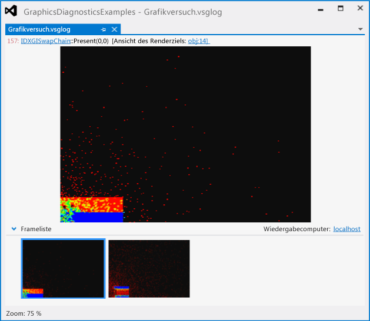
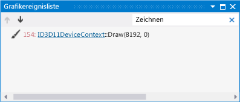
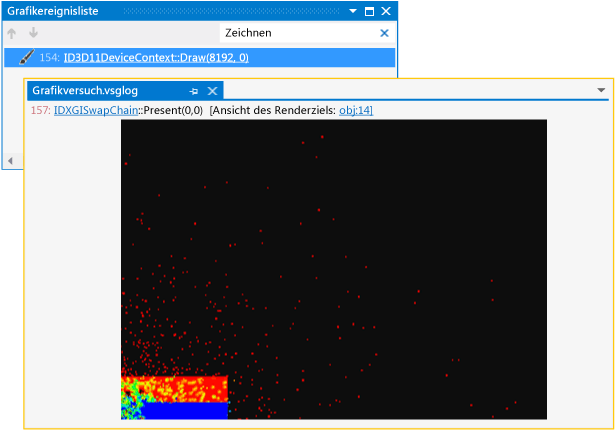
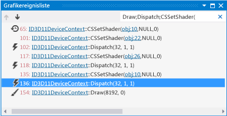
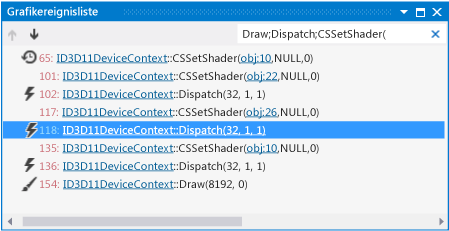

# Exemplarische Vorgehensweise: Debuggen eines Compute-Shaders mithilfe der Grafikdiagnose
[!INCLUDE[vs2017banner](../code-quality/includes/vs2017banner.md)]

In dieser exemplarischen Vorgehensweise wird veranschaulicht, wie die Visual Studio\-Grafikdiagnosetools zur Untersuchung eines Compute\-Shaders verwendet werden, der falsche Ergebnisse generiert.  
  
 In dieser exemplarischen Vorgehensweise werden die folgenden Aufgaben beschrieben:  
  
-   Verwenden der **Grafikereignisliste**, um mögliche Quellen des Problems zu suchen.  
  
-   Verwenden Sie die **Aufrufliste des Grafikereignisses**, um zu ermitteln, welcher Compute\-Shader durch ein `Dispatch`\-Ereignis in DirectCompute ausgeführt wird.  
  
-   Untersuchen Sie den Compute\-Shader, der das Problem verursacht, über das Fenster **Grafikpipelinestufen** und mit dem HLSL\-Debugger.  
  
## Szenario  
 In diesem Szenario haben Sie eine Fluiddynamiksimulation geschrieben, die DirectCompute zur Ausführung der berechnungsintensivsten Teile des Simulationsupdates verwendet.  Beim Ausführen der App werden Dataset und Benutzeroberfläche korrekt wiedergegeben, die Simulation verhält sich jedoch nicht wie erwartet.  Mithilfe der Grafikdiagnose können Sie den Fehler in einer Grafikprotokolldatei erfassen, um die App zu debuggen.  Das Problem sieht in der App wie folgt aus:  
  
   
  
 Informationen zum Erfassen von Grafikproblemen in einem Grafikprotokoll finden Sie unter [Erfassen von Grafikinformationen](../debugger/capturing-graphics-information.md).  
  
## Untersuchung  
 Sie können die Grafikprotokolldatei mithilfe der Grafikdiagnosetools laden, um die aufgezeichneten Frames zu überprüfen.  
  
#### So überprüfen Sie einen Frame in einem Grafikprotokoll  
  
1.  Laden Sie ein Grafikprotokoll in Visual Studio, das einen Frame mit falschen Simulationsergebnissen enthält.  Eine neue Grafikdiagnose\-Registerkarte wird in Visual Studio angezeigt.  Ganz oben auf dieser Registerkarte befindet sich die Renderingzielausgabe des ausgewählten Frames.  Im unteren Teil befindet sich die **Frameliste**, in der alle aufgezeichneten Frames als Miniaturansichten angezeigt werden.  
  
2.  Wählen Sie einen Frame in der **Frameliste** aus, in dem das falsche Simulationsverhalten auftritt.  Obwohl sich der Fehler scheinbar im Simulationscode und nicht im Renderingode befindet, müssen Sie trotzdem einen Frame auswählen, da DirectCompute\-Ereignisse von einem Frame zum nächsten, gemeinsam mit Direct3D\-Ereignissen aufgezeichnet werden.  In diesem Szenario sieht die Grafikprotokoll\-Registerkarte wie folgt aus:  
  
       
  
 Wenn Sie einen Frame ausgewählt haben, der das Problem demonstriert, können Sie die **Grafikereignisliste** verwenden, um das Problem zu diagnostizieren.  Die **Grafikereignisliste** zeigt ein Ereignis für jeden DirectCompute\- und Direct3D\-API\-Aufruf an, der erfolgte, als der Frame aktiv war. Dazu gehören beispielsweise API\-Aufrufe zur Ausführung einer Berechnung auf dem GPU, das Rendern eines Datasets oder der Benutzeroberfläche.  In diesem Fall interessieren uns die `Dispatch`\-Ereignisse, die Teile der im GPU ausgeführten Simulation darstellen.  
  
#### So finden Sie das Dispatchereignis für das Simulationsupdate  
  
1.  Klicken Sie auf der Symbolleiste **Grafikdiagnose** auf **Ereignisliste**, um das Fenster **Grafikereignisliste** zu öffnen.  
  
2.  Suchen Sie das Zeichnen\-Ereignis, mit dem das Dataset gerendert wird, in der **Grafikereignisliste**.  Zur Vereinfachung können Sie im Feld `Suche` in oberen rechten Ecke des Fensters **Grafikereignisliste** das Wort **Zeichnen** eingeben.  Damit wird die Liste gefiltert und enthält nur Ereignisse, die "Zeichnen" im Titel haben.  In diesem Szenario ermitteln Sie, dass die folgenden Zeichnen\-Ereignisse aufgetreten sind:  
  
       
  
3.  Navigieren Sie durch die einzelnen Zeichnen\-Ereignisse, und beobachten Sie das Renderziel in der Dokumentregisterkarte "Grafikprotokolle".  
  
4.  Halten Sie an, wenn das gerenderte Dataset erstmals im Renderziel angezeigt wird.  In diesem Szenario wird das Dataset im ersten Zeichnen\-Ereignis gerendert.  Der Fehler in der Simulation wird angezeigt:  
  
       
  
5.  Überprüfen Sie jetzt die **Grafikereignisliste** auf das `Dispatch`\-Ereignis, das die Simulation aktualisiert.  Da es wahrscheinlich ist, dass die Simulation vor dem Rendering aktualisiert wird, können Sie sich zunächst auf die `Dispatch`\-Ereignisse konzentrieren, die vor dem Zeichnen\-Ereignis auftreten, das die Ergebnisse rendert.  Zur Vereinfachung können Sie das Feld **Suchen** in `Draw;Dispatch;CSSetShader(` ändern.  Dadurch wird die Liste gefiltert, sodass sie zusätzlich zu den Zeichnen\-Ereignissen auch `Dispatch`\- und `CSSetShader`\-Ereignisse enthält.  In diesem Szenario ermitteln Sie, dass mehrere `Dispatch`\-Ereignisse vor dem Zeichnen\-Ereignis aufgetreten sind:  
  
       
  
 Nachdem Sie nun wissen, welche der vielen `Dispatch`\-Ereignisse möglicherweise mit dem Problem in Verbindung stehen, können diese ausführlicher überprüfen.  
  
#### So ermitteln Sie, welcher Compute\-Shader von einem Dispatchaufruf ausgeführt wird  
  
1.  Wählen Sie zum Öffnen des Fensters **Aufrufliste des Grafikereignisses** auf der Symbolleiste **Grafikdiagnose** die Option **Ereignisaufrufliste** aus.  
  
2.  Bewegen Sie sich ausgehend vom Zeichnen\-Ereignis, das die Simulationsergebnisse rendert, rückwärts durch die vorherigen `CSSetShader`\-Ereignisse.  Wählen Sie anschließend im Fenster **Aufrufliste des Grafikereignisses** die oberste Funktion aus, um zur Aufrufsite zu navigieren.  Auf der Aufrufwebsite können Sie den ersten Parameter des [CSSetShader](http://msdn.microsoft.com/library/ff476402.aspx)\-Funktionsaufrufs verwenden, um zu bestimmen, welcher Shader durch das nächste `Dispatch`\-Ereignis ausgeführt wird.  
  
 In diesem Szenario befinden sich in jedem Frame drei Paare mit `CSSetShader`\- und `Dispatch`\-Ereignissen.  Von hinten angefangen stellt das dritte Paar den Integrationsschritt dar \(in dem die flüssigen Partikel tatsächlich verschoben werden\), das zweite Paare stellt den Schritt der Kräfteberechnung dar \(in dem die Kräfte berechnet werden, die jedes einzelne Partikel beeinflussen\), und das dritte Paar enthält den Schritt der Dichteberechnung.  
  
#### So debuggen Sie den Compute\-Shader  
  
1.  Klicken Sie auf der Symbolleiste **Grafikdiagnose** auf **Pipelinestufen**, um das Fenster **Grafikpipelinestufen** zu öffnen.  
  
2.  Wählen Sie das dritte `Dispatch`\-Ereignis aus \(das Ereignis direkt vor dem Zeichnen\-Ereignis\), und klicken Sie dann im Fenster **Grafikpipelinestufen** unter der Stufe **Compute\-Shader** auf **Debugging starten**.  
  
       
  
     Der HLSL\-Debugger wird am Shader gestartet, der den Integrationsschritt ausführt.  
  
3.  Überprüfen Sie den Quellcode des Compute\-Shaders auf den Integrationsschritt, um die Fehlerursache zu finden.  Wenn Sie die Grafikdiagnose verwenden, um den HLSL\-Compute\-Shader\-Code zu debuggen, können Sie den Code schrittweise ausführen und andere Ihnen vertraute Debugtools wie Überwachungsfenster verwenden.  In diesem Szenario ermitteln Sie, dass scheinbar kein Fehler im Compute\-Shader vorhanden ist, der den Integrationsschritt ausführt.  
  
       
  
4.  Um das Debugging im Compute\-Shader zu beenden, wählen Sie auf der Symbolleiste **Debuggen** die Option **Debuggen beenden** aus \(Tastatur: UMSCHALT\+F5\).  
  
5.  Wählen Sie danach Sie das zweite `Dispatch`\-Ereignis aus, und starten Sie das Debugging des Compute\-Shaders, wie Sie dies bereits im vorherigen Schritt getan haben.  
  
       
  
     Der HLSL\-Debugger wird am Shader gestartet, der die Kräfte berechnet, die auf alle flüssigen Partikel einwirken.  
  
6.  Überprüfen Sie den Schritt der Kräfteberechnung im Quellcode des Compute\-Shaders.  In diesem Szenario ermitteln Sie, dass die Fehlerquelle sich hier befindet.  
  
       
  
 Nachdem Sie den Ursprung des Fehlers bestimmt haben, können Sie das Debuggen beenden und den Quellcode des Compute\-Shaders dahingehend ändern, dass der Abstand zwischen den interagierenden Partikeln ordnungsgemäß berechnet wird.  In diesem Szenario ändern Sie nur die Zeile `float2 diff = N_position + P_position;` in `float2 diff = N_position - P_position;`:  
  
   
  
 Da die Compute\-Shader zur Laufzeit kompiliert werden, können Sie in diesem Szenario die App nach Durchführung der Änderungen einfach neu starten und beobachten, welche Auswirkung die Änderungen auf die Simulation haben.  Sie müssen die App nicht neu erstellen.  Wenn Sie die App ausführen, können Sie feststellen, dass sich die Simulation nun ordnungsgemäß verhält.  
  
 