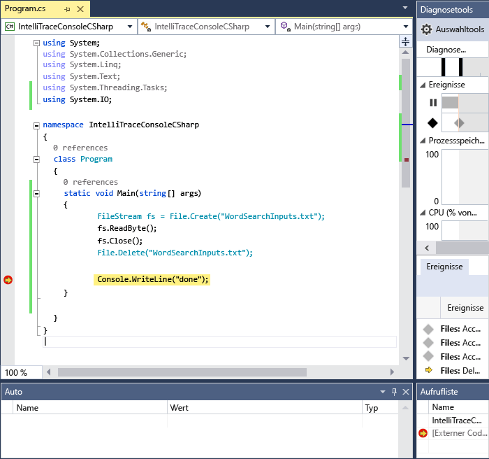
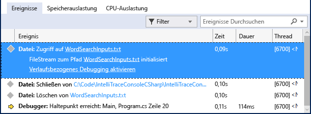
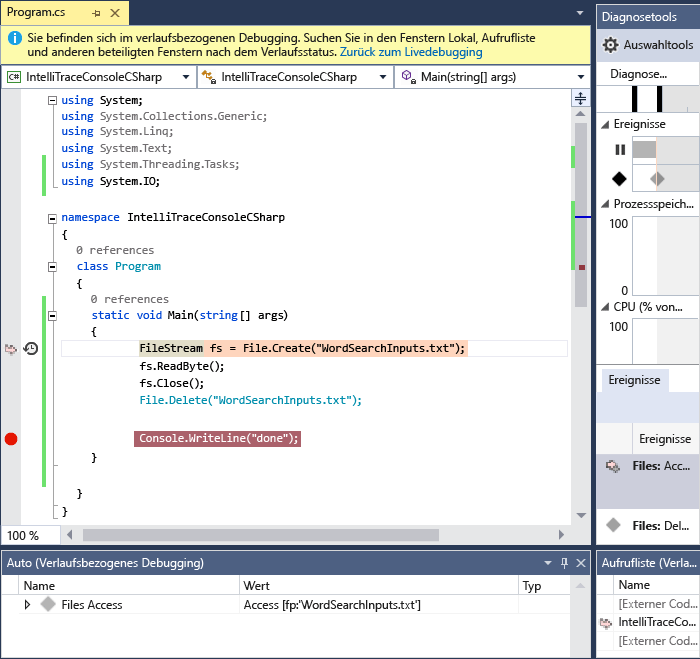

# <a name="view-events-with-intellitrace-in-visual-studio"></a>Anzeigen von Ereignissen mit IntelliTrace in Visual Studio
Sie können IntelliTrace zum Sammeln von Informationen über bestimmte Ereignisse oder Ereigniskategorien oder zum Erfassen von einzelnen Funktionsaufrufen zusätzlich zu den Ereignissen verwenden. In der folgenden Vorgehensweisen wird gezeigt, wie dies umzusetzen ist.  
  
 Sie können IntelliTrace in Visual Studio Enterprise Edition, jedoch nicht den Professional oder Community Editions verwenden.  
  
##  <a name="GettingStarted"></a> Konfigurieren von Intellitrace  
 Sie können ein Debugging nur mit IntelliTrace-Ereignissen durchführen. IntelliTrace-Ereignisse sind Debuggerereignisse, Ausnahmen, .NET Framework-Ereignisse und andere Systemereignisse. Bevor Sie mit dem Debuggen beginnen, sollten Sie bestimmte Ereignisse aktivieren oder deaktivieren, um die von IntelliTrace aufgezeichneten Ereignisse zu steuern. Weitere Informationen finden Sie unter [IntelliTrace-Funktionen](../debugger/intellitrace-features.md).  
  
 - Aktivieren Sie das IntelliTrace-Ereignis für den Dateizugriff. Wechseln Sie zu der **Tools > Optionen > IntelliTrace > IntelliTrace-Ereignisse** Seite, und erweitern Sie die **Datei** Kategorie. Aktivieren Sie die Ereigniskategorie **Datei** . Dadurch werden alle Dateiereignisse (Zugriff, Schließen, Löschen) überprüft.

## <a name="create-your-app"></a>Erstellen Sie Ihre app
  
1.  Erstellen Sie eine C#- Konsolenanwendung. Fügen Sie in der Datei "Program.cs" die folgende `using`-Anweisung hinzu:  
  
    ```csharp  
    using System.IO;  
    ```  
  
2.  Erstellen Sie ein <xref:System.IO.FileStream> -Element in der Main-Methode, lesen Sie es aus, schließen Sie es, und löschen Sie die Datei. Fügen Sie eine weitere Zeile hinzu, um einen Haltepunkt festlegen zu können:  
  
    ```csharp  
    static void Main(string[] args)  
    {  
        FileStream fs = File.Create("WordSearchInputs.txt");  
        fs.ReadByte();  
        fs.Close();  
        File.Delete("WordSearchInputs.txt");  
  
        Console.WriteLine("done");  
    }  
    ```  
  
3.  Legen Sie einen Haltepunkt auf `Console.WriteLine("done");`fest.  

## <a name="start-debugging-and-view-intellitrace-events"></a>Starten Sie das Debuggen und Anzeigen von IntelliTrace-Ereignisse
  
1.  Starten Sie das Debuggen wie gewohnt. (Drücken Sie **F5** oder klicken Sie auf **Debuggen > Debuggen starten**.  
  
    > [!TIP]
    >  Behalten Sie die **"lokal"** und **"Auto"** Fenster zu öffnen, während Sie Debuggen, um anzuzeigen, und notieren Sie die Werte in diesen Fenstern.  
  
2.  Die Ausführung hält am Haltepunkt an. Wenn Sie nicht sehen die **Diagnosetools** Fenster, klicken Sie auf **Debuggen > Windows > IntelliTrace-Ereignisse**.  
  
     Wechseln Sie im Fenster **Diagnosetools** zur Registerkarte **Ereignisse** (es sollten drei Registerkarten vorhanden sein: **Ereignisse**, **Speicherauslastung**und **CPU-Auslastung**). Die Registerkarte **Ereignisse** zeigt eine chronologische Liste aller Ereignisse, die mit dem letzten Ereignis endet, bevor die Ausführung vom Debugger unterbrochen wurde. Es sollte ein Ereignis namens **Access WordSearchInputs.txt**angezeigt werden.  
  
     Der folgende Screenshot stammt aus Visual Studio 2015 Update 1.  
  
       
  
3.  Wählen Sie das Ereignis aus, um die Details zu erweitern.  
  
     Der folgende Screenshot stammt aus Visual Studio 2015 Update 1.  
  
       
  
     Sie können den Link des Pfadnamens auswählen, um die Datei zu öffnen. Wenn der vollständige Pfadname nicht verfügbar ist, wird das Dialogfeld **Datei öffnen** angezeigt.  
  
     Klicken Sie auf **verlaufsbezogenes Debugging aktivieren**, wodurch den datenschnellansichten des Debuggers Kontext mit der Zeit, wenn das ausgewählte Ereignis wurde, gesammelt werden, so werden Verlaufsdaten der **Aufrufliste**, **"lokal"** und den anderen zugehörigen Debuggerfenstern. Wenn Quellcode verfügbar ist, bewegt Visual Studio den Zeiger auf den entsprechenden Code im Quellcodefenster, damit Sie ihn überprüfen können.  
  
     Der folgende Screenshot stammt aus Visual Studio 2015 Update 1.  
  
       
  
4.  Wenn Sie den Fehler nicht finden, überprüfen Sie andere Ereignisse, die zu dem Fehler geführt haben. Sie können auch veranlassen, dass IntelliTrace Aufrufinformationen aufzeichnet, damit Sie die Funktionsaufrufe schrittweise durchlaufen können. 
  
## <a name="next-steps"></a>Nächste Schritte

Sie können einige der erweiterten Funktionen von IntelliTrace mit verlaufsbezogenem debugging verwenden:

 - Zum Anzeigen von Momentaufnahmen finden Sie unter [überprüfen Sie die vorherigen app-Status, die mit IntelliTrace](../debugger/view-historical-application-state.md)
 - So untersuchen Sie Variablen, und Navigieren im Code finden Sie unter [untersuchen Ihrer app mit verlaufsbezogenem debugging](../debugger/historical-debugging-inspect-app.md)