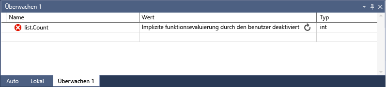

# <a name="watch-variables-with-watch-windows-and-quickwatch"></a>Beobachten Sie Variablen mit überwachen und Schnellüberwachung

Während des Debuggens, können Sie **Watch** Windows und **Schnellüberwachung** , Variablen und Ausdrücke zu beobachten. Die Windows sind nur verfügbar, während einer Debugsitzung.

**Sehen Sie sich** Windows können mehrere Variablen zu einem Zeitpunkt während des Debuggens angezeigt. Die **Schnellüberwachung** Dialogfeld zeigt eine einzelne Variable an, und muss geschlossen werden, bevor Sie mit dem Debuggen fortfahren kann.

Wenn dies das erste Mal, die Sie versucht haben ist, um Code zu debuggen, sollten Sie lesen [Debuggen für absolute Anfänger](../debugger/debugging-absolute-beginners.md) und [Debuggen, Techniken und Tools](../debugger/write-better-code-with-visual-studio.md) , bevor Sie diesen Artikel durchgehen.

## <a name="observe-variables-with-a-watch-window"></a>Beobachten Sie Variablen mit einem Überwachungsfenster

Sie können mehrere öffnen **sehen Sie sich** Fenster und beobachten Sie mehr als eine Variable in einer **sehen Sie sich** Fenster.

Um beispielsweise eine Überwachung auf den Werten festgelegt `a`, `b`, und `c` in den folgenden Code:

```C++
int main()
{
    int a, b, c;
    a = 1;
    b = 2;
    c = 0;

    for (int i = 0; i < 10; i++)
    {
        a++;
        b *= 2;
        c = a + b;
    }

    return 0;
}

```

1. Legen Sie einen Haltepunkt auf der `c = a + b;` Zeile durch Klicken auf den linken Rand auswählen **Debuggen** > **Haltepunkt ein/aus**, oder drücken Sie **F9**.

1. Starten Sie das Debuggen durch, wählen Sie die grüne **starten** Pfeil oder **Debuggen** > **Debuggen starten**, oder drücken Sie **F5**. Die Ausführung hält am Haltepunkt.

1. Öffnen einer **Watch** Fenster durch Auswahl **Debuggen** > **Windows** > **sehen Sie sich**  >   **Überwachen 1**, oder drücken Sie **STRG**+**Alt**+**W** > **1**.

   Sie können zusätzliche öffnen **Watch** Windows dazu Windows **2**, **3**, oder **4**.

1. In der **Watch** für Fenster, wählen Sie eine leere Zeile und Variablen vom Typ `a`. Gleiches gilt für `b` und `c`.

   

1. Fortfahren, Debuggen, indem Sie die Auswahl **Debuggen** > **Einzelschritt** oder durch Drücken **F11** je nach Bedarf, um fortzufahren. Die Variablenwerte den **Überwachen** Fenster ändern, beim Durchlaufen der `for` Schleife.

>[!NOTE]
>Für C++,
>- Sie müssen möglicherweise qualifizieren Sie den Kontext eines Variablennamens oder ein Ausdruck, der einen Variablennamen verwendet. Der Kontext ist die Funktion, Quelldatei oder Modul, in dem eine Variable enthalten ist. Wenn Sie den Kontext qualifizieren müssen, verwenden Sie die [Kontextoperator (C++)](../debugger/context-operator-cpp.md) -Syntax in der **Namen** in die **sehen Sie sich** Fenster.
>
>- Sie können Registernamen und Variablennamen mit hinzufügen  **$ \<registrieren&nbsp;Name >** oder  **@ \<registrieren&nbsp;Name >** auf die **Namen** in der **Watch** Fenster. Weitere Informationen finden Sie unter [Pseudovariables](../debugger/pseudovariables.md).

## <a name="use-expressions-in-a-watch-window"></a>Verwenden von Ausdrücken in einem Fenster "überwachen"

Sie können beobachten, dass jeder gültigen Ausdruck erkannt, durch den Debugger in einem **sehen Sie sich** Fenster.

Z. B. für den Code im vorherigen Abschnitt erhalten Sie den Mittelwert der drei Werte durch Eingabe `(a + b + c) / 3` in die **Watch** Fenster:


Die Regeln zum Auswerten von Ausdrücken in der **Watch** Fenster sind in der Regel die Regeln zum Auswerten von Ausdrücken in der Codesprache identisch. Wenn ein Ausdruck einen Syntaxfehler aufweist, erwarten Sie den gleichen Compilerfehler wie im Code-Editor. Ein Tippfehler im vorhergehenden Ausdruck erzeugt z. B. diesen Fehler in der **Watch** Fenster:


Ein Kreis mit zwei Wellenlinien Symbol darf in der **Watch** Fenster. Dieses Symbol weist darauf hin, dass der Debugger der Ausdruck aufgrund einer möglichen threadübergreifenden Abhängigkeit nicht. Auswertung des Codes muss andere Threads in Ihrer app vorübergehend ausgeführt, aber da Sie sich im Unterbrechungsmodus befinden, werden alle Threads in Ihrer app in der Regel beendet. Vorübergehende Ausführung anderer Threads zugelassen haben unerwartete Auswirkungen auf den Status Ihrer app, und der Debugger können Ereignisse wie z. B. Haltepunkte und Ausnahmen für diese Threads zu ignorieren.

::: moniker range=">= vs-2019" 
## <a name="search-in-the-watch-window"></a>Suchen Sie in das Fenster "überwachen"

Sie können nach Schlüsselwörtern in den Spalten für Name, Wert und Typ der suchen die **Überwachen** Fenster über die Suchleiste oben jedes Fenster. Drücken Sie die EINGABETASTE, oder wählen Sie einen der Pfeile, um eine Suche auszuführen. Um einen laufenden Suchvorgang abzubrechen, wählen Sie das Symbol "X" in der Suchleiste ein.

Verwenden Sie die Pfeile nach links und rechts (UMSCHALT + F3 und F3, bzw.) finden Sie zum Navigieren zwischen entspricht.


Um Ihre Suche mehr oder weniger umfassend und nutzen die **umfassendere Suche** Dropdownliste am oberen Rand der **sehen Sie sich** Fenster auswählen, wie viele Ebenen soll in geschachtelten Objekten. 

::: moniker-end

### <a name="bkmk_refreshWatch"></a> Aktualisieren von Überwachungswerten

Möglicherweise ein Aktualisierungssymbol (kreisförmigen Pfeil) angezeigt, der **Watch** anzeigen, wenn ein Ausdruck ausgewertet wird. Das Symbol "Aktualisieren" gibt an, einen Fehler oder ein Wert, der nicht mehr aktuell ist.

Um den Wert zu aktualisieren, wählen Sie das Symbol zum Aktualisieren oder drücken Sie die LEERTASTE. Der Debugger versucht, den Ausdruck neu auszuwerten. Allerdings darf nicht möchten oder können den Ausdruck, abhängig davon, warum der Wert ausgewertet wurde nicht neu auswerten.

Zeigen Sie auf das Symbol zum Aktualisieren oder finden Sie unter den **Wert** Spalte für den Grund der Ausdruck wurde nicht ausgewertet. Dies kann u.a. folgende Gründe haben:

- Der Ausdruck ausgewertet wird wurde, wie im vorherigen Beispiel ist ein Fehler aufgetreten. Ein Timeout auftreten kann, oder eine Variable außerhalb des gültigen Bereichs.

- Der Ausdruck hat einen Funktionsaufruf, der einen Nebeneffekt in der app auslösen könnten. Finden Sie unter [Ausdruck Nebeneffekte](#bkmk_sideEffects).

- Automatische Auswertung von Eigenschaften und implizite Funktionsaufrufe deaktiviert ist.

Wenn das Aktualisierungssymbol angezeigt wird, da die automatische Auswertung von Eigenschaften und implizite Funktionsaufrufe deaktiviert ist, können Sie es aktivieren, durch Auswahl **eigenschaftenauswertung und andere implizite Funktionsaufrufe** in **Tools**   >  **Optionen** > **Debuggen** > **allgemeine**.

Um zu veranschaulichen, verwenden das Symbol zum Aktualisieren:

1. In **Tools** > **Optionen** > **Debuggen** > **allgemeine**, deaktivieren Sie die **Eigenschaftenauswertung und andere implizite Funktionsaufrufe** Kontrollkästchen.

1. Geben Sie den folgenden Code, und klicken Sie in der **Watch** Fenster Festlegen eines überwachungselements für die `list.Count` Eigenschaft.

   ```csharp
   static void Main(string[] args)
   {
       List<string> list = new List<string>();
       list.Add("hello");
       list.Add("goodbye");
   }
   ```

1. Beginnen Sie mit dem Debuggen. Die **Watch** Fenster zeigt beispielsweise die folgende Meldung:

   

1. Um den Wert zu aktualisieren, wählen Sie das Symbol zum Aktualisieren oder drücken Sie die LEERTASTE. Der Debugger wertet den Ausdruck.

### <a name="bkmk_sideEffects"></a> Ausdruck Nebeneffekte

Die Auswertung bestimmter Ausdrücke kann ändern Sie den Wert einer Variablen, oder andernfalls Auswirkungen auf den Status Ihrer App. Die Auswertung des folgenden Ausdrucks ändert beispielsweise den Wert von `var1`:

```csharp
var1 = var2
```

Dieser Code kann dazu führen, dass eine [Nebeneffekt](https://en.wikipedia.org/wiki/Side_effect_\(computer_science\)). Nebeneffekte können Sie das Debuggen erschwert durch Ändern der, für Ihre app ausgeführt wird.

Ein Ausdruck mit Nebeneffekten wird nur einmal bei der ersten Eingabe ausgewertet. Der Ausdruck im abgeblendet erscheint die **sehen Sie sich** Fenster und weiteren auswertungen sind deaktiviert. Die QuickInfo oder **Wert** Spalte wird erläutert, dass der Ausdruck einen Nebeneffekt bewirkt. Sie können eine erneute Auswertung erzwingen, wählen Sie das Symbol "Aktualisieren", das neben dem Wert angezeigt wird.

Werden, dass eine Möglichkeit, die die Bezeichnung Nebeneffekte zu verhindern, dass die automatische funktionsauswertung zu deaktivieren. In **Tools** > **Optionen** > **Debuggen** > **allgemeine**, deaktivieren Sie **Eigenschaftenauswertung und andere implizite Funktionsaufrufe**.

Für C# nur, wenn die Auswertung von Eigenschaften oder impliziten Funktionen deaktiviert ist, Sie können die Auswertung erzwingen durch Hinzufügen der **Ac** Formatmodifizierers auf eine Variable **Namen** in die **ansehen**  Fenster. Weitere Informationen finden Sie unter [Formatieren von Spezifizierern in C#](../debugger/format-specifiers-in-csharp.md).

## <a name="bkmk_objectIds"></a> Verwenden von Objekt-IDs in das Fenster "überwachen" (C# und Visual Basic)

Manchmal möchten Sie das Verhalten eines bestimmten Objekts beobachten. Beispielsweise empfiehlt es sich um ein Objekt, das auf eine lokale Variable verweist, nachdem diese Variable den Gültigkeitsbereich verlassen hat nachzuverfolgen. In C# und Visual Basic können Sie Objekt-IDs für bestimmte Instanzen von Verweistypen erstellen und diese im Fenster **Überwachen** und in Haltepunktbedingungen verwenden. Die Objekt-ID wird von den Debugdiensten der CLR (Common Language Runtime) generiert und dem Objekt zugeordnet.

> [!NOTE]
> Objekt-IDs erstellen weak-Verweise, die das Objekt nicht nicht von der Garbage collection. Sie gelten nur für die aktuelle Debugsitzung.

In den folgenden Code der `MakePerson()` -Methode erstellt eine `Person` Verwenden einer lokalen Variablen:

```csharp
class Person
{
    public Person(string name)
    {
        Name = name;
    }
    public string Name { get; set; }
}

public class Program
{
    static List<Person> _people = new List<Person>();
    public static void Main(string[] args)
    {
        MakePerson();
        DoSomething();
    }

    private static void MakePerson()
    {
        var p = new Person("Bob");
        _people.Add(p);
    }

    private static void DoSomething()
    {
        // more processing
         Console.WriteLine("done");
    }
}
```

Um herauszufinden, den Namen des der `Person` in die `DoSomething()` -Methode können Sie einen Verweis zum Hinzufügen der `Person` Objekt-ID in der **sehen Sie sich** Fenster.

1. Legen Sie einen Haltepunkt im Code hinter der `Person` Objekt erstellt wurde.

1. Beginnen Sie mit dem Debuggen.

1. Wenn die Ausführung am Haltepunkt angehalten wird, öffnen Sie die **"lokal"** durch auswählen **Debuggen** > **Windows** > **"lokal"**.

1. In der **"lokal"** Fenster mit der rechten Maustaste die `Person` Variable, und wählen **Objekt-ID**.

   Daraufhin sollte ein Dollarzeichen (**$**) plus eine Zahl in die **"lokal"** Fenster, in dem der Objekt-ID handelt.

1. Fügen Sie den Objekt-ID, die **Watch** Fenster, indem Sie mit der rechten Maustaste die Objekt-ID und auswählen **Überwachung hinzufügen**.

1. Legen Sie einen weiteren Haltepunkt in der `DoSomething()` Methode.

1. Debuggen fortsetzen. Wenn die Ausführung wird angehalten, der `DoSomething()` -Methode, die **sehen Sie sich** Fenster zeigt die `Person` Objekt.

   > [!NOTE]
   > Wenn Sie die Eigenschaften des Objekts, z. B. anzeigen möchten `Person.Name`, müssen Sie dazu die eigenschaftenauswertung aktivieren **Tools** > **Optionen**  >   **Debuggen von** > **allgemeine** > **eigenschaftenauswertung und andere implizite Funktionsaufrufe**.

## <a name="dynamic-view-and-the-watch-window"></a>Dynamische Ansicht und das Fenster "überwachen"

Einige Skriptsprachen (z. B. JavaScript oder Python) verwenden eine dynamische oder [Duck](https://en.wikipedia.org/wiki/Duck_typing) eingeben und die .NET 4.0 und höher unterstützt die Objekte, die nur schwer in den normalen Debugfenstern beobachten.

Die **Watch** Fenster zeigt diese Objekte als dynamische Objekte, die aus Typen erstellt werden, die implementieren die <xref:System.Dynamic.IDynamicMetaObjectProvider> Schnittstelle. Dynamische Objektknoten die dynamischen Member des dynamischen Objekten anzeigen, aber nicht zulassen Bearbeitung der Memberwerte.

Aktualisieren **dynamische Ansicht** Werte, die auf die [Aktualisierungssymbol](#bkmk_refreshWatch) neben dem Knoten des dynamischen Objekts.

Zur Anzeige der **dynamische Ansicht** für ein Objekt hinzufügen eine **dynamische** Formatbezeichner nach dem Namen des dynamischen Objekts in der **Watch** Fenster:

- Für C#: `ObjectName, dynamic`
- Für Visual Basic: `$dynamic, ObjectName`

>[!NOTE]
>- Die C# Debugger nicht automatisch erneut auswerten, die Werte in der **dynamische Ansicht** Wenn Sie wechseln zur nächsten Zeile des Codes.
>- Der Debugger von Visual Basic automatisch aktualisiert wird, Ausdrücke, die hinzugefügt werden, über die **dynamische Ansicht**.
>- Wenn Sie die Member einer **dynamischen Ansicht** auswerten, kann das zu [Nebenwirkungen](https://en.wikipedia.org/wiki/Side_effect_\(computer_science\)) führen.

**Wenn Sie eine neue Überwachung einfügen wandelt Variable, die ein Objekt in ein dynamisches Objekt:**

1. Mit der rechten Maustaste ein untergeordnetes Element eine **dynamische Ansicht**.
1. Wählen Sie **Überwachung hinzufügen**. Die `object.name` wird `((dynamic) object).name` und wird in einem neuen **Watch** Fenster.

Der Debugger sowie eine **dynamische Ansicht** untergeordneten Knoten des Objekts, das die **"Auto"** Fenster. Zum Öffnen der **"Auto"** wählen Sie im Fenster während des Debuggens **Debuggen** > **Windows** > **"Auto"**.

**Dynamische Ansicht** verbessert auch Debuggen für COM-Objekte. Wenn der Debugger erreicht, um ein COM-Objekt, das umschlossen **System. __ComObject**, fügt es einer **dynamische Ansicht** Knoten für das Objekt.

## <a name="observe-a-single-variable-or-expression-with-quickwatch"></a>Beachten Sie, eine einzelne Variable oder einen Ausdruck, Fenster "schnellüberwachung"

Sie können **Schnellüberwachung** auf eine einzelne Variable zu beobachten.

Beispielsweise den folgenden Code:

```csharp
static void Main(string[] args)
{
    int a, b;
    a = 1;
    b = 2;
    for (int i = 0; i < 10; i++)
    {
        a = a + b;
    }
}
```

Beobachten der `a` -Variable

1. Legen Sie einen Haltepunkt in der Zeile `a = a + b;` fest.

1. Beginnen Sie mit dem Debuggen. Die Ausführung hält am Haltepunkt.

1. Wählen Sie die Variable `a` im Code.

1. Wählen Sie **Debuggen** > **Schnellüberwachung**, drücken Sie die **UMSCHALT**+**F9**, oder mit der rechten Maustaste, und wählen Sie **Schnellüberwachung**.

   Die **Schnellüberwachung** Dialogfeld wird angezeigt. Die `a` Variable befindet sich in der **Ausdruck** Feld mit einem **Wert** von **1**.

   

1. Geben Sie zum Auswerten eines Ausdrucks, mit der Variable einen Ausdruck ein, z. B. `a + b` in die **Ausdruck** , und wählen Sie **neu auswerten**.

   

1. Hinzufügen von Variablen oder des Ausdrucks aus **Schnellüberwachung** auf die **sehen Sie sich** wählen Sie im Fenster **Überwachung hinzufügen**.

1. Wählen Sie **schließen** schließen die **Schnellüberwachung** Fenster. (**Schnellüberwachung** modales Dialogfeld ist, damit Sie Debugvorgang nicht fortsetzen, solange sie geöffnet ist.)

1. Debuggen fortsetzen. Sie können beobachten, dass die Variable in der **Watch** Fenster.

## <a name="see-also"></a>Siehe auch
- [Was bedeutet „Debuggen“?](../debugger/what-is-debugging.md)
- [Debugging techniques and tools (Debugverfahren und -tools)](../debugger/write-better-code-with-visual-studio.md)
- [Ein erster Blick auf das Debuggen](../debugger/debugger-feature-tour.md)
- [Debuggerfenster](../debugger/debugger-windows.md)
