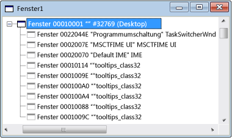

# Fensteransicht
Wenn Sie erstmalig Spy++ öffnen, zeigt Fensteransicht eine Struktur mit allen Windows- und Steuerelemente im System an. Der Fenstername Handle- und Klasse werden angezeigt. Das aktuelle Desktopfenster wird am oberen Rand der Struktur. Alle anderen Fenster sind untergeordnete Elemente des Desktops und anhand der Hierarchie Standardfenster aufgeführt sind. Nebengeordnete Fenster werden in erweiterbaren Listen unter ihre übergeordneten Elemente eingezogen angezeigt.  
  
 Die folgende Abbildung zeigt eine typische Spy++-Fensteransicht mit den obersten Knoten erweitert.  
  
   
Spy++-Fensteransicht  
  
 Das aktuelle Desktopfenster wird am oberen Rand der Struktur. Alle anderen Fenster sind untergeordnete Elemente des Desktops, und werden anhand der Hierarchie Standardfenster mit nebengeordnete Fenster nach Z-Reihenfolge geordnet aufgeführt. Sie können erweitern oder reduzieren Sie einen beliebigen übergeordneten Knoten der Struktur, indem Sie auf das + oder - Symbol neben dem Knoten.  
  
 Wenn Fensteransicht den Fokus besitzt, können Sie das Suchtool in der [Fenster-Dialogfeld "Fenstersuche"](../debugger/window-search-dialog-box.md) zum Anzeigen von Informationen aus einem beliebigen geöffneten Fenster auf Ihrem System.  
  
## In diesem Abschnitt  
 [Gewusst wie: Verwenden des Suchtools](../debugger/how-to-use-the-finder-tool.md)  
 Zeigt an, wie dieses Tool-Fenster für die Eigenschaften oder Nachrichten überprüft.  
  
 [Gewusst wie: Suchen nach einem Fenster in der Fensteransicht](../debugger/how-to-search-for-a-window-in-windows-view.md)  
 Erläutert, wie ein bestimmtes Fenster in der Fensteransicht gefunden.  
  
 [Vorgehensweise: Anzeigen von Fenstereigenschaften](../debugger/how-to-display-window-properties.md) m  
 Verfahren zum Öffnen des Dialogfelds Eigenschaften.  
  
## Verwandte Abschnitte  
 [Spy++-Ansichten](../debugger/spy-increment-views.md)  
 Erläutert die Spy++-Strukturansichten von Windows, Nachrichten, Prozesse und Threads an.  
  
 [Verwenden von Spy++](../debugger/using-spy-increment.md)  
 Führt das Tool Spy++ und erläutert, wie sie verwendet werden kann.  
  
 [Dialogfeld "Fenster suchen"](../debugger/find-window-dialog-box.md)  
 Zum Anzeigen der Eigenschaften oder Nachrichten von einem bestimmten Fenster verwendet.  
  
 [Dialogfeld "Fenstersuche"](../debugger/window-search-dialog-box.md)  
 So suchen Sie den Knoten für ein bestimmtes Fenster in der Fensteransicht verwendet.  
  
 [Fenstereigenschaften (Dialogfeld)](../debugger/window-properties-dialog-box.md)  
 Verwendet zum Anzeigen der Eigenschaften eines Fensters, in der Fensteransicht ausgewählt.  
  
 [Spy++-Referenz](../debugger/spy-increment-reference.md)  
 Enthält Abschnitte beschreiben die einzelnen Spy++-Menü und das Dialogfeld.