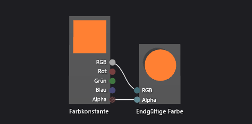

# Vorgehensweise: Erstellen eines einfachen Farbshaders

In diesem Artikel wird erläutert, wie der Shader-Designer und die Directed Graph Shader Language (DGSL) zum Erstellen eines flachen Farbshaders verwendet wird. Dieser Shader legt die endgültige Farbe auf einen konstanten RGB-Farbwert fest.

## Erstellen eines flachen Farbshaders

Sie können einen flachen Farbshader implementieren, indem Sie die Farbwerte einer RGB-Farbkonstante in die endgültige Ausgabefarbe schreiben.

Bevor Sie beginnen, stellen Sie sicher, dass das Fenster **Eigenschaften** und die **Toolbox** angezeigt werden.

1. Erstellen Sie einen DGSL-Shader, mit dem Sie arbeiten können. Wie Sie dem Projekt einen DGSL-Shader hinzufügen, erfahren Sie im Abschnitt „Erste Schritte“ unter [Shader-Designer](../designers/shader-designer.md)

2. Löschen Sie den Knoten **Punktfarbe**. Verwenden Sie das Tool **Auswählen**, um den Knoten **Punktfarbe** auszuwählen, und klicken Sie anschließend in der Menüleiste auf **Bearbeiten** > **Entfernen**.

3. Fügen Sie einen Knoten **Farbkonstante** zum Diagramm hinzu. Klicken Sie in der **Toolbox** unter **Konstanten** auf **Farbkonstante**, und verschieben Sie es auf die Entwurfsoberfläche.

4. Geben Sie einen Farbwert für den Knoten **Farbkonstante** an. Verwenden Sie das Tool **Auswählen**, um den Knoten **Farbkonstante** auszuwählen, und geben Sie anschließend im Fenster **Eigenschaften** unter der Eigenschaft **Ausgabe** einen Farbwert an. Geben Sie für Orange einen Wert von (1.0, 0,5, 0,2, 1.0) an.

5. Verbinden Sie die Farbkonstante mit der endgültigen Farbe. Verschieben Sie das Terminal **RGB** des Knotens **Farbkonstante** auf das Terminal **RGB** des Knotens **Endgültige Farbe**, um die Verbindungen zu herzustellen. Verschieben Sie anschließend das Terminal **Alpha** des Knotens **Farbkonstante** auf das Terminal **Alpha** des Knotens **Endgültige Farbe**. Diese Verbindungen legen die endgültige Farbe auf die Farbkonstante fest, die im vorherigen Schritt definiert wurde.

In der folgenden Abbildung wird das fertige Shader-Diagramm sowie eine Vorschau eines Würfels gezeigt, auf dem der Shader angewandt wurde.

> [!NOTE]
> In der Abbildung wurde eine orangene Farbe angegeben, um den Effekt des Shaders besser zu veranschaulichen.

Bestimmte Formen sorgen vielleicht für bessere Vorschauen für einige Shader. Weitere Informationen zur Verwendung der Vorschau von Shadern im Shader-Designer finden Sie unter [Shader-Designer](../designers/shader-designer.md).

## Siehe auch

- [Vorgehensweise: Anwenden eines Shaders auf ein 3D-Modell](../designers/how-to-apply-a-shader-to-a-3-d-model.md)
- [Vorgehensweise: Exportieren eines Shaders](../designers/how-to-export-a-shader.md)
- [Shader-Designer](../designers/shader-designer.md)
- [Shader-Designer-Knoten](../designers/shader-designer-nodes.md)