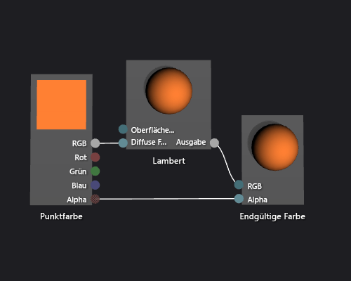

# Vorgehensweise: Erstellen eines einfachen Lambert-Shaders

In diesem Artikel wird erläutert, wie der Shader-Designer und die Directed Graph Shader Language (DGSL) zum Erstellen eines Beleuchtungsshaders verwendet wird, der das klassische Lambert-Beleuchtungsmodell implementiert.

## Das Lambert-Beleuchtungsmodell

Das Lambert-Beleuchtungsmodell umfasst diffuses Licht und eine Umgebungsbeleuchtung, um Objekte in einer 3D-Szene zu schattieren. Die Umgebungskomponenten sorgen für die Basis der Beleuchtung in der 3D-Szene. Die Richtungskomponente sorgen für zusätzliche Beleuchtung von einer gerichteten (weit entfernten) Lichtquelle. Umgebungsbeleuchtung wirkt sich auf alle Oberflächen in der Szene gleich aus, unabhängig von deren Ausrichtung. Für eine bestimmte Oberfläche ist es ein Produkt aus der Umgebungsfarbe der Oberfläche sowie der Farbe und Intensität des Umgebungslichts in der Szene. Gerichtete Beleuchtung wirkt sich auf jede Oberfläche in der Szene unterschiedlich aus, je nach Ausrichtung der Oberfläche in Bezug auf die Richtung der Lichtquelle. Es ist ein Produkt aus der diffusen Farbe und Ausrichtung der Oberfläche sowie der Farbe, Intensität und Ausrichtung der Lichtquelle. Oberflächen, die direkt auf die Lichtquelle zeigen, erhalten die maximale Einwirkung, während Oberflächen, die direkt weg zeigen, keine Einwirkung erhalten. Unter dem Lambert-Beleuchtungsmodell werden die Umgebungskomponente und eine oder mehrere Richtungskomponenten kombiniert, um die gesamte diffuse Farbeinwirkung für jeden Punkt am Objekt festzulegen.

Bevor Sie beginnen, stellen Sie sicher, dass das Fenster **Eigenschaften** und die **Toolbox** angezeigt werden.

1.  Erstellen Sie einen DGSL-Shader, um mit diesem zu arbeiten. Wie Sie dem Projekt einen DGSL-Shader hinzufügen, erfahren Sie im Abschnitt „Erste Schritte“ unter [Shader-Designer](../designers/shader-designer.md)

2.  Trennen Sie den Knoten **Farbpunkt** vom Knoten **Endgültige Farbe**. Klicken Sie auf das Terminal **RGB** des Knotens **Farbpunkt** und anschließend auf **Link aufheben**. Lassen Sie das Terminal **Alpha** verbunden.

3.  Fügen Sie einen Knoten **Lambert** in das Diagramm ein. Klicken Sie in der **Toolbox** unter **Hilfsprogramme** auf **Lambert**, und verschieben Sie es auf die Entwurfsoberfläche. Der Lambert-Knoten berechnet anhand der Umgebungs- und diffusen Lichtparameter die gesamte diffuse Lichteinwirkung des Pixels.

4.  Verbinden Sie den Knoten **Farbpunkt** mit dem Knoten **Lambert**. Verschieben Sie im Modus **Auswählen** das Terminal **RGB** des Knotens **Farbpunkt** auf das Terminal **Diffuses Licht** des Knotens **Lambert**. Diese Verbindung versorgt den Lambert-Knoten mit der interpolierten diffusen Farbe des Pixels.

5.  Verbinden Sie den berechneten Farbwert mit der endgültige Farbe. Verschieben Sie das Terminal **Ausgabe** des Knotens **Lambert** auf das Terminal **RGB** des Knotens **Endgültige Farbe**.

 In der folgenden Abbildung wird das fertige Shader-Diagramm sowie eine Vorschau eines Teekannenmodells gezeigt, auf dem der Shader angewandt wurde.

> [!NOTE]
> Es wurde eine orangene Farbe durch die Verwendung des Parameters **MaterialDiffuse** des Shaders angegeben, um den Effekt des Shaders in dieser Abbildung besser veranschaulichen. Ein Spiel oder eine Anwendung kann diesen Parameter verwenden, um für jedes Objekt einen eindeutigen Farbwert bereitzustellen. Weitere Informationen zu Materialparameter finden Sie im Abschnitt „Vorschau von Shadern verwenden“ unter [Shader-Designer](../designers/shader-designer.md).

 

 Bestimmte Formen sorgen vielleicht für bessere Vorschauen für einige Shader. Weitere Informationen zur Verwendung der Vorschau von Shadern im Shader-Designer finden Sie im Abschnitt „Vorschau von Shadern verwenden“ unter [Shader-Designer](../designers/shader-designer.md).

 In der folgenden Abbildung wird der auf ein 3D-Modell angewendete Shader dargestellt, der in diesem Dokument beschrieben wurde.

 

 Weitere Informationen zum Anwenden eines Shaders auf ein 3D-Modell finden Sie unter [Vorgehensweise: Anwenden eines Shaders auf ein 3D-Modell](../designers/how-to-apply-a-shader-to-a-3-d-model.md).

## Siehe auch

- [Vorgehensweise: Anwenden eines Shaders auf ein 3D-Modell](../designers/how-to-apply-a-shader-to-a-3-d-model.md)
- [Gewusst wie: Exportieren eines Shaders](../designers/how-to-export-a-shader.md)
- [Gewusst wie: Erstellen eines standardmäßigen Phong-Shaders](../designers/how-to-create-a-basic-phong-shader.md)
- [Shader-Designer](../designers/shader-designer.md)
- [Shader-Designer-Knoten](../designers/shader-designer-nodes.md)