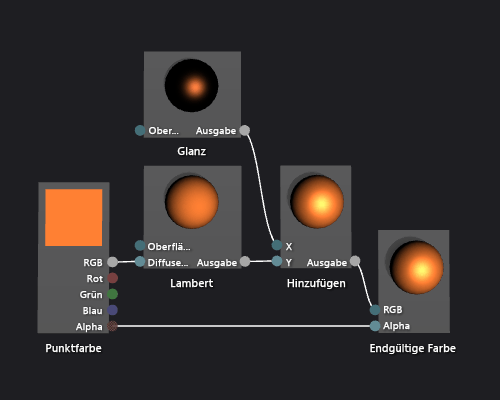

# Gewusst wie: Erstellen eines standardm&#228;&#223;igen Phong-Shaders
[!INCLUDE[vs2017banner](../code-quality/includes/vs2017banner.md)]

Dieses Dokument veranschaulicht, wie Sie den Shader\-Designer und die Directed Graph Shader Language \(DGSL\) verwenden, um einen Beleuchtungs\-Shader zu erstellen, der das klassische Phong\-Beleuchtungsmodell implementiert.  
  
 In diesem Dokument werden die folgenden Aktivitäten veranschaulicht:  
  
-   Hinzufügen von Knoten einem Shaderdiagramm  
  
-   Trennen von Knoten  
  
-   Knoten verbinden  
  
## Das Phong\-Beleuchtungsmodell  
 Das Phong\-Beleuchtungsmodell erweitert das Lambert\-Beleuchtungsmodell um Glanzlichter, die die reflektierenden Eigenschaften einer Oberfläche simulieren.  Die Glanzlichtkomponente bietet eine zusätzliche Beleuchtung aus denselben direktionalen Lichtquellen, die im Lambert\-Beleuchtungsmodell verwendet werden, jedoch ist sein Beitrag zur endgültigen Farbe ist anders verarbeitet.  Glanzlichter hat auf jede Oberfläche in der Szene anders, je nach Beziehung zwischen der Ansichtsrichtung, der Richtung der Lichtquellen und Ausrichtung der Oberfläche.  Sie ergeben sich aus der Glanzlichtfarbe, der Glanzlichtstärke und der Ausrichtung der Oberfläche und der Farbe, Intensität und Richtung der Lichtquellen.  Oberflächen, die die Lichtquelle direkt beim Betrachter reflektieren, erhalten die maximale Spiegelbeitrag und Oberflächen, die die Lichtquelle weg vom Betrachter reflektieren, erhalten keine Glanzlichter.  Im Phong\-Beleuchtungsmodell werden eine oder mehrere Glanzlichterkomponenten kombiniert, um die Farbe und die Intensität der Glanzlichter an jedem Punkt auf dem Objekt zu ermitteln und sie zum Ergebnis des Lambert\-Beleuchtungsmodells hinzuzufügen, um die endgültige Farbe des Pixels zu erzeugen.  
  
 Weitere Informationen zum Lambert\-Beleuchtungsmodell finden Sie unter [Gewusst wie: Erstellen eines Lambert\-Shaders](../designers/how-to-create-a-basic-lambert-shader.md).  
  
 Bevor Sie beginnen, stellen Sie sicher, dass das Fenster **Eigenschaften** und der **Werkzeugkasten** angezeigt werden.  
  
#### So erstellen Sie einen Phong\-Shader  
  
1.  Erstellen Sie einen Lambert\-Shader, wie in [Gewusst wie: Erstellen eines Lambert\-Shaders](../designers/how-to-create-a-basic-lambert-shader.md) beschrieben.  
  
2.  Trennen Sie den Knoten **Lambert** vom Knoten **Endgültige Farbe**.  Wählen Sie das **RGB** Terminal des Knotens **Lambert**, und dann **Zeilen umbrechen** aus.  Dadurch wird Platz für den Knoten geschaffen, der im nächsten Schritt hinzugefügt wird.  
  
3.  Fügen Sie einem Knoten **Hinzufügen** Diagramm hinzu.  In **Werkzeugkasten** unter **Berechnungen**, wählen Sie **Hinzufügen** aus und verschieben Sie es auf die Entwurfsoberfläche.  
  
4.  Fügen Sie dem Diagramm den Knoten **Glanz** hinzu.  Wählen Sie im **Werkzeugkasten** unter **Hilfsprogramm** das Werkzeug **Glanz** aus, und verschieben Sie es auf die Entwurfsoberfläche.  
  
5.  Fügen Sie Glanzlichter hinzu.  Verschieben Sie das **Ausgabe** Terminal des Knotens **Glanz** auf das Terminal **X** des Knotens **Hinzufügen**, und verschieben Sie das **Ausgabe** Terminal des Knotens **Lambert** auf das Terminal **Y** des Knotens **Hinzufügen**.  Diese Verbindungen kombinieren sich Rechnen diffuse die auf und Glanzfarbenbeiträge zum Pixel.  
  
6.  Verbinden Sie den berechneten Farbwert mit der endgültigen Farbe.  Verschieben Sie das **Ausgabe** Terminal des Knotens **Hinzufügen** auf das Terminal **RGB** des Knotens **Endgültige Farbe**.  
  
 Die folgende Abbildung zeigt das endgültige Shaderdiagramm und eine Vorschau des auf das Teekannenmodell angewendeten Shaders.  
  
> [!NOTE]
>  Um die Wirkung des Shaders in dieser Abbildung besser zu veranschaulichen, wurde eine orangefarbene Farbe verwendet wurde mit dem Parameter **MaterialDiffuse** des Shader verwendete, und ein metallisch\-aussehendes Ende angegeben wurde indem die **MaterialSpecular** und **MaterialSpecularPower**\-Parameter verwendet.  Informationen zu passen Parameter, finden Sie Befehlsvorschau Shaderabschnitt in [Shader\-Designer](../designers/shader-designer.md).  
  
   
  
 Für einige Shader erzielen Sie mit bestimmte Formen möglicherweise bessere Vorschauen.  Weitere Informationen dazu, wie von Shadern im Shader\-Designer, finden Sie Befehlsvorschau Shaderabschnitt in [Shader\-Designer](../designers/shader-designer.md) in der Vorschau angezeigt  
  
 Die folgende Abbildung zeigt den in diesem Dokument beschriebenen Shader, der auf ein 3D\-Modell angewendet wurde.  Die Eigenschaft **MaterialSpecular** ist auf \(1.00, 0.50, 0.20, 0.00\) festgelegt und die Eigenschaft **MaterialSpecularPower** auf 16.  
  
> [!NOTE]
>  Die Eigenschaft **MaterialSpecular** bestimmt die Art des dargestellten Oberflächenmaterials.  Eine Hochglanzoberfläche wie Glas oder Plastik hat eine helle, weiße Glanzfarbe.  Eine metallische Oberfläche hat eine Glanzfarbe, die ihrer diffusen Farbe ähnlich ist.  Eine Satin\-ähnliche Oberfläche hat eine dunkelgraue Glanzfarbe.  
>   
>  Die Eigenschaft **MaterialSpecularPower** bestimmt, wie intensiv die Glanzlichter sind.  Hohe Werte simulieren stumpfere, lokalisierte Glanzlichter.  Sehr niedrig die Werte simulieren intensive, auffällige Glanzlichter, die oversaturate und Farbe der Ganzoberfläche zu reduzieren können.  
  
   
  
 Weitere Informationen zum Anwenden eines Schaders in einem 3D\-Modell finden Sie unter [Gewusst wie: Anwenden eines Shaders auf ein 3D\-Modell](../designers/how-to-apply-a-shader-to-a-3-d-model.md).  
  
## Siehe auch  
 [Gewusst wie: Anwenden eines Shaders auf ein 3D\-Modell](../designers/how-to-apply-a-shader-to-a-3-d-model.md)   
 [Gewusst wie: Exportieren eines Shaders](../designers/how-to-export-a-shader.md)   
 [Gewusst wie: Erstellen eines Lambert\-Shaders](../designers/how-to-create-a-basic-lambert-shader.md)   
 [Shader\-Designer](../designers/shader-designer.md)   
 [Shader\-Designer\-Knoten](../designers/shader-designer-nodes.md)