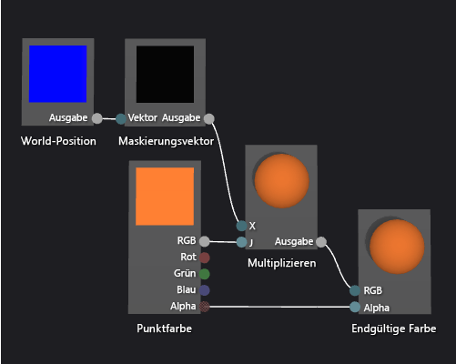

# Vorgehensweise: Erstellen eines geometriebasierten Farbverlauf-Shaders

In diesem Artikel wird erläutert, wie der Shader-Designer und die Directed Graph Shader Language zum Erstellen eines geometriebasierten Farbverlauf-Shaders verwendet wird. Dieser Shader skaliert einen konstanten RGB-Farbwert anhand der Höhe von jedem Punkt eines Objekts im Raum.

## Erstellen eines geometriebasierten Farbverlauf-Shaders

Sie können einen geometriebasierten Farbverlauf-Shader implementieren, indem Sie die Position des Pixels in Ihrem Shader aufnehmen. Ein Pixel enthält in Shadersprachen mehr Informationen als nur seine Farbe und Position auf einem 2D-Bildschirm. Ein Pixel, das als ein *Fragment* in manchen Systemen bekannt ist, ist eine Auflistung von Werten, das die Oberfläche beschreibt, die einem Pixel entspricht. Der Shader, der in diesem Dokument beschrieben wird, nutzt die Höhe der einzelnen Pixel eines 3D-Objekts im Raum, um die endgültige Ausgabe des Fragments zu beeinflussen.

Bevor Sie beginnen, stellen Sie sicher, dass das Fenster **Eigenschaften** und die **Toolbox** angezeigt werden.

1.  Erstellen Sie einen DGSL-Shader, um mit diesem zu arbeiten. Wie Sie dem Projekt einen DGSL-Shader hinzufügen, erfahren Sie im Abschnitt „Erste Schritte“ unter [Shader-Designer](../designers/shader-designer.md)

2.  Trennen Sie den Knoten **Farbpunkt** vom Knoten **Endgültige Farbe**. Klicken Sie auf das Terminal **RGB** des Knotens **Farbpunkt** und anschließend auf **Link aufheben**. Dadurch wird Platz für den Knoten geschaffen, der im nächsten Schritt hinzugefügt wird.

3.  Fügen Sie einen Knoten **Multiplizieren** in das Diagramm ein. Klicken Sie in der **Toolbox** unter **Mathematik** auf **Multiplizieren** und verschieben Sie es auf die Entwurfsoberfläche.

4.  Fügen Sie einen Knoten **Maskierungsvektor** in das Diagramm ein. Klicken Sie in der **Toolbox** unter **Hilfsprogramme** auf **Maskierungsvektor**, und verschieben Sie es auf die Entwurfsoberfläche.

5.  Geben Sie Maskierungswerte für den Knoten **Maskierungsvektor** an. Klicken Sie im Modus **Auswählen** auf den Knoten **Maskierungsvektor**, und legen Sie anschließend im Fenster **Eigenschaften** die Eigenschaft **Grün / Y** auf **TRUE** sowie die Eigenschaften **Rot / X**, **Blau / Z** und **Alpha / W** auf **FALSE** fest. In diesem Beispiel entsprechend die Eigenschaften **Rot / X**, **Grün / Y** und **Blau / Z** den Komponenten „x“, „y“ und „z“ des Knotens **Raumposition**. **Alpha / W** wird nicht verwendet. Da nur **Grün / Y** auf **TRUE** festgelegt wird, bleibt nur die Y-Komponente des Eingabevektors, nachdem sie maskiert wurde.

6.  Fügen Sie einen Knoten **Raumposition** in das Diagramm ein. Klicken Sie in der **Toolbox** unter **Konstanten** auf **Raumposition**, und verschieben Sie es auf die Entwurfsoberfläche.

7.  Maskieren Sie die Raumposition des Fragments. Verschieben Sie im Modus **Auswählen** das Terminal **Ausgabe** des Knotens **Raumposition** auf das Terminal **Vektor** des Knotens **Maskierungsvektor**. Diese Verbindung maskiert die Position des Fragments, um die Komponenten „x“ und „y“ zu ignorieren.

8.  Multiplizieren Sie die RGB-Farbkonstante anhand der Position der maskierten Raumposition. Verschieben Sie das Terminal **RGB** des Knotens **Farbpunkt** auf das Terminal **Y** des Knotens **Multiplizieren**. Verschieben Sie anschließend das Terminal **Ausgabe** des Knotens **Maskierungsvektor** auf das Terminal **X** des Knotens **Multiplizieren**. Diese Verbindung skaliert den Farbwert anhand der Pixelhöhe im Raum.

9. Verbinden Sie den berechneten Farbwert mit der endgültige Farbe. Verschieben Sie das Terminal **Ausgabe** des Knotens **Multiplizieren** auf das Terminal **RGB** des Knotens **Endgültige Farbe**.

In der folgenden Abbildung wird das fertige Shader-Diagramm sowie eine Vorschau einer Kugel gezeigt, auf der der Shader angewandt wurde.

> [!NOTE]
> In dieser Abbildung wird eine orangene Farbe ausgewählt, um den Effekt des Shaders besser zu veranschaulichen. Da die Vorschauform jedoch keine Position im Raum hat, kann der Shader nicht vollständig im Voraus im Shader-Designer angeschaut werden. Der Shader muss in einer echten Szene vorausgeschaut werden, um den vollen Effekt zu demonstrieren.

 

 Bestimmte Formen sorgen vielleicht für bessere Vorschauen für einige Shader. Weitere Informationen zur Verwendung der Vorschau von Shadern im Shader-Designer finden Sie unter [Vorschau von Shadern verwenden](../designers/shader-designer.md) in **Shader-Designer**.

 In der folgenden Abbildung wird die Anwendung des Shaders, der in diesem Dokument beschrieben wird, auf die 3D-Szene unter [Vorgehensweise: Modellieren eines 3D-Geländes](../designers/how-to-model-3-d-terrain.md) veranschaulicht. Die Farbintensität erhöht sich durch die Höhe der Punkte im Raum.

 

 Weitere Informationen zum Anwenden eines Shaders auf ein 3D-Modell finden Sie unter [Vorgehensweise: Anwenden eines Shaders auf ein 3D-Modell](../designers/how-to-apply-a-shader-to-a-3-d-model.md).

## Siehe auch

- [Vorgehensweise: Anwenden eines Shaders auf ein 3D-Modell](../designers/how-to-apply-a-shader-to-a-3-d-model.md)
- [Vorgehensweise: Exportieren eines Shaders](../designers/how-to-export-a-shader.md)
- [Vorgehensweise: Modellieren eines 3D-Geländes](../designers/how-to-model-3-d-terrain.md)
- [Vorgehensweise: Erstellen eines Graustufentextur-Shaders](../designers/how-to-create-a-grayscale-texture-shader.md)
- [Shader-Designer](../designers/shader-designer.md)
- [Shader-Designer-Knoten](../designers/shader-designer-nodes.md)