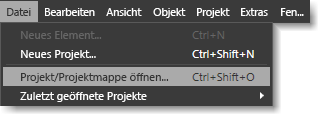
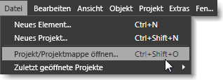

# Tastenkombinationen und Zusatztasten
[!INCLUDE[vs2017banner](../code-quality/includes/vs2017banner.md)]

Mit Tastenkombinationen können Sie beim Arbeiten Zeit sparen, indem eine Aktion, die normalerweise mehrere Klicks auf Schaltflächen erfordert, auf das Drücken einer Tastenkombination auf der Tastatur reduziert wird.  Bei Tastenkombinationen gibt es in [!INCLUDE[blend_first](../debugger/includes/blend_first_md.md)] die beiden folgenden Kategorien:  
  
-   **Zugriffstasten** Mit Zugriffstasten können Sie auf einen Menübefehl oder auf einen Bereich eines Dialogfelds zugreifen, indem Sie eine bestimmte Taste auf der Tastatur drücken.  Zugriffstasten werden im momentan ausgewählten Befehl oder in Dialogfeldern durch einen Unterstrich angezeigt.  
  
     Drücken Sie zum Verwenden der Zugriffstasten zuerst die ALT\-TASTE oder F10, um die Unterstriche anzuzeigen, und drücken Sie dann den entsprechenden Buchstaben des Menü\- oder Dialogfeldelements.  Alternativ dazu können Sie auch durch ein Menü oder Dialogfeld navigieren, indem Sie die TAB\-TASTE oder die Pfeiltasten verwenden.  Wenn Sie in [!INCLUDE[blend_subs](../debugger/includes/blend_subs_md.md)] z. B. die ALT\-TASTE drücken, wird im Menü **Datei** unter dem Buchstaben **D** ein Unterstrich angezeigt, um die Zugriffstaste anzugeben.  Um ein Projekt zu öffnen, können Sie die ALT\-TASTE gedrückt halten, den Buchstaben D drücken und dann den Buchstaben F drücken.  
  
       
Zugriffstasten, die nach dem Drücken der ALT\-TASTE mit einem Unterstrich dargestellt werden  
  
-   **Tastenkombinationen** Sie können Tastenkombinationen verwenden, um eine Aktion auszuführen \(z. B. das Auswählen eines Menübefehls oder das Ändern des Verhaltens eines Werkzeugs\), indem Sie eine Tastenkombination drücken.  
  
     Auf der Benutzeroberfläche von [!INCLUDE[blend_subs](../debugger/includes/blend_subs_md.md)] können Sie die meisten Tastenkombinationen leicht identifizieren. Sie werden jeweils rechts von den Menübefehlen angezeigt.  Im Menü **Datei** wird für den Menübefehl **Projekt öffnen** beispielsweise die Tastenkombination STRG\+UMSCHALT\+O angezeigt.  Zeigen Sie mit der Maus auf das Tool, um die Tastenkombinationen für ein Tool im Bereich **Werkzeuge** anzuzeigen.  
  
       
Tastenkombinationen, die neben relevanten Menübefehlen angezeigt werden  
  
 Weitere Informationen über Barrierefreiheit und Funktionen finden Sie unter [Accessibility at Microsoft](http://go.microsoft.com/fwlink/?LinkId=75069) \(Barrierefreiheit bei Microsoft\) \(in englischer Sprache\).  
  
## Zusatztasten  
 Einigen Tastenkombinationen sind keine Menüoptionen zugeordnet. Sie können daher nicht über die [!INCLUDE[blend_subs](../debugger/includes/blend_subs_md.md)]\-Benutzeroberfläche ermittelt werden.  Unter den folgenden Themen sind die Tastenkombinationen aufgeführt, mit denen Sie das Verhalten von Werkzeugen oder eine Aktion ändern können, z. B. die Größenänderung eines Objekts:  
  
-   [Zusatztasten der Zeichenflächen](../designers/artboard-modifier-keys-in-blend.md)  
  
-   [Stifttool\-Zusatztasten](../designers/pen-tool-modifier-keys-in-blend.md)  
  
-   [Direktauswahlwerkzeug\-Zusatztasten](../designers/direct-selection-tool-modifier-keys-in-blend.md)