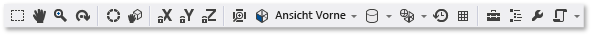

# Modell-Editor

In diesem Dokument wird beschrieben, wie Sie mit dem Visual Studio-Modell-Editor 3D-Modelle anzeigen, erstellen und ändern können.

Sie können den Modell-Editor verwenden, um einfache 3D-Modelle von Grund auf neu zu erstellen oder komplexere 3D-Modelle, die mithilfe vollwertiger 3D-Modellierungstools erstellt wurden, anzuzeigen und zu ändern. Der Modell-Editor unterstützt mehrere 3D-Modellformate, die bei der Entwicklung von DirectX-Apps verwendet werden.

## Unterstützte Formate

Der Modell-Editor unterstützt folgende Modellformate:

|Formatname|Dateierweiterung|Unterstützte Vorgänge (Anzeigen, Bearbeiten, Erstellen)|
|-----------------|--------------------|-------------------------------------------------|
|AutoDesk-FBX-Austauschdatei|*FBX*|Anzeigen, Bearbeiten, Erstellen|
|Collada DAE-Datei|*DAE*|Anzeigen, Bearbeiten (Änderungen an Collada DAE-Dateien werden im FBX-Format gespeichert).|
|OBJ|*OBJ*|Anzeigen, Bearbeiten (Änderungen an OBJ-Dateien werden im FBX-Format gespeichert).|

## Erste Schritte

In diesem Abschnitt wird beschrieben, wie Sie Ihrem Visual Studio-Projekt ein 3D-Modell hinzufügen. Außerdem erhalten Sie grundlegende Informationen über die ersten Schritte bei der Erstellung von 3D-Modellen.

### So fügen Sie Ihrem Projekt ein 3D-Modell hinzu

1. Öffnen Sie im **Projektmappen-Explorer** das Kontextmenü des Projekts, zu dem Sie das Bild hinzufügen möchten, und wählen Sie anschließend **Hinzufügen** > **Neues Element** aus.

2. Klicken Sie im Dialogfeld **Neues Element hinzufügen** unter der Kategorie **Grafiken** auf **3D-Szene (.fbx)**.

   

3. Geben Sie den **Namen** der Modelldatei ein, und klicken Sie auf **Hinzufügen**.

> [!NOTE]
> Wenn im Dialogfeld **Neues Element hinzufügen** nicht die Kategorie **Grafiken** angezeigt wird, müssen Sie möglicherweise die Komponente **Bild- und 3D-Modell-Editoren** installieren. Schließen Sie den Dialog, und klicken Sie in der Menüleiste auf **Extras** > **Get Tools and Features** (Extras und Features abrufen), um den **Visual Studio-Installer** herunterzuladen. Klicken Sie erst auf die Registerkarte **Einzelne Komponenten** und dann unter der Kategorie **Spiele und Grafiken** auf die Komponente **Bild- und 3D-Modell-Editoren**. Klicken Sie auf **Ändern**.
>
> 
>
> Möglicherweise ist die Komponente **Bild- und 3D-Modell-Editoren** zwar installiert, jedoch wird die Vorlagenkategorie **Grafiken** trotzdem nicht angezeigt. Beachten Sie in diesem Fall, dass diese Kategorie nur für bestimmte Projekttypen wie Konsolenanwendungen angezeigt wird.

### Achsenausrichtung

Visual Studio unterstützt sämtliche Ausrichtungen der 3D-Achse und lädt Informationen zur Achsenausrichtung aus den unterstützten Modelldateiformaten. Wird keine Achsenausrichtung angegeben, verwendet Visual Studio standardmäßig das rechtshändige Koordinatensystem. Der **Achsenindikator** zeigt die aktuelle Achsenausrichtung in der rechten unteren Ecke der Entwurfsoberfläche an. Der **Achsenindikator** stellt die X-Achse in rot, die Y-Achse in grün und die Z-Achse in blau dar.

### Erstellen eines neuen 3D-Modells

Im Modell-Editor wird jedes neue Objekt zuerst immer in einer der grundlegenden 3D-Formen (*Primitive*) erstellt, die in den Modell-Editor integriert sind. Fügen Sie der Szene ein Primitiv hinzu, um neue und eindeutige Objekte zu erstellen, und ändern Sie dann dessen Form durch Verschieben der Scheitelpunkte. Bei komplexen Formen können Sie zusätzliche Scheitelpunkte hinzufügen, indem Sie Extrusionen oder Unterteilungen verwenden und diese dann ändern. Unter [Erstellen und Importieren von 3D-Objekten](#Adding3DObjects) finden Sie Informationen zum Hinzufügen eines primitiven Objekts zu Ihrer Szene. Unter [Ändern von Objekten](#ModifyingObjects) finden Sie Informationen zum Hinzufügen weiterer Scheitelpunkte zu einem Objekt.

## Arbeiten mit dem Modell-Editor

In den folgenden Abschnitten wird beschrieben, wie Sie den Modell-Editor für die Arbeit mit 3D-Modellen verwenden können.

### Symbolleisten des Model-Editors

Die Symbolleisten des Modell-Editors enthalten Befehle, die Ihnen die Arbeit mit 3D-Modellen erleichtern sollen.

Befehle, die den Zustand des Modell-Editors beeinflussen, finden Sie auf der Symbolleiste **Model Editor Mode** (Modell-Editor-Modus) im Visual Studio-Hauptfenster. Modellierungstools und vorbereitete Befehle befinden sich auf der Symbolleiste **Model Editor** (Modell-Editor) der Entwurfsoberfläche des Modell-Editors.

Die Symbolleiste **Model Editor Mode** (Modell-Editor-Modus):

In dieser Tabelle werden die Elemente der Symbolleiste **Model Editor Mode** (Modell-Editor-Modus) beschrieben und in der Reihenfolge aufgelistet, in der sie auf der Symbolleiste von links nach rechts angezeigt werden.

|Element der Symbolleiste|Beschreibung |
|------------------|-----------------|
|**Auswählen**|Ermöglicht, abhängig vom aktiven Auswahlmodus, das Auswählen von Punkten, Rändern, Flächen oder Objekten in der Szene.|
|**Schwenken**|Ermöglicht das Bewegen einer 3D-Szene unter Berücksichtigung des Fensterrahmens. Wählen Sie zum Schwenken einen Punkt in der Szene aus und verschieben Sie ihn.   Im **Auswahl**-Modus können Sie den **Schwenken**-Modus durch Gedrückthalten der **STRG**-TASTE vorübergehend aktivieren.|
|**Zoom**|Ermöglicht das Anzeigen von mehr oder weniger Szenendetails relativ zum Fensterrahmen. Klicken Sie im **Zoom**-Modus auf einen Punkt in der Szene, und verschieben Sie ihn: zum Vergrößern nach rechts oder nach unten, und zum Verkleinern nach links oder nach oben.   Im **Auswahl**-Modus können Sie zum Vergrößern oder Verkleinern das Mausrad verwenden. Halten Sie währenddessen die **STRG**-TASTE gedrückt.|
|**Orbit**|Positioniert die Ansicht auf einem kreisförmigen Pfad um das ausgewählte Objekt. Ist kein Objekt ausgewählt, wird der Pfad auf den Szenenursprung zentriert. **Hinweis**: Dieser Modus hat keine Auswirkungen, wenn die Projektionsoption **Orthografisch** aktiviert ist.|
|**World Local**|Ist dieses Element aktiviert, werden Transformationen am ausgewählten Objekt im Welt-Raum umgesetzt. Andernfalls werden Transformationen am ausgewählten Objekt in lokalem Raum umgesetzt.|
|**Pivot-Modus**|Ist dieses Element aktiviert, beeinflussen Transformationen den Ort und die Ausrichtung des *Pivotpunkts* des ausgewählten Objekts (der Pivotpunkt definiert den Mittelpunkt der Verschiebungs-, Skalierungs- und Drehvorgänge.) Andernfalls beeinflussen Transformationen den Ort und die Ausrichtung der Geometrie des Objekts relativ zum Pivotpunkt.|
|**X-Achse sperren**|Beschränkt die Bearbeitung des Objekts auf die X-Achse. Gilt nur bei Verwendung des mittleren Teils des Manipulator-Widgets.|
|**Y-Achse sperren**|Beschränkt die Bearbeitung des Objekts auf die Y-Achse. Gilt nur bei Verwendung des mittleren Teils des Manipulator-Widgets.|
|**Z-Achse sperren**|Beschränkt die Bearbeitung des Objekts auf die Z-Achse. Gilt nur bei Verwendung des mittleren Teils des Manipulator-Widgets.|
|**Rahmenobjekt**|Rahmt das ausgewählte Objekt ein, sodass es sich in der Mitte der Ansicht befindet.|
|**Ansicht**|Legt die Ausrichtung der Ansicht fest. Im Folgenden finden Sie die verfügbaren Ausrichtungen:   **Front** (Vorderseite)  Positioniert die Ansicht vor der Szene.   **Zurück**  Positioniert die Ansicht hinter die Szene.   **Links**  Positioniert die Ansicht links von der Szene.   **Rechts**  Positioniert die Ansicht rechts von der Szene.   **Top** (Oben)  Positioniert die Ansicht über der Szene.   **Bottom** (Unten)  Positioniert die Ansicht unter der Szene. **Hinweis:** Dies ist die einzige Möglichkeit, die Ansichtsrichtung zu ändern, wenn die Projektionsoption **Orthografisch** aktiviert ist.|
|**Projektion**|Legt die Projektionsart fest, die zum Zeichnen der Szene verwendet wird. Im Folgenden finden Sie die verfügbaren Projektionsarten:   **Perspektive**  In der perspektivischen Projektion erscheinen weiter vom Blickpunkt entfernte Objekte kleiner und laufen letztendlich in der Entfernung zu einem Punkt zusammen.   **Orthografisch**  In der ortographischen Projektion erscheinen Objekte unabhängig von ihrer Entfernung zum Blickpunkt gleich Groß. Es wird keine Konvergenz angezeigt. Ist die Projektionsoption **Orthografisch** aktiviert, können Sie den **Orbit**-Modus nicht zum Positionieren der Ansicht verwenden.|
|**Zeichenstil**|Legt fest, wie Objekte in der Szene gerendert werden. Im Folgenden finden Sie die verfügbaren Stile:   **Drahtmodell**  Ist diese Option aktiviert, werden Objekte als Drahtmodelle gerendert.   **Überzeichnen**  Ist diese Option aktiviert, werden Objekte durch Additive Blending gerendert. Sie können diese Option verwenden, um darzustellen, wie ausgeprägt die Überzeichnung in der Szene ist.   **Flach schattiert**  Ist diese Option aktiviert, werden Objekte mithilfe eines einfachen flach schattierten Beleuchtungsmodells gerendert. Verwenden Sie diese Option, um die Flächen eines Objekts leichter zu erkennen.   Wenn keine dieser Optionen aktiviert ist, wird jedes Objekt in dem darauf angewendeten Material gerendert.|
|**Real-Time Rendering Mode** (Echtzeit-Renderingmodus)|Bei aktiviertem Rendering in Echtzeit, zeichnet Visual Studio die Entwurfsoberfläche auch dann neu, wenn keine Benutzeraktion ausgeführt wird. Ein hilfreicher Modus, bei der Arbeit mit Shadern, die sich im Laufe der Zeit ändern.|
|**Raster umschalten**|Ist dieses Element aktiviert, wird ein Raster angezeigt. Andernfalls wird das Raster nicht angezeigt.|
|**Werkzeugkasten**|Zeigt die **Toolbox** entweder an oder blendet sie aus.|
|**Dokumentgliederung**|Zeigt das Fenster **Dokumentgliederung** entweder an oder blendet es aus.|
|**Eigenschaften**|Zeigt das Fenster **Eigenschaften** entweder an oder blendet es aus.|
|**Erweitert**|Enthält erweiterte Befehle und Optionen.   
  **Grafik-Engines**   **Mit D3D11 rendern**  Verwendet Direct3D 11 zum Rendern der Model-Editor-Entwurfsoberfläche.   **Mit D3D11WARP rendern**  Verwendet Direct3D 11 Windows Advanced Rasterization Platform (WARP) zum Rendern der Entwurfsoberfläche des Model-Editors.   **Szenenverwaltung**   **Importieren**  Importiert Objekte aus einer anderen 3D-Modelldatei in die aktuelle Szene.   **Attach to Parent** (Übergeordnetes Element festlegen)  Definiert das erste mehrerer ausgewählter Objekte als übergeordnetes Element der verbleibenden ausgewählten Objekte.   **Detach from Parent** (Übergeordnetes Element entfernen)  Trennt das ausgewählte Objekt von seinem übergeordneten Element. Das ausgewählte Objekt wird zu einem *Stammobjekt* in der Szene. Ein Stammobjekt verfügt über kein übergeordnetes Objekt.   **Gruppe erstellen**  Gruppiert die ausgewählten Objekte als gleichgeordnete Objekte.   **Objekte zusammenführen**  Kombiniert die ausgewählten Objekte in einem Objekt.   **Create New Object From Polygon Selection** (Neues Objekt aus Polygonauswahl erstellen)  Entfernt die ausgewählten Oberflächen aus dem aktuellen Objekt und fügt der Szene ein neues Objekt hinzu, das die entsprechenden Oberflächen enthält.   **Extras**   **Polygonwicklung spiegeln**  Kippt die ausgewählten Polygone in der Weise, dass ihre Wicklungsreihenfolgen und Oberflächennormale umgekehrt werden.   **Alle Animationen entfernen**  Entfernt Animationsdaten aus den Objekten.   **Triangulieren**  Konvertiert das ausgewählte Objekt in Dreiecke.   **Ansicht**   Backface Culling  Aktiviert oder deaktiviert Backface Culling.   **Bildfrequenz**  Zeigt in der rechten oberen Ecke der Entwurfsoberfläche die Einzelbildrate an. Die Einzelbildrate ist die Anzahl von Bildern, die pro Sekunde gezeichnet werden.   Diese Option ist hilfreich, wenn Sie die Option **Real-Time Rendering Mode** (Echtzeit-Renderingmodus) aktivieren.   **Alle anzeigen**  Zeigt alle Objekte in der Szene an. Dadurch wird die Eigenschaft **Ausgeblendet** für jedes Objekt auf **FALSE** zurückgesetzt.   **Show Face Normals** (Flächennormale anzeigen)  Zeigt die Normale jeder einzelnen Fläche an.   **Show Missing Materials** (Fehlende Materialien anzeigen)  Zeigt auf Objekten, denen kein Material zugewiesen wurde, eine spezielle Textur an.   **Pivot anzeigen**  Aktiviert oder deaktiviert das Anzeigen eines 3D-Achsenmarkers am Pivotpunkt der aktiven Auswahl.   **Show Placeholder Nodes** (Platzhalterknoten anzeigen)  Platzhalterknoten anzeigen Ein Platzhalterknoten wird erstellt, wenn Sie Objekte gruppieren.   **Show Vertex Normals** (Vertexnormale anzeigen)  Zeigt die Normale jedes Vertex an. **Tipp**: Sie können auf die Schaltfläche **Skripts** klicken, um das letzte Skript erneut auszuführen.|

Die Symbolleiste **Model Editor** (Modell-Editor):

In der folgenden Tabelle werden die Elemente der Symbolleiste **Model Editor** (Modell-Editor) beschrieben und in der Reihenfolge aufgelistet, in der sie auf der Symbolleiste von oben nach unten angezeigt werden.

|Element der Symbolleiste|Beschreibung |
|------------------|-----------------|
|**Verschieben**|Verschiebt die Markierung.|
|**Scale** (Skalieren)|Ändert die Größe der Auswahl.|
|**Drehen**|Dreht die Auswahl.|
|**Punkt auswählen**|Legt den **Auswahlmodus** auf die Auswahl einzelner Punkte in einem Objekt fest.|
|**Kante auswählen**|Legt den **Auswahlmodus** auf die Auswahl einer Kante (eine Linie zwischen zwei Schnittpunkten) an einem Objekt fest.|
|**Seite auswählen**|Legt den **Auswahlmodus** auf die Auswahl einer Fläche eines Objekts fest.|
|**Objekt auswählen**|Legt den **Auswahlmodus** auf die Auswahl eines kompletten Objekts fest.|
|**Extrudieren**|Erstellt eine zusätzliche Fläche und verbindet sie mit der ausgewählten Fläche.|
|**Unterteilen**|Unterteilt jede ausgewählte Fläche in mehrere Flächen. Zum Erstellen der neuen Flächen werden neue Schnittpunkte hinzugefügt. Einer im Mittelpunkt der ursprünglichen Fläche und jeweils ein weiterer mitten auf jedem Rand. Sie werden dann mit den ursprünglichen Schnittpunkten verknüpft. Die Anzahl der hinzugefügten Flächen entspricht der Anzahl Rändern der ursprünglichen Fläche.|

### Steuern der Ansicht

Die 3D-Szene wird entsprechend der Ansicht gerendert, die Sie sich als virtuelle Kamera mit einer Position und einer Ausrichtung vorstellen können. Ändern Sie Position und Ausrichtung über die Ansichtssteuerelemente auf der Symbolleiste **Model Editor Mode** (Modell-Editor-Modus).

In der folgenden Tabelle werden die Hauptsteuerelemente der Ansicht beschrieben.

|Ansichtsteuerung|Beschreibung |
|------------------|-----------------|
|**Schwenken**|Ermöglicht das Bewegen einer 3D-Szene unter Berücksichtigung des Fensterrahmens. Wählen Sie zum Schwenken einen Punkt in der Szene aus und verschieben Sie ihn.   Im **Auswahl**-Modus können Sie den **Schwenken**-Modus durch Gedrückthalten der **STRG**-TASTE vorübergehend aktivieren.|
|**Zoom**|Ermöglicht das Anzeigen von mehr oder weniger Szenendetails relativ zum Fensterrahmen. Klicken Sie im **Zoom**-Modus auf einen Punkt in der Szene, und verschieben Sie ihn: zum Vergrößern nach rechts oder nach unten, und zum Verkleinern nach links oder nach oben.   Im **Auswahl**-Modus können Sie zum Vergrößern oder Verkleinern das Mausrad verwenden. Halten Sie währenddessen die **STRG**-TASTE gedrückt.|
|**Orbit**|Positioniert die Ansicht auf einem kreisförmigen Pfad um das ausgewählte Objekt. Ist kein Objekt ausgewählt, wird der Pfad auf den Szenenursprung zentriert. **Hinweis**: Dieser Modus hat keine Auswirkungen, wenn die Projektionsoption **Orthografisch** aktiviert ist.|
|**Rahmenobjekt**|Rahmt das ausgewählte Objekt ein, sodass es sich in der Mitte der Ansicht befindet.|

Die Ansicht wird zwar von der virtuellen Kamera erstellt, ist jedoch auch durch eine Projektion definiert. Die Projektion definiert, wie Formen und Objekte in der Ansicht auf der Entwurfsoberfläche in Pixel übersetzt werden. Sie können auf der Symbolleiste **Model Editor** (Modell-Editor) zwischen der Projektionsoption **Perspektive** oder **Orthografisch** auswählen.

|Projection|Beschreibung |
|----------------|-----------------|
|**Perspektive**|In der perspektivischen Projektion erscheinen weiter vom Blickpunkt entfernte Objekte kleiner und laufen letztendlich in der Entfernung zu einem Punkt zusammen.|
|**Orthografisch**|In der ortographischen Projektion erscheinen Objekte unabhängig von ihrer Entfernung zum Blickpunkt gleich Groß. Es wird keine Konvergenz angezeigt. Ist die Projektionsoption **Orthografisch** aktiviert, können Sie den **Orbit**-Modus nicht beliebig zum Positionieren der Ansicht verwenden.|

Es kann hilfreich sein, eine 3D-Szene von einer bekannten Position aus und in einem bekannten Winkel anzeigen zu lassen. Dies ist zum Beispiel bei einem Vergleich von zwei ähnlichen Szenen der Fall. In so einem Fall stellt der Model-Editor mehrere vordefinierte Ansichten zur Verfügung. Zum Verwenden einer vordefinierte Ansicht, klicken Sie auf der Symbolleiste **Model Editor Mode** (Modell-Editor-Modus) auf die Option **Ansicht**, und wählen Sie anschließend die gewünschte vordefinierte Ansicht aus: vorne, hinten, links, rechts, oben oder unten. Die virtuelle Kamera ist in diesen Ansichten direkt auf den Ursprung der Szene ausgerichtet. Wenn Sie beispielsweise **Oberseite anzeigen** auswählen, zeigt die virtuelle Kamera direkt von oben auf den Ursprung der Szene.

### Anzeigen zusätzlicher Geometriedetails

Zum besseren Verständnis eines 3D-Objekts oder einer 3D-Szene können Sie zusätzliche Geometriedetails wie die vertexspezifische oder flächenspezifische Normale oder Pivotpunkte der aktuellen Auswahl und weitere Details anzeigen. Wählen Sie in der Symbolleiste **Modell-Editor** die Option **Skripts** > **Ansicht** aus, und wählen Sie die gewünschte Option aus, um diese zu aktivieren oder zu deaktivieren.

### Erstellen und Importieren von 3D-Objekten 

Wählen Sie in der **Toolbox** die gewünschte Form aus, und verschieben Sie sie dann auf die Entwurfsoberfläche, um der Szene eine vordefinierte 3D-Form hinzuzufügen. Neue Formen werden am Ursprung der Szene positioniert. Der Modell-Editor stellt sieben Formen zur Verfügung: **Kegel**, **Würfel**, **Zylinder**, **Scheibe**, **Ebene**, **Kugel** und **Teekanne**.

Wählen Sie in der Symbolleiste **Modell-Editor** die Option **Erweitert** > **Szenenverwaltung** > **Importieren** aus, und geben Sie anschließend die zu importierende Datei an, um ein 3D-Objekt aus einer Datei zu importieren.

### Transform-Objekte

Sie können ein Objekt *transformieren*, indem Sie die Eigenschaften **Drehung**, **Skalierung** und **Übersetzung** ändern. *Drehung* richtet ein Objekt aus, indem es nacheinander um die durch den Pivotpunkt des Objekts definierte X-, Y- und Z-Achse gedreht wird. Jede Drehungsspezifikation verfügt über drei Komponenten: x, y und z; in dieser Reihenfolge. Die Komponenten werden in Grad angegeben. **Skalierung** ändert die Größe eines Objekts. Dabei wird das Objekt entlang mindestens einer auf dem Pivotpunkt zentrierter Achse um einen angegebenen Faktor gestreckt. *Übersetzung* legt ein Objekt im dreidimensionalen Raum relativ zu seinem übergeordneten Element anstatt relativ zu seinem Pivotpunkt fest.

Sie können ein Objekt entweder mithilfe der Modellierungstools transformieren oder, indem Sie Eigenschaften festlegen.

#### So transformieren Sie ein Objekt mithilfe der Modellingtools

1. Wählen Sie im **Auswahlmodus** das Objekt aus, das Sie transformieren möchten. Eine Drahtmodellüberlappung zeigt an, dass das Objekt ausgewählt ist.

2. Klicken Sie auf der Symbolleiste **Model Editor** (Modell-Editor) auf eins der folgenden Tools: **Verschieben**, **Skalierung** oder **Drehen**. Ein Übersetzungs-, Skalierungs- oder ein Drehungsmanipulator wird angezeigt.

3. Verwenden Sie den Manipulator, um die Transformation durchzuführen. Der Manipulator für Übersetzungs- und Skalierungstransformationen ist ein Achsenindikator. Sie können eine Achse nacheinander ändern oder, mithilfe des weißen Würfels in der Mitte des Indikators, alle Achsen gleichzeitig. Der Manipulator für Drehung ist eine Kugel aus farbcodierten Kreisen, entsprechend der x-Achse (rot), der y-Achse (grün) und der z-Achse (blau). Für eine gewünschte Drehung müssen Sie jede Achse einzeln ändern.

#### So transformieren Sie ein Objekt durch Festlegen der Eigenschaften

1. Wählen Sie im **Auswahlmodus** das Objekt aus, das Sie transformieren möchten. Eine Drahtmodellüberlappung zeigt an, dass das Objekt ausgewählt ist.

2. Geben Sie im Fenster **Eigenschaften** Werte für die Eigenschaften **Drehung**, **Skalierung** und **Übersetzung** an.

    > [!IMPORTANT]
    > Geben Sie für die Eigenschaft **Drehung** den Grad der Drehung um jede der drei Achsen an. Drehungen werden nach der Reihe ausgeführt. Planen Sie daher eine Drehung zuerst in Hinblick auf die Drehung der x-Achse, dann die der Y-Achse und anschließend die der z-Achse.

Mithilfe der Modellierungstools können Sie schnell Transformationen erstellen, die jedoch nicht genau sind. Durch Festlegen der Objekteigenschaften, können Sie Transformationen genau allerdings nicht schnell angeben. Es wird empfohlen, die Modellierungstools zu verwenden, um sich so weit wie möglich an die gewünschte Transformationen anzunähern und die Feinabstimmung anschließend über die Eigenschaftswerte vorzunehmen.

Wenn Sie keine Manipulatoren verwenden möchten, können Sie den Freihandform-Modus aktivieren. Wählen Sie in der Symbolleiste **Modell-Editor** die Option **Skripts** > **Tools** > **Free-form Manipulation** (Freiformbearbeitung) aus, um den Freiform-Modus zu aktivieren (oder zu deaktivieren). Im Freihandform-Modus können Sie an jedem Punkt auf der Entwurfsoberfläche mit einer Manipulation beginnen, anstatt an einem Punkt auf dem Manipulator. Im Freihandform-Modus können Sie Änderungen an bestimmten Achsen einschränken, indem Sie diejenigen sperren, die Sie nicht ändern möchten. Klicken Sie auf der Symbolleiste **Model Editor Mode** (Modell-Editor-Modus) auf eine beliebige Kombination aus den Schaltflächen **LockX**, **LockY** und **LockZ**.

Es ist es möglicherweise hilfreich, Objekte zum Arbeiten am Raster auszurichten. Klicken Sie zum Aktivieren (oder Deaktivieren) der Ausrichtung am Raster auf der Symbolleiste **Model Editor Mode** (Modell-Editor-Modus) auf **Ausrichten**. Bei aktivierter Ausrichtung am Raster, sind die Transformationenen Verschiebung, Drehung und Skalierung auf vordefinierte Schritte beschränkt.

### Arbeiten mit dem Pivotpunkt

Der Pivotpunkt eines Objekts definiert seinen Drehungs- und Skalierungsmittelpunkt. Sie können den Pivotpunkt eines Objekts ändern, um die Auswirkungen von Drehungs- und Skalierungstransformationen auf das Objekt zu ändern. Klicken Sie zum Aktivieren (oder Deaktivieren) des Pivotmodus auf der Symbolleiste **Model Editor Mode** (Modell-Editor-Modus) auf **Pivot-Modus**. Bei aktiviertem Pivotmodus wird ein kleiner Achsenindikator am Pivotpunkt des ausgewählten Objekts angezeigt. Sie können die Tools **Übersetzung** und **Drehung** anschließend zur Bearbeitung des Pivotpunkts verwenden.

Unter [Vorgehensweise: Ändern des Pivotpunkts eines 3D-Modells](../designers/how-to-modify-the-pivot-point-of-a-3-d-model.md) wird die Verwendung eines Pivotpunkts dargestellt.

### Welt-Modus und lokaler Modus

Die Tools „Übersetzung“ und „Drehung“ lassen sich im lokalen Koordinatensystem (oder im *lokalen Bezugsrahmen*) des Objekts oder im Koordinatensystem der Welt (oder im *Weltbezugsrahmen*) umsetzen. Der Weltverweisrahmen ist von der Drehung des Objekts unabhängig. Die Standardeinstellung ist der lokale Modus. Klicken Sie zum Aktivieren (oder Deaktivieren) des Weltmodus auf der Symbolleiste **Model Editor Mode** (Modell-Editor-Modus) auf die Schaltfläche **WorldLocal**.

### Ändern von Objekten 

Sie können die Form eines 3D-Objekts ändern, indem Sie die Schnittpunkte, Ränder und Flächen verschieben oder löschen. Standardmäßig ist der Modell-Editor auf den *Objektmodus* eingestellt, damit Sie komplette Objekte auswählen und transformieren können. Wählen Sie Punkte, Ränder oder Flächen mithilfe des entsprechenden Auswahlmodus aus. Klicken Sie auf der Symbolleiste **Model Editor Mode** (Modell-Editor-Modus) auf **Selection modes** (Auswahlmodi), und wählen Sie dann den gewünschten Modus aus.

 Mithilfe von Extrusionen oder Unterteilungen können Sie zusätzliche Schnittpunkte erstellen. Extrusion dupliziert die Vertices einer Fläche (ein koplanarer Satz von Vertices), die durch die duplizierten Vertices verbunden bleiben. Mit Unterteilung werden Schnittpunkte hinzugefügt, um aus einer Fläche mehrere Flächen zu erstellen. Zum Erstellen der neuen Flächen werden neue Schnittpunkte hinzugefügt. Einer im Mittelpunkt der ursprünglichen Fläche und jeweils ein weiterer mitten auf jedem Rand. Sie werden dann mit den ursprünglichen Schnittpunkten verknüpft. Die Anzahl der hinzugefügten Flächen entspricht der Anzahl Rändern der ursprünglichen Fläche. In beiden Fällen können Sie die neuen Schnittpunkte übersetzen, drehen und anpassen, um die Geometrie des Objekts zu ändern.

#### So extrudieren Sie eine Fläche aus einem Objekt

1. Wählen Sie im Flächenauswahlmodus die Fläche aus, die Sie extrudieren möchten.

2. Wählen Sie in der Symbolleiste **Modell-Editor** die Option **Skripts** > **Tools** > **Extrudieren** aus.

#### So unterteilen Sie Flächen.

1. Wählen Sie im Flächenauswahlmodus die Flächen aus, die Sie unterteilen möchten. Da das Unterteilen neue Randdaten erstellt, erhalten Sie mit einer Unterteilung aller Flächen auf einmal konsistentere Ergebnisse, sofern die Flächen aneinandergrenzen.

2. Wählen Sie in der Symbolleiste **Modell-Editor** die Option **Skripts** > **Tools** > **Unterteilen** aus.

 Sie können Flächen auch triangulieren, Objekte zusammenfügen und ausgewählte Polygone in neue Objekte konvertieren. Triangulation erstellt zusätzliche Ränder, indem Flächen, die nicht dreieckig sind, in die optimale Anzahl von Dreiecken konvertiert werden. Es werden jedoch keine zusätzlichen geometrischen Details bereitgestellt. Zusammenführen kombiniert die ausgewählten Objekte in einem Objekt. Neue Objekte können aus einer Polygon-Auswahl erstellt werden.

#### So triangulieren Sie eine Fläche

1. Wählen Sie im Flächenauswahlmodus die Fläche aus, die Sie triangulieren möchten.

2. Wählen Sie in der Symbolleiste **Modell-Editor** die Option **Skripts** > **Tools** > **Triangulieren** aus.

#### So führen Sie Objekte zusammen

1. Wählen Sie im Modus "Objektauswahl" die Objekte, die Sie zusammenführen möchten.

2. Wählen Sie in der Symbolleiste **Modell-Editor** die Option **Skripts** > **Tools** > **Objekte zusammenführen** aus.

#### So erstellen Sie ein Objekt aus einer Polygon-Auswahl

1. Wählen Sie im Flächenauswahlmodus die Fläche aus, aus der Sie in ein neues Objekt erstellen möchten.

2. Wählen Sie in der Symbolleiste **Modell-Editor** die Option **Skripts** > **Tools** > **Create New Object from Polygon Selection** (Neues Objekt aus Polygonauswahl erstellen) aus.

### Arbeiten mit Materialien und Shadern

Die Darstellung eines Objekts wird durch das Zusammenwirken der Beleuchtung in der Szene und dem Material des Objekts bestimmt. Materialien werden über Eigenschaften definiert, die beschreiben, wie die Oberfläche auf unterschiedliche Lichtarten reagiert und über ein Shaderprogramm, das die endgültige Farbe jedes Pixels auf der Objektoberfläche auf Grundlage von Beleuchtungsinformationen, Strukturschemas, normalen Schemas und anderen Daten berechnet.

Der Model-Editor stellt folgende Standardmaterialien bereit:

|Material|Beschreibung |
|--------------|-----------------|
|**Unbeleuchtet**|Rendert eine Oberfläche ohne simulierte Beleuchtung.|
|**Lambert**|Rendert eine Oberfläche mit simulierter umgebender und diffuser Beleuchtung.|
|**Phong**|Rendert eine Oberfläche mit simulierter umgebender und diffuser Beleuchtung und mit Lichtreflexen.|

Jedes dieser Materialien stellt eine Textur auf der Oberfläche eines Objekts. Sie können für jedes Objekt, von dem das Material verwendet wird, eine andere Textur festlegen.

Um die Reaktion eines bestimmten Objekts auf verschiedenen Lichtquellen in der Szene zu ändern, können Sie die Beleuchtungseigenschaften des Materials unabhängig von anderen Objekten ändern, bei denen das Material verwendet wird. Die folgende Tabelle beschreibt allgemeine Beleuchtungseigenschaften:

|Beleuchtungseigenschaft|Beschreibung |
|-----------------------|-----------------|
|**Umgebend**|Beschreibt die Auswirkung von umgebenden Beleuchtung auf die Oberfläche.|
|**Diffus**|Beschreibt die Auswirkung direktionaler Punktlichter auf die Oberfläche.|
|**Selbstleuchtend**|Beschreibt die Abgabe von Licht durch die Oberfläche unabhängig von anderer Beleuchtung.|
|**Glänzend**|Beschreibt die Reflektion von ausgerichtetem Licht und von Punktlichtern durch die Oberfläche.|
|**Glanzkraft**|Beschreibt die Breite und Intensität von Glanzlichtern.|

Abhängig von den vom Material unterstützten Möglichkeiten, können Sie seine Beleuchtungseigenschaften, Texturen und andere Daten ändern. Klicken Sie im **Auswahlmodus** auf das Objekt, dessen Material Sie ändern möchten. Ändern Sie anschließend im Fenster **Eigenschaften** die Optionen **MaterialAmbient**, **MaterialDiffuse**, **MaterialEmissive**, **MaterialSpecular**, **MaterialSpecularPower** oder andere verfügbare Eigenschaften. Ein Material kann bis zu acht Texturen tragen, deren Eigenschaften nacheinander als **Texture1** bis **Texture8** bezeichnet werden.

Wählen Sie zum Entfernen sämtlicher Materialien von einem Objekt in der Symbolleiste **Modell-Editor** die Option **Skripts** > **Materialien** > **Materialien entfernen** aus.

Sie können den **Shader-Designer** verwenden, um benutzerdefinierte Shadermaterialien zu erstellen, die Sie auf Objekte in der 3D-Szene anwenden können. Informationen zum Erstellen benutzerdefinierter Shadermaterialien finden Sie unter [Shader-Designer](../designers/shader-designer.md). Informationen zur Anwendung benutzerdefinierter Shadermaterialien auf ein Objekt finden Sie unter [Vorgehensweise: Anwenden eines Shaders auf ein 3D-Modell](../designers/how-to-apply-a-shader-to-a-3-d-model.md).

### Szenenverwaltung

Sie können Szenen wie eine Hierarchie von Objekten verwalten. Werden mehrere Objekte in einer Hierarchie angeordnet, wirkt sich jede Übersetzung, Skalierung oder Drehung eines übergeordneten Knotens auch auf die untergeordneten Elemente aus. Das ist hilfreich, wenn Sie aus grundlegenderen Objekten komplexe Objekte oder Szenen erstellen möchten.

Über das Fenster **Dokumentgliederung** können Sie die Szenenhierarchie abrufen und Szenenknoten auswählen. Haben Sie einen Knoten in der Gliederung ausgewählt, können Sie die Eigenschaften über das Fensters **Eigenschaften** ändern.

Sie können eine Hierarchie von Objekten entweder erstellen, indem Sie eins davon als übergeordnetes Element festlegen oder indem Sie alle unter einem Platzhalterknoten, der als übergeordnetes Element auftritt, als gleichgeordnete Elemente gruppieren.

#### So erstellen Sie eine Hierarchie mit übergeordnetem Objekt

1. Wählen Sie im **Auswahlmodus** mindestens zwei Objekte aus. Das erste Objekt, das Sie auswählen, wird zum übergeordneten Objekt.

2. Wählen Sie in der Symbolleiste **Modell-Editor** die Option **Skripts** > **Szenenverwaltung** > **Attach to Parent** (An übergeordnetes Element anfügen) aus.

#### So erstellen Sie eine Hierarchie gleichgeordneter Objekte

1. Wählen Sie im **Auswahlmodus** mindestens zwei Objekte aus. Ein Platzhalterobjekt wird erstellt und wird zum übergeordneten Objekt.

2. Wählen Sie in der Symbolleiste **Modell-Editor** die Option **Skripts** > **Szenenverwaltung** > **Gruppe erstellen** aus.

Der Model-Editor verwendet ein weißes Drahtmodell zur Identifizierung des zuerst ausgewählten Objekts, das zum übergeordneten Element wird. Andere Objekte in der Auswahl werden mit einem blauen Drahtmodell dargestellt. Standardmäßig werden Platzhalterknoten nicht angezeigt. Wählen Sie für die Anzeige von Platzhalterknoten in der Symbolleiste **Modell-Editor** die Option **Skripts** > **Szenenverwaltung** > **Show Placeholder Nodes** (Platzhalterknoten anzeigen) aus. Sie können mit Platzhalterknoten genauso arbeiten, wie mit Objekten ohne Platzhalterknoten.

Wenn Sie die Zuordnung zwischen zwei übergeordneten und untergeordneten Objekten entfernen möchten, wählen Sie das untergeordnete Objekt und anschließend in der Symbolleiste **Modell-Editor** die Option **Skripts** > **Szenenverwaltung** > **Detach from Parent** (Übergeordnetes Element entfernen) aus. Sobald Sie das übergeordnete Element vom untergeordneten Objekt trennen, wird das untergeordnete Objekt zu einem Stammobjekt in der Szene.

## Tastenkombinationen

|Befehl|Tastenkombinationen|
|-------------|------------------------|
|In den Modus **Auswählen** wechseln|**STRG**+**G**, **STRG**+**Q**   **S**|
|In den Modus **Zoom** wechseln|**STRG**+**G**, **STRG**+**Z**   **Z**|
|In den Modus **Schwenken** wechseln|**STRG**+**G**, **STRG**+**P**   **K**|
|Alles auswählen|**STRG**+**A**|
|Die aktuelle Auswahl löschen|**Löschen**|
|Brechen Sie die aktuelle Auswahl ab.|**Escape** (**ESC**)|
|Vergrößern|**Mausrad vorwärts**   **STRG**+**Mausrad vorwärts**   **UMSCHALTTASTE**+**Mausrad vorwärts**   **STRG**+**BildAuf**   Pluszeichen (**+**)|
|Verkleinern|**Mausrad rückwärts**   **STRG**+**Mausrad rückwärts**   **UMSCHALTTASTE**+**Mausrad rückwärts**   **STRG**+**PageDown**   Minuszeichen (**-**)|
|Die Kamera nach oben schwenken|**BildAb**|
|Die Kamera nach unten schwenken|**BildAuf**|
|Die Kamera nach links schwenken|**Mausrad links**   **STRG**+**PageDown**|
|Die Kamera nach rechts schwenken|**Mausrad rechts**   **STRG**+**PageDown**|
|Oberseite des Modells anzeigen|**STRG**+**L**, **STRG**+**T**   **T**|
|Unterseite des Modells anzeigen|**STRG**+**L**, **STRG**+**U**|
|Linke Seite des Modells anzeigen|**STRG**+**L**, **STRG**+**L**|
|Rechte Seite des Modells anzeigen|**STRG**+**L**, **STRG**+**R**|
|Vorderseite des Modells anzeigen|**STRG**+**L**, **STRG**+**F**|
|Rückseite des Modells anzeigen|**STRG**+**L**, **STRG**+**B**|
|Objekt im Fenster einrahmen|**F**|
|Drahtmodellmodus ein-/ausschalten|**STRG**+**L**, **STRG**+**W**|
|"Am Raster ausrichten" ein-/ausschalten|**STRG**+**G**, **STRG**+**N**|
|Pivotmodus ein-/ausschalten|**STRG**+**G**, **STRG**+**V**|
|x-Achsen-Beschränkung ein-/ausschalten|**STRG**+**L**, **STRG**+**X**|
|y-Achsen-Beschränkung ein-/ausschalten|**STRG**+**L**, **STRG**+**Y**|
|z-Achsen-Beschränkung ein-/ausschalten|**STRG**+**L**, **STRG**+**Z**|
|In den Übersetzungsmodus umschalten|**STRG**+**G**, **STRG**+**W**   **W**|
|In den Skaliermodus umschalten|**STRG**+**G**, **STRG**+**E**   **E**|
|In den Drehungsmodus umschalten|**STRG**+**G**, **STRG**+**R**   **R**|
|In den Punktauswahlmodus umschalten|**STRG**+**L**, **STRG**+**1**|
|In den Randauswahlmodus umschalten|**STRG**+**L**, **STRG**+**2**|
|In den Flächenauswahlmodus umschalten|**STRG**+**L**, **STRG**+**3**|
|In den Objektauswahlmodus umschalten|**STRG**+**L**, **STRG**+**4**|
|In den Orbitmodus (Kamera) umschalten|**STRG**+**L**, **STRG**+**O**|
|Nächstes Objekt in der Szene auswählen|**TAB**|
|Vorhergehendes Objekt in der Szene auswählen|**UMSCHALT**+**Tab**|
|Ausgewählte Objekt mit dem aktuellen Tool bearbeiten.|Die **Pfeiltasten**|
|Aktuellen Manipulator deaktivieren|**Q**|
|Kamera drehen|**ALT**+**Ziehen** mit linker Maustaste|

## Verwandte Themen

|Titel|Beschreibung |
|-----------|-----------------|
|[Arbeiten mit 3D-Objekten für Spiele und Apps](../designers/working-with-3-d-assets-for-games-and-apps.md)|Bietet eine Übersicht über die Visual Studio-Tools, die Sie bei der Arbeit mit Grafikobjekten wie Texturen und Bildern, 3D-Modellen und Shadereffekten verwenden können.|
|[Bildbearbeitung](../designers/image-editor.md)|Beschreibt die Verwendung der Visual Studio-Bildbearbeitung für die Arbeit mit Texturen und Bildern.|
|[Shader-Designer](../designers/shader-designer.md)|Beschreibt die Verwendung des Shader-Designers von Visual Studio zur Arbeit mit Shadern.|