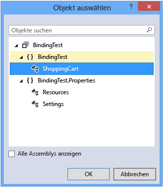
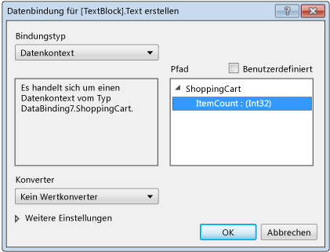

# <a name="walkthrough-binding-to-data-in-xaml-designer"></a>Exemplarische Vorgehensweise: Bindung an Daten im XAML-Designer
Im XAML-Designer können Sie Datenbindungseigenschaften mithilfe der Zeichenfläche und des Eigenschaftenfensters festlegen. In dieser exemplarischen Vorgehensweise wird veranschaulicht, wie Daten an ein Steuerelement gebunden werden. Die exemplarische Vorgehensweise zeigt insbesondere, wie eine einfache Einkaufswagenklasse erstellt wird, die über eine [DependencyProperty](http://msdn.microsoft.com/library/windows/apps/windows.ui.xaml.dependencyproperty.aspx) mit der Bezeichnung `ItemCount` verfügt, und wie die Eigenschaft `ItemCount` an die Eigenschaft **Text** eines [TextBlock](http://msdn.microsoft.com/library/windows/apps/windows.ui.xaml.controls.textblock.aspx)-Steuerelements gebunden wird.  
  
### <a name="to-create-a-class-to-use-as-a-data-source"></a>So erstellen Sie eine Klasse, die als Datenquelle verwendet wird  
  
1.  Wählen Sie im Menü **Datei** die Optionsfolge **Neu**, **Projekt**aus.  
  
2.  Wählen Sie im Dialogfeld **Neues Projekt** den Knoten **Visual C#** oder **Visual Basic** aus, erweitern Sie den Knoten **Windows Desktop**, und wählen Sie dann die Vorlage **WPF-Anwendung** aus.  
  
3.  Geben Sie dem Projekt den Namen **BindingTest**, und wählen Sie anschließend die Schaltfläche **OK**.  
  
4.  Öffnen Sie die Datei "MainWindow.xaml.cs" (oder "MainWindow.xaml.vb"), und fügen Sie den folgenden Code hinzu. Fügen Sie in C# den Code im `BindingTest`-Namespace (vor der letzten schließenden Klammer in der Datei) hinzu. In Visual Basic können Sie einfach die neue Klasse hinzufügen.  
  
    ```csharp  
    public class ShoppingCart : DependencyObject  
    {  
        public int ItemCount  
        {  
            get { return (int)GetValue(ItemCountProperty); }  
            set { SetValue(ItemCountProperty, value); }  
        }  
  
        public static readonly DependencyProperty ItemCountProperty =  
             DependencyProperty.Register("ItemCount", typeof(int),  
             typeof(ShoppingCart), new PropertyMetadata(0));  
    }  
  
    ```  
  
    ```vb  
    Public Class ShoppingCart  
        Inherits DependencyObject  
  
        Public Shared ReadOnly ItemCountProperty As DependencyProperty = DependencyProperty.Register(  
            "ItemCount", GetType(Integer), GetType(ShoppingCart), New PropertyMetadata(0))  
        Public Property ItemCount As Integer  
            Get  
                ItemCount = CType(GetValue(ItemCountProperty), Integer)  
            End Get  
            Set(value As Integer)  
                SetValue(ItemCountProperty, value)  
            End Set  
        End Property  
    End Class  
    ```  
  
     Durch diesen Code wird der Wert „0“ (null) als Standardelementanzahl mithilfe des [PropertyMetadata](http://msdn.microsoft.com/library/windows/apps/windows.ui.xaml.propertymetadata.aspx)-Objekts festgelegt.  
  
5.  Klicken Sie im Menü **Datei** auf die Option **Erstellen** und dann auf **Projektmappe erstellen**.  
  
### <a name="to-bind-the-itemcount-property-to-a-textblock-control"></a>So binden Sie die ItemCount-Eigenschaft an ein TextBlock-Steuerelement  
  
1.  Öffnen Sie im Projektmappen-Explorer das Kontextmenü für „MainWindow.xaml“, und klicken Sie auf **Ansicht-Designer**.  
  
2.  Klicken Sie in der Toolbox auf ein [Raster](http://msdn.microsoft.com/library/windows/apps/windows.ui.xaml.controls.grid.aspx)-Steuerelement, um es dem Formular hinzuzufügen.  
  
3.  Wenn Sie `Grid` ausgewählt haben, klicken Sie im Eigenschaftenfenster auf **Neu** neben der **DataContext**-Eigenschaft.  
  
4.  Vergewissern Sie sich, dass im Dialogfeld **Objekt auswählen** das Kontrollkästchen **Alle Assemblys anzeigen** deaktiviert ist, wählen Sie dann **ShoppingCart** unter dem **BindingTest**-Namespace aus, und klicken Sie anschließend auf die Schaltfläche **OK**.  
  
     Die folgende Abbildung zeigt das Dialogfeld **Objekt auswählen** mit der ausgewählten Option **ShoppingCart**.  
  
       
  
5.  Wählen Sie in der **Toolbox** ein `TextBlock`-Steuerelement aus, um es dem Formular hinzuzufügen.  
  
6.  Wenn Sie das `TextBlock`-Steuerelement ausgewählt haben, wählen Sie im Eigenschaftenfenster den Eigenschaftenmarker rechts neben der **Text**-Eigenschaft aus, und klicken anschließend auf **Datenbindung erstellen**. (Der Eigenschaftenmarker sieht wie ein kleines Feld aus.)  
  
7.  Wählen Sie im Dialogfeld „Datenbindung erstellen“ im Feld **Pfad** die **ItemCount: (int32)**-Eigenschaft aus, und klicken Sie dann auf **OK**.  
  
     Die folgende Abbildung zeigt das Dialogfeld **Datenbindung erstellen**, wobei die Eigenschaft **ItemCount** ausgewählt ist.  
  
       
  
8.  Drücken Sie F5, um die App auszuführen.  
  
     Das `TextBlock`-Steuerelement sollte den Standardwert 0 als Text anzeigen.  
  
## <a name="see-also"></a>Siehe auch  
 [Erstellen einer Benutzeroberfläche mit dem XAML-Designer](../designers/creating-a-ui-by-using-xaml-designer-in-visual-studio.md)   
 [Dialogfeld „Wertkonverter hinzufügen“](https://msdn.microsoft.com/en-us/c5f3d110-a541-4b55-8bca-928f77778af8)