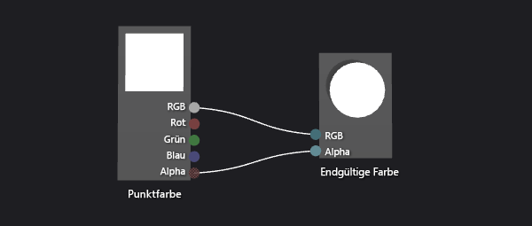
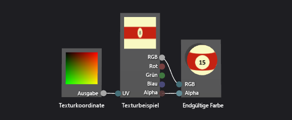
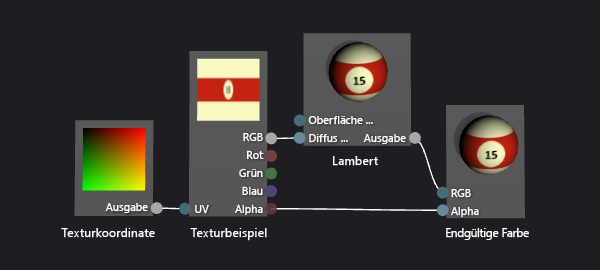
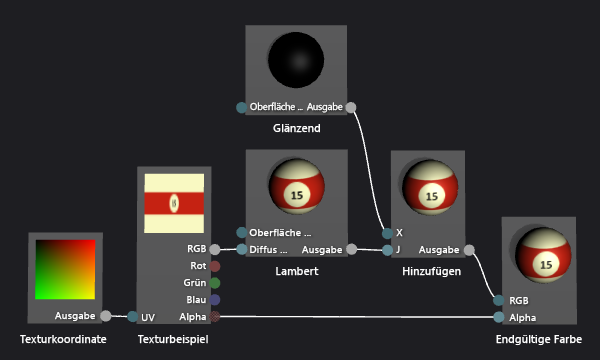
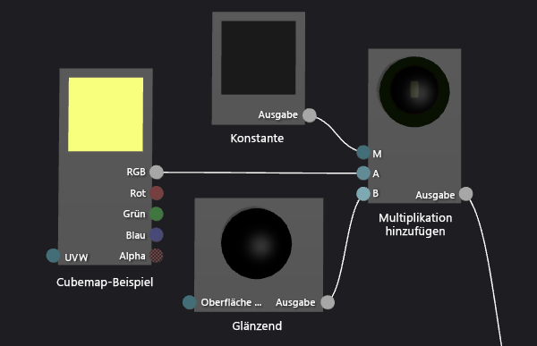
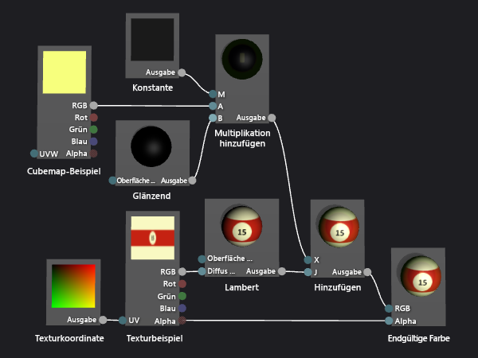

# Exemplarische Vorgehensweise: Erstellen einer realistischen 3D-Billardkugel

In dieser exemplarischen Vorgehensweise wird veranschaulicht, wie Sie mithilfe des Shader-Designers und der Bildbearbeitung in Visual Studio eine realistische 3D-Billardkugel erstellen können. Die 3D-Darstellung der Billardkugel wird erreicht, indem verschiedene Shadertechniken mit entsprechenden Texturressourcen kombiniert werden.

## Erforderliche Komponenten

Für die Durchführung dieser exemplarischen Vorgehensweise benötigen Sie folgende Komponenten und Kenntnisse:

-   Ein Tool zum Zusammenfügen von Texturen in einer Cubemap, wie das DirectX-Textur-Tool, das im DirectX SDK von Juni 2010 enthalten ist

-   Kenntnisse im Umgang mit der Bildbearbeitung in Visual Studio

-   Kenntnisse im Umgang mit dem Shader-Designer in Visual Studio

## Erstellen der grundlegenden Darstellung mit Form und Textur

In der Computergrafik sind die ganz grundlegenden Darstellungselemente Form und Farbe. In einer Computersimulation wird häufig ein 3D-Modell verwendet, um die Form eines Objekts der realen Welt darzustellen. Dann werden Farbdetails auf die Modelloberfläche angewendet, indem eine Texturmap verwendet wird.

In der Regel müssen Sie sich an einen Experten wenden, der für Sie ein brauchbares 3D-Modell erstellt, aber da eine Billardkugel eine gängige Form ist (Kugel), können Sie in diesem Beispiel ein geeignetes, bereits im Shader-Designer integriertes Modell verwenden.

Die Kugel ist die standardmäßige Vorschauform im Shader-Designer; wenn Sie zurzeit eine andere Form für die Shader-Vorschau verwenden, wechseln Sie zurück zur Kugel.

### So erstellen Sie eine Shader-Vorschau mithilfe einer Kugel

-   Klicken Sie auf der Symbolleiste des Shader-Designers auf **Vorschau mit Kugel**.

 Im nächsten Schritt erstellen Sie ein Shaderprogramm, das eine Textur auf das Modell anwendet, aber zunächst müssen Sie eine Textur erstellen, die Sie verwenden können. In dieser exemplarischen Vorgehensweise wird veranschaulicht, wie die Textur mit der Bildbearbeitung von Visual Studio erstellt wird, aber Sie können auch jede andere Form von Bildbearbeitung verwenden, mit der sich die Textur in einem geeigneten Format speichern lässt.

 Stellen Sie sicher, dass das Fenster **Eigenschaften** und die **Toolbox** angezeigt werden.

### So erstellen Sie eine Billardkugeltextur mit dem Bild-Editor

1.  Erstellen Sie eine Textur, mit der Sie arbeiten können. Weitere Informationen zum Hinzufügen von Texturen zu Projekten finden Sie im Abschnitt „Erste Schritte“ unter [Bildbearbeitung](../designers/image-editor.md).

2.  Legen Sie die Bildgröße so fest, dass sie doppelt so breit ist wie hoch; dies ist aufgrund der Art erforderlich, wie die Textur auf die kugelförmige Oberfläche der Billardkugel angewendet wird. Um das Bild in der Größe zu verändern, geben Sie im Fenster **Eigenschaften** neue Werte für die Eigenschaften **Breite** und **Höhe** an. Legen Sie beispielsweise die Breite auf 512 und die Höhe auf 256 fest.

3.  Zeichnen Sie eine Textur für die Billardkugel, und führen Sie sich dabei vor Augen, wie eine Textur auf eine Kugel angewendet wird.

     Die Textur sollte etwa wie folgt aussehen:

     

4.  Optional können Sie die Speicheranforderungen dieser Textur verringern. Dies können Sie erreichen, indem Sie die Breite der Textur so reduzieren, dass sie ihrer Höhe entspricht. Dadurch wird die Textur entlang der Breite reduziert, aber aufgrund der Art, wie die Textur auf die Kugel angewendet wird, wird sie beim Rendern der Billardkugel gedehnt. Nachdem die Größe geändert wurde, sollte die Textur in etwa folgendermaßen aussehen:

     

 Nun können Sie einen Shader erstellen, der diese Textur auf das Modell anwendet.

### So erstellen Sie einen Basistexturshader

1.  Erstellen Sie einen DGSL-Shader, um mit diesem zu arbeiten. Wie Sie dem Projekt einen DGSL-Shader hinzufügen, erfahren Sie im Abschnitt „Erste Schritte“ unter [Shader-Designer](../designers/shader-designer.md)

     Standardmäßig sieht ein Shaderdiagramm wie folgt aus:

     

2.  Ändern Sie den standardmäßigen Shader, damit er den Wert eines Texturbeispiels auf das aktuelle Pixel anwendet. Das Shaderdiagramm sollte wie folgt aussehen:

     

3.  Wenden Sie die Textur an, die Sie gerade erstellt haben, indem Sie die Textureigenschaften konfigurieren. Legen Sie den Wert der Eigenschaft **Texture** (Textur) des Knotens **Texture Sample** (Texturbeispiel) auf **Texture1** fest, und geben Sie dann die Texturdatei an, indem Sie die Eigenschaft **Filename** (Dateiname) der Eigenschaftengruppe **Texture1** im gleichen Eigenschaftenfenster verwenden.

 Weitere Informationen darüber, wie Sie eine Textur im Shader anwenden, finden Sie unter [Vorgehensweise: Erstellen eines Basistextur-Shaders](../designers/how-to-create-a-basic-texture-shader.md).

 Die Billardkugel sollte jetzt in etwa folgendermaßen aussehen:

 

## Erstellen von Tiefe mit dem Lambert-Beleuchtungsmodell

Sie haben jetzt eine leicht zu erkennende Billardkugel erstellt. Sie sieht jedoch flach und uninteressant aus – eher wie eine Comicdarstellung und nicht wie überzeugendes Abbild der Wirklichkeit. Die flache Darstellung ergibt sich aus dem stark vereinfachten Shader, der sich so verhält, als würde auf jedes Pixel auf der Oberfläche der Billardkugel die gleiche Menge Licht fallen.

 In der realen Welt wirken die Bereiche einer Oberfläche, die direkt einer Lichtquelle zugewandt sind, heller als die Bereiche, die sich abgewandt von der Lichtquelle befinden. Dies kommt daher, dass der Bereich, der direkt einer Lichtquelle zugewandt ist, sehr klein ist, und sich die Energie der Lichtstrahlen auf diesen sehr kleinen Oberflächenbereich verteilt. Die gleiche Menge an Licht fällt auch auf den nicht direkt der Lichtquelle zugewandten Bereich, der aber wesentlich größer ist. Der Oberflächenbereich, der völlig von der Lichtquelle abgewandt ist, empfängt keinerlei Lichtenergie und erscheint daher komplett dunkel. Diese Unterschiede bei der Helligkeit auf der Objektoberfläche sind ein wichtiges visuelles Merkmal, durch das die Form eines Objekts entsteht und ohne diese es flach aussehen würde.

 In Computergrafiken werden *Beleuchtungsmodelle* verwendet – vereinfachte Näherungen komplexer, realer Beleuchtungsinteraktionen –, um natürliches Licht nachzuahmen. Das Lambert-Beleuchtungsmodell variiert die Menge des diffus reflektierten Lichts auf der Oberfläche eines Objekts, wie im vorherigen Absatz beschrieben. Sie können das Lambert-Beleuchtungsmodell Ihrem Shader hinzufügen, um der Billardkugel eine überzeugendere 3D-Darstellung zu verleihen.

### So fügen Sie das Lambert-Beleuchtungsmodell Ihrem Shader hinzu

-   Ändern Sie den Shader, um den Wert des Texturbeispiels mit dem Lambert-Beleuchtungswert zu modulieren. Das Shaderdiagramm sollte wie folgt aussehen:

     

-   Optional können Sie das Beleuchtungsverhalten anpassen, indem Sie die Eigenschaft **MaterialDiffuse** des Shaderdiagramms konfigurieren. Um auf Eigenschaften des Shaderdiagramms zuzugreifen, wählen Sie einen leeren Bereich der Entwurfsoberfläche aus, und suchen Sie dann im Fenster **Eigenschaften** die Eigenschaft, auf die Sie zugreifen möchten.

 Weitere Informationen zur Verwendung der Lambert-Beleuchtung im Shader finden Sie unter [Vorgehensweise: Erstellen eines Lambert-Shaders](../designers/how-to-create-a-basic-lambert-shader.md).

 Bei angewendetem Lambert-Beleuchtungsmodell sollte die Billardkugel in etwa folgendermaßen aussehen:

 

## Optimieren der einfachen Darstellung mithilfe von Glanzlichtern

Das Lambert-Beleuchtungsmodell erzeugt ein Raum- und Dimensionsgefühl, das bei dem reinen Textur-Shader nicht vorhanden waren. Die Billardkugel hat jedoch immer noch ein etwas langweiliges Aussehen.

 Eine echte Billardkugel weist normalerweise eine glänzende Oberfläche auf, die einen Teil des Lichts reflektiert, das darauf fällt. Ein Teil dieses reflektierten Lichts erzeugt Glanzlichter, durch die die reflektierenden Eigenschaften einer Oberfläche simuliert werden. Abhängig von den Eigenschaften der Oberfläche können die Glanzlichter fokussiert, breit, intensiv oder subtil sein. Diese Glanzlichtreflexionen werden mithilfe der Beziehung zwischen einer Lichtquelle, der Ausrichtung der Oberfläche und der Kameraposition modelliert – das bedeutet, dass das Glanzlicht am intensivsten ist, wenn die Oberfläche so ausgerichtet ist, dass die Lichtquelle direkt in die Kamera reflektiert wird, und am wenigsten intensiv ist, wenn die Reflexion weniger direkt ist.

 Das Phong-Beleuchtungsmodell basiert auf dem Lambert-Beleuchtungsmodell, kann aber auch Glanzlichter darstellen, wie im vorherigen Absatz beschrieben. Sie können das Phong-Beleuchtungsmodell dem Shader hinzufügen, um der Billardkugel eine simulierte Oberflächendarstellung zu verleihen, durch die sie interessanter aussieht.

### So fügen Sie dem Shader Glanzlichter hinzu

1.  Ändern Sie den Shader, um Glanzlichter darzustellen, indem Sie additives Mischen verwenden. Das Shaderdiagramm sollte wie folgt aussehen:

     

2.  Optional können Sie das Glanzlichtverhalten anpassen, indem Sie die Glanzlichteigenschaften (**MaterialSpecular** und **MaterialSpecularPower**) des Shaderdiagramms konfigurieren. Um auf Eigenschaften des Shaderdiagramms zuzugreifen, wählen Sie einen leeren Bereich der Entwurfsoberfläche aus, und suchen Sie dann im Fenster **Eigenschaften** die Eigenschaft, auf die Sie zugreifen möchten.

 Weitere Informationen darüber, wie Sie Glanzlichter im Shader anwenden, finden Sie unter [Vorgehensweise: Erstellen eines Phong-Shaders](../designers/how-to-create-a-basic-phong-shader.md).

 Mit Glanzlichtern sollte die Billardkugel in etwa folgendermaßen aussehen:

 

## Erzeugen eines Raumgefühls durch das Spiegeln der Umgebung

Wenn Glanzlichter angewendet wurden, sieht die Billardkugel bereits recht überzeugend aus. Sie hat die richtige Form, die richtige Farbe und die richtige Oberflächendarstellung. Es gibt jedoch noch eine weitere Technik, durch die sich die Billardkugel noch besser in ihre Umgebung einfügt.

 Wenn Sie eine echte Billardkugel sorgfältig untersuchen, sehen Sie, dass ihre glatte Oberfläche nicht nur Glanzlichter aufweist, sondern auch Dinge in der Umgebung ganz schwach reflektiert. Sie können diese Reflexion simulieren, indem Sie ein Bild der Umgebung als Textur verwenden und diese mit der Textur des Modells kombinieren, um die endgültige Farbe jedes Pixels zu bestimmen. Je nach Art der gewünschten Oberflächendarstellung können Sie einen größeren oder kleineren Teil der Reflexionstextur mit dem Rest des Shaders kombinieren. Ein Shader, der eine stark reflektierende Oberfläche, wie einen Spiegel, simuliert, verwendet z. B. möglicherweise nur die Reflexionstextur, ein Shader jedoch, der eine subtilere Reflexion simuliert, wie die auf einer Billardkugel, kombiniert dagegen möglicherweise nur einen kleinen Teil des Werts der Reflexionstextur mit dem Rest der Shaderberechnung.

 Natürlich können Sie das reflektierte Bild nicht auf die gleiche Weise auf das Modell anwenden wie die Texturmap des Modells. Wenn Sie dies täten, würde sich die Reflexion auf der Billardkugel immer zusammen mit der Kugel bewegen, als wäre sie darauf festgeklebt. Da eine Reflexion aus einer beliebigen Richtung kommen kann, ist eine Methode erforderlich, mit der ein Reflexionsschema für einen beliebigen Winkel bereitgestellt werden kann, sowie eine Methode, mit der das Reflexionsschema an der Umgebung ausgerichtet bleibt. Um diese Anforderungen erfüllen zu können, müssen Sie eine spezielle Texturmap verwenden, eine so genannte *Cubemap*, die sechs Texturen in Form der Seiten eines Würfels liefert. Aus diesem Würfel heraus können Sie in eine beliebige Richtung zeigen, um einen Texturwert zu finden. Wenn die Texturen auf jeder Seite des Würfels Bilder der Umgebung enthalten, können Sie jede Reflexion simulieren, indem Sie den Samplewert der entsprechenden Position auf der Oberfläche verwenden. Dadurch, dass der Würfel an der Umgebung ausgerichtet bleibt, entsteht eine genaue Reflexion der Umgebung. Um festzustellen, wo die Stichprobe am Würfel genommen werden soll, berechnen Sie einfach die Reflexion des Kameravektors an der Oberfläche des Objekts, und verwenden Sie sie dann als 3D-Texturkoordinaten. Das Verwenden von Cubemaps ist eine übliche Vorgehensweise, die als *Umgebungszuordnung* bezeichnet wird.

 Die Umgebungszuordnung bietet eine effiziente Näherung echter Reflexionen, wie in den vorherigen Abschnitten beschrieben. Sie können umgebungszugeordnete Reflexionen in den Shader mischen, um der Billardkugel eine simulierte Oberflächendarstellung zu verleihen, durch die die Billardkugel sich besser in die Umgebung einfügt.

 Zunächst muss eine Cubemaptextur erstellt werden. In den meisten Apps muss der Inhalt der Cubemaps nicht perfekt sein, um effektiv zu sein, insbesondere, wenn die Reflexion gering ist oder keinen bedeutenden Platz auf dem Bildschirm einnimmt. Beispielsweise werden in vielen Spielen vorberechnete Cubemaps für die Umgebungszuordnung verwendet und oft nur die Cubemaps verwendet, die sich einem reflektierenden Objekt am nächsten befinden, obwohl dies keine korrekte Reflexion erzeugt. Selbst eine grobe Näherung ist häufig ausreichend für einen überzeugenden Effekt.

### So erstellen Sie Texturen für eine Umgebungszuordnung mithilfe der Bild-Editors

1.  Erstellen Sie eine Textur, mit der Sie arbeiten können. Weitere Informationen zum Hinzufügen von Texturen zu Projekten finden Sie im Abschnitt „Erste Schritte“ unter [Bildbearbeitung](../designers/image-editor.md).

2.  Legen Sie die Bildgröße so fest, dass deren Breite und Höhe der Potenz 2 entsprechen; Dies ist aufgrund der Art erforderlich, die eine Cubemap indiziert wird. Um das Bild in der Größe zu verändern, geben Sie im Fenster **Eigenschaften** neue Werte für die Eigenschaften **Breite** und **Höhe** an. Legen Sie beispielsweise den Wert der Eigenschaften **Breite** und **Höhe** auf 256 fest.

3.  Verwenden Sie eine Volltonfarbe, um die Textur auszufüllen. Diese Textur ist der untere Bereich der Cubemap, der der Oberfläche des Billardtischs entspricht. Merken Sie sich die Farbe für die nächste Textur.

4.  Erstellen Sie eine zweite Textur, die die selbe Größe hat wie die erste. Diese Textur wird auf den vier Seiten der Cubemap wiederholt, die der Oberfläche und den Seiten eines Billardtischs und dem Bereich um den Billardtisch entsprechen. Stellen Sie sicher, dass Sie die Oberfläche des Billardtischs in dieser Textur mit der gleichen Farbe wie in der unteren Textur zeichnen. Die Textur sollte etwa wie folgt aussehen:

     

     Beachten Sie, dass eine Reflexionszuordnung nicht photorealistisch sein muss, um effektiv zu sein, beispielsweise enthält die Cubemap, mit der die Bilder in diesem Artikel erstellt wurden, nur vier Taschen statt sechs.

5.  Erstellen Sie eine dritte Textur, die die gleiche Größe hat wie die anderen. Diese Textur ist der obere Bereich der Cubemaps, der der Decke über dem Billardtisch entspricht. Um diesen Teil der Reflexion interessanter zu machen, können Sie ein Deckenlicht zeichnen, um die Glanzlichter zu verstärken, die Sie dem Shader in der vorherigen Vorgehensweise hinzugefügt haben. Die Textur sollte etwa wie folgt aussehen:

     

 Nachdem Sie nun einzelne Texturen für die Seiten der Cubemap erstellt haben, können Sie jetzt ein Tool verwenden, um sie in einer Cubemap zusammenzufügen, die in einer einzelnen *DDS-Textur* gespeichert werden kann. Sie können ein beliebiges Programm zum Erstellen der Cubemap verwenden, solange die Cubemap im DDS-Texturformat gespeichert werden kann. In dieser exemplarischen Vorgehensweise wird veranschaulicht, wie die Textur mit dem DirectX-Textur-Tool erstellt wird, das Teil des DirectX SDK von Juni 2010 ist.

### So stellen Sie eine Cubemap mit dem DirectX-Textur-Tool zusammen

1.  Klicken Sie im Hauptmenü des DirectX-Textur-Tools auf **Datei** > **Neue Textur**. Das Dialogfeld **New Texture** wird angezeigt.

2.  Wählen Sie in der Gruppe **Texture Type** (Texturtyp) die Option **Cubemap Texture** (Cubemaptextur) aus.

3.  Geben Sie in der Gruppe **Dimensions** (Dimensionen) den richtigen Wert für **Width** (Breite) und **Höhe** ein, und wählen Sie dann **OK** aus. Ein neues Texturdokument wird angezeigt. Standardmäßig entspricht die im Texturdokument dargestellte Textur der Würfelfläche **Positive X**.

4.  Laden Sie die Textur, die Sie für die Seite des Texturwürfels erstellt haben, in die Würfelfläche. Klicken Sie im Hauptmenü auf **Datei** > **Open Onto This Cubemap Face** (Auf dieser Cubemapfläche öffnen) aus, wählen Sie die Textur aus, die Sie für die Seite des Würfels erstellt haben, und klicken Sie dann auf **Öffnen**.

5.  Wiederholen Sie Schritt 4 für die Würfelflächen **Negative X**, **Positive Z** und **Negative Z**. Hierzu müssen Sie die Fläche sehen, die Sie laden möchten. Wenn eine andere Cubemapfläche angezeigt werden soll, klicken Sie im Hauptmenü auf **Ansicht** > **Cube Map Face** (Cubemapfläche), und wählen Sie dann die gewünschte Fläche aus.

6.  Laden Sie für die Würfelfläche **Positive Y** die Textur, die Sie für den oberen Bereich des Texturwürfels erstellt haben.

7.  Laden Sie für die Würfelfläche **Negative Y** die Textur, die Sie für den unteren Bereich des Texturwürfels erstellt haben.

8.  Speichern Sie die Textur.

 Sie können sich das Layout der Cubemap so vorstellen:

 

 Das Bild oben stellt die positive Y-Würfelfläche (+Y) dar. In der Mitte, von links nach rechts, befinden sich die Würfelflächen -X-, +Z-, +X- und -Z, während sich unten die Würfelfläche -Y befindet.

 Jetzt können Sie den Shader ändern, um das Cubemap-Sample mit dem Rest des Shaders zu mischen.

### So fügen Sie Ihrem Shader eine Umgebungszuordnung hinzu

1.  Ändern Sie den Shader, um eine Umgebungszuordnung einzubeziehen, indem Sie additives Mischen verwenden. Das Shaderdiagramm sollte wie folgt aussehen:

     

     Beachten Sie, dass Sie den Knoten **Multiply-Add** verwenden können, um das Shaderdiagramm zu vereinfachen.

     Im Folgenden finden Sie eine detaillierte Ansicht der Shaderknoten, die eine Umgebungszuordnung implementieren:

     

2.  Wenden Sie die Textur an, die Sie gerade erstellt haben, indem Sie die Textureigenschaften der Cubemap konfigurieren. Legen Sie den Wert der Eigenschaft **Texture** des Knotens **Cubemap Sample** (Cubemapbespiel) auf **Texture2** fest, und geben Sie dann die Texturdatei an, indem Sie die Eigenschaft **Filename** der Eigenschaftengruppe **Texture2** verwenden.

3.  Optional können Sie das Reflexionsvermögen der Billardkugel anpassen, indem Sie die Eigenschaft **Output** des Knotens **Constant** konfigurieren. Um auf Eigenschaften des Knotens zuzugreifen, wählen Sie ihn aus, und suchen Sie anschließend im Fenster **Eigenschaften** die Eigenschaft aus, auf die Sie zugreifen möchten.

 Wenn die Umgebungszuordnung angewendet wurde, sollte die Billardkugel in etwa folgendermaßen aussehen:

 

 In diesem abschließenden Bild sehen Sie, wie die Effekte, die Sie hinzugefügt haben, zusammen eine sehr überzeugende Darstellung einer Billardkugel ergeben. Die Form, die Textur und die Beleuchtung bilden die Grundlage eines 3D-Objekts, und durch die Glanzlichter und die Reflexionen sieht die Billardkugel interessanter aus und fügt sich in ihre Umgebung ein.

## Siehe auch

- [Vorgehensweise: Exportieren eines Shaders](../designers/how-to-export-a-shader.md)
- [Vorgehensweise: Anwenden eines Shaders auf ein 3D-Modell](../designers/how-to-apply-a-shader-to-a-3-d-model.md)
- [Shader-Designer](../designers/shader-designer.md)
- [Bildbearbeitung](../designers/image-editor.md)
- [Shader-Designer-Knoten](../designers/shader-designer-nodes.md)