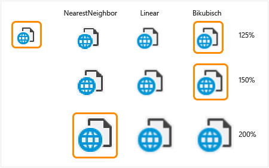

# <a name="addressing-dpi-issues"></a>Adressieren von DPI-Probleme
Eine zunehmende Anzahl von Geräten, die mit "Auflösung" Bildschirme geliefert werden. Diese Seiten sind in der Regel über 200 Pixel pro Zoll (Ppi). Arbeiten mit einer Anwendung auf diesen Computern ist Inhalt skaliert werden, um den Bedürfnissen Anzeigen des Inhalts in einer normalen Ansicht Entfernung für das Gerät erforderlich. Stand 2014 ist die primäre Zielgruppe für PHP-zeigt mobiler Geräte (Tablets, Laptops Schalenkoffer und Telefone) berechnen.  
  
 Windows 8.1 und höher enthält zahlreiche Features, aktivieren diese Computer mithilfe des angezeigt wird und die Umgebungen, in denen der Computer ist für beide PHP-angefügt und Standard-Dichte gleichzeitig angezeigt.  
  
-   Windows kann Ihnen ermöglichen, die Inhalte werden skaliert und das Gerät mithilfe des "Stellen Text und andere Elemente vergrößern oder verkleinern" (verfügbar ab Windows XP) festlegen.  
  
-   Windows 8.1 und höher kann automatisch Inhalt für die meisten Anwendungen konsistent, wenn zwischen der unterschiedlichen Pixel dichten verschoben skaliert werden. Wenn die primäre Anzeige – hohe Dichte (200 % Skalierung ist) und die sekundäre Anzeige ist standard Dichte (100 %), Windows wird automatisch Herunterskalieren der Fensterinhalt der Anwendung auf dem sekundären (1 Pixel angezeigt, die für jede 4 Pixel gerendert werden, indem Sie die die Anwendung).  
  
-   Windows wird standardmäßig auf das Recht für die Pixeldichte Skalierung und Abstand für die Anzeige (Windows 7 und höher, OEM konfigurierbare) anzeigen.  
  
-   Windows kann automatisch Inhalt von 250 % auf neuen Geräten skalieren, die 280 Ppi (As of Windows 8.1 S14) überschreiten.  
  
 Windows verfügt über einen Weg zum Umgang mit Zentrales Skalieren UI erhöhte Pixel Anzahlen nutzen. Eine Anwendung für die Teilnahme dieses System durch Deklarieren selbst "System DPI-fähig". Anwendungen, die dies nicht tun, werden vom System skaliert. Dies kann zu einer "Fuzzyübereinstimmung" Benutzeroberfläche führen, in dem die gesamte Anwendung gleichmäßig auf die Pixels gestreckt wird. Zum Beispiel:  
  
   
  
 Visual Studio "OPTS" in DPI-Skalierung-fähig, und daher nicht "virtualisiert."  
  
 Windows (und Visual Studio) nutzen mehrere UI-Technologien, die unterschiedliche Methoden zum Umgang mit Skalierung Faktoren, die vom System festgelegt haben. Zum Beispiel:  
  
-   WPF misst die Steuerelemente auf eine Weise geräteunabhängige (Einheiten, nicht in Pixel). WPF UI werden automatisch für die aktuelle DPI skaliert.  
  
-   Alle Textgrößen unabhängig von Benutzeroberflächen-Framework in Punkten ausgedrückt werden und werden daher vom System als DPI-unabhängige behandelt. Text in Win32- und WinForms WPF bereits skalieren ordnungsgemäß, wenn auf dem Anzeigegerät gezeichnet.  
  
-   Win32/WinForms-Dialogfeldern und Fenstern haben die notwendigen Mittel zum Aktivieren der Layouts, das Text -, z. B. durch das Raster, Datenfluss und Tabelle LayoutPanel-Elemente ändert. Diese ermöglichen das Vermeiden von hartcodierten Pixel-Speicherorte, die nicht skaliert werden, wenn die Schriftgrade Ihren Bedürfnissen erhöht werden.  
  
-   Symbole, die vom System bereitgestellten oder Ressourcen basierend auf Systemmetriken (z. B. SM_CXICON zugeordnet und SM_CXSMICON zugeordnet) sind bereits skaliert.  
  
## <a name="older-win32-gdi-gdi-and-winforms-based-ui"></a>Ältere Win32 (GDI, GDI +) und WinForms-basierte Benutzeroberfläche  
 Während WPF bereits hohe DPI-fähig ist, wurde Großteil des getesteten Codes Win32/GDI-basierten nicht ursprünglich mit der DPI-Ausführung Bedenken geschrieben. Windows-APIs DPI-Skalierung angegeben. Updates für Win32-Probleme sollten diese einheitlich über das Produkt verwenden. Visual Studio stellt eine Hilfsprogramm der Klassenbibliothek um Funktionen dupliziert und Gewährleistung der Konsistenz gesamten Produkt zu vermeiden.  
  
## <a name="high-resolution-images"></a>Hochauflösende Bilder  
 Dieser Abschnitt ist in erster Linie für Entwickler, die Visual Studio 2013 erweitern. Verwenden Sie für Visual Studio 2015 Image-Dienst in Visual Studio integriert ist. Sie können auch feststellen, dass Sie Support-Ziel viele Versionen von Visual Studio müssen, und daher mit der Image-Dienst in 2015 kann nicht verwendet werden, da sie in früheren Versionen nicht vorhanden ist. In diesem Abschnitt wird auch dann für Sie.  
  
## <a name="scaling-up-images-that-are-too-small"></a>Zentrale Skalieren von Bildern, die zu klein sind.  
 Bilder, die zu klein sind, können "skaliert" und auf GDI und einige allgemeinen Methoden mit WPF gerendert werden. Verwaltete DPI-Hilfsklassen stehen internen und externen Visual Studio-Integratoren Skalierung, Symbole, Bitmaps, Imagestrips und Imagelists Adresse. Win32-basierte systemeigenen C / C ++ Hilfsmethoden für die Skalierung HICON, HBITMAP HIMAGELIST und VsUI::GdiplusImage verfügbar sind. Skalieren einer Bitmap in der Regel erfordert nur eine einzeilige Änderung nach dem einen Verweis auf die Hilfsbibliothek einschließen. Zum Beispiel:  
  
```cpp  
(Unmanaged)  VsUI::DpiHelper::LogicalToDeviceUnits(&hBitmap);  
```  
  
```csharp  
(WinForms) DpiHelper.LogicalToDeviceUnits(ref image);  
```  
  
 Skalieren einer Imagelist, hängt davon ab, ob die Imagelist zur Ladezeit abgeschlossen ist, oder zur Laufzeit angefügt wird. Wenn Sie zur Ladezeit abgeschlossen ist, rufen Sie LogicalToDeviceUnits() mit der Imagelist wie eine Bitmap. Wenn der Code eine einzelne Bitmap zu laden, bevor Sie die Imagelist verfassen muss, stellen Sie sicher, um die Bildgröße der Imagelist skalieren:  
  
```csharp  
imagelist.ImageSize = DpiHelper.LogicalToDeviceUnits(imagelist.ImageSize);  
```  
  
 In systemeigenem Code können die Dimensionen skaliert werden, für die Erstellung die Imagelist wie folgt:  
  
```cpp  
ImageList_Create(VsUI::DpiHelper::LogicalToDeviceUnitsX(16),VsUI::DpiHelper::LogicalToDeviceUnitsY(16), ILC_COLOR32|ILC_MASK, nCount, 1);  
```  
  
 Funktionen in der Bibliothek ermöglichen das Ändern der Größe Algorithmus angeben. Wenn Skalierung Bilder in Imagelists, platziert werden Stellen Sie sicher, dass die Farbe des Hintergrunds angeben, für die Transparenz verwendet wird, oder NearestNeighbor Skalierung (wodurch Verzerrung auf 125 % und 150 %) verwenden.  
  
 Wenden Sie sich an den <xref:Microsoft.VisualStudio.PlatformUI.DpiHelper> Dokumentation auf MSDN.  
  
 Die folgende Tabelle zeigt Beispiele wie Bilder mit entsprechenden DPI skaliert werden sollen Skalierungsfaktoren. Die Bilder in Grün bezeichnen unsere best Practice ab Visual Studio 2013 (100-200 % DPI-Skalierung):  
  
   
  
## <a name="layout-issues"></a>Probleme mit dem Layout  
 Häufige Probleme mit dem Layout können in erster Linie durch das Schützen von Punkten in der Benutzeroberfläche, skaliert und relativ zueinander positioniert statt absolute Positionen (insbesondere in Pixeleinheiten) vermieden werden. Zum Beispiel:  
  
-   Layout-Text-Positionen müssen Konto für DPMS Bilder anpassen.  
  
-   Spalten im Raster müssen Breiten für den erweiterten Text angepasst haben.  
  
-   Hartcodierte Größen oder Raum zwischen Elementen müssen auch skaliert werden. Größen, die nur für Text Dimensionen basieren sind normalerweise gut, da Schriftarten automatisch skaliert werden.  
  
 Hilfsfunktionen stehen in der <xref:Microsoft.VisualStudio.PlatformUI.DpiHelper> Klasse ermöglichen die Skalierung auf der X- und Y-Achse:  
  
-   LogicalToDeviceUnitsX/LogicalToDeviceUnitsY (Funktionen ermöglichen die Skalierung auf X / Y-Axis)  
  
-   Int Speicherplatz = DpiHelper.LogicalToDeviceUnitsX (10);  
  
-   Int-Höhe = VsUI::DpiHelper::LogicalToDeviceUnitsY(5);  
  
 Es gibt LogicalToDeviceUnits Überladungen zu ermöglichen, Objekte, z. B. Rect, Zeitpunkt und Größe skalieren.  
  
## <a name="using-the-dpihelper-libraryclass-to-scale-images-and-layout"></a>Mithilfe der DPIHelper/Bibliotheksklasse zum Skalieren von Bildern und layout  
 Der Visual Studio-DPI-Hilfsbibliothek steht in systemeigenen und verwalteten Formulare und außerhalb von Visual Studio-Shell von anderen Anwendungen verwendet werden kann.  
  
 Um die Bibliothek zu verwenden, wechseln Sie zu der [Beispiele für Visual Studio VSSDK Erweiterbarkeit](https://github.com/Microsoft/VSSDK-Extensibility-Samples) und Klonen von hoher DPI_Images_Icons-Beispiel  
  
 Klicken Sie in Quelldateien enthalten Sie VsUIDpiHelper.h, und rufen Sie die statischen Funktionen VsUI::DpiHelper-Klasse:  
  
```cpp  
#include "VsUIDpiHelper.h"  
  
int cxScaled = VsUI::DpiHelper::LogicalToDeviceUnitsX(cx);  
VsUI::DpiHelper::LogicalToDeviceUnits(&hBitmap);  
  
```  
  
> [!NOTE]
>  Verwenden Sie nicht die Hilfsfunktionen in auf Modulebene oder auf Klassenebene statischen Variablen. Die Bibliothek verwendet auch statische Variablen für die Threadsynchronisierung und in Reihenfolge-Initialisierungsprobleme ausführen kann. Konvertieren Sie diese statische Variablen in nicht statischen Membervariablen oder in einer Funktion umschlossen Sie (damit sie beim ersten Zugriff erstellt abrufen).  
  
 Um die DPI-Hilfsfunktionen in verwaltetem Code zugreifen zu können, die in der Visual Studio-Umgebung ausgeführt wird:  
  
-   Die verbrauchende Projekt muss die neueste Version der Shell MPF verweisen. Zum Beispiel:  
  
    ```csharp  
    <Reference Include="Microsoft.VisualStudio.Shell.14.0.dll" />  
    ```  
  
-   Stellen Sie sicher, das Projekt verfügt über Verweise auf **"System.Windows.Forms"**, **PresentationCore**, und **PresentationUI**.  
  
-   Verwenden Sie im Code die **Microsoft.VisualStudio.PlatformUI** Namespace, und rufen eine statische Funktionen DpiHelper-Klasse. Unterstützte Typen (Points, Größe, Rechtecke, usw.) sind bereitgestellt Erweiterungsfunktionen, die neue zurückgeben Objekten skaliert. Zum Beispiel:  
  
    ```csharp  
    using Microsoft.VisualStudio.PlatformUI;  
    double x = DpiHelper.LogicalToDeviceUnitsX(posX);  
    Point ptScaled = ptOriginal.LogicalToDeviceUnits();  
    DpiHelper.LogicalToDeviceUnits(ref bitmap);  
  
    ```  
  
## <a name="dealing-with-wpf-image-fuzziness-in-zoomable-ui"></a>Umgang mit WPF Image Unschärfe zoombarem Benutzeroberfläche  
 In WPF werden Bitmaps eine automatische größenanpassung von WPF für den aktuellen Zoomfaktor für DPI mithilfe eines Algorithmus für qualitativ hochwertige Bikubisch (Standard), eignet sich gut für Bilder oder große Screenshots, aber ist für die Elementsymbole Menü ungeeignet, da es wahrgenommene Unschärfe führt .  
  
 Empfehlungen:  
  
-   Für das Logo, Bild und Banner Grafik, die Standardeinstellung <xref:System.Windows.Media.BitmapScalingMode> Größenänderung Modus verwendet werden.  
  
-   Für Menüelemente und Iconography Bilder die <xref:System.Windows.Media.BitmapScalingMode> sollte verwendet werden, wenn es nicht dazu, dass andere Artefakte Verzerrung Unschärfe (auf 200 und 300 %) zu vermeiden.  
  
-   Für große Zoom Zugriffsebenen, die kein Vielfaches von 100 % (z. B. 250 % oder 350 %), führt Skalieren von Bildern von Iconography mit Bikubisch fuzzy, verwaschener UI. Ein besseres Ergebnis wird durch die erste Skalieren des Bilds mit NearestNeighbor zum größten Vielfachen von 100 % (z. B. 200 % oder 300 %) und Skalierung bei Bikubisch von dort abgerufen. Finden Sie unter Sonderfall: WPF-Images für große DPI prescaling cachefreigabeebenen für Weitere Informationen.  
  
 Die DpiHelper-Klasse im Namespace Microsoft.VisualStudio.PlatformUI einen Elementnamen enthält <xref:System.Windows.Media.BitmapScalingMode> , die für die Bindung verwendet werden kann. Der Visual Studio-Shell zu steuern, die die Skalierung von Bitmaps Modus gesamten Produkt einheitlich, abhängig von der DPI-Skalierungsfaktor wird zugelassen.  
  
 Um es in XAML verwenden, fügen Sie Folgendes hinzu:  
  
```xaml  
xmlns:vsui="clr-namespace:Microsoft.VisualStudio.PlatformUI;assembly=Microsoft.VisualStudio.Shell.14.0"  
  
<Setter Property="RenderOptions.BitmapScalingMode" Value="{x:Static vs:DpiHelper.BitmapScalingMode}" />  
  
```  
  
 Die Visual Studio-Shell wird diese Eigenschaft bereits Fenster auf oberster Ebene und Dialogfelder. WPF-basierte Benutzeroberfläche, die in Visual Studio ausgeführt wird, bereits es erbt. Wenn die Einstellung, die bestimmte Teile der Benutzeroberfläche nicht weitergegeben wird, können sie auf das Stammelement der XAML/WPF-Benutzeroberfläche festgelegt werden. In dem in diesem Fall, stellen umfassen Popups auf Win32-übergeordnete Elemente, und Designerfenstern, die ausgeführt werden, der verarbeitet werden, beispielsweise Blend.  
  
 Einige UI kann unabhängig von der System-Set-DPI Zoomstufe, z. B. Visual Studio-Texteditor und WPF-basierten Designer (WPF-Desktop und Windows Store) skaliert werden. In diesen Fällen sollte DpiHelper.BitmapScalingMode nicht verwendet werden. Zur Behebung dieses Problems im Editor die IDE-Team erstellt eine benutzerdefinierte Eigenschaft mit dem Titel RenderOptions.BitmapScalingMode. Legen Sie diese Eigenschaftswert HighQuality oder NearestNeighbor, je nach den kombinierten Zoomstufe des Systems und die Benutzeroberfläche.  
  
## <a name="special-case-prescaling-wpf-images-for-large-dpi-levels"></a>Sonderfall: prescaling WPF-Images für große DPI Ebenen  
 Für sehr große Zoomfaktoren, die nicht Vielfachen von 100 % (z. B. 250 %, 350 % usw.), Skalierung Iconography Bilder mit Bikubisch-Ergebnissen in fuzzy, verwaschener UI. Der Eindruck dieser Bilder neben scharfe-Text ist fast wie eine optische Illusion. Die Bilder angezeigt werden, die näher zu und unscharf in Bezug auf den Text sein. Die Skalierung Ergebnis bei dieser vergrößerten Größe kann verbessert werden, vom ersten Skalieren des Bilds mit NearestNeighbor zum größten Vielfachen von 100 % (z. B. 200 % oder 300 %) und Skalierung bei Bikubisch für den Rest (zusätzliche 50 %).  
  
 Folgender Ausdruck ist ein Beispiel für die Unterschiede in den Ergebnissen, in dem das erste Bild skaliert wird mit dem verbesserte Skalierung Double-Algorithmus 100 % -> 200 % -> 250 % und dem zweiten Ausdruck nur bei Bikubisch 100 % -> 250 %.  
  
   
  
 Damit können die Benutzeroberfläche zum Anzeigen jedes Image-Element dieser Double Skalierung kann die Verwendung von XAML-Markup müssen geändert werden. Die folgenden Beispiele veranschaulichen die Verwendung von Double-Skalierung in WPF in Visual Studio unter Verwendung des DpiHelper-Bibliothek und Shell.12/14.  
  
 Schritt 1: Prescale das Bild auf 200 %, 300 % usw. NearestNeighbor verwenden.  
  
 Prescale das Image mithilfe von entweder einen Konverter für eine Bindung oder mit einer XAML-Markuperweiterung angewendet. Zum Beispiel:  
  
```xaml  
<vsui:DpiPrescaleImageSourceConverter x:Key="DpiPrescaleImageSourceConverter" />  
  
<Image Source="{Binding Path=SelectedImage, Converter={StaticResource DpiPrescaleImageSourceConverter}}" Width="16" Height="16" />  
  
<Image Source="{vsui:DpiPrescaledImage Images/Help.png}" Width="16" Height="16" />  
  
```  
  
 Wenn das Image auch Design angewendet werden muss muss (die meisten, wenn nicht alle sollten), das Markup können einen anderen Konverter, das zuerst Designumgebung des Images, und klicken Sie dann vorab Skalierung durchführt. Das Markup können entweder <xref:Microsoft.VisualStudio.PlatformUI.DpiPrescaleThemedImageConverter> oder <xref:Microsoft.VisualStudio.PlatformUI.DpiPrescaleThemedImageSourceConverter>, je nachdem, auf die gewünschte Konvertierung-Ausgabe.  
  
```xaml  
<vsui:DpiPrescaleThemedImageSourceConverter x:Key="DpiPrescaleThemedImageSourceConverter" />  
  
<Image Width="16" Height="16">  
  <Image.Source>  
    <MultiBinding Converter="{StaticResource DpiPrescaleThemedImageSourceConverter}">  
      <Binding Path="Icon" />  
      <Binding Path="(vsui:ImageThemingUtilities.ImageBackgroundColor)"    
               RelativeSource="{RelativeSource Self}" />  
      <Binding Source="{x:Static vsui:Boxes.BooleanTrue}" />  
    </MultiBinding>  
  </Image.Source>  
</Image>  
```  
  
 Schritt 2: Stellen Sie sicher, dass die endgültige Größe für den aktuellen DPI-Wert korrekt ist.  
  
 Da WPF die Benutzeroberfläche für den aktuellen DPI-Wert mithilfe der BitmapScalingMode-Eigenschaft, legen Sie für die UIElement skaliert werden, sollten ein Image-Steuerelement mit einem prescaled-Image aus, wie seine Quelle, zwei oder drei Mal größer als sehen. Im folgenden finden mehrere Möglichkeiten, die Auswirkung dieser Leistungsindikator:  
  
-   Wenn Sie die Dimension des ursprünglichen Bilds bei 100 % kennen, können Sie die genaue Größe des Image-Steuerelements angeben. Diese Größen wider, dass die Größe der Benutzeroberfläche vor der Skalierung angewendet wird.  
  
    ```xaml  
    <Image Source="{Binding Path=SelectedImage, Converter={StaticResource DpiPrescaleImageSourceConverter}}" Width="16" Height="16" />  
    ```  
  
-   Wenn die ursprüngliche Bildgröße nicht bekannt ist, kann eine LayoutTransform zentral herunterskaliert das endgültige Image-Objekt verwendet werden. Zum Beispiel:  
  
    ```xaml  
    <Image Source="{Binding Path=SelectedImage, Converter={StaticResource DpiPrescaleImageSourceConverter}}" >  
        <Image.LayoutTransform>  
         <ScaleTransform  
             ScaleX="{x:Static vsui:DpiHelper.PreScaledImageLayoutTransformScale}"  
             ScaleY="{x:Static vsui:DpiHelper.PreScaledImageLayoutTransformScale}" />  
        </Image.LayoutTransform>  
    </Image>  
    ```  
  
## <a name="enabling-hdpi-support-to-the-weboc"></a>HDPI-Support, um die WebOC aktivieren  
 Standardmäßig aktivieren nicht WebOC-Steuerelemente (z. B. das WebBrowser-Steuerelement in den WPF- oder IWebBrowser2-Schnittstelle) HDPI-Erkennung und Support. Das Ergebnis wird ein eingebettetes Steuerelement mit Inhalt angezeigt werden, die auf einem hochauflösenden zu klein ist. Im folgenden wird beschrieben, wie zum Aktivieren der Unterstützung von hoher DPI-Einstellung in einer bestimmten Web WebOC-Instanz.  
  
 Implementieren Sie die IDocHostUIHandler-Schnittstelle (finden Sie im MSDN-Artikel auf der [IDocHostUIHandler](http://msdn.microsoft.com/library/aa753260.aspx) Schnittstelle):  
  
```idl  
[ComImport, InterfaceType(ComInterfaceType.InterfaceIsIUnknown),  
 Guid("BD3F23C0-D43E-11CF-893B-00AA00BDCE1A")]  
public interface IDocHostUIHandler  
{  
    [return: MarshalAs(UnmanagedType.I4)]  
    [PreserveSig]  
    int ShowContextMenu(  
        [In, MarshalAs(UnmanagedType.U4)] int dwID,  
        [In] POINT pt,  
        [In, MarshalAs(UnmanagedType.Interface)] object pcmdtReserved,  
        [In, MarshalAs(UnmanagedType.IDispatch)] object pdispReserved);  
    [return: MarshalAs(UnmanagedType.I4)]  
    [PreserveSig]  
    int GetHostInfo([In, Out] DOCHOSTUIINFO info);  
    [return: MarshalAs(UnmanagedType.I4)]  
    [PreserveSig]  
    int ShowUI(  
        [In, MarshalAs(UnmanagedType.I4)] int dwID,  
        [In, MarshalAs(UnmanagedType.Interface)] object activeObject,  
        [In, MarshalAs(UnmanagedType.Interface)] object commandTarget,  
        [In, MarshalAs(UnmanagedType.Interface)] object frame,  
        [In, MarshalAs(UnmanagedType.Interface)] object doc);  
    [return: MarshalAs(UnmanagedType.I4)]  
    [PreserveSig]  
    int HideUI();  
    [return: MarshalAs(UnmanagedType.I4)]  
    [PreserveSig]  
    int UpdateUI();  
    [return: MarshalAs(UnmanagedType.I4)]  
    [PreserveSig]  
    int EnableModeless([In, MarshalAs(UnmanagedType.Bool)] bool fEnable);  
    [return: MarshalAs(UnmanagedType.I4)]  
    [PreserveSig]  
    int OnDocWindowActivate([In, MarshalAs(UnmanagedType.Bool)] bool fActivate);  
    [return: MarshalAs(UnmanagedType.I4)]  
    [PreserveSig]  
    int OnFrameWindowActivate([In, MarshalAs(UnmanagedType.Bool)] bool fActivate);  
    [return: MarshalAs(UnmanagedType.I4)]  
    [PreserveSig]  
    int ResizeBorder(  
        [In] COMRECT rect,  
        [In, MarshalAs(UnmanagedType.Interface)] object doc,  
        bool fFrameWindow);  
    [return: MarshalAs(UnmanagedType.I4)]  
    [PreserveSig]  
    int TranslateAccelerator(  
        [In] ref MSG msg,  
        [In] ref Guid group,  
        [In, MarshalAs(UnmanagedType.I4)] int nCmdID);  
    [return: MarshalAs(UnmanagedType.I4)]  
    [PreserveSig]  
    int GetOptionKeyPath(  
        [Out, MarshalAs(UnmanagedType.LPArray)] string[] pbstrKey,  
        [In, MarshalAs(UnmanagedType.U4)] int dw);  
    [return: MarshalAs(UnmanagedType.I4)]  
    [PreserveSig]  
    int GetDropTarget(  
        [In, MarshalAs(UnmanagedType.Interface)] IOleDropTarget pDropTarget,  
        [MarshalAs(UnmanagedType.Interface)] out IOleDropTarget ppDropTarget);  
    [return: MarshalAs(UnmanagedType.I4)]  
    [PreserveSig]  
    int GetExternal([MarshalAs(UnmanagedType.IDispatch)] out object ppDispatch);  
    [return: MarshalAs(UnmanagedType.I4)]  
    [PreserveSig]  
    int TranslateUrl(  
        [In, MarshalAs(UnmanagedType.U4)] int dwTranslate,  
        [In, MarshalAs(UnmanagedType.LPWStr)] string strURLIn,  
        [MarshalAs(UnmanagedType.LPWStr)] out string pstrURLOut);  
    [return: MarshalAs(UnmanagedType.I4)]  
    [PreserveSig]  
    int FilterDataObject(  
        IDataObject pDO,  
        out IDataObject ppDORet);  
    }   
```  
  
 Implementieren Sie optional die ICustomDoc-Schnittstelle (finden Sie im MSDN-Artikel auf der [ICustomDoc](http://msdn.microsoft.com/library/aa753272.aspx) Schnittstelle):  
  
```idl  
[InterfaceType(ComInterfaceType.InterfaceIsIUnknown),  
 Guid("3050F3F0-98B5-11CF-BB82-00AA00BDCE0B")]  
public interface ICustomDoc  
{  
    void SetUIHandler(IDocHostUIHandler pUIHandler);  
}   
```  
  
 Ordnen Sie die Klasse, die mit der WebOC Dokument IDocHostUIHandler implementiert. Wenn Sie die oben genannten ICustomDoc-Schnittstelle implementiert, hat als das WebOC Dokumenteigenschaft gültig ist, wird Umwandeln Sie es in ein ICustomDoc und rufen Sie die SetUIHandler-Methode, die IDocHostUIHandler implementierende Klasse übergeben.  
  
```csharp  
// "this" references that class that owns the WebOC control and in this case also implements the IDocHostUIHandler interface  
ICustomDoc customDoc = (ICustomDoc)webBrowser.Document;  
customDoc.SetUIHandler(this);  
  
```  
  
 Wenn Sie die ICustomDoc-Schnittstelle nicht implementiert wurde, klicken Sie dann müssen, sobald die WebOC Dokumenteigenschaft gültig ist, wird Sie es IOleObject umgewandelt, und rufen Sie die SetClientSite-Methode, die in die IDocHostUIHandler implementierende Klasse übergeben. Legen Sie das Flag DOCHOSTUIFLAG_DPI_AWARE für die DOCHOSTUIINFO an den GetHostInfo-Methodenaufruf übergeben:  
  
```csharp  
public int GetHostInfo(DOCHOSTUIINFO info)  
{  
    // This is what the default site provides.  
    info.dwFlags = (DOCHOSTUIFLAG)0x5a74012;  
    // Add the DPI flag to the defaults  
    info.dwFlags |=.DOCHOSTUIFLAG.DOCHOSTUIFLAG_DPI_AWARE;  
    return S_OK;  
}  
```  
  
 Dies sollten alle sein, die das Steuerelement WebOC HPDI unterstützen abrufen müssen.  
  
## <a name="tips"></a>Tipps  
  
1.  Wenn die Document-Eigenschaft für das Steuerelement WebOC geändert wird, müssen Sie das Dokument mit der Klasse IDocHostUIHandler neu zuordnen.  
  
2.  Wenn die oben genannten Kriterien nicht funktioniert, besteht ein Problem mit der WebOC heben Sie die Änderung auf dem DPI-Flag nicht bekanntes. Die zuverlässigste Möglichkeit beheben Dies ist der optischen Zoom die WebOC Bedeutung zwei Aufrufe mit zwei unterschiedliche Werte für den Zoomprozentwert aktivieren bzw. deaktivieren. Darüber hinaus, wenn diese problemumgehung erforderlich ist, kann es erforderlich, führen Sie es bei jedem Aufruf navigieren sein.  
  
    ```csharp  
    // browser2 is a SHDocVw.IWebBrowser2 in this case  
    // EX: Call the Exec twice with DPI%-1 and then DPI% as the zoomPercent values  
    IOleCommandTarget cmdTarget = browser2.Document as IOleCommandTarget;  
    if (cmdTarget != null)  
    {  
        object commandInput = zoomPercent;  
        cmdTarget.Exec(IntPtr.Zero,  
                       OLECMDID_OPTICAL_ZOOM,  
                       OLECMDEXECOPT_DONTPROMPTUSER,  
                       ref commandInput,  
                       ref commandOutput);  
    }  
    ```