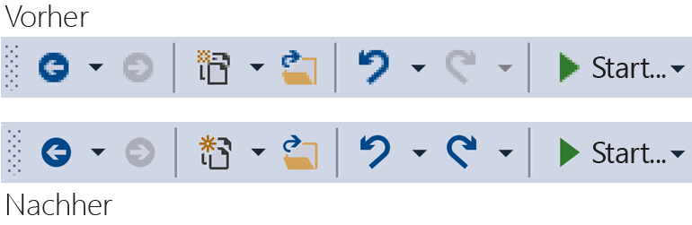
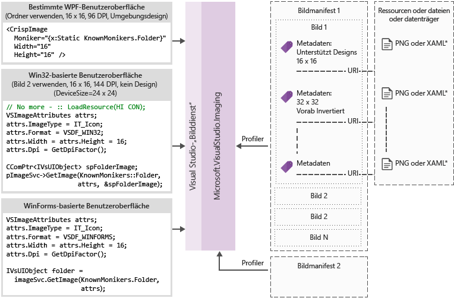

# <a name="image-service-and-catalog"></a>Bilddienst und-Katalog
Dieser Richtlinie enthält Anleitungen und bewährte Methoden für den Umstieg auf den Dienst für Visual Studio-Images und Image-Katalog, die in Visual Studio 2015 eingeführt.  
  
 Der Image-Dienst, eingeführt in Visual Studio 2015 ermöglicht Entwicklern die besten Bilder für das Gerät und das ausgewählte Design des Benutzers, zum Anzeigen des Bilds an, einschließlich des richtigen Designs für den Kontext, in dem sie angezeigt werden. Einführung des Diensts für Images können wichtige Problembereiche im Zusammenhang mit Asset-Wartung, HDPI Skalierung und Designs zu vermeiden.  
  
|||  
|-|-|  
|**Probleme noch heute**|**Projektmappen**|  
|Hintergrund Kombination von Farbe|Integrierte Alphablending|  
|Design (einige)-images|Design-Metadaten|  
|Modus für hohe Kontraste|Alternative Ressourcen von hohem Kontrast|  
|Benötigen Sie mehrere Ressourcen für unterschiedliche DPI-Modi|Auswählbar-Ressourcen mit vektorbasierte fallback|  
|Doppelten Bildern|Ein Bezeichner pro Image-Konzept|  
  
 Warum einführen den Image-Dienst?  
  
- Erhalten Sie immer das neueste "pixelgenauen" Image aus Visual Studio  
  
- Sie senden können, und verwenden Sie Ihre eigenen images  
  
- Nicht erforderlich, Testen Ihre Images, wenn Windows neue DPI-Skalierung fügt  
  
- Alte Architektur Hürden in Ihrer Implementierung zu beheben  
  
  Der Visual Studio Shell-Symbolleiste, vor und nach der Verwendung des Image-Diensts:  
  
    
  
## <a name="how-it-works"></a>So funktioniert es
 Der Image-Dienst kann auf ein Bitmapbild geeignet für alle unterstützten UI-Frameworks angeben:  
  
- WPF: BitmapSource  
  
- WinForms: System.Drawing.Bitmap  
  
- Win32: HBITMAP  
  
  Bilddienst-Flussdiagramm  
  
    
  
  **Image-Moniker**  
  
  Ein Bild Moniker (oder der Moniker für die kurze) ist ein GUID-ID-Paar, das ein Standardimage-Medienobjekt oder die Liste bildanlage aus der Abbildbibliothek eindeutig identifiziert.  
  
  **Bekannte Moniker**  
  
  Der Satz von Image-Moniker, die in der Visual Studio-Image-Katalog und öffentlich verwendet werden können von Visual Studio-Komponente oder Erweiterung enthalten.  
  
  **Image-Manifestdateien**  
  
  Bildmanifest (*.imagemanifest*)-Dateien sind XML-Dateien, die einen Satz von Bildressourcen, die Moniker zu, die darstellen definieren, die Ressourcen, und die echten Bild oder Bilder, jedes Objekt darstellen. Bildmanifesten können eigenständige Bilder oder bilderlisten für ältere Benutzeroberflächenautomatisierungs-Unterstützung. Es gibt außerdem Attribute, die auf das Objekt oder auf die einzelnen Bilder hinter jedem Medienobjekt festgelegt werden können, zu ändern, wann und wie diese Objekte angezeigt werden.  
  
  **Image-manifest-schema**  
  
  Ein Abschließen des Images Manifest sieht folgendermaßen aus:  
  
```xml  
<ImageManifest>  
      <!-- zero or one Symbols elements -->  
      <Symbols>  
        <!-- zero or more Import, Guid, ID, or String elements -->  
      </Symbols>  
      <!-- zero or one Images elements -->  
      <Images>  
        <!-- zero or more Image elements -->  
      </Images>  
      <!-- zero or one ImageLists elements -->  
      <ImageLists>  
        <!-- zero or more ImageList elements -->  
      </ImageLists>  
</ImageManifest>  
```  
  
 **Symbole**  
  
 Wie einer besseren Lesbarkeit und die Wartung zu unterstützen, können die bildmanifest Symbole für Attributwerte. Symbole sind wie folgt definiert:  
  
```xml  
<Symbols>  
      <Import Manifest="manifest" />  
      <Guid Name="ShellCommandGuid" Value="8ee4f65d-bab4-4cde-b8e7-ac412abbda8a" />  
      <ID Name="cmdidSaveAll" Value="1000" />  
      <String Name="AssemblyName" Value="Microsoft.VisualStudio.Shell.UI.Internal" />  
</Symbols>  
```  
  
|||  
|-|-|  
|**Subelement**|**Definition**|  
|Importieren|Importiert die Symbole der angegebenen Manifestdatei zur Verwendung in das aktuelle manifest|  
|GUID|Das Symbol eine GUID darstellt, und Formatieren der GUID übereinstimmen|  
|ID|Das Symbol eine ID dar und muss eine nicht negative ganze Zahl sein|  
|Zeichenfolge|Das Symbol für eines beliebigen Zeichenfolgenwert|  
  
 Symbole sind Groß-/Kleinschreibung beachtet und die referenzierten $(symbol-name)-Syntax verwenden:  
  
```xml  
<Image Guid="$(ShellCommandGuid)" ID="$(cmdidSaveAll)" >  
      <Source Uri="/$(AssemblyName);Component/Resources/image.xaml" />  
</Image>  
```  
  
 Einige Symbole sind für alle Manifeste vordefiniert. Diese können verwendet werden, in der das Uri-Attribut der \<Quelle > oder \<Import >-Element zu Verweispfaden auf dem lokalen Computer.  
  
|||  
|-|-|  
|**Symbol**|**Beschreibung**|  
|CommonProgramFiles|Der Wert, der die Variable %CommonProgramFiles%-Umgebung|  
|LocalAppData|Der Wert der Umgebungsvariablen % LocalAppData% %|  
|ManifestFolder|Dem Ordner mit der Manifestdatei|  
|MyDocuments|Der vollständige Pfad des Ordners "Eigene Dateien" des aktuellen Benutzers|  
|ProgramFiles|Der Wert der Umgebungsvariablen % ProgramFiles %|  
|System|Die *"Windows\System32"* Ordner|  
|WinDir|Der Wert der Umgebungsvariable "WinDir"|  
  
 **Image**  
  
 Die \<Image >-Element definiert ein Bild, das einen Moniker verwiesen werden kann. Die GUID und ID, die zusammen bilden die Image-Moniker. Der Moniker für das Image muss innerhalb der gesamten Abbildbibliothek eindeutig sein. Wenn mehr als ein Bild ein angegebenes Monikers verfügt, wird die erste Bedingung, die beim Erstellen der Bibliotheks gefunden, die beibehalten werden.  
  
 Es muss mindestens eine Quelle enthalten. Größe neutrale Quellen erhalten die besten Ergebnisse für eine Vielzahl von Größen, aber sie sind nicht erforderlich. Wenn der Dienst für ein Bild mit einer Größe, die nicht in definierte aufgefordert wird die \<Image >-Element und es ist keine Größe Neutral Quelle ist, wird der Dienst, wählen Sie die beste Quelle für spezifische Größe und skalieren Sie sie auf die angeforderte Größe.  
  
```xml  
<Image Guid="guid" ID="int" AllowColorInversion="true/false">  
      <Source ... />  
      <!-- optional additional Source elements -->  
</Image>  
```  
  
|||  
|-|-|  
|**Attribut**|**Definition**|  
|GUID|[Erforderlich] Der GUID-Teil der Image-moniker|  
|ID|[Erforderlich] Die ID-Teil der Image-moniker|  
|AllowColorInversion|[Optional, Standardwert "true"] Gibt an, ob das Bild seine Farben umgekehrt programmgesteuert, wenn auf einen dunklen Hintergrund verwendet werden kann.|  
  
 **Quelle**  
  
 Die \<Source >-Element definiert ein einzelnes Abbild quellmedienobjekt (XAML und PNG).  
  
```xml  
<Source Uri="uri" Background="background">  
      <!-- optional NativeResource element -->  
 </Source>  
```  
  
|||  
|-|-|  
|**Attribut**|**Definition**|  
|URI|[Erforderlich] Ein URI, der definiert, in dem das Bild aus geladen werden können. Sie können eine der folgenden sein:<br /><br /> -Ein [Paket-URI](/dotnet/framework/wpf/app-development/pack-uris-in-wpf) mithilfe der Anwendung: / / / der Autorität<br />– Ein Ressourcenverweis absolute-Komponente<br />– Ein Pfad zu einer Datei enthält eine systemeigene Ressource|  
|Hintergrund|[Optional] Gibt an, was von der Art des Hintergrunds, die die Quelle verwendet werden soll.<br /><br /> Sie können eine der folgenden sein:<br /><br /> *Licht:* Die Quelle kann auf einen hellen Hintergrund verwendet werden.<br /><br /> *Dunkel:* Die Quelle kann auf einen dunklen Hintergrund verwendet werden.<br /><br /> *HighContrast:* Die Quelle kann auf eine im Hintergrund laufende im Modus für hohe Kontraste verwendet werden.<br /><br /> *HighContrastLight:* Die Quelle kann auf einen hellen Hintergrund im Modus für hohe Kontraste verwendet werden.<br /><br /> *HighContrastDark:* Die Quelle kann auf einen dunklen Hintergrund im Modus für hohe Kontraste verwendet werden.<br /><br /> Wenn das Background-Attribut weggelassen wird, kann die Quelle auf eine im Hintergrund laufende verwendet werden.<br /><br /> Wenn der Hintergrund ist *Licht*, *dunkel*, *HighContrastLight*, oder *HighContrastDark*, der Quelle Farben sind nicht umgekehrt. Wenn Hintergrund ausgelassen oder legen Sie auf *hohem Kontrast*, der die Umkehrung der Farben von der Quelle wird gesteuert, indem des Bilds **AllowColorInversion** Attribut.|  

|||  
  
 Ein \<Source >-Element kann nur jeweils eines der folgenden optionalen untergeordneten Elemente aufweisen:  
  
||||  
|-|-|-|  
|**Element**|**Attribute (alle erforderlich)**|**Definition**|  
|\<Size>|Wert|Die Quelle wird für Bilder mit der angegebenen Größe (in Geräteeinheiten) verwendet werden. Das Bild wird quadratisch sein.|  
|\<SizeRange>|MinSize, MaxSize|Die Quelle wird für Bilder aus "MinSize" auf MaxSize-Wert (in Geräteeinheiten) einschließlich verwendet werden. Das Bild wird quadratisch sein.|  
|\<Dimensionen >|Breite, Höhe|Die Quelle wird für Bilder mit der angegebenen Breite und Höhe (in Geräteeinheiten) verwendet werden.|  
|\<DimensionRange>|MinWidth, MinHeight,<br /><br /> MaxWidth, MaxHeight|Die Quelle wird einschließlich bei Abbildern für die minimale Breite/Höhe, die maximale Breite/Höhe (in Geräteeinheiten) verwendet werden.|  
  
 Ein \<Source >-Element kann auch einen optionalen aufweisen \<NativeResource > Unterelement, das definiert eine \<Quelle >, die aus einer nativen Assembly anstatt einer verwalteten Assembly geladen wird.  
  
```xml  
<NativeResource Type="type" ID="int" />  
```  
  
|||  
|-|-|  
|**Attribut**|**Definition**|  
|Typ|[Erforderlich] Der Typ der systemeigene Ressource entweder XAML oder PNG-Datei|  
|ID|[Erforderlich] Der ganzzahlige ID Teil der systemeigene Ressource|  
  
 **ImageList**  
  
 Die \<ImageList >-Element definiert eine Auflistung von Abbildern, die auf einem einzelnen Streifen zurückgegeben werden können. Das Entfernen wird bei Bedarf erstellt, je nach Bedarf.  
  
```xml  
<ImageList>  
      <ContainedImage Guid="guid" ID="int" External="true/false" />  
      <!-- optional additional ContainedImage elements -->  
 </ImageList>  
```  
  
|||  
|-|-|  
|**Attribut**|**Definition**|  
|GUID|[Erforderlich] Der GUID-Teil der Image-moniker|  
|ID|[Erforderlich] Die ID-Teil der Image-moniker|  
|Extern|[Optional, standardmäßig "false"] Gibt an, ob der Image-Moniker ein Bild in das aktuelle Manifest verweist.|  
  
 Der Moniker für das enthaltene Image keine auf ein Bild in das aktuelle Manifest definiert. Wenn das eigenständige Image aus der Abbildbibliothek gefunden werden kann, wird ein leeres Platzhalterbild an seiner Stelle verwendet werden.  
  
## <a name="using-the-image-service"></a>Verwenden des Image-Diensts  
  
### <a name="first-steps-managed"></a>Erste Schritte (verwaltet)  
 Um den Dienst Images verwenden zu können, müssen Sie Ihrem Projekt Verweise auf einige oder alle der folgenden Assemblys hinzufügen:  
  
-   *Microsoft.VisualStudio.ImageCatalog.dll*  
  
    -   Erforderlich, wenn Sie den integrierten Image-Katalog **KnownMonikers**.  
  
-   *Microsoft.VisualStudio.Imaging.dll*  
  
    -   Erforderlich, wenn Sie **CrispImage** und **ImageThemingUtilities** in Ihrer WPF-UI.
  
-   *Microsoft.VisualStudio.Imaging.Interop.14.0.DesignTime.dll*  
  
    -   Erforderlich, wenn Sie die **ImageMoniker** und **"ImageAttributes"** Typen.  
  
    -   **EmbedInteropTypes** sollte festgelegt werden, auf "true".  
  
-   *Microsoft.VisualStudio.Shell.Interop.14.0.DesignTime*  
  
    -   Erforderlich, wenn Sie die **IVsImageService2** Typ.  
  
    -   **EmbedInteropTypes** sollte festgelegt werden, auf "true".  
  
-   *Microsoft.VisualStudio.Utilities.dll*  
  
    -   Erforderlich, wenn Sie die **BrushToColorConverter** für die **ImageThemingUtilities.ImageBackgroundColor** in Ihrer WPF-UI.  
  
-   *Microsoft.VisualStudio.Shell.\<VSVersion>.0*  
  
    -   Erforderlich, wenn Sie die **IVsUIObject** Typ.  
  
-   *Microsoft.VisualStudio.Shell.Interop.10.0.dll*  
  
    -   Erforderlich, wenn Sie die Windows Forms-bezogene UI-Hilfsprogramme verwenden.  
  
    -   **EmbedInteropTypes** sollte festgelegt werden, auf "true"  
  
### <a name="first-steps-native"></a>Erste Schritte (systemeigen)  
 Um den Dienst Images verwenden zu können, müssen Sie einige oder alle der folgenden Header zu Ihrem Projekt hinzufügen:  
  
-   **KnownImageIds.h**  
  
    -   Erforderlich, wenn Sie den integrierten Image-Katalog **KnownMonikers**, jedoch nicht verwenden die **ImageMoniker** Typ, z. B. wenn die Rückgabe von Werten **IVsHierarchy GetGuidProperty**oder **GetProperty** aufrufen.  
  
-   **KnownMonikers.h**  
  
    -   Erforderlich, wenn Sie den integrierten Image-Katalog **KnownMonikers**.  
  
-   **ImageParameters140.h**  
  
    -   Erforderlich, wenn Sie die **ImageMoniker** und **"ImageAttributes"** Typen.  
  
-   **VSShell140.h**  
  
    -   Erforderlich, wenn Sie die **IVsImageService2** Typ.  
  
-   **ImageThemingUtilities.h**  
  
    -   Erforderlich, wenn Sie nicht den Image-Dienst verarbeiten Designs für Sie lassen können.  
  
    -   Verwenden Sie diesen Header nicht, wenn der Bilddienst Ihr Image-Design verarbeiten kann.  
  
-   **VSUIDPIHelper.h**  
  
    -   Erforderlich, wenn Sie die DPI-Hilfsprogramme verwenden, um den aktuellen DPI-Wert zu erhalten.  
  
## <a name="how-do-i-write-new-wpf-ui"></a>Wie schreibe ich die neuen WPF-UI?  
  
1.  Beginnen Sie mit der in der obigen erforderlichen Assemblyverweise hinzufügen zunächst die Schritte im Abschnitt zu Ihrem Projekt aus. Sie müssen nicht alle davon hinzufügen, fügen Sie also nur die Verweise, die Sie benötigen. (Hinweis: Wenn Sie verwenden, oder haben Zugriff auf **Farben** anstelle von **Pinsel**, können Sie den Verweis auf überspringen **Dienstprogramme**, da Sie den Konverter nicht benötigen.)  
  
2.  Wählen Sie das gewünschte Abbild aus, und rufen Sie den Moniker. Verwenden Sie eine **KnownMoniker**, oder verwenden Sie Ihre eigenen, wenn Sie Ihre eigenen benutzerdefinierten Images und Moniker verfügen.  
  
3.  Hinzufügen **CrispImages** zu Ihrem XAML. (Siehe Beispiel unten).  
  
4.  Legen Sie die **ImageThemingUtilities.ImageBackgroundColor** Eigenschaft in Ihrer Hierarchie der Benutzeroberfläche. (Dies sollte festgelegt werden, an dem Speicherort, in dem die Hintergrundfarbe ist bekannt, nicht unbedingt auf, die **CrispImage**.) (Siehe Beispiel unten).  
  
```xaml  
<Window  
  x:Class="WpfApplication.MainWindow"  
  xmlns="http://schemas.microsoft.com/winfx/2006/xaml/presentation"  
  xmlns:x="http://schemas.microsoft.com/winfx/2006/xaml"  
  xmlns:imaging="clr-namespace:Microsoft.VisualStudio.Imaging;assembly=Microsoft.VisualStudio.Imaging"  
  xmlns:theming="clr-namespace:Microsoft.VisualStudio.PlatformUI;assembly=Microsoft.VisualStudio.Imaging"  
  xmlns:utilities="clr-namespace:Microsoft.Internal.VisualStudio.Imaging;assembly=Microsoft.VisualStudio.Imaging"  
  xmlns:catalog="clr-namespace:Microsoft.VisualStudio.Imaging;assembly=Microsoft.VisualStudio.ImageCatalog"  
  Title="MainWindow" Height="350" Width="525" UseLayoutRounding="True">  
  <Window.Resources>  
    <utilities:BrushToColorConverter x:Key="BrushToColorConverter"/>  
  </Window.Resources>  
  <StackPanel Background="White" VerticalAlignment="Center"   
    theming:ImageThemingUtilities.ImageBackgroundColor="{Binding Background, RelativeSource={RelativeSource Self}, Converter={StaticResource BrushToColorConverter}}">  
    <imaging:CrispImage Width="16" Height="16" Moniker="{x:Static catalog:KnownMonikers.MoveUp}" />  
  </StackPanel>  
</Window>  
```  
  
 **Wie aktualisiere ich die vorhandenen WPF-UI?**  
  
 Aktualisieren von vorhandenen WPF-UI ist ein relativ einfacher Prozess, der aus drei grundlegenden Schritten besteht:  
  
1.  Ersetzen Sie den gesamten \<Image >-Elemente in der Benutzeroberfläche mit \<CrispImage > Elemente.  
  
2.  Ändern Sie die quellattributen Moniker-Attributen.  
  
    -   Wenn das Image sich nie ändert, und Sie **KnownMonikers**, klicken Sie dann statisch zu binden, ist diese Eigenschaft die **KnownMoniker**. (Siehe Beispiel oben).  
  
    -   Wenn das Image sich nie ändert, und Sie Ihr eigenes benutzerdefinierte Image verwenden, klicken Sie dann statisch binden Sie an Ihre eigenen Moniker.  
  
    -   Wenn das Bild ändern kann, binden Sie die Moniker-Attribut auf eine Code-Eigenschaft, die auf eigenschaftsänderungen benachrichtigt.  
  
3.  Legen Sie an einer beliebigen Stelle in der Hierarchie der Benutzeroberfläche, **ImageThemingUtilities.ImageBackgroundColor** , stellen Sie sicher, dass farbumkehrung ordnungsgemäß funktioniert.  
  
    -   Dies erfordert möglicherweise die Verwendung der **BrushToColorConverter** Klasse. (Siehe Beispiel oben).  
  
## <a name="how-do-i-update-win32-ui"></a>Wie aktualisiere ich die Win32-Benutzeroberfläche?  
 Fügen Sie Folgendes an Ihrem Code immer angezeigt, das Rohdaten laden von Bildern zu ersetzen. Wechseln Sie Werte für die Rückgabe von HBITMAPs nicht im Vergleich zu HICONs im Vergleich zu HIMAGELIST je nach Bedarf.  
  
 **Abrufen des Image-Diensts**  
  
```cpp  
CComPtr<IVsImageService2> spImgSvc;  
CGlobalServiceProvider::HrQueryService(SID_SVsImageService, &spImgSvc);  
```  
  
 **Das Image angefordert**  
  
```cpp  
ImageAttributes attr = { 0 };  
attr.StructSize      = sizeof(attributes);  
attr.Format          = DF_Win32;  
// IT_Bitmap for HBITMAP, IT_Icon for HICON, IT_ImageList for HIMAGELIST  
attr.ImageType       = IT_Bitmap;  
attr.LogicalWidth    = 16;  
attr.LogicalHeight   = 16;  
attr.Dpi             = VsUI::DpiHelper::GetDeviceDpiX();  
attr.Background      = 0xFFFFFFFF;  
// Desired RGBA color, if you don't use this, don't set IAF_Background below  
attr.Flags           = IAF_RequiredFlags | IAF_Background;  
  
CComPtr<IVsUIObject> spImg;  
// Replace this KnownMoniker with your desired ImageMoniker  
spImgSvc->GetImage(KnownMonikers::Blank, attributes, &spImg);  
  
```  
  
## <a name="how-do-i-update-winforms-ui"></a>Wie aktualisiere ich WinForms UI?  
 Fügen Sie Folgendes an Ihrem Code immer angezeigt, das Rohdaten laden von Bildern zu ersetzen. Wechseln Sie Werte für die Rückgabe von Bitmaps und Symbole, je nach Bedarf.  
  
 **Hilfreich, die using-Anweisung**  
  
```csharp  
using GelUtilities = Microsoft.Internal.VisualStudio.PlatformUI.Utilities;  
```  
  
 **Abrufen des Image-Diensts**  
  
```csharp  
// This or your preferred way of querying for Visual Studio services  
IVsImageService2 imageService = (IVsImageService2)Package.GetGlobalService(typeof(SVsImageService));  
  
```  
  
 **Fordern Sie das image**  
  
```csharp  
ImageAttributes attributes = new ImageAttributes  
{  
    StructSize    = Marshal.SizeOf(typeof(ImageAttributes)),  
    // IT_Bitmap for Bitmap, IT_Icon for Icon  
    ImageType     = (uint)_UIImageType.IT_Bitmap,  
    Format        = (uint)_UIDataFormat.DF_WinForms,  
    LogicalWidth  = 16,  
    LogicalHeight = 16,  
    // Desired RGBA color, if you don't use this, don't set IAF_Background below  
    Background    = 0xFFFFFFFF,  
    Flags = (uint)_ImageAttributesFlags.IAF_RequiredFlags | _ImageAttributesFlags.IAF_Background,  
};  
  
// Replace this KnownMoniker with your desired ImageMoniker  
IVsUIObject uIObj = imageService.GetImage(KnownMonikers.Blank, attributes);  
  
Bitmap bitmap = (Bitmap)GelUtilities.GetObjectData(uiObj); // Use this if you need a bitmap  
// Icon icon = (Icon)GelUtilities.GetObjectData(uiObj); // Use this if you need an icon  
  
```  
  
## <a name="how-do-i-use-image-monikers-in-a-new-tool-window"></a>Wie verwende ich die Image-Moniker in ein neues Toolfenster?  
 Die VSIX-Paket-Projektvorlage wurde für Visual Studio 2015 aktualisiert. Um ein neues Toolfenster zu erstellen, mit der rechten Maustaste auf das VSIX-Projekt, und wählen Sie **hinzufügen** > **neues Element** (**STRG**+**UMSCHALT** + **Ein**). Wählen Sie unter dem Knoten "Erweiterbarkeit" für die Projektsprache **benutzerdefinierten Toolfensters**, benennen Sie dem Toolfenster, und drücken Sie die **hinzufügen** Schaltfläche.  
  
 Hierbei handelt es sich um den Schlüssel stellen Moniker in einem Toolfenster verwenden. Befolgen Sie die Anweisungen für die einzelnen:  
  
1. Der Toolfenster-Registerkarte bei die Registerkarten klein (auch in verwendet die **STRG**+**Registerkarte** Fenster Switcher).  
  
    Fügen Sie diese Zeile an den Konstruktor für die abgeleitete Klasse die **ToolWindowPane** Typ:  
  
   ```csharp  
   // Replace this KnownMoniker with your desired ImageMoniker  
   this.BitmapImageMoniker = KnownMonikers.Blank;  
   ```  
  
2. Der Befehl, um das Fenster zu öffnen.  
  
    In der *VSCT* -Datei für das Paket, das Toolfenster Befehlsschaltfläche "Bearbeiten":  
  
   ```xml  
   <Button guid="guidPackageCmdSet" id="CommandId" priority="0x0100" type="Button">  
     <Parent guid="guidSHLMainMenu" id="IDG_VS_WNDO_OTRWNDWS1"/>  
     <!-- Replace this KnownMoniker with your desired ImageMoniker -->  
     <Icon guid="ImageCatalogGuid" id="Blank" />  
     <!-- Add this -->  
     <CommandFlag>IconIsMoniker</CommandFlag>  
     <Strings>  
       <ButtonText>MyToolWindow</ButtonText>  
     </Strings>  
   </Button>  
   ```  
  
   **Wie verwende ich die Image-Moniker in ein vorhandenes Toolfenster?**  
  
   Aktualisiert ein vorhandenes Toolfenster zum Image-Moniker verwenden, entspricht die Schritte zum Erstellen eines neuen Toolfensters.  
  
   Hierbei handelt es sich um den Schlüssel stellen Moniker in einem Toolfenster verwenden. Befolgen Sie die Anweisungen für die einzelnen:  
  
3. Der Toolfenster-Registerkarte bei die Registerkarten klein (auch in verwendet die **STRG**+**Registerkarte** Fenster Switcher).  
  
   1.  Entfernen Sie diese Zeilen (sofern vorhanden) im Konstruktor für die abgeleitete Klasse die **ToolWindowPane** Typ:  
  
       ```csharp  
       this.BitmapResourceID = <Value>;  
       this.BitmapIndex = <Value>;  
       ```  
  
   2.  Finden Sie in Schritt #1, der die "Wie verwende ich Image Moniker in ein neues Toolfenster?" weiter oben.  
  
4. Der Befehl, um das Fenster zu öffnen.  
  
   -   Finden Sie in Schritt #2 von der "Wie verwende ich Image Moniker in ein neues Toolfenster?" weiter oben.  
  
## <a name="how-do-i-use-image-monikers-in-a-vsct-file"></a>Wie verwende ich die Image-Moniker in einer VSCT-Datei?  
 Aktualisieren Ihrer *VSCT* Datei wie in den kommentierten Zeilen, die unten angegeben:  
  
```xml  
<?xml version="1.0" encoding="utf-8"?>  
<CommandTable xmlns="http://schemas.microsoft.com/VisualStudio/2005-10-18/CommandTable" xmlns:xs="http://www.w3.org/2001/XMLSchema">  
  <!--  Include the definitions for images included in the VS image catalog -->  
  <Include href="KnownImageIds.vsct"/>  
  <Commands package="guidMyPackage">  
    <Buttons>  
      <Button guid="guidMyCommandSet" id="cmdidMyCommand" priority="0x0000" type="Button">  
        <!-- Add an Icon element, changing the attributes to match the image moniker you want to use.  
             In this case, we're using the Guid for the VS image catalog.  
             Change the id attribute to be the ID of the desired image moniker. -->  
        <Icon guid="ImageCatalogGuid" id="OpenFolder" />  
        <CommandFlag>DynamicVisibility</CommandFlag>  
        <CommandFlag>DefaultInvisible</CommandFlag>  
        <CommandFlag>DefaultDisabled</CommandFlag>  
        <CommandFlag>CommandWellOnly</CommandFlag>  
        <CommandFlag>IconAndText</CommandFlag>  
        <!-- Add the IconIsMoniker CommandFlag -->  
        <CommandFlag>IconIsMoniker</CommandFlag>  
        <Strings>  
          <ButtonText>Quick Fixes...</ButtonText>  
          <CommandName>Show Quick Fixes</CommandName>  
          <CanonicalName>ShowQuickFixes</CanonicalName>  
          <LocCanonicalName>ShowQuickFixes</LocCanonicalName>  
        </Strings>  
      </Button>  
    </Buttons>  
  </Commands>  
  <!-- It is recommended that you remove <Bitmap> elements that are no longer used in the vsct file -->  
  <Symbols>  
    <GuidSymbol name="guidMyPackage"    value="{1491e936-6ffe-474e-8371-30e5920d8fdd}" />  
    <GuidSymbol name="guidMyCommandSet" value="{10347de4-69a9-47f4-a950-d3301f6d2bc7}">  
      <IDSymbol name="cmdidMyCommand" value="0x9437" />  
    </GuidSymbol>  
  </Symbols>  
</CommandTable>  
```  
  
 **Was geschieht, wenn meine VSCT-Datei muss auch von älteren Versionen von Visual Studio gelesen werden?**  
  
 Ältere Versionen von Visual Studio nicht erkennen die **IconIsMoniker** Befehl Flag. Sie können Images aus dem Image-Dienst auf Versionen von Visual Studio verwenden, die unterstützt wird, aber weiterhin alten Images auf älteren Versionen von Visual Studio verwenden. Zu diesem Zweck sollen Sie lassen die *VSCT* Datei unverändert (und daher mit älteren Versionen von Visual Studio kompatibel), und erstellen Sie CSV (durch Trennzeichen getrennte Werte)-Datei, die zugeordnet wird, von GUID-ID-Paaren, die definiert, die einer *VSCT* dateimodell \<Bitmaps >-Element Image Moniker-GUID-ID-Paaren.  
  
 Das Format der CSV-Zuordnungsdatei ist:  
  
```  
Icon guid, Icon id, Moniker guid, Moniker id  
b714fcf7-855e-4e4c-802a-1fd87144ccad,1,fda30684-682d-421c-8be4-650a2967058e,100  
b714fcf7-855e-4e4c-802a-1fd87144ccad,2,fda30684-682d-421c-8be4-650a2967058e,200  
```  
  
 Die CSV-Datei mit dem Paket bereitgestellt wird und der Speicherort wird angegeben, indem die **IconMappingFilename** Eigenschaft der **ProvideMenuResource** Paketattributs:  
  
```csharp  
[ProvideMenuResource("MyPackage.ctmenu", 1, IconMappingFilename="IconMappings.csv")]  
```  
  
 Die **IconMappingFilename** entweder ein relativer Pfad implizit wurden die nutzungsbeschränkungen entfernt $PackageFolder $ (wie im obigen Beispiel) oder ein absoluter Pfad Ausnahmestruktur explizit ein Verzeichnis, das von einer Umgebungsvariable definiert, wie z. B. *@"% UserProfile%\dir1\dir2\MyMappingFile.csv"*.  
  
## <a name="how-do-i-port-a-project-system"></a>Wie wird die Portieren ein Projektsystem  
 **Gewusst wie: Angeben von ImageMonikers für ein Projekt**  
  
1. Implementieren **VSHPROPID_SupportsIconMonikers** auf des Projekts **IVsHierarchy**, und geben Sie "true" zurück.  
  
2. Implementieren entweder **VSHPROPID_IconMonikerImageList** (wenn das ursprüngliche Projekt verwendet **VSHPROPID_IconImgList**) oder **VSHPROPID_IconMonikerGuid**,  **VSHPROPID_IconMonikerId**, **VSHPROPID_OpenFolderIconMonikerGuid**, **VSHPROPID_OpenFolderIconMonikerId** (wenn das ursprüngliche Projekt verwendet  **VSHPROPID_IconHandle** und **VSHPROPID_OpenFolderIconHandle**).  
  
3. Ändern Sie die Implementierung von der ursprünglichen VSHPROPIDs für Symbole, "legacy" Versionen der Symbole zu erstellen, wenn Erweiterungspunkte, die sie anfordern. **IVsImageService2** bietet Funktionen zum Abrufen der entsprechenden Symbole  
  
   **Zusätzliche Anforderungen für VB / c#-Projekt Sorten**  
  
   Nur implementieren **VSHPROPID_SupportsIconMonikers** , wenn Sie feststellen, dass Ihr Projekt ist das **äußersten Flavor**. Andernfalls die tatsächliche Konfiguration des äußerste unterstützen möglicherweise keine Image Moniker in der Praxis, und Ihre Basis Flavor kann effektiv "ausblenden" benutzerdefinierte Images.  
  
   **Wie verwende ich die Image-Moniker in CPS?**  
  
   Festlegen von benutzerdefinierten Images in CPS (Common Project System) kann durchgeführt werden, manuell oder über eine Item-Vorlage, die mit der Projekt-System-Erweiterbarkeit SDK geliefert wird.  
  
   **Verwenden die System-Projekterweiterbarkeit SDK**  
  
   Befolgen Sie die Anweisungen unter [Geben Sie benutzerdefinierte Symbole für den Typ der Projekt-/Elementvorlagen](https://github.com/Microsoft/VSProjectSystem/blob/master/doc/scenario/provide_custom_icons_for_the_project_or_item_type.md) Ihre Images CPS anpassen. Weitere Informationen zu CPS finden Sie unter [Dokumentation zur Erweiterbarkeit von Visual Studio-Projektsystem](https://github.com/Microsoft/VSProjectSystem)  
  
   **Verwenden Sie ImageMonikers manuell**  
  
4. Implementieren und exportieren Sie die **IProjectTreeModifier** Schnittstelle in Ihrem Projektsystem.  
  
5. Bestimmen, welche **KnownMoniker** oder benutzerdefiniertes Image-Moniker, die Sie verwenden möchten.  
  
6. In der **ApplyModifications** -Methode, gehen Sie folgendermaßen vor an einer beliebigen Stelle in der Methode vor der Rückgabe der neuen Struktur ähnelt dem folgenden Beispiel:  
  
   ```csharp  
   // Replace this KnownMoniker with your desired ImageMoniker  
   tree = tree.SetIcon(KnownMonikers.Blank.ToProjectSystemType());  
   ```  
  
7. Wenn Sie eine neue Struktur erstellen, können Sie benutzerdefinierte Images festlegen, übergeben die gewünschten Moniker an die Methode "NewTree", die ähnlich wie das folgende Beispiel:  
  
   ```csharp  
   // Replace this KnownMoniker with your desired ImageMoniker  
   ProjectImageMoniker icon         = KnownMonikers.FolderClosed.ToProjectSystemType();  
   ProjectImageMoniker expandedIcon = KnownMonikers.FolderOpened.ToProjectSystemType();  
  
   return this.ProjectTreeFactory.Value.NewTree(/*caption*/<value>,  
                                                /*filePath*/<value>,  
                                                /*browseObjectProperties*/<value>,  
                                                icon,  
                                                expandedIcon);  
   ```  
  
## <a name="how-do-i-convert-from-a-real-image-strip-to-a-moniker-based-image-strip"></a>Wie konvertiere ich von einem echten Bildstreifen auf einen Moniker-basiertes Image entfernen?  
 **Ich möchte HIMAGELISTs unterstützen.**  
  
 Ist ein bereits vorhandene Bildstreifen für Ihren Code, den Sie zur Verwendung des Diensts Image aktualisieren möchten, jedoch begrenzt durch die APIs, die Weitergabe von Bildlisten erfordern, können Sie weiterhin die Vorteile der Image-Dienst abrufen. Um ein Streifen Moniker-basiertes Image zu erstellen, die unten angegebenen Schritte zum Erstellen eines Manifests aus vorhandenen Moniker.  
  
1. Führen Sie die **ManifestFromResources** -Tool, und übergeben sie den Bildstreifen. Dadurch wird ein Manifest für den Bereichsstreifen.  
  
   -   Empfohlen: Geben Sie einen nicht standardmäßigen-Namen für das Manifest an deren Verwendung anpassen.  
  
2. Wenn Sie nur verwenden **KnownMonikers**, führen Sie Folgendes:  
  
   -   Ersetzen Sie die \<Images >-Abschnitt des Manifests mit \<Bilder / >.  
  
   -   Entfernen Sie alle Teilbild-IDs (alles, was \<Imagestrip-Name > _ ##).  
  
   -   Empfohlen: Benennen Sie die AssetsGuid und Image Strip-Symbol an die Verwendung anpassen.  
  
   -   Ersetzen Sie jeden **ContainedImage**GUID mit $(ImageCatalogGuid), ersetzen Sie jeden **ContainedImage**ID mit der $(\<Moniker >), und fügen Sie das externe = "true"-Attribut, um jede **ContainedImage**  
  
       -   \<der Moniker > ersetzt werden soll, mit der **KnownMoniker** , entspricht das Bild jedoch mit der "KnownMonikers". Entfernt aus dem Namen.  
  
   -   Hinzufügen < Import Manifest="$(ManifestFolder)\\< Relative Installationspfad Dir, *\>\Microsoft.VisualStudio.ImageCatalog.imagemanifest" /\*> am Anfang der \<Symbole > Abschnitt.  
  
       -   Der relative Pfad wird durch den Speicherort für die Bereitstellung während der Einrichtung für das Manifest erstellen definierten bestimmt.  
  
3. Führen Sie die **ManifestToCode** Wrapper generieren, damit der vorhandene Code einen Moniker verfügt, können mit den Image-Dienst für den Bildstreifen abzufragen.  
  
   -   Empfohlen: Geben Sie nicht standardmäßige Namen für den Wrapper und Namespaces zu ihrer Verwendung entsprechen.  
  
4. Alle der hinzufügt, Erstellung, Setup und Bereitstellung und anderen Änderungen am Code, mit der Image-Dienst und die neuen Dateien arbeiten.  
  
   Das beispielmanifest einschließlich internen und externen Images, um anzuzeigen, wie es aussehen sollte:  
  
```xml  
<?xml version="1.0"?>  
<ImageManifest  
  xmlns:xsi="http://www.w3.org/2001/XMLSchema-instance"  
  xmlns:xsd="http://www.w3.org/2001/XMLSchema"  
  xmlns="http://schemas.microsoft.com/VisualStudio/ImageManifestSchema/2014">  
  
  <Symbols>  
    <!-- This needs to be the relative path from your manifest to the ImageCatalog's manifest  
         where $(ManifestFolder) is the deployed location of this manifest. -->  
    <Import Manifest="$(ManifestFolder)\<RelPath>\Microsoft.VisualStudio.ImageCatalog.imagemanifest" />  
  
    <String Name="Resources" Value="/My.Assembly.Name;Component/Resources/ImageStrip" />  
    <Guid Name="ImageGuid" Value="{fb41b7ef-6587-480c-aa27-5b559d42cfc9}" />  
    <Guid Name="ImageStripGuid" Value="{9c84a570-d9a7-4052-a340-188fb276f973}" />  
    <ID Name="MyImage_0" Value="100" />  
    <ID Name="MyImage_1" Value="101" />  
    <ID Name="InternalList" Value="1001" />  
    <ID Name="ExternalList" Value="1002" />  
  </Symbols>  
  
  <Images>  
    <Image Guid="$(ImageGuid)" ID="$(MyImage_0)">  
      <Source Uri="$(Resources)/MyImage_0.png">  
        <Size Value="16" />  
      </Source>  
    </Image>  
    <Image Guid="$(ImageGuid)" ID="$(MyImage_1)">  
      <Source Uri="$(Resources)/MyImage_1.png">  
        <Size Value="16" />  
      </Source>  
    </Image>  
  </Images>  
  
  <ImageLists>  
    <ImageList Guid="$(ImageStripGuid)" ID="$(InternalList)">  
      <ContainedImage Guid="$(ImageGuid)" ID="$(MyImage_0)" />  
      <ContainedImage Guid="$(ImageGuid)" ID="$(MyImage_1)" />  
    </ImageList>  
    <ImageList Guid="$(ImageStripGuid)" ID="$(ExternalList)">  
      <ContainedImage Guid="$(ImageCatalogGuid)" ID="$(StatusError)" External="true" />  
      <ContainedImage Guid="$(ImageCatalogGuid)" ID="$(StatusWarning)" External="true" />  
      <ContainedImage Guid="$(ImageCatalogGuid)" ID="$(StatusInformation)" External="true" />  
    </ImageList>  
  </ImageLists>  
  
</ImageManifest>  
```  
  
 **Ich möchte nicht HIMAGELISTs zu unterstützen**  
  
1.  Ermitteln, welche **KnownMonikers** , die Bilder in Ihrem Bildstreifen entsprechen, oder erstellen Sie eigene Moniker für die Bilder in Ihrem Bildstreifen.  
  
2.  Aktualisieren Sie alle Zuordnung, die Sie verwendet, um das Abbild auf dem erforderlichen Index in den Bildstreifen zu verwenden. die Moniker zu erhalten.  
  
3.  Aktualisieren Sie Ihren Code, um den Dienst Images zu verwenden, um Moniker über die aktualisierte Zuordnung anzufordern. (Dies kann bedeuten, Aktualisieren auf **CrispImages** für verwalteten Code oder Anfordern von HBITMAPs nicht oder HICONs aus der Image-Dienst und sie für systemeigenen Code übergeben.)  
  
## <a name="testing-your-images"></a>Testen Ihre images  
 Sie können das Bildbibliotheks-Viewer-Tool verwenden, testen Sie Ihr Image-Manifeste, um sicherzustellen, dass alles richtig erstellt wurde. Sie finden das Tool in der [Visual Studio 2015 SDK](visual-studio-sdk.md). Dokumentation zu diesem und anderen Tools finden Sie [hier](http://aka.ms/VSImageThemeTools).  
  
## <a name="additional-resources"></a>Zusätzliche Ressourcen  
  
### <a name="samples"></a>Proben  
 Einige der Visual Studio-Beispiele auf GitHub wurden aktualisiert, um zeigen, wie den Image-Dienst als Teil von verschiedenen Punkten der Visual Studio-Erweiterbarkeit verwendet.  
  
 Überprüfen Sie [ http://github.com/Microsoft/VSSDK-Extensibility-Samples ](http://github.com/Microsoft/VSSDK-Extensibility-Samples) für die neuesten Beispiele.  
  
### <a name="tooling"></a>Tools  
 Eine Reihe von Tools von Unterstützung für den Image-Dienst wurde erstellt, um bei der Benutzeroberfläche, die mit der Image-Dienst erstellt/aktualisiert. Weitere Informationen zu den einzelnen Tools überprüfen Sie die Dokumentation, die mit den Tools geliefert wird. Die Tools sind Bestandteil der [Visual Studio 2015 SDK](visual-studio-sdk.md).
  
 **ManifestFromResources**  
  
 Das Manifest aus Ressourcen Tool akzeptiert eine Liste von Bildressourcen (PNG oder XAML) und generiert eine Image-Manifestdatei für die Verwendung dieser Images mit der Image-Dienst.  
  
 **ManifestToCode**  
  
 Das Manifest für Code Tool nimmt eine Image-manifest-Datei und generiert eine Wrapperdatei für den Verweis auf die modulmanifest-Werte im Code (C++, c# und VB) oder *VSCT* Dateien.  
  
 **ImageLibraryViewer**  
  
 Bildbibliotheks-Viewer-Tool kann laden bildmanifesten und ermöglicht dem Benutzer, die sie auf die gleiche Weise zu bearbeiten, die Visual Studio würden, um sicherzustellen, dass das Manifest richtig erstellt wurde. Der Benutzer kann es sich um Hintergrund, Größen, DPI-Einstellung, hoher Kontrast und andere Einstellungen ändern. Außerdem zeigt beim Laden der Informationen zum Suchen von Fehlern in den Manifesten und zeigt Sie Quellinformationen für jedes Bild im Manifest an.  
  
## <a name="faq"></a>FAQ  
  
-   Bestehen Abhängigkeiten, die Sie, beim Laden von einschließen muss \<Verweis Include="Microsoft.VisualStudio.*. Interop.14.0.DesignTime"/ >?  
  
    -   Legen Sie EmbedInteropTypes = "true", auf alle Interop-DLL-Dateien.  
  
-   Wie stelle ich einem bildmanifest mit my-Erweiterung bereit?  
  
    -   Hinzufügen der *.imagemanifest* Datei zum Projekt.  
  
    -   Legen Sie "Include in VSIX-Datei" auf "true" fest.  
  
-   Ich habe meine Projektsystem CPS wird aktualisiert. Was ist mit passiert **ImageName** und **StockIconService**?  
  
    -   Diese wurden entfernt, wenn CPS aktualisiert wurde, dass Sie Moniker verwenden. Sie müssen nicht mehr Aufrufen der **StockIconService**, übergeben Sie einfach die gewünschte **KnownMoniker** an die Methode oder Eigenschaft mit der **ToProjectSystemType()** Erweiterungsmethode in Die CPS-Hilfsprogramme. Finden Sie eine Zuordnung von **ImageName** zu **KnownMonikers** unten:  
  
        |||  
        |-|-|  
        |**ImageName**|**KnownMoniker**|  
        |ImageName.OfflineWebApp|KnownImageIds.Web|  
        |ImageName.WebReferencesFolder|KnownImageIds.Web|  
        |ImageName.OpenReferenceFolder|KnownImageIds.FolderOpened|  
        |ImageName.ReferenceFolder|KnownImageIds.Reference|  
        |ImageName.Reference|KnownImageIds.Reference|  
        |ImageName.SdlWebReference|KnownImageIds.WebReferenceFolder|  
        |ImageName.DiscoWebReference|KnownImageIds.DynamicDiscoveryDocument|  
        |ImageName.Folder|KnownImageIds.FolderClosed|  
        |ImageName.OpenFolder|KnownImageIds.FolderOpened|  
        |ImageName.ExcludedFolder|KnownImageIds.HiddenFolderClosed|  
        |ImageName.OpenExcludedFolder|KnownImageIds.HiddenFolderOpened|  
        |ImageName.ExcludedFile|KnownImageIds.HiddenFile|  
        |ImageName.DependentFile|KnownImageIds.GenerateFile|  
        |ImageName.MissingFile|KnownImageIds.DocumentWarning|  
        |ImageName.WindowsForm|KnownImageIds.WindowsForm|  
        |ImageName.WindowsUserControl|KnownImageIds.UserControl|  
        |ImageName.WindowsComponent|KnownImageIds.ComponentFile|  
        |ImageName.XmlSchema|KnownImageIds.XMLSchema|  
        |ImageName.XmlFile|KnownImageIds.XMLFile|  
        |ImageName.WebForm|KnownImageIds.Web|  
        |ImageName.WebService|KnownImageIds.WebService|  
        |ImageName.WebUserControl|KnownImageIds.WebUserControl|  
        |ImageName.WebCustomUserControl|KnownImageIds.WebCustomControl|  
        |ImageName.AspPage|KnownImageIds.ASPFile|  
        |ImageName.GlobalApplicationClass|KnownImageIds.SettingsFile|  
        |ImageName.WebConfig|KnownImageIds.ConfigurationFile|  
        |ImageName.HtmlPage|KnownImageIds.HTMLFile|  
        |ImageName.StyleSheet|KnownImageIds.StyleSheet|  
        |ImageName.ScriptFile|KnownImageIds.JSScript|  
        |ImageName.TextFile|KnownImageIds.Document|  
        |ImageName.SettingsFile|KnownImageIds.Settings|  
        |ImageName.Resources|KnownImageIds.DocumentGroup|  
        |ImageName.Bitmap|KnownImageIds.Image|  
        |ImageName.Icon|KnownImageIds.IconFile|  
        |ImageName.Image|KnownImageIds.Image|  
        |ImageName.ImageMap|KnownImageIds.ImageMapFile|  
        |ImageName.XWorld|KnownImageIds.XWorldFile|  
        |ImageName.Audio|KnownImageIds.Sound|  
        |ImageName.Video|KnownImageIds.Media|  
        |ImageName.Cab|KnownImageIds.CABProject|  
        |ImageName.Jar|KnownImageIds.JARFile|  
        |ImageName.DataEnvironment|KnownImageIds.DataTable|  
        |ImageName.PreviewFile|KnownImageIds.Report|  
        |ImageName.DanglingReference|KnownImageIds.ReferenceWarning|  
        |ImageName.XsltFile|KnownImageIds.XSLTransform|  
        |ImageName.Cursor|KnownImageIds.CursorFile|  
        |ImageName.AppDesignerFolder|KnownImageIds.Property|  
        |ImageName.Data|KnownImageIds.Database|  
        |ImageName.Application|KnownImageIds.Application|  
        |ImageName.DataSet|KnownImageIds.DatabaseGroup|  
        |ImageName.Pfx|KnownImageIds.Certificate|  
        |ImageName.Snk|KnownImageIds.Rule|  
        |ImageName.VisualBasicProject|KnownImageIds.VBProjectNode|  
        |ImageName.CSharpProject|KnownImageIds.CSProjectNode|  
        |ImageName.Empty|KnownImageIds.Blank|  
        |ImageName.MissingFolder|KnownImageIds.FolderOffline|  
        |ImageName.SharedImportReference|KnownImageIds.SharedProject|  
        |ImageName.SharedProjectCs|KnownImageIds.CSSharedProject|  
        |ImageName.SharedProjectVc|KnownImageIds.CPPSharedProject|  
        |ImageName.SharedProjectJs|KnownImageIds.JSSharedProject|  
        |ImageName.CSharpCodeFile|KnownImageIds.CSFileNode|  
        |ImageName.VisualBasicCodeFile|KnownImageIds.VBFileNode|  
  
    -   Ich habe meine Vervollständigungsanbieter für die Liste wird aktualisiert. Was **KnownMonikers** übereinstimmen, auf das alte **StandardGlyphGroup** und **StandardGlyph** Werte?  
  
        ||||  
        |-|-|-|  
        |GlyphGroupClass|GlyphItemPublic|ClassPublic|  
        |GlyphGroupClass|GlyphItemInternal|ClassInternal|  
        |GlyphGroupClass|GlyphItemFriend|ClassInternal|  
        |GlyphGroupClass|GlyphItemProtected|ClassProtected|  
        |GlyphGroupClass|GlyphItemPrivate|ClassPrivate|  
        |GlyphGroupClass|GlyphItemShortcut|ClassShortcut|  
        |GlyphGroupConstant|GlyphItemPublic|ClassPublic|  
        |GlyphGroupConstant|GlyphItemInternal|ClassInternal|  
        |GlyphGroupConstant|GlyphItemFriend|ClassInternal|  
        |GlyphGroupConstant|GlyphItemProtected|ClassProtected|  
        |GlyphGroupConstant|GlyphItemPrivate|ClassPrivate|  
        |GlyphGroupConstant|GlyphItemShortcut|ClassShortcut|  
        |GlyphGroupDelegate|GlyphItemPublic|DelegatePublic|  
        |GlyphGroupDelegate|GlyphItemInternal|DelegateInternal|  
        |GlyphGroupDelegate|GlyphItemFriend|DelegateInternal|  
        |GlyphGroupDelegate|GlyphItemProtected|DelegateProtected|  
        |GlyphGroupDelegate|GlyphItemPrivate|DelegatePrivate|  
        |GlyphGroupDelegate|GlyphItemShortcut|DelegateShortcut|  
        |GlyphGroupEnum|GlyphItemPublic|EnumerationPublic|  
        |GlyphGroupEnum|GlyphItemInternal|EnumerationInternal|  
        |GlyphGroupEnum|GlyphItemFriend|EnumerationInternal|  
        |GlyphGroupEnum|GlyphItemProtected|EnumerationProtected|  
        |GlyphGroupEnum|GlyphItemPrivate|EnumerationPrivate|  
        |GlyphGroupEnum|GlyphItemShortcut|EnumerationShortcut|  
        |GlyphGroupEnumMember|GlyphItemPublic|EnumerationMemberPublic|  
        |GlyphGroupEnumMember|GlyphItemInternal|EnumerationMemberInternal|  
        |GlyphGroupEnumMember|GlyphItemFriend|EnumerationMemberInternal|  
        |GlyphGroupEnumMember|GlyphItemProtected|EnumerationMemberProtected|  
        |GlyphGroupEnumMember|GlyphItemPrivate|EnumerationMemberPrivate|  
        |GlyphGroupEnumMember|GlyphItemShortcut|EnumerationMemberShortcut|  
        |GlyphGroupEvent|GlyphItemPublic|EventPublic|  
        |GlyphGroupEvent|GlyphItemInternal|EventInternal|  
        |GlyphGroupEvent|GlyphItemFriend|EventInternal|  
        |GlyphGroupEvent|GlyphItemProtected|EventProtected|  
        |GlyphGroupEvent|GlyphItemPrivate|EventPrivate|  
        |GlyphGroupEvent|GlyphItemShortcut|EventShortcut|  
        |GlyphGroupException|GlyphItemPublic|ExceptionPublic|  
        |GlyphGroupException|GlyphItemInternal|ExceptionInternal|  
        |GlyphGroupException|GlyphItemFriend|ExceptionInternal|  
        |GlyphGroupException|GlyphItemProtected|ExceptionProtected|  
        |GlyphGroupException|GlyphItemPrivate|ExceptionPrivate|  
        |GlyphGroupException|GlyphItemShortcut|ExceptionShortcut|  
        |GlyphGroupField|GlyphItemPublic|FieldPublic|  
        |GlyphGroupField|GlyphItemInternal|FieldInternal|  
        |GlyphGroupField|GlyphItemFriend|FieldInternal|  
        |GlyphGroupField|GlyphItemProtected|FieldProtected|  
        |GlyphGroupField|GlyphItemPrivate|FieldPrivate|  
        |GlyphGroupField|GlyphItemShortcut|FieldShortcut|  
        |GlyphGroupInterface|GlyphItemPublic|InterfacePublic|  
        |GlyphGroupInterface|GlyphItemInternal|InterfaceInternal|  
        |GlyphGroupInterface|GlyphItemFriend|InterfaceInternal|  
        |GlyphGroupInterface|GlyphItemProtected|InterfaceProtected|  
        |GlyphGroupInterface|GlyphItemPrivate|InterfacePrivate|  
        |GlyphGroupInterface|GlyphItemShortcut|InterfaceShortcut|  
        |GlyphGroupMacro|GlyphItemPublic|MacroPublic|  
        |GlyphGroupMacro|GlyphItemInternal|MacroInternal|  
        |GlyphGroupMacro|GlyphItemFriend|MacroInternal|  
        |GlyphGroupMacro|GlyphItemProtected|MacroProtected|  
        |GlyphGroupMacro|GlyphItemPrivate|MacroPrivate|  
        |GlyphGroupMacro|GlyphItemShortcut|MacroShortcut|  
        |GlyphGroupMap|GlyphItemPublic|MapPublic|  
        |GlyphGroupMap|GlyphItemInternal|MapInternal|  
        |GlyphGroupMap|GlyphItemFriend|MapInternal|  
        |GlyphGroupMap|GlyphItemProtected|MapProtected|  
        |GlyphGroupMap|GlyphItemPrivate|MapPrivate|  
        |GlyphGroupMap|GlyphItemShortcut|MapShortcut|  
        |GlyphGroupMapItem|GlyphItemPublic|MapItemPublic|  
        |GlyphGroupMapItem|GlyphItemInternal|MapItemInternal|  
        |GlyphGroupMapItem|GlyphItemFriend|MapItemInternal|  
        |GlyphGroupMapItem|GlyphItemProtected|MapItemProtected|  
        |GlyphGroupMapItem|GlyphItemPrivate|MapItemPrivate|  
        |GlyphGroupMapItem|GlyphItemShortcut|MapItemShortcut|  
        |GlyphGroupMethod|GlyphItemPublic|MethodPublic|  
        |GlyphGroupMethod|GlyphItemInternal|MethodInternal|  
        |GlyphGroupMethod|GlyphItemFriend|MethodInternal|  
        |GlyphGroupMethod|GlyphItemProtected|MethodProtected|  
        |GlyphGroupMethod|GlyphItemPrivate|MethodPrivate|  
        |GlyphGroupMethod|GlyphItemShortcut|MethodShortcut|  
        |GlyphGroupOverload|GlyphItemPublic|MethodPublic|  
        |GlyphGroupOverload|GlyphItemInternal|MethodInternal|  
        |GlyphGroupOverload|GlyphItemFriend|MethodInternal|  
        |GlyphGroupOverload|GlyphItemProtected|MethodProtected|  
        |GlyphGroupOverload|GlyphItemPrivate|MethodPrivate|  
        |GlyphGroupOverload|GlyphItemShortcut|MethodShortcut|  
        |GlyphGroupModule|GlyphItemPublic|ModulePublic|  
        |GlyphGroupModule|GlyphItemInternal|ModuleInternal|  
        |GlyphGroupModule|GlyphItemFriend|ModuleInternal|  
        |GlyphGroupModule|GlyphItemProtected|ModuleProtected|  
        |GlyphGroupModule|GlyphItemPrivate|ModulePrivate|  
        |GlyphGroupModule|GlyphItemShortcut|ModuleShortcut|  
        |GlyphGroupNamespace|GlyphItemPublic|NamespacePublic|  
        |GlyphGroupNamespace|GlyphItemInternal|NamespaceInternal|  
        |GlyphGroupNamespace|GlyphItemFriend|NamespaceInternal|  
        |GlyphGroupNamespace|GlyphItemProtected|NamespaceProtected|  
        |GlyphGroupNamespace|GlyphItemPrivate|NamespacePrivate|  
        |GlyphGroupNamespace|GlyphItemShortcut|NamespaceShortcut|  
        |GlyphGroupOperator|GlyphItemPublic|OperatorPublic|  
        |GlyphGroupOperator|GlyphItemInternal|OperatorInternal|  
        |GlyphGroupOperator|GlyphItemFriend|OperatorInternal|  
        |GlyphGroupOperator|GlyphItemProtected|OperatorProtected|  
        |GlyphGroupOperator|GlyphItemPrivate|OperatorPrivate|  
        |GlyphGroupOperator|GlyphItemShortcut|OperatorShortcut|  
        |GlyphGroupProperty|GlyphItemPublic|PropertyPublic|  
        |GlyphGroupProperty|GlyphItemInternal|PropertyInternal|  
        |GlyphGroupProperty|GlyphItemFriend|PropertyInternal|  
        |GlyphGroupProperty|GlyphItemProtected|PropertyProtected|  
        |GlyphGroupProperty|GlyphItemPrivate|PropertyPrivate|  
        |GlyphGroupProperty|GlyphItemShortcut|PropertyShortcut|  
        |GlyphGroupStruct|GlyphItemPublic|StructurePublic|  
        |GlyphGroupStruct|GlyphItemInternal|StructureInternal|  
        |GlyphGroupStruct|GlyphItemFriend|StructureInternal|  
        |GlyphGroupStruct|GlyphItemProtected|StructureProtected|  
        |GlyphGroupStruct|GlyphItemPrivate|StructurePrivate|  
        |GlyphGroupStruct|GlyphItemShortcut|StructureShortcut|  
        |GlyphGroupTemplate|GlyphItemPublic|TemplatePublic|  
        |GlyphGroupTemplate|GlyphItemInternal|TemplateInternal|  
        |GlyphGroupTemplate|GlyphItemFriend|TemplateInternal|  
        |GlyphGroupTemplate|GlyphItemProtected|TemplateProtected|  
        |GlyphGroupTemplate|GlyphItemPrivate|TemplatePrivate|  
        |GlyphGroupTemplate|GlyphItemShortcut|TemplateShortcut|  
        |GlyphGroupTypedef|GlyphItemPublic|TypeDefinitionPublic|  
        |GlyphGroupTypedef|GlyphItemInternal|TypeDefinitionInternal|  
        |GlyphGroupTypedef|GlyphItemFriend|TypeDefinitionInternal|  
        |GlyphGroupTypedef|GlyphItemProtected|TypeDefinitionProtected|  
        |GlyphGroupTypedef|GlyphItemPrivate|TypeDefinitionPrivate|  
        |GlyphGroupTypedef|GlyphItemShortcut|TypeDefinitionShortcut|  
        |GlyphGroupType|GlyphItemPublic|TypePublic|  
        |GlyphGroupType|GlyphItemInternal|TypeInternal|  
        |GlyphGroupType|GlyphItemFriend|TypeInternal|  
        |GlyphGroupType|GlyphItemProtected|TypeProtected|  
        |GlyphGroupType|GlyphItemPrivate|TypePrivate|  
        |GlyphGroupType|GlyphItemShortcut|TypeShortcut|  
        |GlyphGroupUnion|GlyphItemPublic|UnionPublic|  
        |GlyphGroupUnion|GlyphItemInternal|UnionInternal|  
        |GlyphGroupUnion|GlyphItemFriend|UnionInternal|  
        |GlyphGroupUnion|GlyphItemProtected|UnionProtected|  
        |GlyphGroupUnion|GlyphItemPrivate|UnionPrivate|  
        |GlyphGroupUnion|GlyphItemShortcut|UnionShortcut|  
        |GlyphGroupVariable|GlyphItemPublic|FieldPublic|  
        |GlyphGroupVariable|GlyphItemInternal|FieldInternal|  
        |GlyphGroupVariable|GlyphItemFriend|FieldInternal|  
        |GlyphGroupVariable|GlyphItemProtected|FieldProtected|  
        |GlyphGroupVariable|GlyphItemPrivate|FieldPrivate|  
        |GlyphGroupVariable|GlyphItemShortcut|FieldShortcut|  
        |GlyphGroupValueType|GlyphItemPublic|ValueTypePublic|  
        |GlyphGroupValueType|GlyphItemInternal|ValueTypeInternal|  
        |GlyphGroupValueType|GlyphItemFriend|ValueTypeInternal|  
        |GlyphGroupValueType|GlyphItemProtected|ValueTypeProtected|  
        |GlyphGroupValueType|GlyphItemPrivate|ValueTypePrivate|  
        |GlyphGroupValueType|GlyphItemShortcut|ValueTypeShortcut|  
        |GlyphGroupIntrinsic|GlyphItemPublic|ObjectPublic|  
        |GlyphGroupIntrinsic|GlyphItemInternal|ObjectInternal|  
        |GlyphGroupIntrinsic|GlyphItemFriend|ObjectInternal|  
        |GlyphGroupIntrinsic|GlyphItemProtected|ObjectProtected|  
        |GlyphGroupIntrinsic|GlyphItemPrivate|ObjectPrivate|  
        |GlyphGroupIntrinsic|GlyphItemShortcut|ObjectShortcut|  
        |GlyphGroupJSharpMethod|GlyphItemPublic|MethodPublic|  
        |GlyphGroupJSharpMethod|GlyphItemInternal|MethodInternal|  
        |GlyphGroupJSharpMethod|GlyphItemFriend|MethodInternal|  
        |GlyphGroupJSharpMethod|GlyphItemProtected|MethodProtected|  
        |GlyphGroupJSharpMethod|GlyphItemPrivate|MethodPrivate|  
        |GlyphGroupJSharpMethod|GlyphItemShortcut|MethodShortcut|  
        |GlyphGroupJSharpField|GlyphItemPublic|FieldPublic|  
        |GlyphGroupJSharpField|GlyphItemInternal|FieldInternal|  
        |GlyphGroupJSharpField|GlyphItemFriend|FieldInternal|  
        |GlyphGroupJSharpField|GlyphItemProtected|FieldProtected|  
        |GlyphGroupJSharpField|GlyphItemPrivate|FieldPrivate|  
        |GlyphGroupJSharpField|GlyphItemShortcut|FieldShortcut|  
        |GlyphGroupJSharpClass|GlyphItemPublic|ClassPublic|  
        |GlyphGroupJSharpClass|GlyphItemInternal|ClassInternal|  
        |GlyphGroupJSharpClass|GlyphItemFriend|ClassInternal|  
        |GlyphGroupJSharpClass|GlyphItemProtected|ClassProtected|  
        |GlyphGroupJSharpClass|GlyphItemPrivate|ClassPrivate|  
        |GlyphGroupJSharpClass|GlyphItemShortcut|ClassShortcut|  
        |GlyphGroupJSharpNamespace|GlyphItemPublic|NamespacePublic|  
        |GlyphGroupJSharpNamespace|GlyphItemInternal|NamespaceInternal|  
        |GlyphGroupJSharpNamespace|GlyphItemFriend|NamespaceInternal|  
        |GlyphGroupJSharpNamespace|GlyphItemProtected|NamespaceProtected|  
        |GlyphGroupJSharpNamespace|GlyphItemPrivate|NamespacePrivate|  
        |GlyphGroupJSharpNamespace|GlyphItemShortcut|NamespaceShortcut|  
        |GlyphGroupJSharpInterface|GlyphItemPublic|InterfacePublic|  
        |GlyphGroupJSharpInterface|GlyphItemInternal|InterfaceInternal|  
        |GlyphGroupJSharpInterface|GlyphItemFriend|InterfaceInternal|  
        |GlyphGroupJSharpInterface|GlyphItemProtected|InterfaceProtected|  
        |GlyphGroupJSharpInterface|GlyphItemPrivate|InterfacePrivate|  
        |GlyphGroupJSharpInterface|GlyphItemShortcut|InterfaceShortcut|  
        |GlyphGroupError||StatusError|  
        |GlyphBscFile||ClassFile|  
        |GlyphAssembly||Referenz|  
        |GlyphLibrary||Bibliothek|  
        |GlyphVBProject||VBProjectNode|  
        |GlyphCoolProject||CSProjectNode|  
        |GlyphCppProject||CPPProjectNode|  
        |GlyphDialogId||Dialogfeld|  
        |GlyphOpenFolder||FolderOpened|  
        |GlyphClosedFolder||FolderClosed|  
        |GlyphArrow||GoToNext|  
        |GlyphCSharpFile||CSFileNode|  
        |GlyphCSharpExpansion||Codeausschnitt|  
        |GlyphKeyword||IntellisenseKeyword|  
        |GlyphInformation||StatusInformation|  
        |GlyphReference||ClassMethodReference|  
        |GlyphRecursion||Rekursion|  
        |GlyphXmlItem||Tag|  
        |GlyphJSharpProject||DocumentCollection|  
        |GlyphJSharpDocument||Dokument|  
        |GlyphForwardType||GoToNext|  
        |GlyphCallersGraph||CallTo|  
        |GlyphCallGraph||CallFrom|  
        |GlyphWarning||StatusWarning|  
        |GlyphMaybeReference||QuestionMark|  
        |GlyphMaybeCaller||CallTo|  
        |GlyphMaybeCall||CallFrom|  
        |GlyphExtensionMethod||ExtensionMethod|  
        |GlyphExtensionMethodInternal||ExtensionMethod|  
        |GlyphExtensionMethodFriend||ExtensionMethod|  
        |GlyphExtensionMethodProtected||ExtensionMethod|  
        |GlyphExtensionMethodPrivate||ExtensionMethod|  
        |GlyphExtensionMethodShortcut||ExtensionMethod|  
        |GlyphXmlAttribute||XmlAttribute|  
        |GlyphXmlChild||XmlElement|  
        |GlyphXmlDescendant||XmlDescendant|  
        |GlyphXmlNamespace||XmlNamespace|  
        |GlyphXmlAttributeQuestion||XmlAttributeLowConfidence|  
        |GlyphXmlAttributeCheck||XmlAttributeHighConfidence|  
        |GlyphXmlChildQuestion||XmlElementLowConfidence|  
        |GlyphXmlChildCheck||XmlElementHighConfidence|  
        |GlyphXmlDescendantQuestion||XmlDescendantLowConfidence|  
        |GlyphXmlDescendantCheck||XmlDescendantHighConfidence|  
        |GlyphCompletionWarning||IntellisenseWarning|