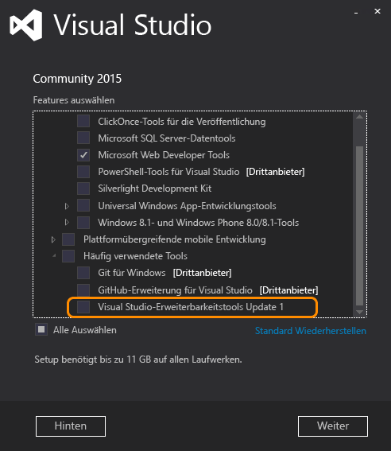

# <a name="installing-the-visual-studio-sdk"></a>Das Visual Studio SDK installieren
Starten in Visual Studio 2015, führen Sie Sie nicht Visual Studio SDK aus dem Downloadcenter installieren. Er ist als optionales Feature in Visual Studio-Setup enthalten. Sie können auch später im Visual Studio SDK installieren.  
  
## <a name="installing-the-visual-studio-sdk-as-part-of-a-visual-studio-installation"></a>Installieren das Visual Studio SDK als Teil einer Visual Studio-Installation  
 Wenn Sie VSSDK in Visual Studio-Installation aufnehmen möchten, müssen Sie eine benutzerdefinierte Installation durchführen.  
  
> [!NOTE]
>  In der Installationsdatei heißt das Visual Studio SDK **Visual Studio Extensibility Tools**.  
  
1.  Starten Sie die Visual Studio 2015-Installation. Sie können eine beliebige Edition von Visual Studio außer Express installieren.  
  
2.  Wählen Sie auf der ersten Seite **benutzerdefinierte**, nicht **Standard**. Klicken Sie auf **Weiter**.  
  
3.  Sie sehen eine Strukturansicht der benutzerdefinierten Funktionen. Öffnen Sie **häufig verwendete Tools**. Daraufhin sollte **Visual Studio Extensibility Tools** .  
  
       
  
4.  Überprüfen Sie **Visual Studio Extensibility Tools** , klicken Sie dann auf **Weiter** und die Installation fortzusetzen.  
  
## <a name="installing-the-visual-studio-sdk-after-installing-visual-studio"></a>Installieren das Visual Studio SDK nach der Installation von Visual Studio  
 Wenn Sie das Visual Studio SDK nach Abschluss der Installation von Visual Studio installieren möchten, sollten Sie das folgende Verfahren befolgen:  
  
1.  Wechseln Sie zu **Systemsteuerung / Programme / Programme und Funktionen**, und suchen Sie nach **Visual Studio 2015**. Sie können das Visual Studio SDK für eine beliebige Edition von Visual Studio 2015 außer Express installieren.  
  
2.  Mit der rechten Maustaste **Visual Studio 2015**, und klicken Sie dann auf **ändern**. Die Seite "Installation" sollte angezeigt werden.  
  
3.  Gehen Sie wie in **Installation von Visual Studio SDK im Rahmen einer Visual Studio-Installation** oben.  
  
4.  Klicken Sie auf die **Visual Studio Extensibility Tools** Link zur Installation von Visual Studio SDK.  
  
## <a name="installing-the-visual-studio-sdk-from-a-solution"></a>Installieren das Visual Studio SDK aus einer Projektmappe  
 Wenn Sie eine Lösung mit einem Erweiterbarkeitsprojekt öffnen, ohne die erste Installation VSSDK, werden Sie durch eine hervorgehobene Informationsleiste oben im Projektmappen-Explorer aufgefordert werden. Es sollte etwa wie folgt aussehen:  
  
   
  
## <a name="installing-the-visual-studio-sdk-from-the-command-line"></a>Installieren das Visual Studio SDK von der Befehlszeile aus  
 Sie können VSSDK über die Befehlszeile installieren, mit der **/InstallSelectableItems** switch mit dem Visual Studio-Installer. Weitere Informationen zum Verwenden von Befehlszeilenparametern mit dem Installer finden Sie unter [Befehlszeilenoptionen verwenden, um die Installation von Visual Studio](../install/use-command-line-parameters-to-install-visual-studio.md).  
  
 Hier ist das VSSDK automatisch mit dem Visual Studio 2015 Community-Installer installieren:  
  
```  
vs_community.exe /s /installSelectableItems VS_SDK_GROUPV1  
```  
  
 Beachten Sie, dass Sie Visual Studio-Installationsprogramm verwenden müssen, das die installierte Version von Visual Studio entspricht. Wenn Sie Visual Studio Enterprise auf Ihrem Computer installiert haben, müssen Sie das Visual Studio Enterprise-Installationsprogramm (vs_enterprise.exe) ausführen.
