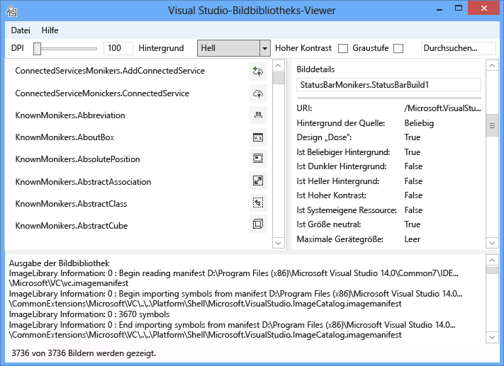
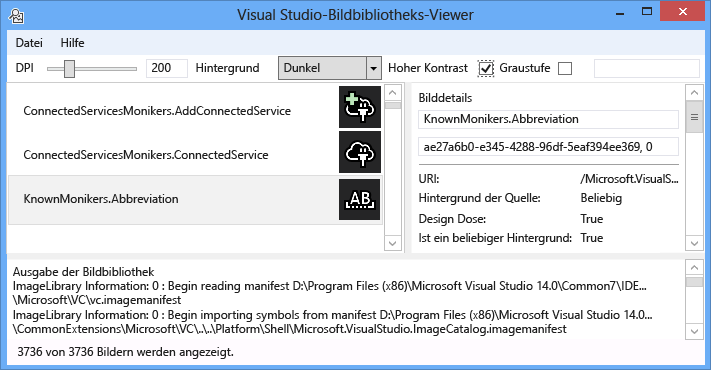
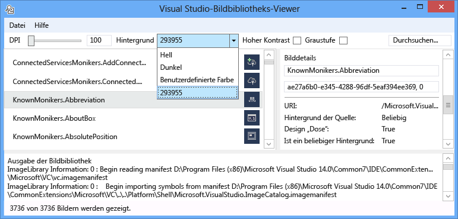
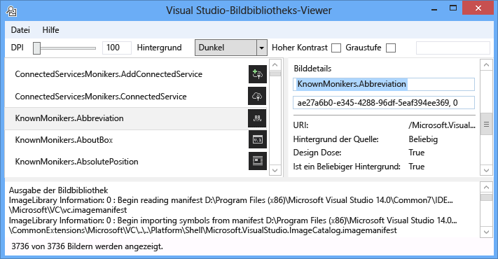
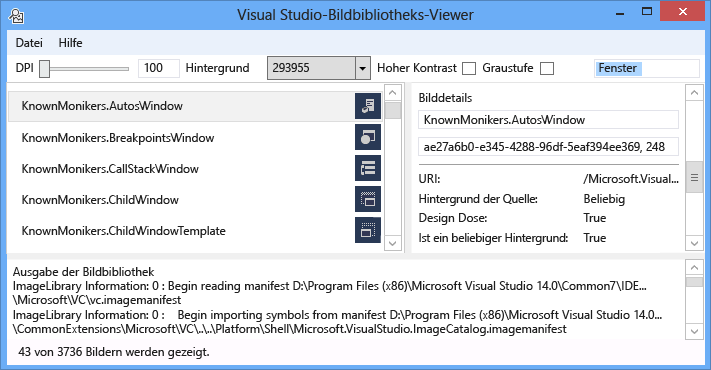
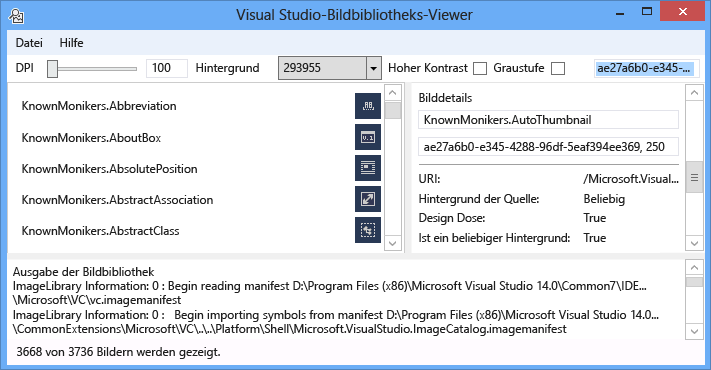
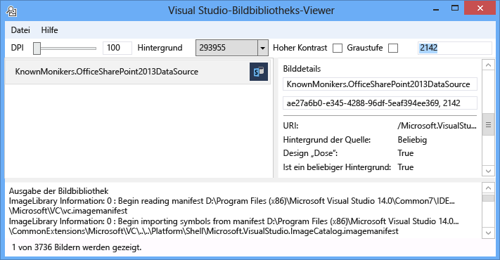

# <a name="image-library-viewer"></a>Bildbibliotheks-Viewer
Das Visual Studio Bildbibliotheks-Viewer-Tool kann geladen werden, und suchen bildmanifesten, damit der Benutzer sie auf die gleiche Weise bearbeiten wie Visual Studio. Der Benutzer kann es sich um Hintergrund, Größen, DPI-Wert, hoher Kontrast und andere Einstellungen ändern. Das Tool zeigt beim Laden der Informationen für jedes Image Manifest auch und zeigt Quellinformationen für jedes Bild im Image-Manifest. Dieses Tool eignet sich für:  
  
1. Diagnostizieren von Fehlern  
  
2. Sicherstellen, dass Attribute sind in benutzerdefinierten Images Manifeste ordnungsgemäß festgelegt.  
  
3. Suche für Bilder in der Visual Studio-Image-Katalog, damit Visual Studio-Erweiterung Images verwenden kann, die den Stil von Visual Studio entsprechen.  
  
     
  
   **Image-moniker**  
  
   Ein Bild Moniker (oder der Moniker für die kurze) ist ein GUID: ID-Paar, das ein Standardimage-Medienobjekt oder die Liste bildanlage aus der Abbildbibliothek eindeutig identifiziert.  
  
   **Image-Manifestdateien**  
  
   Image-Manifest (.imagemanifest)-Dateien sind XML-Dateien, die einen Satz von Bildressourcen, die Moniker zu, die darstellen definieren, die Ressourcen, und die echten Bild oder Bilder, die jedes Objekt darstellen. Bildmanifesten können eigenständige Bilder oder bilderlisten für ältere Benutzeroberflächenautomatisierungs-Unterstützung. Es gibt außerdem Attribute, die auf das Objekt oder auf die einzelnen Bilder hinter jedem Medienobjekt festgelegt werden können, zu ändern, wann und wie diese Objekte angezeigt werden.  
  
   **Image-manifest-schema**  
  
   Ein Abschließen des Images Manifest sieht folgendermaßen aus:  
  
```xml  
<ImageManifest>  
      <!-- zero or one Symbols elements -->  
      <Symbols>  
        <!-- zero or more Guid, ID, or String elements -->  
      </Symbols>  
      <!-- zero or one Images elements -->  
      <Images>  
        <!-- zero or more Image elements -->  
      </Images>  
      <!-- zero or one ImageLists elements -->  
      <ImageLists>  
        <!-- zero or more ImageList elements -->  
      </ImageLists>  
</ImageManifest>  
```  
  
 **Symbole**  
  
 Wie einer besseren Lesbarkeit und die Wartung zu unterstützen, können die bildmanifest Symbole für Attributwerte. Symbole sind wie folgt definiert:  
  
```xml  
<Symbols>  
      <Import Manifest="manifest" />  
      <Guid Name="ShellCommandGuid" Value="8ee4f65d-bab4-4cde-b8e7-ac412abbda8a" />  
      <ID Name="cmdidSaveAll" Value="1000" />  
      <String Name="AssemblyName" Value="Microsoft.VisualStudio.Shell.UI.Internal" />  
</Symbols>  
```  
  
|||  
|-|-|  
|**Subelement**|**Definition**|  
|Importieren|Importiert die Symbole der angegebenen Manifestdatei zur Verwendung in das aktuelle Manifest an.|  
|GUID|Das Symbol eine GUID darstellt, und Formatieren von GUID entsprechen.|  
|ID|Das Symbol eine ID dar und muss eine nicht negative ganze Zahl sein.|  
|Zeichenfolge|Das Symbol für eines beliebigen Zeichenfolgenwert.|  
  
 Symbole sind Groß-/Kleinschreibung beachtet und die referenzierten $(symbol-name)-Syntax verwenden:  
  
```xml  
<Image Guid="$(ShellCommandGuid)" ID="$(cmdidSaveAll)" >  
      <Source Uri="/$(AssemblyName);Component/Resources/image.xaml" />  
</Image>  
```  
  
 Einige Symbole sind für alle Manifeste vordefiniert. Diese können verwendet werden, in der das Uri-Attribut der \<Quelle > oder \<Import >-Element zu Verweispfaden auf dem lokalen Computer.  
  
|||  
|-|-|  
|**Symbol**|**Beschreibung**|  
|CommonProgramFiles|Der Wert, der die Variable %CommonProgramFiles%-Umgebung|  
|LocalAppData|Der Wert der Umgebungsvariablen % LocalAppData% %|  
|ManifestFolder|Dem Ordner mit der Manifestdatei|  
|MyDocuments|Der vollständige Pfad des Ordners "Eigene Dateien" des aktuellen Benutzers|  
|ProgramFiles|Der Wert der Umgebungsvariablen % ProgramFiles %|  
|System|Der Ordner "Windows\System32"|  
|WinDir|Der Wert der Umgebungsvariable "WinDir"|  
  
 **Image**  
  
 Die \<Image >-Element definiert ein Bild, das einen Moniker verwiesen werden kann. Die GUID und ID, die zusammen bilden die Image-Moniker. Der Moniker für das Image muss innerhalb der gesamten Abbildbibliothek eindeutig sein. Wenn mehr als ein Bild ein angegebenes Monikers verfügt, wird die erste Bedingung, die beim Erstellen der Bibliotheks gefunden, die beibehalten werden.  
  
 Es muss mindestens eine Quelle enthalten. Obwohl Größe neutrale Quellen für eine Vielzahl von Größen die besten Ergebnisse erzielen, sind sie nicht erforderlich. Wenn der Dienst für ein Bild mit einer Größe, die nicht in definierte aufgefordert wird die \<Image >-Element und es ist keine Größe Neutral Quelle ist, wird der Dienst, wählen Sie die beste Quelle für spezifische Größe und skalieren Sie sie auf die angeforderte Größe.  
  
```xml  
<Image Guid="guid" ID="int" AllowColorInversion="true/false">  
      <Source ... />  
      <!-- optional additional Source elements -->  
</Image>  
```  
  
|||  
|-|-|  
|**Attribut**|**Definition**|  
|GUID|[Erforderlich] Der GUID-Teil der Image-moniker|  
|ID|[Erforderlich] Die ID-Teil der Image-moniker|  
|AllowColorInversion|[Optional, Standardwert "true"] Gibt an, ob das Bild seine Farben umgekehrt programmgesteuert, wenn auf einen dunklen Hintergrund verwendet werden kann.|  
  
 **Quelle**  
  
 Die \<Source >-Element definiert ein einzelnes Abbild quellmedienobjekt (XAML und PNG).  
  
```xml  
<Source Uri="uri" Background="background">  
      <!-- optional NativeResource element -->  
 </Source>  
```  
  
|||  
|-|-|  
|**Attribut**|**Definition**|  
|URI|[Erforderlich] Ein URI, der definiert, in dem das Bild aus geladen werden können. Sie können eine der folgenden sein:<br /><br /> -Ein [Paket-URI](/dotnet/framework/wpf/app-development/pack-uris-in-wpf) mithilfe der Anwendung: / / / der Autorität<br /><br /> – Ein Ressourcenverweis absolute-Komponente<br /><br /> – Ein Pfad zu einer Datei enthält eine systemeigene Ressource|  
|Hintergrund|[Optional] Gibt an, was von der Art des Hintergrunds, die die Quelle verwendet werden soll.<br /><br /> Sie können eine der folgenden sein:<br /><br /> - *Light*: Die Quelle kann auf einen hellen Hintergrund verwendet werden.<br /><br /> - *Dunkel*: Die Quelle kann auf einen dunklen Hintergrund verwendet werden.<br /><br /> - *HighContrast*: Die Quelle kann auf eine im Hintergrund laufende im Modus für hohe Kontraste verwendet werden.<br /><br /> - *HighContrastLight*: Die Quelle kann auf einen hellen Hintergrund im Modus für hohe Kontraste verwendet werden.<br /><br /> -*HighContrastDark*: Die Quelle kann auf einen dunklen Hintergrund im Modus für hohe Kontraste verwendet werden.<br /><br /> Wenn die **Hintergrund** Attribut weggelassen wird, die Quelle kann auf alle Hintergrund verwendet werden.<br /><br /> Wenn **Hintergrund** ist *Licht*, *dunkel*, *HighContrastLight*, oder *HighContrastDark*, der Quelle Farben sind nicht umgekehrt. Wenn **Hintergrund** ausgelassen oder auf ist *hohem Kontrast*, der die Umkehrung der Farben von der Quelle wird gesteuert, indem des Bilds **AllowColorInversion** Attribut.|  
  
 Ein \<Source >-Element kann nur jeweils eines der folgenden optionalen untergeordneten Elemente aufweisen:  
  
||||  
|-|-|-|  
|**Element**|**Attribute (alle erforderlich)**|**Definition**|  
|\<Size>|Wert|Die Quelle wird für Bilder mit der angegebenen Größe (in Geräteeinheiten) verwendet werden. Das Bild wird quadratisch sein.|  
|\<SizeRange>|MinSize, MaxSize|Die Quelle wird für Bilder aus "MinSize" auf MaxSize-Wert (in Geräteeinheiten) einschließlich verwendet werden. Das Bild wird quadratisch sein.|  
|\<Dimensionen >|Breite, Höhe|Die Quelle wird für Bilder mit der angegebenen Breite und Höhe (in Geräteeinheiten) verwendet werden.|  
|\<DimensionRange>|MinWidth, MinHeight,<br /><br /> MaxWidth, MaxHeight|Die Quelle wird einschließlich bei Abbildern für die minimale Breite/Höhe, die maximale Breite/Höhe (in Geräteeinheiten) verwendet werden.|  
  
 Ein \<Source >-Element kann auch einen optionalen aufweisen \<NativeResource > Unterelement, das definiert eine \<Quelle >, die aus einer nativen Assembly anstatt einer verwalteten Assembly geladen wird.  
  
```xml  
<NativeResource Type="type" ID="int" />  
```  
  
|||  
|-|-|  
|**Attribut**|**Definition**|  
|Typ|[Erforderlich] Der Typ der systemeigene Ressource entweder XAML oder PNG-Datei|  
|ID|[Erforderlich] Der ganzzahlige ID Teil der systemeigene Ressource|  
  
 **ImageList**  
  
 Die \<ImageList >-Element definiert eine Auflistung von Abbildern, die auf einem einzelnen Streifen zurückgegeben werden können. Das Entfernen wird bei Bedarf erstellt, je nach Bedarf.  
  
```xml  
<ImageList>  
      <ContainedImage Guid="guid" ID="int" External="true/false" />  
      <!-- optional additional ContainedImage elements -->  
 </ImageList>  
```  
  
|||  
|-|-|  
|**Attribut**|**Definition**|  
|GUID|[Erforderlich] Der GUID-Teil der Image-moniker|  
|ID|[Erforderlich] Die ID-Teil der Image-moniker|  
|Extern|[Optional, standardmäßig "false"] Gibt an, ob der Image-Moniker ein Bild in das aktuelle Manifest verweist.|  
  
 Der Moniker für das enthaltene Image keine auf ein Bild in das aktuelle Manifest definiert. Wenn das eigenständige Image aus der Abbildbibliothek gefunden werden kann, wird ein leeres Platzhalterbild an seiner Stelle verwendet werden.  
  
## <a name="how-to-use-the-tool"></a>Gewusst wie: Verwenden Sie das tool  
 **Überprüfen ein benutzerdefiniertes Image-manifest**  
  
 Um ein benutzerdefiniertes Manifest zu erstellen, empfehlen wir, dass Sie das Tool ManifestFromResources zur automatischen Generierung des Manifests verwenden. Klicken Sie zum Überprüfen des benutzerdefinierten Manifests den Bildbibliotheks-Viewer zu starten, und wählen Sie die Datei > Pfade festlegen... um die Verzeichnisse durchsuchen-Dialogfeld zu öffnen. Das Tool zum Laden von bildmanifesten Suchverzeichnisse verwenden, aber darüber hinaus nutzt er diese, um die DLL-Dateien zu suchen, die Bilder in einem Manifest enthalten, daher unbedingt sowohl das Manifest als auch die DLL-Verzeichnisse in diesem Dialogfeld enthalten.  
  
   
  
 Klicken Sie auf **hinzufügen...**  auszuwählenden neuen Suchverzeichnisse zur Suche nach Manifeste und ihre zugehörigen DLLs. Das Tool speichert diese Verzeichnisse durchsuchen, und sie können aktiviert oder deaktiviert durch Aktivieren oder deaktivieren ein Verzeichnis.  
  
 Standardmäßig versucht das Tool, suchen das Visual Studio-Installationsverzeichnis, und fügen diese Verzeichnisse der Suchliste für Verzeichnisse. Sie können Verzeichnisse, die das Tool nicht gefunden wird, manuell hinzufügen.  
  
 Sobald alle Manifeste geladen werden, kann das Tool verwendet werden, um umzuschalten **Hintergrund** Farben, **DPI**, **hoher Kontrast**, oder **Grayscaling** für die Bilder, damit ein Benutzer visuell untersuchen Bildanlagen um zu überprüfen, ob sie werden für die verschiedenen Einstellungen ordnungsgemäß gerendert werden kann.  
  
   
  
 Die Farbe des Hintergrunds kann hell, dunkel oder einen benutzerdefinierten Wert festgelegt werden. Auswählen von "Benutzerdefinierte Farbe" wird ein Farbauswahl-Dialogfeld zu öffnen, und diese benutzerdefinierten Farbe am unteren Rand im Kombinationsfeld Hintergrund leichter zu merkenden später hinzufügen.  
  
   
  
 Wählen einen bildmoniker klicken, werden die Informationen für die einzelnen realen Bilder hinter dieser Moniker im Bereich Details der Images auf der rechten Seite angezeigt. Der Bereich ermöglicht außerdem Benutzern einen Moniker anhand des Namens oder raw-GUID: ID-Wert zu kopieren.  
  
   
  
 Für jede Quelle angezeigte Informationen, welche Art von Hintergrund angezeigt, ist angegeben, ob sie mit Design versehen werden kann oder unterstützt das hohem Kontrast, welche Größe sie für gültig ist oder, ob es ist Größe Neutral, und gibt an, ob das Bild stammt aus einer nativen Assembly.  
  
   
  
 Bei einem bildmanifest überprüfen möchten, empfehlen wir, dass Sie den und Image-DLL in ihren realen Speicherorten bereitstellen. Hierdurch wird sichergestellt, dass relative Pfade ordnungsgemäß ausgeführt werden und die Abbildbibliothek finden und laden das Manifest und DLL-Image kann.  
  
 **Image-Katalog KnownMonikers werden gesucht**  
  
 Um die Formatierung von Visual Studio besser entsprechen zu können, kann Visual Studio-Erweiterung Bilder in der Visual Studio-Image-Katalog statt erstellen und verwenden eine eigene verwenden. Dies hat den Vorteil, dass ohne diese Bilder zu verwalten, und es wird sichergestellt, dass das Image ein Image für die High-DPI-Wert-Sicherung hat, sodass es in alle DPI-Einstellungen korrekt gesucht werden soll, die Visual Studio unterstützt.  
  
 Die bildbibliotheks-Viewer können ein Manifest, so, dass ein Benutzer den Moniker, der ein Bildobjekt darstellt finden und dieser Moniker im Code verwenden gesucht werden soll. Um nach Bildern suchen, geben Sie den gewünschten Suchbegriff in das Suchfeld, und drücken Sie EINGABETASTE. Die Statusleiste im unteren Bereich zeigt, wie viele Übereinstimmungen aus der Gesamt-Images in allen der Manifeste gefunden wurden.  
  
   
  
 Bei der Suche nach Image-Moniker in vorhandenen Manifesten wird empfohlen, dass Sie suchen nach und verwenden Sie nur Visual Studio-Image des Katalogs Moniker, andere absichtlich öffentlich zugänglichen Moniker oder Ihre eigenen benutzerdefinierten Moniker. Wenn Sie nicht öffentliche Moniker verwenden, benutzerdefinierte Benutzeroberfläche ist möglicherweise nicht mehr funktionsfähig oder haben die Bilder geändert auf unerwartete Weise Wenn oder wenn diese nicht öffentlich Moniker und Images geändert oder aktualisiert werden.  
  
 Darüber hinaus ist die Suche nach GUID möglich. Diese Art von Suche eignet sich zum Filtern der Liste, um eine einzelne Manifest oder einzelne Unterabschnitt für ein manifest, wenn das Manifest enthält mehrere GUIDs.  
  
   
  
 Schließlich ist das Suchen nach ID möglich auch.  
  
   
  
## <a name="notes"></a>Hinweise  
  
-   Standardmäßig wird das Tool in mehrere vorhanden, in der Visual Studio-Installationsverzeichnis bildmanifesten abrufen. Die einzige, der öffentlich nutzbar Moniker verfügt die **Microsoft.VisualStudio.ImageCatalog** manifest. GUID: ae27a6b0-e345-4288-96df-5eaf394ee369 (werden **nicht** überschreiben Sie diese GUID in ein benutzerdefiniertes Manifest) Typ: KnownMonikers  
  
-   Das Tool versucht beim Start laden Sie alle Image-Manifeste, die sie findet, die daher dauert möglicherweise einige Sekunden, für die Anwendung tatsächlich angezeigt werden. Es kann auch langsam oder nicht reagierender sein, beim Laden der Manifeste.  
  
## <a name="sample-output"></a>Beispielausgabe  
 Dieses Tool generiert keine Ausgabe.