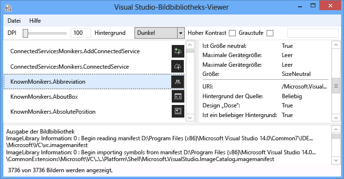

# Bildbibliotheks-Viewer
[!INCLUDE[vs2017banner](../../code-quality/includes/vs2017banner.md)]

Das Visual Studio Bildbibliotheks-Viewer-Tool laden und bildmanifesten, sodass der Benutzer sie auf die gleiche Weise zu bearbeiten, wie Visual Studio würden zu suchen. Der Benutzer kann im Hintergrund, Größe, DPI, hoher Kontrast und andere Einstellungen ändern. Das Tool auch zeigt für jede bildmanifest von ladeinformationen und Quellinformationen für jedes Bild in das bildmanifest angezeigt. Dieses Tool ist nützlich für:  
  
1.  Diagnostizieren von Fehlern  
  
2.  Sicherstellen, dass Attribute sind in benutzerdefinierten bildmanifesten richtig festgelegt.  
  
3.  Suchen für Bilder in der Visual Studio-Image-Katalog, damit Visual Studio-Erweiterung Images verwenden kann, die den Stil von Visual Studio entsprechen  
  
   
  
 **Image-moniker**  
  
 Ein Bild Moniker (oder kurz Moniker) ist ein GUID: ID-Paar, das ein Standardimage-Medienobjekt oder Liste imagemedienobjekt in der Bildbibliothek eindeutig identifiziert.  
  
 **Manifest Bilddateien**  
  
 Image-Manifest (.imagemanifest)-Dateien sind XML-Dateien, die einen Satz von Bildanlagen, die Moniker, die darstellen definieren, die Ressourcen und echten Bild oder Bilder, die jede Anlage darstellen. Image-Manifeste können eigenständige Bilder oder Bild für Legacyunterstützung Benutzeroberfläche aufgelistet. Darüber hinaus können Attribute, die auf die Anlage oder die einzelnen Bilder hinter jedem Medienobjekt festgelegt werden können, zu ändern, wann und wie diese Elemente angezeigt werden.  
  
 **Image-Manifestschema**  
  
 Ein vollständiges Abbild Manifest sieht folgendermaßen aus:  
  
```xml  
<ImageManifest>  
      <!-- zero or one Symbols elements -->  
      <Symbols>  
        <!-- zero or more Guid, ID, or String elements -->  
      </Symbols>  
      <!-- zero or one Images elements -->  
      <Images>  
        <!-- zero or more Image elements -->  
      </Images>  
      <!-- zero or one ImageLists elements -->  
      <ImageLists>  
        <!-- zero or more ImageList elements -->  
      </ImageLists>  
</ImageManifest>  
```  
  
 **Symbole**  
  
 Eine Lesbarkeit und Wartung erleichtern, kann das Image-Manifest Symbole für Attributwerte verwenden. Symbole sind wie folgt definiert:  
  
```xml  
<Symbols>  
      <Import Manifest="manifest" />  
      <Guid Name="ShellCommandGuid" Value="8ee4f65d-bab4-4cde-b8e7-ac412abbda8a" />  
      <ID Name="cmdidSaveAll" Value="1000" />  
      <String Name="AssemblyName" Value="Microsoft.VisualStudio.Shell.UI.Internal" />  
</Symbols>  
```  
  
|||  
|-|-|  
|**Unterelement**|**Definition**|  
|Importieren|Importiert die Symbole der angegebenen Manifestdatei für die Verwendung in das aktuelle Manifest an.|  
|Guid|Das Symbol stellt einen GUID dar und GUID Formatierung übereinstimmen.|  
|ID|Das Symbol eine ID dar und muss eine nicht negative ganze Zahl sein.|  
|Zeichenfolge|Das Symbol für eines beliebigen Zeichenfolgenwert.|  
  
 Symbole sind Groß-und Kleinschreibung sowie mit $(symbol-name) Syntax verwiesen wird:  
  
```xml  
<Image Guid="$(ShellCommandGuid)" ID="$(cmdidSaveAll)" >  
      <Source Uri="/$(AssemblyName);Component/Resources/image.xaml" />  
</Image>  
```  
  
 Einige Symbole werden für alle Manifeste vordefiniert. Diese können verwendet werden, im Uri-Attribut der \< Quelle> oder \< Import> Element Verweispfade auf dem lokalen Computer.  
  
|||  
|-|-|  
|**Symbol**|**Beschreibung**|  
|CommonProgramFiles|Der Wert der Variable %CommonProgramFiles% Umgebung|  
|LocalAppData|Der Wert der Umgebungsvariablen für % LocalAppData% %|  
|ManifestFolder|Den Ordner mit der manifest-Datei|  
|Eigene Dateien|Der vollständige Pfad des Ordners "Eigene Dateien" des aktuellen Benutzers|  
|ProgramFiles|Der Wert der Umgebungsvariablen für % ProgramFiles %|  
|System|Ordner "Windows\System32"|  
|WinDir|Der Wert der Umgebungsvariablen für % WinDir %|  
  
 **Bild**  
  
 Die \< Image> -Element definiert ein Bild, das über einen Moniker verwiesen werden kann. Die GUID und ID, die zusammen genommen bilden den Image-Moniker. Der Moniker für das Image muss für die gesamte Bildbibliothek eindeutig sein. Wenn mehr als ein Abbild einen angegebenen Moniker verfügt, wird der ersten aufgetreten, die Bibliothek erstellt, die beibehalten werden.  
  
 Es muss mindestens eine Quelle enthalten. Obwohl Größe Neutral Quellen über eine Breite Palette von Größen die besten Ergebnisse liefern, werden diese nicht benötigt. Wenn ein Image mit einer Größe, die nicht definiert, der Dienst angefordert wird das \< Image> Element und es ist keine Quelle Größe Neutral ist, wird der Dienst, und wählen Sie die optimale Größe-spezifische Quelle auf die angeforderte Größe zu skalieren.  
  
```xml  
<Image Guid="guid" ID="int" AllowColorInversion="true/false">  
      <Source ... />  
      <!-- optional additional Source elements -->  
</Image>  
```  
  
|||  
|-|-|  
|**Attribut**|**Definition**|  
|Guid|[Erforderlich] Der GUID-Teil der Image-moniker|  
|ID|[Erforderlich] Der ID-Teil der Image-moniker|  
|AllowColorInversion|[Optional, Standardwert True] Gibt an, ob das Bild die Farben umgedreht programmgesteuert auf einen dunklen Hintergrund verwendet werden kann.|  
  
 **Datenquelle**  
  
 Das \< Source> -Element definiert eine einzelne Quelle imagemedienobjekt (XAML und PNG).  
  
```xml  
<Source Uri="uri" Background="background">  
      <!-- optional NativeResource element -->  
 </Source>  
```  
  
|||  
|-|-|  
|**Attribut**|**Definition**|  
|URI|[Erforderlich] Ein URI, der definiert, in dem das Bild aus geladen werden können. Es kann eine der folgenden sein:<br /><br /> – Ein [Paket-URI](http://msdn.microsoft.com/en-US/library/aa970069\(v=vs.100\).aspx) mithilfe der Anwendung: / / / Autorität<br /><br /> -Ein Ressourcenverweis absolute Komponente<br /><br /> – Ein Pfad zu einer Datei mit einer systemeigenen Ressource|  
|Hintergrund|[Optional] Gibt an, welche Art von Hintergrund, die die Quelle verwendet werden soll.<br /><br /> Es kann eine der folgenden sein:<br /><br /> - *Light*: die Quelle kann auf einen hellen Hintergrund verwendet werden.<br /><br /> - *Dunkle*: die Quelle kann auf einem dunklen Hintergrund verwendet werden.<br /><br /> - *Hoher Kontrast*: die Quelle kann auf eine im Hintergrund laufende im Modus für hohe Kontraste verwendet werden.<br /><br /> - *HighContrastLight*: die Quelle kann auf einen hellen Hintergrund im Modus für hohe Kontraste verwendet werden.<br /><br /> -*HighContrastDark*: die Quelle kann auf einen dunklen Hintergrunds im Modus für hohe Kontraste verwendet werden.<br /><br /> Wenn die **Hintergrund** Attribut ausgelassen wird, die Quelle kann auf eine im Hintergrund laufende verwendet werden.<br /><br /> Wenn **Hintergrund** ist *Licht*, *dunkel*, *HighContrastLight*, oder *HighContrastDark*, die Quelle Farben sind niemals umgekehrt. Wenn **Hintergrund** ausgelassen oder auf festgelegt ist *hoher Kontrast*, der die Umkehrung der Farben der Quelle gesteuert wird, von des Abbild **AllowColorInversion** Attribut.|  
  
 Ein \< Quelle> Element kann nur eines der folgenden optionalen untergeordneten Elemente aufweisen:  
  
||||  
|-|-|-|  
|**Element**|**Attribute (alle erforderlich)**|**Definition**|  
|\< Größe>|Wert|Die Quelle wird für Bilder der vorgegebenen Größe (in Geräteeinheiten) verwendet werden. Das Bild quadratisch sein müssen.|  
|\< SizeRange>|MinSize, MaxSize|Die Quelle wird (einschließlich) liegen für Bilder aus MinSize, MaxSize (in Geräteeinheiten) verwendet werden. Das Bild quadratisch sein müssen.|  
|\< Dimensionen>|Breite, Höhe|Die Quelle wird für Bilder von der angegebenen Breite und Höhe (in Geräteeinheiten) verwendet werden.|  
|\< DimensionRange>|MinWidth, MinHeight,<br /><br /> MaxWidth MaxHeight|Die Quelle wird (einschließlich) liegen für Abbilder aus die minimale Breite und Höhe für die maximale Breite/Höhe (in Geräteeinheiten) verwendet werden.|  
  
 Ein \< Quelle> -Element kann auch eine optionale umfassen \< NativeResource> Unterelement, das definiert ein \< Quelle> das aus einer verwalteten Assembly, anstatt eine systemeigene Assembly geladen wird.  
  
```xml  
<NativeResource Type="type" ID="int" />  
```  
  
|||  
|-|-|  
|**Attribut**|**Definition**|  
|Typ|[Erforderlich] Der Typ der systemeigene Ressource, XAML oder PNG|  
|ID|[Erforderlich] Der ganzzahlige ID-Teil von systemeigenen Ressource|  
  
 **ImageList**  
  
 Die \< ImageList> -Element definiert eine Sammlung von Bildern, die in einem einzelnen Streifen zurückgegeben werden können. Balken wird bei Bedarf erstellt, je nach Bedarf.  
  
```xml  
<ImageList>  
      <ContainedImage Guid="guid" ID="int" External="true/false" />  
      <!-- optional additional ContainedImage elements -->  
 </ImageList>  
```  
  
|||  
|-|-|  
|**Attribut**|**Definition**|  
|Guid|[Erforderlich] Der GUID-Teil der Image-moniker|  
|ID|[Erforderlich] Der ID-Teil der Image-moniker|  
|Extern|[Optional, Standardwert ist False.] Gibt an, ob der Image-Moniker ein Bild in das aktuelle Manifest verweist.|  
  
 Der Moniker für die enthaltene Bild hat keinen Verweis auf ein Bild in das aktuelle Manifest definiert. Wenn das enthaltene Bild in der Bildbibliothek gefunden werden kann, wird ein leeres Platzhalterbild an deren Stelle verwendet werden.  
  
## <a name="how-to-use-the-tool"></a>Gewusst wie: Verwenden Sie das tool  
 **Überprüfen ein benutzerdefiniertes Image-manifest**  
  
 Um ein benutzerdefiniertes Manifest zu erstellen, wird empfohlen, dass Sie das Tool ManifestFromResources zur automatischen Generierung des Manifests verwenden. Um das benutzerdefinierte Manifest zu überprüfen, starten Sie den Bildbibliotheks-Viewer, und wählen Sie Datei > Pfade festlegen... um das Dialogfeld "Suchverzeichnisse" zu öffnen. Das Tool verwendet Suchverzeichnisse bildmanifesten geladen, aber es wird auch verwendet, damit die DLL-Dateien zu suchen, die Bilder in einem Manifest enthalten, achten Sie darauf, Manifest und DLL-Verzeichnisse in diesem Dialogfeld zu schließen.  
  
   
  
 Klicken Sie auf **hinzufügen...** um neue Suchverzeichnisse zu suchende Manifeste und ihre entsprechenden DLLs auszuwählen. Das Tool merkt sich diese Verzeichnisse durchsuchen, und sie können aktiviert werden ein- oder Ausschalten von aktivieren oder deaktivieren ein Verzeichnis.  
  
 Standardmäßig versucht das Tool zum Suchen von Visual Studio-Installationsverzeichnis, und diese Verzeichnisse der Suchliste für die Verzeichnisse hinzufügen. Sie können manuell Verzeichnisse hinzufügen, die das Tool nicht findet.  
  
 Sobald alle Manifeste geladen werden, kann das Tool verwendet werden, aktivieren bzw. deaktivieren **Hintergrund** Farben **DPI**, **hoher Kontrast**, oder **Grayscaling** für die Bilder, damit kann ein Benutzer eine sichtprüfung des Bildanlagen überprüfen sie sind gerenderte ordnungsgemäß für verschiedene Einstellungen.  
  
   
  
 Die Farbe des Hintergrunds kann hell, dunkel oder einen benutzerdefinierten Wert festgelegt werden. Auswählen von "Benutzerdefinierte Farbe" wird ein Farbauswahl-Dialogfeld zu öffnen und diese benutzerdefinierte Farbe am Ende das Kombinationsfeld im Hintergrund für einfache Rückruf später hinzufügen.  
  
   
  
 Ein Moniker Image auswählen, zeigt die Informationen für jede echten Bild hinter diesem Moniker im Image Detailbereich auf der rechten Seite. Der Bereich kann sich Benutzer einen Moniker nach Name oder unformatierte GUID: ID-Wert zu kopieren.  
  
   
  
 Der angezeigten Informationen für jede Bildquelle enthält Hintergrund angezeigt, welche, ob Designs möglich oder unterstützt das hoher Kontrast, welche Größe, die es gültig ist oder gibt an, ob es ist Größe Neutral und gibt an, ob das Bild stammen aus einem systemeigenen Assembly.  
  
   
  
 Bei der Validierung einer bildmanifest wird empfohlen, dass Sie das Manifest und Image-DLL in ihre Speicherorte realen bereitstellen. Hierdurch wird sichergestellt, dass relative Pfade ordnungsgemäß ausgeführt werden und die Bildbibliothek finden und das Manifest und Image-DLL laden kann.  
  
 **Image-Katalog KnownMonikers werden gesucht**  
  
 Zum Formatieren von Visual Studio besser entsprechen zu können, können eine Visual Studio-Erweiterung in der Visual Studio-Image-Katalog statt erstellen und verwenden eine eigene Bilder. Dies hat den Vorteil, ohne diese Bilder zu verwalten, und es wird sichergestellt, dass das Image ein Image Unterstützung hoher DPI-Einstellung vorhanden sind, damit es in alle DPI-Einstellungen richtig aussehen soll, die Visual Studio unterstützt.  
  
 Die bildbibliotheks-Viewer ermöglicht ein Manifest, gesucht werden soll, damit ein Benutzer suchen den Moniker, der eine imagemedienobjekt darstellt und dieser Moniker im Code verwenden kann. Um nach Images suchen, geben Sie den gewünschten Suchbegriff in das Suchfeld, und drücken Sie die EINGABETASTE. Die Statusleiste im unteren Bereich zeigt, wie viele Übereinstimmungen aus der gesamten Bilder in allen von Manifesten gefunden wurden.  
  
   
  
 Bei der Suche nach Image Monikern in vorhandenen Manifesten wird empfohlen, dass Sie suchen und verwenden Sie nur die Visual Studio Bild des Katalogs Moniker, andere absichtlich öffentlich zugängliche Moniker oder eigene benutzerdefinierte Moniker. Bei Verwendung von Monikern nicht öffentliche benutzerdefinierte Benutzeroberfläche ist möglicherweise unterbrochen, oder die Bilder geändert wurden unerwartete Weise Wenn oder wenn diese nicht öffentliche Moniker und Bilder geändert oder aktualisiert werden.  
  
 Darüber hinaus ist die Suche nach GUID möglich. Diese Art von Suche eignet sich zum Filtern der Liste eine einzelne Manifest oder einzelne Unterabschnitt ein manifest, wenn für das Manifest enthält mehrere GUIDs.  
  
   
  
 Schließlich kann anhand der ID suchen auch.  
  
   
  
## <a name="notes"></a>Notizen  
  
-   Standardmäßig wird das Tool mehrere bildmanifesten vorhanden, in der Visual Studio-Installationsverzeichnis einziehen. Die einzige, die öffentlich nutzbar Moniker verfügt die **Microsoft.VisualStudio.ImageCatalog** manifest. GUID: ae27a6b0-e345-4288-96df-5eaf394ee369 (führen Sie **nicht** überschreiben diese GUID in ein benutzerdefiniertes Manifest) Typ: KnownMonikers  
  
-   Das Tool versucht beim Start laden alle bildmanifesten gefundene, damit dauert möglicherweise einige Sekunden für die Anwendung tatsächlich angezeigt werden. Es könnte auch langsamen oder nicht reagierenden beim Laden der Manifeste sein.  
  
## <a name="sample-output"></a>Beispielausgabe  
 Dieses Tool generiert keine Ausgabe.