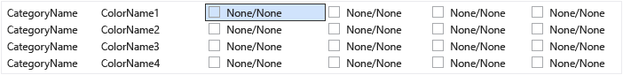

# VSIX Farb-Editor
[!INCLUDE[vs2017banner](../../code-quality/includes/vs2017banner.md)]

Das Visual Studio\-Erweiterung Farb\-Editor\-Tool kann erstellen und Bearbeiten von Farben für Visual Studio. Das Tool kann auch Designs Ressourcenschlüssel generieren, so, dass die Farben im Code verwendet werden können. Dieses Tool ist nützlich zum Erstellen von Farben für Visual Studio\-Erweiterung, die Designs unterstützt. Mit diesem Tool kann PKGDEF und XML\-Dateien öffnen. Visual Studio\-Themen \(.vstheme\-Dateien\) können mit Visual Studio Extension\-Farb\-Editor verwendet werden, indem Sie die Erweiterung auf XML. Darüber hinaus können .vstheme Dateien in einer aktuellen XML\-Datei importiert werden.  
  
   
  
 **Paketdefinitionsdateien**  
  
 Paketdefinitionsdateien \(PKGDEF\) sind Dateien, die Designs definieren. Die Farben selbst werden in Design Farbe XML\-Dateien gespeichert, die in eine PKGDEF\-Datei kompiliert werden. Die PKGDEF\-Dateien sind durchsuchbar an Visual Studio bereitgestellt, zur Laufzeit verarbeitet und zusammengefügt werden zum Definieren des Designs.  
  
 **Farbe\-Token**  
  
 Ein Token Farbe besteht aus vier Elemente:  
  
-   **Kategoriename:** eine logische Gruppierung für einen Satz von Farben. Verwenden Sie den Kategorienamen einer vorhandenen aus, wenn die Farben, die spezifisch für die gewünschte UI\-Element oder eine Gruppe von Elementen der Benutzeroberfläche sind bereits vorhanden sind.  
  
-   **Tokenname:** einen beschreibenden Namen für die Color\-Token und token. Hintergrund und Vordergrund \(Text\) Tokennamen sowie alle ihre Status umfassen, und sollte diese benannt werden, sodass es leicht ist zu erkennen, die Paare und die Zustände, denen sie gelten.  
  
-   **Farbe Werte \(oder Farbtöne\):** für jedes farbige Designs erforderlich sind. Erstellen Sie immer Hintergrund\- und Farbwerte in Paaren. Farben werden für Hintergrund\/Vordergrund zusammen, sodass die Textfarbe \(Vordergrund\) immer vor dem Hintergrund gelesen werden, auf dem es gezeichnet wird. Diese Farben werden verknüpft und werden zusammen in der Benutzeroberfläche verwendet werden. Wenn der Hintergrund für die Verwendung mit Text nicht vorgesehen ist, definieren Sie eine Vordergrundfarbe.  
  
-   **System Farbnamen:** für die Verwendung in hohem Kontrast angezeigt.  
  
## Zum Verwenden der Tools  
 So weit wie möglich und gegebenenfalls sollten vorhandene Visual Studio Farben anstatt neue wiederverwendet werden. Allerdings sollten für die Fälle, in denen keine entsprechenden Farben definiert sind, benutzerdefinierte Farben erstellt werden um eine Erweiterung Designs kompatibel zu halten.  
  
 **Erstellen die neue Farbe\-Token**  
  
 Gehen Sie folgendermaßen vor, um benutzerdefinierte Farben, die mithilfe der Visual Studio Extension Farb\-Editor zu erstellen:  
  
1.  Bestimmen Sie die Kategorie und Token\-Namen für die neue Farbe\-Token.  
  
2.  Wählen Sie die Farbtöne, die das Element der Benutzeroberfläche für jedes Design und die Systemfarbe für den Kontrast verwenden.  
  
3.  Verwenden Sie im Farb\-Editor, um neue Farbe Token zu erstellen.  
  
4.  Verwenden Sie die Farben in einer Visual Studio\-Erweiterung.  
  
5.  Testen Sie die Änderungen in Visual Studio.  
  
 **Schritt 1: Bestimmen der Kategorie und Tokennamen für die neue Farbe\-Token.**  
  
 Die bevorzugte Benennung Schema ist ein VSColor **\[Kategorie\] \[UI\-Typ\] \[Status\]**. Verwenden Sie nicht das Wort "Color" VSColor Namen, da redundant ist.  
  
 Kategorienamen logische Gruppen bereitzustellen und sollten als spezifisch wie möglich definiert werden. Z. B. der Name eines einzelnen Toolfensters konnte einen Kategorienamen werden der Name der ein gesamtes Unternehmen Einheit oder das Projekt\-Team ist hingegen nicht. Einträge in Kategorien gruppieren, Verwechslungen zwischen Farben mit demselben Namen verhindert.  
  
 Ein token muss klar anzugeben, den Elementtyp und die Situationen oder "State", für die die Farbe angewendet werden. Z. B. eine aktive Datentipp **\[UI\-Typ\]** konnte mit dem Namen "**DataTip**" und die **\[State\]** konnte mit dem Namen "**Active**," Farbnamen des resultierenden "**DataTipActive**." Da Datentipps Text haben, müssen eine Vordergrund\- und Hintergrundfarbe, definiert werden. Mithilfe der Hintergrund\/Vordergrund Verbindungsaufbau des Farb\-Editors erstellt automatisch die Farben "**DataTipActive**" für den Hintergrund und "**DataTipActiveText**" für den Vordergrund.  
  
 Weist das Element der Benutzeroberfläche nur ein Status, der **\[State\]** Teil des Namens kann ausgelassen werden. Z. B. wenn ein Suchfeld einen Rahmen hat, und es ist keine Änderung des Zustands, die Farbe des Rahmens auswirken würde, dann der Namen für den Rahmen Farbe Token kann einfach aufgerufen werden "**SearchBoxBorder**."  
  
 Einige allgemeine Namen enthalten:  
  
-   Aktiv  
  
-   Inaktiv  
  
-   MouseOver  
  
-   MouseDown  
  
-   Ausgewählt  
  
-   Focused \(Mit Fokus\)  
  
 Beispiele für einige Tokennamen für Teile ein Listenelement\-Steuerelement:  
  
-   ListItem  
  
-   ListItemBorder  
  
-   ListItemMouseOver  
  
-   ListItemMouseOverBorder  
  
-   ListItemSelected  
  
-   ListItemSelectedBorder  
  
-   ListItemDisabled  
  
-   ListItemDisabledBorder  
  
 **Schritt 2: Wählen Sie die Farbtöne, die das Element der Benutzeroberfläche für jedes Design und die Systemfarbe für den Kontrast verwenden.**  
  
 Wenn Sie benutzerdefinierte Farben für die Benutzeroberfläche auswählen, wählen Sie ein ähnliche vorhandenen UI\-Element, und verwenden Sie die Farben als Basis. Die Farben für in\-the\-Box\-UI\-Elemente unterzogen worden überprüfen und testen, damit sie gut und in allen Designs mehr ordnungsgemäß funktionieren.  
  
 **Schritt 3: Verwenden des Farb\-Editors, um neue Farbe Token zu erstellen.**  
  
 Starten Sie im Farb\-Editor und öffnen Sie oder erstellen Sie eine neue XML\-Datei in einer benutzerdefinierten Designs Farben. Wählen Sie **Bearbeiten \> neue Farbe** aus dem Menü. Daraufhin wird ein Dialogfeld für die Angabe der Kategorie und einen oder mehrere Namen für die Farbe Einträge innerhalb dieser Kategorie:  
  
   
  
 Wählen Sie eine vorhandene Kategorie aus, oder wählen Sie **neue Kategorie** zum Erstellen einer neuen Kategorie. Ein weiteres Dialogfeld wird geöffnet, erstellen einen neuen Kategorienamen ein:  
  
   
  
 Die neue Kategorie stehen dann erst zur Verfügung, in der **neue Farbe** im Dropdown Menü Kategorie. Nach dem Auswählen einer Kategorie, geben Sie einen Namen pro Zeile für jede neue Farbe Token, und wählen Sie "Erstellen", wenn Sie fertig sind:  
  
   
  
 Die Farbwerte werden paarweise Hintergrund\/Vordergrund dargestellt, mit "None" gibt an, dass die Farbe nicht definiert wurde. Hinweis: Wenn eine Farbe keinen Text Hintergrundfarben\/Color\-Paar, muss nur der Hintergrund definiert werden.  
  
   
  
 Um ein Token Farbe zu bearbeiten, wählen Sie einen Farbe\-Eintrag für das Design \(Spalte\) des Tokens. Fügen Sie dem Wert für die durch einen hexadezimalen Farbwert im 8\-stellige ARGB\-Format eingeben, einen System\-Farbnamen in die Zelle eingeben, oder wählen Sie die gewünschte Farbe eine Farbe oder eine Liste von Systemfarben mithilfe des Dropdown\-Menüs.  
  
   
  
   
  
 Für Komponenten, die nicht zum Anzeigen von Text benötigen, geben Sie nur eine Farbe Wert: die Farbe des Hintergrunds. Andernfalls geben Sie Werte für sowohl Hintergrund\- und Textfarben, getrennt durch einen Schrägstrich ein.  
  
 Beim Eingeben von Werten für den Kontrast, geben Sie gültige Farbnamen für Windows\-System. Geben Sie hartcodierte ARGB\-Werte. Sie können eine Liste der gültigen System Farbnamen anzeigen, indem Sie die Dropdownmenüs Farbe auswählen "Hintergrund: System" oder "Vordergrund: System". Wenn Elemente erstellen, die Textkomponenten haben, verwenden Sie das richtige Hintergrundtext System Color\-Paar oder der Text möglicherweise nicht lesbar.  
  
 Wenn Sie fertig sind, erstellen, festlegen und die Farbe\-Token bearbeiten, speichern Sie sie in die gewünschte XML oder PKGDEF\-Format. Farbe Token weder einen Hintergrund noch eine Reihe Vordergrund werden als leere Farben im XML\-Format gespeichert, aber im Format PKGDEF verworfen. Ein Dialogfeld warnt Sie Datenverluste Farbe wenn Sie versuchen, leere Farben eine PKGDEF\-Datei zu speichern.  
  
 **Schritt 4: Verwenden Sie die Farben in einer Visual Studio\-Erweiterung.**  
  
 Nachdem Sie die neue Farbe definiert haben, enthalten die PKGDEF in der Projektdatei mit "Buildvorgang" auf "Inhalt" festgelegt und "In VSIX einschließen" auf "True" festgelegt  
  
   
  
 In der Visual Studio Extension Farb\-Editor wählen Sie Datei \> Ansicht Ressourcencode Anzeigen von Code, der verwendet wird, für den Zugriff auf die benutzerdefinierten Farben in WPF\-basierte Benutzeroberfläche.  
  
   
  
 Enthalten Sie dieser Code in einer statischen Klasse im Projekt. Ein Verweis auf **Microsoft.VisualStudio.Shell. \< VSVersion \>.0.dll** muss das Projekt verwendet hinzugefügt werden die **ThemeResourceKey** Typ.  
  
```c#  
namespace MyCustomColors { public static class MyCategory { #region Autogenerated resource keys // These resource keys are generated by Visual Studio Extension Color Editor, and should be replaced when new colors are added to this category. public static readonly Guid Category = new Guid("faf7f3f9-9fe5-4dd3-9350-59679617dfbe"); private static ThemeResourceKey _MyColor1ColorKey; private static ThemeResourceKey _MyColor1BrushKey; private static ThemeResourceKey _MyColor1TextColorKey; private static ThemeResourceKey _MyColor1TextBrushKey; public static ThemeResourceKey MyColor1ColorKey { get { return _MyColor1ColorKey ?? (_MyColor1ColorKey = new ThemeResourceKey(Category, "MyColor1", ThemeResourceKeyType.BackgroundColor)); } } public static ThemeResourceKey MyColor1BrushKey { get { return _MyColor1BrushKey ?? (_MyColor1BrushKey = new ThemeResourceKey(Category, "MyColor1", ThemeResourceKeyType.BackgroundBrush)); } } public static ThemeResourceKey MyColor1TextColorKey { get { return _MyColor1TextColorKey ?? (_MyColor1TextColorKey = new ThemeResourceKey(Category, "MyColor1", ThemeResourceKeyType.ForegroundColor)); } } public static ThemeResourceKey MyColor1TextBrushKey { get { return _MyColor1TextBrushKey ?? (_MyColor1TextBrushKey = new ThemeResourceKey(Category, "MyColor1", ThemeResourceKeyType.ForegroundBrush)); } } #endregion } }  
```  
  
 Dies ermöglicht den Zugriff auf die Farben im XAML\-Code und die Benutzeroberfläche so reagieren Sie auf Design ändert.  
  
```xaml  
<UserControl x:Class="NewTestProject.TestPackageControl" Name="MyToolWindow" xmlns="http://schemas.microsoft.com/winfx/2006/xaml/presentation" xmlns:x="http://schemas.microsoft.com/winfx/2006/xaml" xmlns:ns="clr-namespace:MyCustomColors"> <Grid> <TextBlock Background="{DynamicResource {x:Static ns:MyCategory.MyColor1BrushKey}}" Foreground="{DynamicResource {x:Static ns:MyCategory.MyColor1TextBrushKey}}" >Sample Text</TextBlock> </Grid> </UserControl>  
```  
  
 **Schritt 5: Testen Sie die Änderungen in Visual Studio.**  
  
 Farb\-Editor kann die ausgeführten Instanzen von Visual Studio live Änderungen an Farben anzuzeigen, ohne das Neuerstellen des Erweiterungspakets vorübergehend Farbe Token zuweisen. Dazu klicken Sie auf die "Beziehen sich dieses Design auf mit Visual Studio\-Fenster" im Header der einzelnen Spalten Design. Dieses temporäre Design verschwindet, wenn die VSIX\-Farb\-Editor geschlossen wird.  
  
   
  
 Um die Änderungen permanent zu machen, erstellen und die Visual Studio\-Erweiterung nach der PKGDEF\-Datei die neuen Farben hinzugefügt werden und das Schreiben des Codes, mit denen diese Farben werden erneut bereitgestellt werden. Erneutes Erstellen der Visual Studio\-Erweiterung werden die Registrierungswerte für die neuen Farben in den Rest der Themen zusammengeführt. Starten Sie Visual Studio dann erneut, die Benutzeroberfläche anzeigen und überprüfen, ob die neuen Farben wie erwartet angezeigt werden.  
  
## Notizen  
 Dieses Tool dient zum Erstellen von benutzerdefinierter Farben für die bereits vorhandenen Visual Studio\-Designs oder bearbeiten die Farben der ein benutzerdefiniertes Design für Visual Studio verwendet werden soll. Um vollständige benutzerdefinierte Designs von Visual Studio zu erstellen, laden die [Farbschema\-Editor für Visual Studio\-Erweiterung](http://visualstudiogallery.msdn.microsoft.com/6f4b51b6-5c6b-4a81-9cb5-f2daa560430b) aus der Visual Studio\-Erweiterungen Gallery.  
  
## Beispielausgabe  
 **XML\-Color\-Ausgabe**  
  
 Die vom Tool generierten XML\-Datei werden wie folgt verwendet:  
  
```xml  
<Themes> <Theme Name="Light" GUID="{de3dbbcd-f642-433c-8353-8f1df4370aba}"> <Category Name="CategoryName" GUID="{eee9d521-dac2-48d9-9a5e-5c625ba2040c}"> <Color Name="ColorName1"> <Background Type="CT_RAW" Source="FFFFFFFF" /> </Color> <Color Name="ColorName2"> <Background Type="CT_RAW" Source="FFFFFFFF" /> <Foreground Type="CT_RAW" Source="FF000000" /> </Color> <Color Name="ColorName3"> <Background Type="CT_RAW" Source="FFFF0000" /> </Color> <Color Name="ColorName4"> <Background Type="CT_RAW" Source="FF000088" /> <Foreground Type="CT_RAW" Source="FFFFFFFF" /> </Color> </Category> </Theme> <Theme Name="Dark" GUID="{1ded0138-47ce-435e-84ef-9ec1f439b749}">...</Theme> <Theme Name="Blue" GUID="{a4d6a176-b948-4b29-8c66-53c97a1ed7d0}">...</Theme> <Theme Name="HighContrast" GUID="{a5c004b4-2d4b-494e-bf01-45fc492522c7}">...</Theme> </Themes>  
  
```  
  
 **Ausgabe der PKGDEF\-Farbe**  
  
 Die PKGDEF\-Datei, die vom Tool generierten werden etwa wie folgt:  
  
```  
[$RootKey$\Themes\{de3dbbcd-f642-433c-8353-8f1df4370aba}\CategoryName] "Data"=hex:78,00,00,00,0b,00,00,00,01,00,00,00,21,d5,e9,ee,c2,da,d9,48,9a,5e,5c,62,5b,a2,04,0c,04,00,00,00,0a,00,00,00,43,6f,6c,6f,72,4e,61,6d,65,31,01,ff,ff,ff,ff,00,0a,00,00,00,43,6f,6c,6f,72,4e,61,6d,65,32,01,ff,ff,ff,ff,01,00,00,00,ff,0a,00,00,00,43,6f,6c,6f,72,4e,61,6d,65,33,01,ff,00,00,ff,00,0a,00,00,00,43,6f,6c,6f,72,4e,61,6d,65,34,01,00,00,88,ff,01,ff,ff,ff,ff [$RootKey$\Themes\{1ded0138-47ce-435e-84ef-9ec1f439b749}\CategoryName] "Data"=hex:... [$RootKey$\Themes\{a4d6a176-b948-4b29-8c66-53c97a1ed7d0}\CategoryName] "Data"=hex:... [$RootKey$\Themes\{a5c004b4-2d4b-494e-bf01-45fc492522c7}\CategoryName] "Data"=hex:...  
  
```  
  
 **C\#\-Ressourcen\-Schlüssel\-wrapper**  
  
 Die Farbe Ressourcenschlüssel vom Tool generierten werden etwa wie folgt:  
  
```c#  
namespace MyNamespace { public static class MyColors { #region Autogenerated resource keys // These resource keys are generated by Visual Studio Extension Color Editor, and should be replaced when new colors are added to this category. public static string ColorName1ColorKey { get { return "ColorName1ColorKey"; } } public static string ColorName1BrushKey { get { return "ColorName1BrushKey"; } } public static string ColorName2ColorKey { get { return "ColorName2ColorKey"; } } public static string ColorName2BrushKey { get { return "ColorName2BrushKey"; } } public static string ColorName2TextColorKey { get { return "ColorName2TextColorKey"; } } public static string ColorName2TextBrushKey { get { return "ColorName2TextBrushKey"; } } public static string ColorName3ColorKey { get { return "ColorName4ColorKey"; } } public static string ColorName3BrushKey { get { return "ColorName4BrushKey"; } } public static string ColorName3TextColorKey { get { return "ColorName4TextColorKey"; } } public static string ColorName3TextBrushKey { get { return "ColorName4TextBrushKey"; } } #endregion } }  
```  
  
 **WPF\-Ressourcen\-Wörterbuch\-wrapper**  
  
 Die Farbe **ResourceDictionary** vom Tool generierte Schlüssel werden wie folgt:  
  
```xaml  
<ResourceDictionary xmlns="http://schemas.microsoft.com/winfx/2006/xaml/presentation" xmlns:x="http://schemas.microsoft.com/winfx/2006/xaml" xmlns:colors="clr-namespace:MyNamespace"> <SolidColorBrush x:Key="{x:Static colors:MyColors.ColorName1BrushKey}" Color="#FFFFFFFF" /> <Color x:Key="{x:Static colors:MyColors.ColorName1ColorKey}" A="255" R="255" G="255" B="255" /> <SolidColorBrush x:Key="{x:Static colors:MyColors.ColorName2BrushKey}" Color="#FFFFFFFF" /> <Color x:Key="{x:Static colors:MyColors.ColorName2ColorKey}" A="255" R="255" G="255" B="255" /> <SolidColorBrush x:Key="{x:Static colors:MyColors.ColorName2TextBrushKey}" Color="#FF000000" /> <Color x:Key="{x:Static colors:MyColors.ColorName2TextColorKey}" A="255" R="0" G="0" B="0" /> <SolidColorBrush x:Key="{x:Static colors:MyColors.ColorName3BrushKey}" Color="#FFFF0000" /> <Color x:Key="{x:Static colors:MyColors.ColorName3ColorKey}" A="255" R="255" G="0" B="0" /> <SolidColorBrush x:Key="{x:Static colors:MyColors.ColorName4BrushKey}" Color="#FF000088" /> <Color x:Key="{x:Static colors:MyColors.ColorName4ColorKey}" A="255" R="0" G="0" B="136" /> <SolidColorBrush x:Key="{x:Static colors:MyColors.ColorName4TextBrushKey}" Color="#FFFFFFFF" /> <Color x:Key="{x:Static colors:MyColors.ColorName4TextColorKey}" A="255" R="255" G="255" B="255" /> </ResourceDictionary>  
```