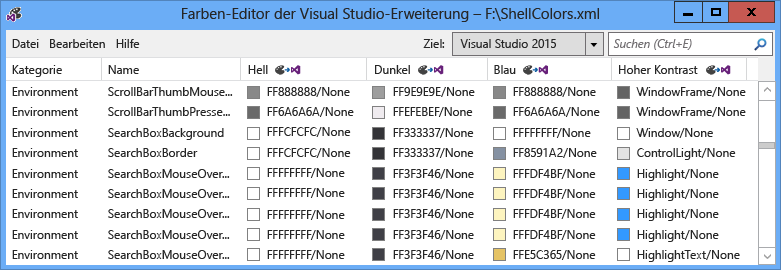
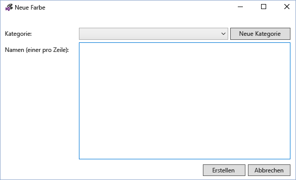
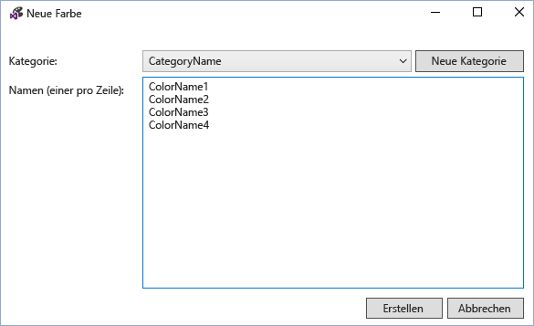
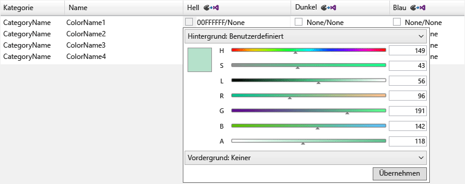
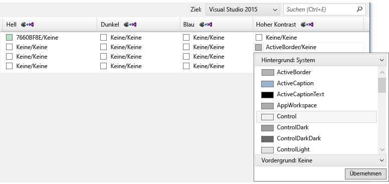
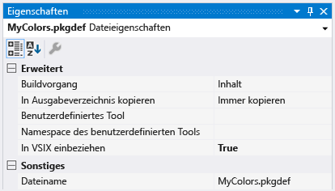
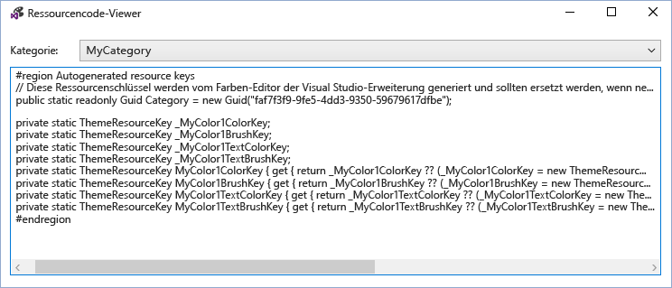
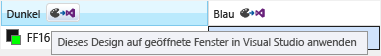

# <a name="vsix-color-editor"></a>VSIX-Farb-Editor
Mit dem Visual Studio-Erweiterungs Farb-Editor-Tool können benutzerdefinierte Farben für Visual Studio erstellt und bearbeitet werden. Das Tool kann auch Design-Ressourcen Schlüssel generieren, damit die Farben im Code verwendet werden können. Dieses Tool ist nützlich, um Farben für eine Visual Studio-Erweiterung zu erstellen, die Designs unterstützt. Mit diesem Tool können pkgdef-und XML-Dateien geöffnet werden. Visual Studio-Themen (vstheme-Dateien) können mit dem Erweiterungs Farb-Editor von Visual Studio verwendet werden, indem die Dateierweiterung in. xml geändert wird. Darüber hinaus können vstheme-Dateien in eine aktuelle XML-Datei importiert werden.

 

 **Paket Definitions Dateien**

 Paket Definitions Dateien (. pkgdef) sind die Dateien, die Designs definieren. Die Farben selbst werden in Design Color. XML-Dateien gespeichert, die in eine pkgdef-Datei kompiliert werden. Die pkgdef-Dateien werden an von Visual Studio durch suchbare Speicherorte bereitgestellt, zur Laufzeit verarbeitet und zusammengeführt, um Designs zu definieren.

 **Farbtoken**

 Ein farbtoken besteht aus vier Elementen:

- **Kategoriename:** Eine logische Gruppierung für einen Satz von Farben. Verwenden Sie einen vorhandenen Kategorienamen, wenn bereits Farben vorhanden sind, die für das gewünschte Benutzeroberflächen Element oder eine Gruppe von Benutzeroberflächen Elementen spezifisch sind.

- **Tokenname:** Ein beschreibender Name für das farbtoken und die tokensätze. Zu den Sätzen gehören Hintergrund-und Vordergrund (Text)-Tokennamen sowie alle zugehörigen Zustände. diese müssen benannt werden, damit die Paare und die Zustände, für die Sie gelten, leicht identifiziert werden können.

- **Farbwerte (oder Farben):** Für jedes farbige Design erforderlich. Erstellen Sie immer Hintergrund-und textfarbwerte in Paaren. Farben werden für Hintergrund/Vordergrund kombiniert, sodass die Textfarbe (Vordergrund) immer für die Hintergrundfarbe lesbar ist, in der Sie gezeichnet wird. Diese Farben sind verknüpft und werden zusammen in der Benutzeroberfläche verwendet. Wenn der Hintergrund nicht für die Verwendung mit Text vorgesehen ist, definieren Sie keine Vordergrundfarbe.

- **System Farbname:** Zur Verwendung in hoch Kontrast anzeigen.

## <a name="how-to-use-the-tool"></a>Verwenden des Tools
 So weit wie möglich und gegebenenfalls sollten vorhandene Visual Studio-Farben wieder verwendet werden, anstatt neue zu erstellen. In Fällen, in denen keine passenden Farben definiert sind, sollten jedoch benutzerdefinierte Farben erstellt werden, um die Kompatibilität der Erweiterungs Themen zu gewährleisten.

 **Erstellen neuer farbtoken**

 Führen Sie die folgenden Schritte aus, um benutzerdefinierte Farben mit dem Erweiterungs Farb-Editor von Visual Studio zu erstellen:

1. Bestimmen Sie die Kategorien-und Tokennamen für die neuen farbtoken.

2. Wählen Sie die Farbtöne aus, die das UI-Element für jedes Design und die System Farbe für hoher Kontrast verwenden soll.

3. Verwenden Sie den Farb-Editor, um neue farbtoken zu erstellen.

4. Verwenden Sie die Farben in einer Visual Studio-Erweiterung.

5. Testen Sie die Änderungen in Visual Studio.

   **Schritt 1: Bestimmen Sie die Kategorien-und Tokennamen für die neuen farbtoken.**

   Das bevorzugte Benennungs Schema für ein vscolor ist **[Category] [UI Type] [State]** . Verwenden Sie das Wort "Color" nicht in vscolor-Namen, da es redundant ist.

   Kategorienamen stellen logische Gruppierungen bereit und sollten so eng wie möglich definiert werden. Der Name eines einzelnen Tool Fensters könnte z. b. ein Kategoriename sein, aber der Name einer gesamten Geschäftseinheit oder eines gesamten Projektteams ist nicht. Das Gruppieren von Einträgen in Kategorien trägt dazu bei, Verwirrung zwischen Farben mit demselben Namen zu verhindern.

   Ein Tokenname muss eindeutig den Elementtyp und die Situationen oder "State" angeben, für die die Farbe angewendet wird. Beispielsweise könnte der **[UI-Typ]** eines aktiven Datentyps "**DataTip**" genannt werden, und **[State]** kann als "**Active**" bezeichnet werden, was den Farbnamen "**datatipactive**" ergibt. Da Daten Tipps über Text verfügen, müssen sowohl eine Vordergrund-als auch eine Hintergrundfarbe definiert werden. Durch die Verwendung einer Hintergrund-/vordergrundkopplung erstellt der Farb-Editor automatisch die Farben "**datatipactive**" für den Hintergrund und "**datatipactivetext**" für den Vordergrund.

   Wenn die Benutzeroberfläche nur einen Status aufweist, kann der **[State]** -Teil des Namens ausgelassen werden. Wenn ein Suchfeld z. b. einen Rahmen hat und keine Zustandsänderung vorliegt, die die Farbe des Rahmens beeinflussen würde, kann der Name für das farbtoken des Rahmens einfach als "**searchboxborder**" bezeichnet werden.

   Einige allgemeine Zustands Namen umfassen Folgendes:

- Aktiv

- Inaktiv

- MouseOver

- MouseDown

- Ausgewählt

- Focused

  Beispiele für einige Tokennamen für Teile eines Listenelement-Steuer Elements:

- ListItem

- ListItemBorder

- ListItemMouseOver

- ListItemMouseOverBorder

- Listitemselected

- ListItemSelectedBorder

- ListItemDisabled

- ListItemDisabledBorder

  **Schritt 2: Wählen Sie die Farbtöne aus, die das UI-Element für jedes Design und die System Farbe für hoher Kontrast verwenden soll.**

  Wenn Sie benutzerdefinierte Farben für die Benutzeroberfläche auswählen, wählen Sie ein ähnliches vorhandenes Benutzeroberflächen Element aus, und verwenden Sie seine Farben als Basis. Die Farben für die eingebundenen Benutzeroberflächen Elemente wurden überprüft und getestet, sodass Sie in allen Designs ordnungsgemäß Aussehen und ordnungsgemäß Verhalten.

  **Schritt 3: Verwenden Sie den Farb-Editor, um neue farbtoken zu erstellen.**

  Starten Sie den Farb-Editor, und öffnen oder erstellen Sie eine neue benutzerdefinierte Design Colors. XML-Datei. Klicken Sie im Menü auf **> neue Farbe bearbeiten** . Dadurch wird ein Dialogfeld zum Angeben der Kategorie und mindestens ein Name für Farbeinträge innerhalb dieser Kategorie geöffnet:

  

  Wählen Sie eine vorhandene Kategorie aus, oder wählen Sie **neue Kategorie** aus, um eine neue Kategorie zu erstellen. Ein weiteres Dialogfeld wird geöffnet, in dem Sie einen neuen Kategorien Amen erstellen:

  

  Die neue Kategorie wird dann im Dropdown Menü **neue Farb** Kategorie verfügbar. Nachdem Sie eine Kategorie ausgewählt haben, geben Sie für jedes neue farbtoken einen Namen pro Zeile ein, und wählen Sie "erstellen", wenn Sie fertig sind:

  

  Die Farbwerte werden in den Hintergrund-/vordergrundpaaren angezeigt, wobei "None" angibt, dass die Farbe nicht definiert wurde. Hinweis: Wenn eine Farbe kein textpaar mit Textfarbe/Hintergrundfarbe hat, muss nur der Hintergrund definiert werden.

  Farbwerte für den ![VSIX-Farb-Editor] Farbwerte für den (../../extensibility/internals/media/vsix-color-editor-color-values.png "VSIX-Farb-Editor")

  Wählen Sie zum Bearbeiten eines farbtokens einen Farb Eintrag für das Design (Spalte) dieses Tokens aus. Fügen Sie den Farbwert hinzu, indem Sie entweder einen hexadezimalen Farbwert in ein acht stelliges ARGB-Format eingeben, einen System Farbnamen in die Zelle eingeben oder das Dropdown Menü verwenden, um die gewünschte Farbe über eine Gruppe von Farb Schiebereglern oder eine Liste von Systemfarben auszuwählen.

  

  

  Geben Sie für Komponenten, die keinen Text anzeigen müssen, nur einen Farbwert ein: die Hintergrundfarbe. Geben Sie andernfalls Werte für Hintergrund-und Textfarbe ein, getrennt durch einen Schrägstrich.

  Geben Sie bei der Eingabe von Werten für hoher Kontrast gültige Namen für die Windows-System Farbe ein. Geben Sie keine hart codierten ARGB-Werte ein. Sie können eine Liste gültiger System Farbnamen anzeigen, indem Sie "Hintergrund: System-oder-Vordergrund: System "aus den Dropdown Menüs Farbwert. Wenn Sie Elemente mit Textkomponenten erstellen, verwenden Sie das richtige Hintergrund-/textsystemfarbpaar, oder der Text kann nicht gelesen werden.

  Wenn Sie das Erstellen, festlegen und Bearbeiten der farbtoken abgeschlossen haben, speichern Sie Sie im gewünschten XML-oder pkgdef-Format. Farb Token, die weder einen Hintergrund noch einen Vordergrund Satz aufweisen, werden als leere Farben im XML-Format gespeichert, aber im pkgdef-Format verworfen. In einem Dialogfeld werden Sie vor möglichen Farb Verlusten gewarnt, wenn Sie versuchen, leere Farben in einer pkgdef-Datei zu speichern.

  **Schritt 4: Verwenden Sie die Farben in einer Visual Studio-Erweiterung.**

  Nachdem Sie die neuen farbtoken definiert haben, fügen Sie die pkgdef-Datei in die Projektdatei ein, für die "Buildaktion" auf "Content" und "include in VSIX" auf "true" festgelegt ist.

  

  Wählen Sie im Visual Studio-Erweiterungs Farb-Editor Datei > Anzeigen von Ressourcen Code aus, um Code anzuzeigen, der für den Zugriff auf die benutzerdefinierten Farben in der WPF-basierten Benutzeroberfläche verwendet wird.

  

  Fügen Sie diesen Code in eine statische Klasse im Projekt ein. Ein Verweis auf **Microsoft. VisualStudio. Shell.\< Vsversion > 0. dll** muss dem Projekt hinzugefügt werden, um den **themeresourcekey** -Typ zu verwenden.

```csharp
namespace MyCustomColors
{
    public static class MyCategory
    {
        #region Autogenerated resource keys
        // These resource keys are generated by Visual Studio Extension Color Editor, and should be replaced when new colors are added to this category.
        public static readonly Guid Category = new Guid("faf7f3f9-9fe5-4dd3-9350-59679617dfbe");

        private static ThemeResourceKey _MyColor1ColorKey;
        private static ThemeResourceKey _MyColor1BrushKey;
        private static ThemeResourceKey _MyColor1TextColorKey;
        private static ThemeResourceKey _MyColor1TextBrushKey;
        public static ThemeResourceKey MyColor1ColorKey { get { return _MyColor1ColorKey ?? (_MyColor1ColorKey = new ThemeResourceKey(Category, "MyColor1", ThemeResourceKeyType.BackgroundColor)); } }
        public static ThemeResourceKey MyColor1BrushKey { get { return _MyColor1BrushKey ?? (_MyColor1BrushKey = new ThemeResourceKey(Category, "MyColor1", ThemeResourceKeyType.BackgroundBrush)); } }
        public static ThemeResourceKey MyColor1TextColorKey { get { return _MyColor1TextColorKey ?? (_MyColor1TextColorKey = new ThemeResourceKey(Category, "MyColor1", ThemeResourceKeyType.ForegroundColor)); } }
        public static ThemeResourceKey MyColor1TextBrushKey { get { return _MyColor1TextBrushKey ?? (_MyColor1TextBrushKey = new ThemeResourceKey(Category, "MyColor1", ThemeResourceKeyType.ForegroundBrush)); } }
        #endregion
    }
}
```

 Dadurch wird der Zugriff auf die Farben in XAML-Code ermöglicht, und die Benutzeroberfläche kann auf Designänderungen reagieren.

```xaml
<UserControl x:Class="NewTestProject.TestPackageControl" Name="MyToolWindow"
             xmlns="http://schemas.microsoft.com/winfx/2006/xaml/presentation"
             xmlns:x="http://schemas.microsoft.com/winfx/2006/xaml"
             xmlns:ns="clr-namespace:MyCustomColors">
  <Grid>
    <TextBlock Background="{DynamicResource {x:Static ns:MyCategory.MyColor1BrushKey}}"
               Foreground="{DynamicResource {x:Static ns:MyCategory.MyColor1TextBrushKey}}"
      >Sample Text</TextBlock>

  </Grid>
</UserControl>
```

 **Schritt 5: Testen Sie die Änderungen in Visual Studio.**

 Der Farb-Editor kann temporär Farb Token auf die ausgelaufenden Instanzen von Visual Studio anwenden, um Live Änderungen an Farben anzuzeigen, ohne das Erweiterungspaket neu zu erstellen. Klicken Sie hierzu auf die Schaltfläche "dieses Design zum Ausführen von Visual Studio-Fenstern anwenden" in der Kopfzeile der einzelnen Design Spalten. Dieses temporäre Design wird entfernt, wenn der VSIX-Farb-Editor geschlossen wird.

 

 Um die Änderungen dauerhaft zu machen, erstellen Sie die Visual Studio-Erweiterung neu, und stellen Sie Sie erneut bereit, nachdem Sie der pkgdef-Datei die neuen Farben hinzugefügt und den Code geschrieben haben, der diese Farben verwendet. Durch das erneute Erstellen der Visual Studio-Erweiterung werden die Registrierungs Werte für die neuen Farben in den restlichen Themen zusammengeführt. Starten Sie Visual Studio erneut, zeigen Sie die Benutzeroberfläche an, und überprüfen Sie, ob die neuen Farben erwartungsgemäß angezeigt werden.

## <a name="notes"></a>Hinweise
 Dieses Tool dient zum Erstellen benutzerdefinierter Farben für die bereits vorhandenen Visual Studio-Designs oder zum Bearbeiten der Farben eines benutzerdefinierten Visual Studio-Designs. Um benutzerdefinierte Visual Studio-Designs zu erstellen, laden Sie die [Visual Studio Color Theme Editor-Erweiterung](https://marketplace.visualstudio.com/items?itemName=VisualStudioProductTeam.VisualStudio2015ColorThemeEditor) aus dem Visual Studio Extensions Gallery herunter.

## <a name="sample-output"></a>Beispielausgabe
 **Ausgabe der XML-Farbe**

 Die XML-Datei, die vom Tool generiert wird, ähnelt der folgenden:

```xml
<Themes>
  <Theme Name="Light" GUID="{de3dbbcd-f642-433c-8353-8f1df4370aba}">
    <Category Name="CategoryName" GUID="{eee9d521-dac2-48d9-9a5e-5c625ba2040c}">
      <Color Name="ColorName1">
        <Background Type="CT_RAW" Source="FFFFFFFF" />
      </Color>
      <Color Name="ColorName2">
        <Background Type="CT_RAW" Source="FFFFFFFF" />
        <Foreground Type="CT_RAW" Source="FF000000" />
      </Color>
      <Color Name="ColorName3">
        <Background Type="CT_RAW" Source="FFFF0000" />
      </Color>
      <Color Name="ColorName4">
        <Background Type="CT_RAW" Source="FF000088" />
        <Foreground Type="CT_RAW" Source="FFFFFFFF" />
      </Color>
    </Category>
  </Theme>
  <Theme Name="Dark" GUID="{1ded0138-47ce-435e-84ef-9ec1f439b749}">...</Theme>
  <Theme Name="Blue" GUID="{a4d6a176-b948-4b29-8c66-53c97a1ed7d0}">...</Theme>
  <Theme Name="HighContrast" GUID="{a5c004b4-2d4b-494e-bf01-45fc492522c7}">...</Theme>
</Themes>

```

 **Pkgdef-Farbausgabe**

 Die pkgdef-Datei, die vom Tool generiert wird, ähnelt der folgenden:

```
[$RootKey$\Themes\{de3dbbcd-f642-433c-8353-8f1df4370aba}\CategoryName]
"Data"=hex:78,00,00,00,0b,00,00,00,01,00,00,00,21,d5,e9,ee,c2,da,d9,48,9a,5e,5c,62,5b,a2,04,0c,04,00,00,00,0a,00,00,00,43,6f,6c,6f,72,4e,61,6d,65,31,01,ff,ff,ff,ff,00,0a,00,00,00,43,6f,6c,6f,72,4e,61,6d,65,32,01,ff,ff,ff,ff,01,00,00,00,ff,0a,00,00,00,43,6f,6c,6f,72,4e,61,6d,65,33,01,ff,00,00,ff,00,0a,00,00,00,43,6f,6c,6f,72,4e,61,6d,65,34,01,00,00,88,ff,01,ff,ff,ff,ff
[$RootKey$\Themes\{1ded0138-47ce-435e-84ef-9ec1f439b749}\CategoryName]
"Data"=hex:...
[$RootKey$\Themes\{a4d6a176-b948-4b29-8c66-53c97a1ed7d0}\CategoryName]
"Data"=hex:...
[$RootKey$\Themes\{a5c004b4-2d4b-494e-bf01-45fc492522c7}\CategoryName]
"Data"=hex:...

```

 **C#Wrapper für Ressourcen Schlüssel**

 Die vom Tool generierten Farb Ressourcen Schlüssel ähneln den folgenden:

```csharp
namespace MyNamespace
{
    public static class MyColors
    {
        #region Autogenerated resource keys
        // These resource keys are generated by Visual Studio Extension Color Editor, and should be replaced when new colors are added to this category.

        public static string ColorName1ColorKey { get { return "ColorName1ColorKey"; } }
        public static string ColorName1BrushKey { get { return "ColorName1BrushKey"; } }

        public static string ColorName2ColorKey { get { return "ColorName2ColorKey"; } }
        public static string ColorName2BrushKey { get { return "ColorName2BrushKey"; } }
        public static string ColorName2TextColorKey { get { return "ColorName2TextColorKey"; } }
        public static string ColorName2TextBrushKey { get { return "ColorName2TextBrushKey"; } }

        public static string ColorName3ColorKey { get { return "ColorName4ColorKey"; } }
        public static string ColorName3BrushKey { get { return "ColorName4BrushKey"; } }
        public static string ColorName3TextColorKey { get { return "ColorName4TextColorKey"; } }
        public static string ColorName3TextBrushKey { get { return "ColorName4TextBrushKey"; } }
        #endregion
    }
}
```

 **WPF-Ressourcenverzeichnis Wrapper**

 Die vom Tool generierten Farben **ResourceDictionary** -Schlüssel ähneln den folgenden:

```xaml
<ResourceDictionary xmlns="http://schemas.microsoft.com/winfx/2006/xaml/presentation"
        xmlns:x="http://schemas.microsoft.com/winfx/2006/xaml"
        xmlns:colors="clr-namespace:MyNamespace">

  <SolidColorBrush x:Key="{x:Static colors:MyColors.ColorName1BrushKey}" Color="#FFFFFFFF" />
  <Color x:Key="{x:Static colors:MyColors.ColorName1ColorKey}" A="255" R="255" G="255" B="255" />

  <SolidColorBrush x:Key="{x:Static colors:MyColors.ColorName2BrushKey}" Color="#FFFFFFFF" />
  <Color x:Key="{x:Static colors:MyColors.ColorName2ColorKey}" A="255" R="255" G="255" B="255" />
  <SolidColorBrush x:Key="{x:Static colors:MyColors.ColorName2TextBrushKey}" Color="#FF000000" />
  <Color x:Key="{x:Static colors:MyColors.ColorName2TextColorKey}" A="255" R="0" G="0" B="0" />

  <SolidColorBrush x:Key="{x:Static colors:MyColors.ColorName3BrushKey}" Color="#FFFF0000" />
  <Color x:Key="{x:Static colors:MyColors.ColorName3ColorKey}" A="255" R="255" G="0" B="0" />

  <SolidColorBrush x:Key="{x:Static colors:MyColors.ColorName4BrushKey}" Color="#FF000088" />
  <Color x:Key="{x:Static colors:MyColors.ColorName4ColorKey}" A="255" R="0" G="0" B="136" />
  <SolidColorBrush x:Key="{x:Static colors:MyColors.ColorName4TextBrushKey}" Color="#FFFFFFFF" />
  <Color x:Key="{x:Static colors:MyColors.ColorName4TextColorKey}" A="255" R="255" G="255" B="255" />
</ResourceDictionary>
```