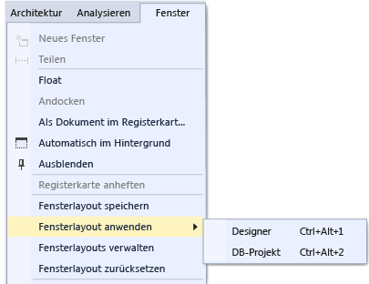
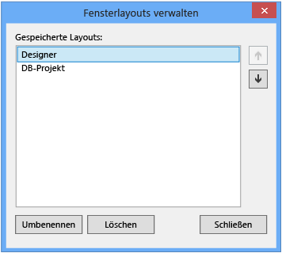

# Anpassen von Fensterlayouts in Visual Studio

In Visual Studio können Sie Position, Größe und Verhalten von Fenstern anpassen, um Fensterlayouts zu erstellen, die für unterschiedliche Entwicklungsworkflows am besten geeignet sind. Wenn Sie das Layout anpassen, wird dies in der IDE gespeichert. Wenn Sie z. B. die Andockposition des **Projektmappen-Explorers** ändern und Visual Studio dann schließen, ist der **Projektmappen-Explorer** nach dem nächsten Start an derselben Position angedockt, selbst wenn Sie an einem anderen Computer arbeiten. Sie können ein benutzerdefiniertes Layout auch benennen und speichern und dann mit einem einzelnen Befehl zwischen den Layouts wechseln. Beispielsweise können Sie ein Layout für die Bearbeitung und ein anderes für das Debuggen erstellen und zwischen diesen mithilfe des Menübefehls **Fenster** > **Fensterlayout anwenden** wechseln.

## Fensterarten

### Tool- und Dokumentfenster

Die IDE verfügt über zwei grundlegende Fenstertypen *Toolfenster* und *Dokumentfenster*. Toolfenster sind in **Projektmappen-Explorer**, **Server-Explorer**, **Ausgabefenster**, **Fehlerliste** sowie im Designer, in den Debuggerfenstern usw. enthalten. Dokumentfenster enthalten Quellcodedateien, beliebige Textdateien, Konfigurationsdateien usw. Die Größe der Toolfenster kann angepasst werden, und sie können an der Titelleiste gezogen werden. Dokumentfenster können an der Registerkarte gezogen werden. Klicken Sie zum Festlegen anderer Optionen für das Fenster mit der rechten Maustaste auf die Registerkarte oder die Titelleiste.

Im Menü **Fenster** werden Optionen zum Andocken, Verankern und Ausblenden von Fenstern in der IDE angezeigt. Klicken Sie mit der rechten Maustaste auf eine Fensterregisterkarte oder Titelleiste, um weitere Optionen für ein bestimmtes Fenster anzuzeigen. Sie können mehrere Instanzen bestimmter Toolfenster gleichzeitig anzeigen. Sie können z. B. mehrere Webbrowserfenster anzeigen und zusätzliche Instanzen bestimmter Toolfenster erstellen, indem Sie **Neues Fenster** im Menü **Fenster** wählen.

### Registerkarte „Vorschau“ (Dokumentfenster)

Auf der Registerkarte **Vorschau** können Sie Dateien im Editor anzeigen, ohne sie zu öffnen. Sie können die Vorschau für Dateien anzeigen, indem Sie diese im **Projektmappen-Explorer** auswählen, während des Debuggens die einzelnen Dateien durchlaufen, mit der Option **Gehe zu Definition** oder beim Durchsuchen der Suchergebnisse. Vorschaudateien werden auch in einer Registerkarte auf der rechten Seite der Dokumentregisterkarte angezeigt. Die Datei wird zum Bearbeiten geöffnet, wenn Sie sie ändern oder auf **Öffnen** klicken.

### Registerkartengruppen

Mit Registerkartengruppen können Sie die Verwaltung des eingeschränkten Arbeitsbereichs beim Arbeiten mit mindestens zwei geöffneten Dokumenten in der IDE erweitern. Sie können mehrere Dokument- und Toolfenster in vertikalen oder horizontalen Registerkartengruppen anordnen und Dokumente zwischen den Registerkartengruppen verschieben.

### Geteilte Fenster

Wenn Sie zwei Positionen gleichzeitig in einem Dokument anzeigen oder bearbeiten müssen, können Sie die Fenster teilen. Um das Dokument in zwei Abschnitte zu teilen, durch die unabhängig voneinander gescrollt werden kann, klicken Sie auf **Teilen** im Menü **Fenster** . Klicken Sie auf **Teilung aufheben** im Menü **Fenster** , um die ursprüngliche Ansicht wiederherzustellen.

### Symbolleisten

Symbolleisten können durch Ziehen oder mithilfe des Dialogfelds **Anpassen** angeordnet werden. Weitere Informationen zum Positionieren und Anpassen von Symbolleisten finden Sie unter [Vorgehensweise: Anpassen von Menüs und Symbolleisten](../ide/how-to-customize-menus-and-toolbars-in-visual-studio.md).

## Anordnen und Andocken von Fenstern

Dokumentfenster und Toolfenster können *angedockt* werden, sodass sie eine Position und Größe innerhalb des Rahmens des IDE-Fensters haben oder als unverankerte Fenster der IDE angezeigt werden. Toolfenster können an einer beliebigen Stelle innerhalb des IDE-Rahmens angedockt werden; manche Toolfenster können im Registerkartenformat angedockt werden. Dokumentfenster können innerhalb des Editorrahmens angedockt und an ihre aktuelle Position in der Aktivierreihenfolge angeheftet werden. Sie können mehrere Fenster per *Rafting* außerhalb der IDE andocken. Toolfenster können ausgeblendet oder minimiert werden.

Fenster können auf die folgenden Weisen angeordnet werden:

-   Heftet Dokumentfenster auf der linken Seite der Registerkartenreihe an.

-   Andocken von Fenstern am Bearbeitungsrahmen

-   Andocken von Toolfenstern am Rand eines Frames in der IDE.

-   Verschieben von Dokument- oder Toolfenstern über die IDE bzw. außerhalb der IDE.

-   Verbergen von Toolfenstern am Rand der IDE.

-   Anzeigen von Fenstern auf verschiedenen Bildschirmen.

-   Zurücksetzen der Fensteranordnung auf das Standardlayout oder ein gespeichertes benutzerdefiniertes Layout.

Tool- und Dokumentfenster können durch Ziehen, mit Befehlen im Menü **Fenster** und durch Klicken mit der rechten Maustaste auf die Titelleiste des anzuordnenden Fensters angeordnet werden.

### Andocken von Fenstern

Beim Klicken und Ziehen der Titelleiste eines Toolfensters oder der Registerkarte im Dokumentfenster wird ein Diamant-Führungssymbol angezeigt. Während des Ziehvorgangs wird, wenn sich der Mauszeiger über einem der Pfeile im Diamanten befindet, ein schattierter Bereich angezeigt, der anzeigt, wo das Fenster angedockt wird, wenn Sie die Maustaste loslassen.

Halten Sie beim Ziehen eines Fensters die **STRG-TASTE** gedrückt, um ein andockbares Fenster ohne Einrasten zu verschieben.

Drücken Sie zum Zurückkehren an die letzte Andockposition eines Tool- oder Dokumentfensters **STRG**, während Sie auf die Titelleiste oder die Registerkarte des Fensters doppelklicken.

Die folgende Abbildung veranschaulicht das Diamant-Führungssymbol für Dokumentfenster, das nur im Bearbeitungsrahmen angedockt werden kann:

Toolfenster können an einer Seite eines Frames in der IDE oder innerhalb des Bearbeitungsrahmens angebunden werden. Ein Diamant-Führungssymbol wird angezeigt, wenn Sie ein Toolfenster an eine andere Position ziehen, damit Sie das Fenster problemlos neu andocken können.

Diamant-Führungssymbol für Toolfenster

In der folgenden Abbildung ist der **Projektmappen-Explorer** an einer neuen Position angedockt, die durch den blau schattierten Bereich dargestellt wird:

### Schließen und automatisches Ausblenden von Toolfenstern

Sie können ein Toolfenster schließen, indem Sie auf das **X** in der Titelleiste oben rechts klicken. Verwenden Sie zum erneuten Öffnen des Fensters die entsprechende Tastenkombination oder den Menübefehl. Toolfenster unterstützen das Feature *Automatisch im Hintergrund*, mit der ein Fenster bei Verwendung eines anderen Fensters in den Hintergrund versetzt wird und ist somit nicht mehr sichtbar ist. Wenn ein Fenster automatisch in den Hintergrund versetzt wird, wird sein Name auf einer Registerkarte am Rand der IDE angezeigt. Um das Fenster wieder zu verwenden, zeigen Sie auf die Registerkarte, damit das Fenster wieder angezeigt wird.

> [!NOTE]
> Legen Sie fest, ob die Funktion „Automatisch im Hintergrund“ in Toolfenstern einzeln oder als angedockte Gruppe ausgeführt wird, indem Sie im Dialogfeld **Optionen** das Kontrollkästchen **Schaltfläche „Automatisch ausblenden“ bezieht sich nur auf aktives Toolfenster** aktivieren oder deaktivieren. Weitere Informationen finden Sie im Artikel zu den Dialogfeldern [Allgemein, Umgebung und Optionen](../ide/reference/general-environment-options-dialog-box.md).

> [!NOTE]
> Toolfenster, für die die Option „Automatisch im Hintergrund“ aktiviert ist, werden möglicherweise kurz eingeblendet, sobald das Fenster den Fokus erhält. Zum Ausblenden des Fensters wählen Sie ein Element außerhalb des aktuellen Fensters aus. Wenn das Fenster den Fokus verliert, wird es ausgeblendet.

### Angeben eines zweiten Monitors

Wenn Sie einen zweiten Bildschirm besitzen und dieser vom Betriebssystem unterstützt wird, können Sie angeben, auf welchem Bildschirm ein Fenster angezeigt werden soll. Sie können mehrere Fenster sogar in *Rafts* auf anderen Bildschirmen gruppieren.

> [!TIP]
> Sie können auch mehrere Instanzen von **Projektmappen-Explorer** erstellen und auf einen anderen Bildschirm verschieben. Klicken Sie mit der rechten Maustaste in das Fenster und wählen Sie **Neue Projektmappen-Explorer-Ansicht**aus. Sie können alle Fenster wieder zum ursprüngliche Bildschirm zurückkehren lassen, indem Sie auf **STRG** drücken und gleichzeitig doppelklicken.

### Zurücksetzen, Benennen und Wechseln zwischen Fensterlayouts

Sie können die IDE mit dem Befehl **Fensterlayout zurücksetzen** auf das ursprüngliche Fensterlayout für Ihre Einstellungsauflistung zurücksetzen. Beim Ausführen dieses Befehls geschieht Folgendes:

-   Alle Fenster werden an ihre Standardpositionen verschoben.

-   Fenster, die im Standardfensterlayout geschlossen sind, werden geschlossen.

-   Fenster, die im Standardfensterlayout geöffnet sind, werden geöffnet.

### Erstellen und Speichern von benutzerdefinierten Layouts

Mit Visual Studio können Sie bis zu 10 benutzerdefinierte Fensterlayouts speichern und schnell zwischen diesen wechseln. Die folgenden Schritte zeigen Ihnen, wie Sie benutzerdefinierte Layouts, mit denen Sie die Vorteile mehrerer Monitore mit angedockten Fenstern und unverankerten Toolfenstern nutzen können, erstellen, speichern, aufrufen und verwalten.

Erstellen Sie zunächst eine Testprojektmappe mit zwei Projekten, die jeweils über ein optimales Layout verfügen.

#### Erstellen eines Benutzeroberflächenprojekts und individuelles Anpassen des Layouts

1.  Erstellen Sie im Dialogfeld **Neues Projekt** eine **C#-WPF-Desktopanwendung**, und geben Sie dieser einen beliebigen Namen. Nehmen wir an, dass Sie bei diesem Projekt an der Benutzeroberfläche arbeiten. Daher sollten Sie den Platz für das Designerfenster maximieren und andere Toolfenster aus dem Weg schieben.

2.  Wenn Sie über mehrere Monitore verfügen, ziehen Sie das **Projektmappen-Explorerfenster** und das Fenster **Eigenschaften** auf den zweiten Monitor. Versuchen Sie, wenn Ihnen nur ein Monitor zur Verfügung steht, alle Fenster außer dem Designerfenster zu schließen.

3.  Drücken Sie **Strg+Alt+X**, um die **Toolbox** anzuzeigen. Ist das Fenster angedockt, ziehen Sie es so, dass es sich auf dem gewünschten Monitor freischwebend dort befindet, wo Sie es platzieren möchten.

4.  Drücken Sie **F5**, um Visual Studio in den Debugmodus zu versetzen. Passen Sie die Position der Debugfenster **Auto**, **Aufrufliste** und **Ausgabe** an Ihre Anforderungen an. Das Layout, das Sie erstellen, ist sowohl für den Bearbeitungsmodus als auch den Debugmous geeignet.

5.  Wenn Sie die Layouts sowohl im Debugmodus als auch im Bearbeitungsmodus Ihren Anforderungen angepasst haben, klicken Sie im Hauptmenü auf **Fenster** > **Fensterlayout speichern**. Nennen Sie dieses Layout „Designer“.

     Beachten Sie, dass das neue Layout der nächsten Tastenkombination aus der reservierten Liste mit **STRG** + **ALT** + **1...0** zugewiesen wird.

#### Erstellen eines Datenbankprojekts und eines Layouts

1.  Fügen Sie der Projektmappe ein neues **SQL Server-Datenbankprojekt** hinzu.

2.  Rechtsklicken Sie im **Projektmappen-Explorer** auf das neue Projekt, und klicken Sie auf **In Objekt-Explorer anzeigen**. Dadurch wird das Fenster **SQL Server-Objekt-Explorer** angezeigt, mit dem Sie auf Tabellen, Ansichten und andere Objekte in der Datenbank zugreifen können. Dieses Fenster kann entweder schwebend sein oder angedockt bleiben. Passen Sie die anderen Toolfenster wie gewünscht an. Um das Beispiel realistischer zu gestalten, können Sie eine tatsächliche Datenbank hinzufügen. Für diese exemplarische Vorgehensweise ist das jedoch nicht notwendig.

3.  Wenn das Layout Ihren Vorstellungen entspricht, klicken Sie im Hauptmenü auf **Fenster** > **Fensterlayout speichern**. Nennen Sie dieses Layout „DB Project“. (Für dieses Projekt ist kein Layout für den Debugmodus erforderlich.)

#### Wechseln zwischen Layouts

Sie können mit Tastenkombinationen zwischen Layouts wechseln, oder klicken Sie im Hauptmenü auf **Fenster** > **Fensterlayout anwenden**.

Nachdem Sie das Benutzeroberflächenlayout angewendet haben, beachten Sie, wie das Layout im Bearbeitungs- und im Debugmodus beibehalten wird.

Wenn Sie an Ihrem Arbeitsplatz mehrere Monitore und zuhause einen Laptop mit nur einem Monitor nutzen, können Sie Layouts erstellen, die für den jeweiligen Computer optimiert sind.

> [!NOTE]
> Wenn Sie ein für mehrere Monitore konzipiertes Layout mit einem einzelnen Monitor nutzen, werden die frei schwebenden Fenster, die Sie auf dem zweiten Monitor platziert haben, durch das Visual Studio-Fenster verdeckt. Sie können diese Fenster in den Vordergrund bewegen, indem Sie **ALT+TAB** drücken. Wenn Sie später Visual Studio mit mehreren Monitoren öffnen, können Sie die Fenster wieder auf die festgelegten Positionen verschieben, indem Sie das Layout erneut anwenden.

#### Verwalten der Layouts und Ausführen von Roamings

Sie können benutzerdefinierte Layouts entfernen, umbenennen oder neu arrangieren, indem Sie auf **Fenster** > **Fensterlayouts verwalten** klicken. Wenn Sie ein Layout verschieben, wird die Schlüsselbindung automatisch so angepasst, dass die neue Position in der Liste wiedergegeben wird. Die Bindung kann nicht auf andere Weise geändert werden. Daher können Sie maximal 10 Layouts gleichzeitig speichern.

Klicken Sie auf **Fenster** > **Fensterlayout anwenden**, um nachzusehen, welche Tastenkombination welchem Layout zugeordnet ist.

Für diese Layouts wird automatisch Roaming zwischen Visual Studio-Editionen ausgeführt, ebenso zwischen Blend-Instanzen auf unterschiedlichen Computern sowie zwischen einer Express-Edition und jeder beliebigen anderen Express-Organisation. Es kann jedoch kein Roaming der Layouts zwischen Visual Studio, Blend und Express ausgeführt werden.

## Siehe auch

- [Vorgehensweise: Navigieren in der IDE](../ide/how-to-move-around-in-the-visual-studio-ide.md)