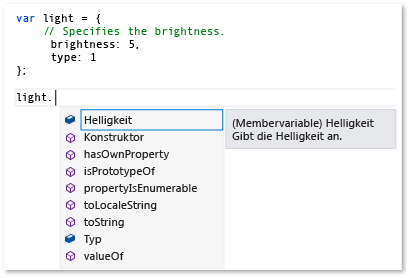
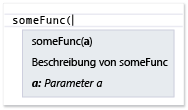
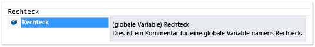
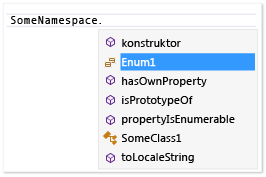
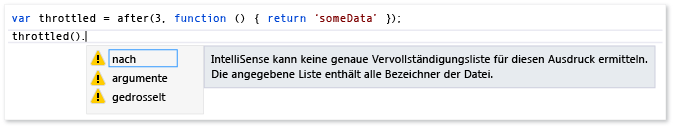

# Erweitern von JavaScript IntelliSense
[!INCLUDE[vs2017banner](../code-quality/includes/vs2017banner.md)]

Die Erweiterbarkeitsfunktion JavaScript IntelliSense ermöglicht es Ihnen, IntelliSense\-Ergebnisse im JavaScript\-Editor für Bibliotheken von Drittanbietern anzupassen.  Dies kann die Erfahrung von Entwicklern verbessern, die diese Bibliotheken verwenden.  
  
 Der JavaScript\-Sprachendienst stellt IntelliSense\-Features für Drittanbieter JavaScript\-Bibliotheken bereit, die dem Projekt hinzugefügt werden.  Für die meisten Bibliotheken Anweisungsvervollständigung wird automatisch vom Sprachdienst bereitgestellt.  Die folgende Abbildung zeigt ein Beispiel der Anweisungsvervollständigung an:  
  
   
  
 Wenn die Bibliothek Beschreibungen von Variablen, Funktionen und Objekte in den Standard\-JavaScript\-Kommentartags \(\/\), profitieren Sie standardmäßig automatisch von IntelliSense\-Erweiterbarkeitsfunktionen, die beschreibende Informationen in einem Popupfeld bereitstellen, der auf der rechten Seite der Elemente in einer Vervollständigungsliste angezeigt wird, oder wenn Sie die öffnende Klammer in einem Funktionsaufruf eingeben.  Die Kommentare im Popupfeld enthalten die Beschreibung des Members.  Im folgenden Beispiel wird das Popupfeld für eine Vervollständigungsliste an.  
  
   
  
 Um den Entwicklungsprozess weiter zu verbessern, sollten Sie Typinformationen für Entwickler im Popupfeld bereitstellen.  Sie können Typinformationen aus der Verwendung von JavaScript [XML\-Dokumentationskommentare](../ide/xml-documentation-comments-javascript.md) anstelle der Standardkommentartags bereitstellen.  Sie fügen XML\-Dokumentationskommentare hinzu, indem Sie TripelSchrägstrichkommentartags \(\/\) und einen definierten Satz XML\-Elemente verwenden.  
  
 Alternativ können Sie Typinformationen aus der Anwendung der Erweiterbarkeit JavaScript IntelliSense bereitstellen.  Diese Funktion ermöglicht es Ihnen, IntelliSense\-Ergebnisse anzupassen, indem sie JavaScript\-Erweiterungen erstellt und an den Skriptkontext hinzugefügt wird.  In der Erweiterung die eine JavaScript\-Datei ist, abonnieren Sie Ereignisse, die vom `intellisense`\-Objekt des Sprachdiensts verfügbar gemacht werden.  Erweiterbarkeit JavaScript IntelliSense ist die bevorzugte Projektmappe für Bibliotheken, wenn ein Verhaltensmuster in der Bibliothek den JavaScript\-Sprachendienst an der Bereitstellung des gewünschten Ebenen von IntelliSense\-Unterstützung verhindert und eine Alternative zu deklarativen XML\-Dokumentationskommentaren auch benötigt wird.  Mithilfe der IntelliSense\-Ergebnisse anpassen, können Sie eine erstklassige IntelliSense\-Erfahrung, unabhängig von alle Verhaltensmuster erstellen, die die standardmäßige Funktionen des Sprachdiensts einschränkten.  Weitere Informationen finden Sie unter [Anweisungsvervollständigung für Bezeichner](../ide/statement-completion-for-identifiers.md).  
  
## Hinzufügen einer Erweiterung für Skript\-Kontext  
 Damit eine IntelliSense\-Erweiterung ausgeführt werden kann, muss sie dem aktuellen Skriptkontext hinzugefügt werden.  Die Erweiterung kann dem Skriptkontext durch den automatischen Suchenmechanismus automatisch hinzugefügt werden, oder Sie können die Erweiterung dem Skriptkontext manuell hinzufügen, indem Sie Vergleichsgruppen oder die Reference\-Direktiven verwenden.  
  
 Der automatische Suchenmechanismus aktiviert den Sprachdienst, um Erweiterungen zu suchen, die der Dateinamenskonvention *libraryname*.intellisense.js ausführen und sich im gleichen Verzeichnis wie die Bibliothek sind, auf die die Erweiterung gilt.  Beispielsweise kann eine gültige Erweiterung für die jQuery\-Bibliothek jQuery.intellisense.js sein.  Für restriktivere jQuery Erweiterungen können Sie Dateinamen wie jQuery\-1.7.1.intellisense.js \(eine versionsspezifische Erweiterung\) oder jQuery.ui.intellisense.js \(eine Erweiterung für eine bewertete jQuery\-Bibliothek\) verwenden.  Die einschränkendste Version der Erweiterung wird verwendet, wenn mehr als eine Erweiterung für eine angegebene Bibliothek gefunden wird.  
  
 Wenn Sie die Erweiterung für all JavaScript\-Projektdateien verwenden möchten, können Sie möglicherweise stattdessen, um die Erweiterung einer Vergleichsgruppe hinzuzufügen.  Es gibt mehrere Typen Vergleichsgruppen, entweder die, die implizite Verweise einfügen und die, die einschließen, dedizierter Worker verweist.  Um eine Erweiterung hinzuzufügen, müssen Sie die Datei als implizite Vergleichsgruppe, jedes **Implizit \(Windows\)**, **Implizit \(Web\)** hinzufügen.  Implizite Verweise sind im Bereich für jede JS\-Datei, die im Code\-Editor geöffnet ist.  Wenn Sie diese Methode verwenden, müssen Sie die Erweiterung und die Datei hinzufügen, die die Erweiterung ergänzt.  
  
 Verwenden Sie die Seite des Dialogfelds **IntelliSenseOptionen**, um eine Erweiterung als Vergleichsgruppe hinzuzufügen.  Sie können auf die Seite **IntelliSense** zugreifen, indem Sie **Tools**, **Optionen** in der Menüleiste und **Text\-Editor** auswählen, **JavaScript**, **IntelliSense**, **Verweise** auswählen.  Weitere Informationen zu Vergleichsgruppen, finden Sie unter [JavaScript IntelliSense](../ide/javascript-intellisense.md) und [Optionen, Text\-Editor, JavaScript, IntelliSense](../ide/reference/options-text-editor-javascript-intellisense.md).  
  
 Wenn Sie die Erweiterung für eine bestimmte verwenden möchten, das von den Dateien festgelegt ist, verwenden Sie Reference\-Direktiven.  Wenn Sie diese Methode verwenden, müssen Sie die Erweiterung verweisen und die Datei, die die Erweiterung ergänzt.  Informationen zum Verwenden der Reference\-Direktiven, finden Sie unter [JavaScript IntelliSense](../ide/javascript-intellisense.md).  
  
## Behandlungs\-IntelliSense\-Ereignisse  
 Die Erweiterbarkeitsfunktion ermöglicht es Ihnen, IntelliSense\-Ergebnisse anzupassen, indem Sie Ereignisse wie das `statementcompletion`\-Ereignis des Sprachendienst\-`intellisense`\-Objekts abonnieren.  Das folgende Beispiel zeigt eine einfache Erweiterung an, die vom Sprachdienst verwendet wird, um Member auszublenden, die mit einem Unterstrich von der Anweisungsvervollständigung starten.  Dieser Code ist in underscorefilter.js enthalten und ist im Ordner \\\\*Visual Studio\-Installationspfad*\\JavaScript\\References.  
  
```javascript  
intellisense.addEventListener('statementcompletion', function (event) {  
    if (event.targetName === "this") return;  
  
    var filterRegex;  
  
    if (event.target === undefined || event.target === window)  
        filterRegex = /^_.*\d{2,}/;  
    else  
        filterRegex = /^_.*/;  
  
    event.items = event.items.filter(function (item) {  
        return !filterRegex.test(item.name);  
    });  
});  
```  
  
 Im vorangehenden Code überprüft die Erweiterung die [targetName Eigenschaft](#TargetName) und [Ziel Eigenschaft](#Target)\-Eigenschaften des `statementcompletion`\-Ereignisobjekts Objekten, z `this` und `window` auszuschließen, und sicherzustellen, dass eine gültige Anweisungsvervollständigungsliste identifiziert werden kann.  Wenn eine Vervollständigungsliste identifiziert werden kann, aktualisiert die Erweiterung die [- Eigenschaft](#Items)\-Auflistung der Anweisungsvervollständigung, indem die Member herausgefiltert werden, die mit einem Unterstrich beginnen.  
  
 Weitere Beispiele finden Sie im Ordner *Visual Studio\-Installationspfad*\\JavaScript\\References.  Die showPlainComments.js\-Datei in diesem Ordner enthält Beispiele der Verwendung anderer Ereignisse, sodass die IntelliSense\-Unterstützung für Standard\-JavaScript\-Kommentartags zu unterstützen \(\/\).  Wie underscorefilter.js ist showPlainComments.js bereits als funktionierende Erweiterung verfügbar, und Sie können die resultierenden IntelliSense\-Informationen finden, wenn Sie Kommentar verwenden, ein im Code für Variablen, Funktionen und Objekte.  Weitere Beispiele finden Sie unter [Codebeispiele](#CodeExamples).  
  
> [!WARNING]
>  Wenn Sie die Erweiterungsdateien ändern, die in Visual Studio enthalten sind, deaktivieren Sie möglicherweise JavaScript IntelliSense oder die Funktion, die durch die Erweiterung unterstützt wird.  
  
 In dem Add\-In\-Code können Sie Handler für die folgenden Ereignistypen erstellen, indem Sie `addEventListener` verwenden:  
  
-   `statementcompletion`, das einen Handler für ein Anweisungsvervollständigungsereignis hinzugefügt wird.  Anweisungsvervollständigung stellt eine Liste der Member für einen bestimmten Typ bereit, der angezeigt wird, nachdem Sie ein Sonderzeichen wie ein Punkt \(.\) eingeben, oder eine Liste von Bezeichnern, die angezeigt wird, während Sie eingeben, oder wenn Sie STRG\+J drücken.  Der Handler empfängt ein Ereignisobjekt des Typs `CompletionEvent`, der die folgenden Member unterstützt: [- Eigenschaft](#Items), [Ziel Eigenschaft](#Target), [targetName Eigenschaft](#TargetName) und [Eigenschaftenbereich](#Scope).  
  
-   `signaturehelp`, das einen Handler für IntelliSense\-Parameterinformationen hinzugefügt wird.  Parameterinformationen geben Sie Informationen über die Anzahl, Namen und Typen von Parametern, die durch eine Funktion benötigt werden.  Der Handler empfängt ein Ereignisobjekt des Typs `SignatureHelpEvent`, der die folgenden Member unterstützt: [Ziel Eigenschaft](#Target), [parentObject Eigenschaft](#ParentObject), [functionComments Eigenschaft](#FunctionComments), [functionHelp Eigenschaft](#FunctionHelp).  
  
-   `statementcompletionhint`, das einen Handler für IntelliSense\-QuickInfo hinzugefügt wird.  Das QuickInfopopupfeld zeigt die vollständige Deklaration für Bezeichner im Code an.  Der Handler empfängt ein Ereignisobjekt des Typs `CompletionHintEvent`, der die folgenden Member unterstützt: [completionItem Eigenschaft](#CompletionItem) und [symbolHelp Eigenschaft](#SymbolHelp).  
  
 Beispiele, die IntelliSense\-Funktionen wie Anweisungsvervollständigung, Parameterinformationen und QuickInfo anzeigen, finden Sie unter [Verwenden von IntelliSense](../ide/using-intellisense.md).  
  
> [!NOTE]
>  In JavaScript QuickInfo verweist auf das Popupfeld an, das auf der rechten Seite einer Vervollständigungsliste angezeigt wird.  Sie können QuickInfo nicht manuell aufrufen.  
  
##  <a name="intellisenseObject"></a> IntelliSense\-Objekt  
 Die folgende Tabelle enthält die Funktionen, die für das `intellisense`\-Objekt verfügbar sind.  Das `intellisense`\-Objekt ist nur zur Entwurfszeit verfügbar.  
  
|Funktion|Beschreibung|  
|--------------|------------------|  
|`addEventListener(type, handler);`|Fügt einen Ereignishandler für ein IntelliSense\-Ereignis hinzu.<br /><br /> `type` ist ein Zeichenfolgenwert.  Gültige Werte enthalten `statementcompletion`, `signaturehelp` und `statementcompletionhint`.<br /><br /> `handler` ist eine Ereignishandlerfunktion, die ein Ereignisobjekt eines der folgenden Typen empfängt:<br /><br /> -   `CompletionEvent`, zum `statementcompletion`\-Ereignis.<br />-   `SignatureHelpEvent`, zum `signaturehelp`\-Ereignis.<br />-   `CompletionHintEvent`, zum `statementcompletionhint`\-Ereignis.<br /><br /> Beispiele, die diese Funktion verwenden, finden Sie unter [Codebeispiele](#CodeExamples).|  
|`annotate(obj, doc);`|Gibt Dokumentation für ein Objekt durch Kopieren von Dokumentationskommentaren von einem Objekt in einem anderen \- Objekt.<br /><br /> `obj` gibt das Objekt an, zu dem die Dokumentation kopieren.<br /><br /> `doc` gibt das Objekt an, von dem die Dokumentation kopieren.<br /><br /> Ein Beispiel, wie diese Funktion, finden [Hinzufügen von IntelliSense-Anmerkungen](#Annotations) verwendet.|  
|`getFunctionComments(func);`|Gibt die Kommentare für eine bestimmte Funktion zurück.<br /><br /> `func` gibt die Funktion an, für die Kommentare zurückgegeben werden.<br /><br /> Sie können den `func`\-Parameter festlegen, indem Sie `completionItem.value` verwenden.<br /><br /> Das zurückgegebene Objekt `functionComments` umfasst die folgenden Member: `above`, `inside` und `paramComment`.  Weitere Informationen finden Sie in den Ausführungen zur [functionComments Eigenschaft](#FunctionComments)\-Eigenschaft.<br /><br /> `getFunctionComments` kann nur aus einem der Ereignishandler aufgerufen werden, die von `addEventListener` registriert werden.<br /><br /> Ein Beispiel, wie diese Funktion verwendet wird, finden Sie in *Visual Studio\-Installationspfad*\\JavaScript\\References\\showPlainComments.js.|  
|`logMessage(msg);`|Sendet an das Ausgabefenster Diagnosemeldungen.<br /><br /> `msg` ist eine Zeichenfolge, die die Nachricht enthält.<br /><br /> Ein Beispiel, wie diese Funktion, finden [Senden von Meldungen an das Ausgabefenster](#Logging) verwendet.|  
|`nullWithCompletionsOf(value);`|Gibt einen speziellen NULL\-Wert zurück, für den die Vervollständigungsliste durch das Objekt bestimmt wird, das in den `value`\-Parameter übergeben wird.<br /><br /> `value` bestimmt die Vervollständigungsliste für den zurückgegebenen Wert.  `value` kann ein beliebiger Typ sein.<br /><br /> Der Rückgabewert wird NULL als NULL zur Entwurfszeit behandelt, aber die Vervollständigungsliste für den Rückgabewert ist dieselbe wie die Vervollständigungsliste für den `value`\-Parameter.<br /><br /> Eine Verwendung für diese Funktion ist, IntelliSense für einen Rückgabewert bereitzustellen, wenn der Rückgabetyp zur Laufzeit vorhersehbar ist, aber der Rückgabewert ist `null` zur Entwurfszeit.|  
|`redirectDefinition(func, definition);`|Weist IntelliSense an, um die bereitgestellte Definitionsfunktion statt der ursprünglichen Funktionsfunktion zu verwenden, wenn Parameterhilfe oder **Gehe zu Definition** angefordert wird.<br /><br /> `func` gibt der Zielfunktion an.<br /><br /> `definition` gibt die statt an der Zielfunktion für Parameterinformationen und **Gehe zu Definition** verwendet werden, Funktion.|  
|`setCallContext(func, thisArg);`|Legt den Aufrufkontext oder Bereich, für die angegebene Funktion fest.<br /><br /> `func` gibt die Funktion an, für die der Bereich festlegen.<br /><br /> `thisArg` ist ein Objektliteral, zu dem das `this`\-Schlüsselwort verweisen kann, das den neuen Bereich für den Member angibt.  Sie können Argumente einschließen, um in diesen Parameter beispielsweise `intellisense.setCallContext(func, { thisArg: "", args: [23,2] });` zu übergeben<br /><br /> `setCallContext` stellt das Verhalten, das zu `Function.prototype.bind` entspricht, außer dass verwendete nur für die Entwurfszeit IntelliSense\-Unterstützung.  Sie können `setCallContext` verwenden, um den Gültigkeitsbereich der Funktion festzulegen, wenn Sie einen Aufruf an den Code simulieren müssen, der andernfalls nicht erreichbar ist, dass, wenn Sie die Funktion aufrufen, der Funktionsaufruf den richtigen Bereich und die Argumente umfasst.|  
|`undefinedWithCompletionsOf(value);`|Gibt einen special nicht definierten Wert zurück, für den die Vervollständigungsliste durch das Objekt bestimmt wird, das in den `value`\-Parameter übergeben wird.<br /><br /> `value` bestimmt die Vervollständigungsliste für den zurückgegebenen Wert.  `value` kann ein beliebiger Typ sein.<br /><br /> Der nicht definierte Rückgabewert wird behandelt, wie zur Entwurfszeit definiert, aber die Vervollständigungsliste für den Rückgabewert ist dieselbe wie die Vervollständigungsliste für den `value`\-Parameter.<br /><br /> Eine Verwendung für diese Funktion ist, IntelliSense für einen Rückgabewert bereitzustellen, wenn der Rückgabetyp zur Laufzeit vorhersehbar ist, aber der Rückgabewert wird zur Entwurfszeit nicht definiert.|  
|`version()`|Gibt die Visual Studio\-Version zurück.|  
  
## Auf Ereignismember  
 In den folgenden Abschnitten werden die Member, die verfügbar gemachte im \- Objekt für die folgenden Ereignisse sind: `statementcompletion`, `signaturehelp` und `statementcompletionhint`.  
  
###  <a name="CompletionItem"></a> completionItem Eigenschaft  
 Gibt den Bezeichner zurück, wird als das Abschlusselement, für das ein QuickInfopopupfeld angefordert wird.  Diese Eigenschaft ist für das `statementcompletionhint`\-Ereignisobjekt und für die \- Eigenschaft des [- Eigenschaft](#Items)`statementcompletion`\-Ereignisobjekts verfügbar.  
  
 Rückgabewert: `completionItem`\-Objekt  
  
 Im Folgenden werden die Member des Objekts `completionItem`:  
  
-   `name`.  Lese\-\/Schreibzugriff, wenn in der Auflistung `items` verwendet werden; andernfalls schreibgeschützt.  Gibt eine Zeichenfolge zurück, die das Abschlusselement identifiziert.  
  
-   `kind`.  Lese\-\/Schreibzugriff, wenn in der Auflistung `items` verwendet werden; andernfalls schreibgeschützt.  Gibt eine Zeichenfolge zurück, die den Typ des Abschlusselements darstellt.  Die möglichen Werte sind Methode, Eigenschaft, Feld, Parametern, Variablen, und reserviert.  
  
-   `glyph`.  Lese\-\/Schreibzugriff, wenn in der Auflistung `items` verwendet werden; andernfalls schreibgeschützt.  Gibt eine Zeichenfolge zurück, die ein Symbol darstellt, das in der Vervollständigungsliste angezeigt wird.  Die möglichen Werte für `glyph` verwenden das folgende Format: vs:*glyphType*, wo *glyphType* zu den sprachneutralen Member in der <xref:Microsoft.VisualStudio.Language.Intellisense.StandardGlyphGroup>\-Enumeration entspricht.  Beispielsweise ist `vs:GlyphGroupMethod` ein beliebiger Wert für `glyph`.  Wenn `glyph` nicht festgelegt wird, bestimmt die \- Eigenschaft `kind` das Standardsymbol.  
  
-   `parentObject`.  Schreibgeschützt.  Gibt das übergeordnete Objekt zurück.  
  
-   `value`.  Schreibgeschützt.  Gibt ein Objekt zurück, das den Wert des Abschlusselements darstellt.  
  
-   `comments`.  Schreibgeschützt.  Gibt eine Zeichenfolge zurück, die die Kommentare enthält, die über dem Feld oder Variablen sind.  
  
-   `scope`.  Schreibgeschützt.  Gibt den Umfang des Abschlusselements zurück.  Die möglichen Werte sind global, lokal, Parameter und Member.  
  
###  <a name="Items"></a> \- Eigenschaft  
 Ruft ab oder legt das Array von Anweisungsvervollständigungselementen fest.  Jedes Element im Array ist ein [completionItem Eigenschaft](#CompletionItem)\-Objekt.  Die `items`\-Eigenschaft ist für das `statementcompletion`\-Ereignisobjekt verfügbar.  
  
 Rückgabewert: array  
  
###  <a name="FunctionComments"></a> functionComments Eigenschaft  
 Gibt die Kommentare der Funktion zurück.  Diese Eigenschaft ist für das `signaturehelp`\-Ereignisobjekt verfügbar.  
  
 Rückgabewert: `comments`\-Objekt  
  
 Im Folgenden werden die Member des Objekts `comments`:  
  
-   `above`.  Gibt die Kommentare zu der Funktion zurück.  
  
-   `inside`.  Gibt die Kommentare innerhalb der Funktion, in der Regel in VSDoc\-Format zurück.  
  
-   `paramComments`.  Gibt ein Array zurück, das Kommentare für jeden Parameter in der Funktion darstellt.  Die Member des Arrayeinschließung:  
  
    -   `name`.  Gibt eine Zeichenfolge zurück, die den Parameternamen darstellt.  
  
    -   `comment`.  Gibt eine Zeichenfolge zurück, die den Parameterkommentar enthält.  
  
###  <a name="FunctionHelp"></a> functionHelp Eigenschaft  
 Gibt die Hilfe für die Funktion zurück.  Diese Eigenschaft ist für das `signaturehelp`\-Ereignisobjekt verfügbar.  
  
 Rückgabewert: `functionHelp`\-Objekt  
  
 Im Folgenden werden die Member des Objekts `functionHelp`:  
  
-   `functionName`.  Lese\-\/Schreibzugriff.  Gibt eine Zeichenfolge zurück, die den Funktionsnamen enthält.  
  
-   `signatures`.  Lese\-\/Schreibzugriff.  Ruft ab oder legt das Array von Funktionssignaturen fest.  Jedes Element im Array ist ein `signature`\-Objekt.  Einige `signature`\-Eigenschaften, wie `locid`, entsprechen allgemeinen [XML\-Dokumentationskommentare](../ide/xml-documentation-comments-javascript.md)\-Attributen.  
  
     Die Member des `signature`\-Objekts gehören:  
  
    -   `description`.  Lese\-\/Schreibzugriff.  Gibt eine Zeichenfolge zurück, die die Funktion beschreibt.  
  
    -   `locid`.  Lese\-\/Schreibzugriff.  Gibt einen zurück, der Zeichenfolgenbezeichner Lokalisierungsinformationen über die Funktion enthält.  
  
    -   `helpKeyword`.  Lese\-\/Schreibzugriff.  Gibt eine Zeichenfolge zurück, die das Hilfeschlüsselwort enthält.  
  
    -   `externalFile`.  Lese\-\/Schreibzugriff.  Gibt eine Zeichenfolge zurück, die die Datei darstellt, die die Member ID enthält  
  
    -   `externalid`.  Lese\-\/Schreibzugriff.  Gibt eine Zeichenfolge zurück, die die Member ID der Funktion darstellt.  
  
    -   `params`.  Lese\-\/Schreibzugriff.  Ruft ab oder legt das Array von Parametern für die Funktion fest.  Jedes Element im Parameterarray ist ein Objekt, das `parameter`\-Eigenschaften verfügt, die mit den folgenden Attributen des \- Elements [\<param\>](../ide/param-javascript.md) entsprechen:  
  
        -   `name`.  Lese\-\/Schreibzugriff.  Gibt eine Zeichenfolge zurück, die den Parameternamen darstellt.  
  
        -   `type`.  Lese\-\/Schreibzugriff.  Gibt eine Zeichenfolge zurück, die den Parametertyp darstellt.  
  
        -   `elementType`.  Lese\-\/Schreibzugriff.  Wenn der Typ `Array` ist, gibt eine Zeichenfolge zurück, die den Typ der Elemente im Array darstellt.  
  
        -   `description`.  Lese\-\/Schreibzugriff.  Gibt eine Zeichenfolge zurück, die den Parameter beschreiben.  
  
        -   `locid`.  Lese\-\/Schreibzugriff.  Gibt einen zurück, der Zeichenfolgenbezeichner Lokalisierungsinformationen über die Funktion enthält.  
  
        -   `optional`.  Lese\-\/Schreibzugriff.  Gibt eine Zeichenfolge zurück, die angibt, ob der Parameter optional ist.  `true` gibt an, dass der Parameter optional ist, `false` gibt an, dass sie nicht ist.  
  
    -   `returnValue`.  Lese\-\/Schreibzugriff.  Ruft ab oder legt ein Rückgabewertobjekt mit Eigenschaften fest, die den folgenden Attributen des \- Elements [\<returns\>](../ide/returns-javascript.md) entsprechen:  
  
        -   `type`.  Lese\-\/Schreibzugriff.  Gibt eine Zeichenfolge zurück, die den Rückgabetyp darstellt.  
  
        -   `elementType`.  Lese\-\/Schreibzugriff.  Wenn der Typ `Array` ist, gibt eine Zeichenfolge zurück, die den Typ der Elemente im Array darstellt.  
  
        -   `description`.  Lese\-\/Schreibzugriff.  Gibt eine Zeichenfolge zurück, die den Rückgabewert beschreibt.  
  
        -   `locid`.  Lese\-\/Schreibzugriff.  Gibt einen zurück, der Zeichenfolgenbezeichner Lokalisierungsinformationen über die Funktion enthält.  
  
        -   `helpKeyword`.  Lese\-\/Schreibzugriff.  Gibt eine Zeichenfolge zurück, die das Hilfeschlüsselwort enthält.  
  
        -   `externalFile`.  Lese\-\/Schreibzugriff.  Gibt eine Zeichenfolge zurück, die die Datei darstellt, die die Member ID enthält  
  
        -   `externalid`.  Lese\-\/Schreibzugriff.  Gibt eine Zeichenfolge zurück, die die Member ID der Funktion darstellt.  
  
###  <a name="ParentObject"></a> parentObject Eigenschaft  
 Gibt das übergeordnete Objekt einer Memberfunktion zurück.  Für `document.getElementByID`, `parentObject``document` gibt das Objekt zurück.  Diese Eigenschaft ist für das `signaturehelp`\-Ereignisobjekt verfügbar.  
  
 Rückgabewert: \- Objekt  
  
###  <a name="Target"></a> Ziel Eigenschaft  
 Gibt ein Objekt zurück, das das Element auf der linken Seite des Triggerzeichens darstellt, ist das ein Punkt \(.\).  Bei Funktionen `target` gibt die Funktion zurück, für die Parameterinformationen angefordert werden.  Diese Eigenschaft ist für die `statementcompletion` und `signaturehelp`\-Ereignisobjekte verfügbar.  
  
 Rückgabewert: \- Objekt  
  
###  <a name="TargetName"></a> targetName Eigenschaft  
 Gibt eine Zeichenfolge zurück, die das Ziel darstellt.  Für dieses ". ", gibt `targetName` "this" zurück.  Für "A.B" \(wenn der Cursor nach "B" ist\), gibt `targetName` "B" zurück.  Diese Eigenschaft ist für das `statementcompletion`\-Ereignisobjekt verfügbar.  
  
 Rückgabewert: Zeichenfolge  
  
###  <a name="SymbolHelp"></a> symbolHelp Eigenschaft  
 Gibt das Abschlusselement zurück, für das ein QuickInfopopupfeld angefordert wird.  Diese Eigenschaft ist für das `statementcompletionhint`\-Ereignisobjekt verfügbar.  
  
 Rückgabewert: `symbolHelp`\-Objekt.  
  
 Einige Eigenschaften des `symbolHelp`\-Objekts, z `locid`, entsprechen allgemeinen [XML\-Dokumentationskommentare](../ide/xml-documentation-comments-javascript.md)\-Attributen.  
  
 Im Folgenden werden die Member des Objekts `symbolHelp`:  
  
-   `name`.  Lese\-\/Schreibzugriff.  Gibt eine Zeichenfolge zurück, die den Bezeichnernamen enthält.  
  
-   `symbolType`.  Lese\-\/Schreibzugriff.  Gibt eine Zeichenfolge zurück, die den Symboltyp darstellt.  Mögliche Werte sind unbekannt, boolean\-, Zahl, Zeichenfolge, Objekt, Funktion, Array, Datum und Regex.  
  
-   `symbolDisplayType`.  Lese\-\/Schreibzugriff.  Gibt eine Zeichenfolge zurück, die den Typnamen enthält, um anzuzeigen.  Wenn `symbolDisplayType` nicht festgelegt ist, wird `symbolType` verwendet.  
  
-   `elementType`.  Lese\-\/Schreibzugriff.  Wenn `symbolType``Array` ist, gibt eine Zeichenfolge zurück, die den Typ der Elemente im Array darstellt.  
  
-   `scope`.  Lese\-\/Schreibzugriff.  Gibt eine Zeichenfolge zurück, die den Bereich des Symbols darstellt.  Mögliche Werte enthalten globales, lokales, Parameter und Member.  
  
-   `description`.  Lese\-\/Schreibzugriff.  Gibt eine Zeichenfolge zurück, die eine Beschreibung des Symbols enthält.  
  
-   `locid`.  Lese\-\/Schreibzugriff.  Gibt einen zurück, der Zeichenfolgenbezeichner Lokalisierungsinformationen zum Symbol enthält.  
  
-   `helpKeyword`.  Lese\-\/Schreibzugriff.  Gibt eine Zeichenfolge zurück, die das Hilfeschlüsselwort enthält.  
  
-   `externalFile`.  Lese\-\/Schreibzugriff.  Gibt eine Zeichenfolge zurück, die die Datei darstellt, die die Member ID enthält  
  
-   `externalid`.  Lese\-\/Schreibzugriff.  Gibt eine Zeichenfolge zurück, die die Member ID des Symbols darstellt.  
  
-   `functionHelp`.  Lese\-\/Schreibzugriff.  Gibt [functionHelp Eigenschaft](#FunctionHelp) zurück, die möglicherweise Informationen enthält, wenn `symbolType`\-Funktion ist.  
  
###  <a name="Scope"></a> Eigenschaftenbereich  
 Gibt den Abschlussbereich des Ereignisses zurück.  Die möglichen Werte für den Abschlussbereich sind global und Member.  Diese Eigenschaft ist für das `statementcompletion`\-Ereignisobjekt verfügbar.  
  
 Rückgabewert: Zeichenfolge  
  
## Debuggings\-IntelliSense\-Erweiterungen  
 Sie können Erweiterungen nicht debuggen, aber Sie können die [IntelliSense-Objekt](#intellisenseObject)\-Funktion verwenden, um Informationen zu Visual Studio\-Ausgabefenster zu senden.  Ein Beispiel, wie diese Funktion, finden [Senden von Meldungen an das Ausgabefenster](#Logging) weiter unten in diesem Thema verwendet.  Damit `logMessage`, mindestens ein Ereignishandler muss in einer Erweiterung registriert werden kann.  
  
##  <a name="CodeExamples"></a> Codebeispiele  
 Dieser Abschnitt umfasst Codebeispiele, die zeigen, wie die IntelliSense\-Erweiterbarkeits\-API verwendet.  Es gibt auch andere Möglichkeiten, diese API zu verwenden.  Weitere Beispiele finden Sie unter die folgenden Dateien im Ordner \\\\*Visual Studio\-Installationspfad*\\JavaScript\\References.  Dies sind die laufenden Beispiele, die vom JavaScript\-Sprachendienst verwendet werden.  
  
-   underscoreFilter.js.  Dieser Code blendet private Member von IntelliSense aus.  Es schließt Ereignishandler für das `statementcompletion`\-Ereignis ein.  
  
-   showPlainComments.js.  Dieser Code bietet IntelliSense\-Unterstützung für Standardkommentare.  Es schließt Ereignishandler für die `signaturehelp` und `statementcompletionhint`\-Ereignisse ein.  
  
###  <a name="Annotations"></a> Hinzufügen von IntelliSense\-Anmerkungen  
 Im folgenden Verfahren wird veranschaulicht, wie IntelliSense\-Dokumentationsunterstützung für die Bibliothek eines Drittanbieters bietet, ohne die Bibliothek direkt zu ändern.  Um dies zu erreichen, können Sie `intellisense.annotate` in einer Erweiterung verwenden.  
  
 Damit dieses Beispiel funktioniert, benötigen Sie die folgenden JavaScript\-Dateien im Projekt:  
  
-   demoLib.js, das eine Projektdatei ist, die die Bibliothek eines Drittanbieters darstellt.  
  
-   demoLib.intellisense.js, das die IntelliSense\-Erweiterung ist.  Diese Datei muss nicht, im Projekt eingeschlossen werden, dies muss im gleichen Ordner wie exampleLib.js sein.  
  
-   appCode.js, das eine Projektdatei ist, die App\-Code darstellt.  
  
##### So fügen Sie eine IntelliSense\-Anmerkung hinzufügen  
  
1.  Fügen Sie den folgenden Code demoLib.js hinzu.  
  
    ```javascript  
    function someFunc(a) { };  
    var rectangle;  
  
    ```  
  
2.  Fügen Sie den folgenden Code demoLib.intellisense.js hinzu.  
  
    ```javascript  
    intellisense.annotate(someFunc, function (a) {  
        /// <signature>  
        /// <summary>Description of someFunc</summary>  
        /// <param name="a">Param a</param>  
        /// </signature>  
    });  
  
    intellisense.annotate(window, {  
        // This is a comment on a global variable named rectangle.  
        rectangle: undefined  
    });  
    ```  
  
3.  Fügen Sie die folgenden Reference\-Direktiven wie die erste Zeile in appCode.js hinzu.  Der Pfad, der hier verwendet wird, gibt an, dass die JavaScript\-Dateien im gleichen Ordner befinden.  
  
    ```javascript  
    /// <reference path="demoLib.js" />  
  
    ```  
  
4.  In appCode.js geben Sie den folgenden Code ein.  Sie finden die XML\-Dokumentationskommentare in der Erweiterung, die als IntelliSense\-Parameterinformationen angezeigt wird.  
  
       
  
5.  In appCode.js geben Sie den folgenden Code ein.  Während Sie Typ, die Sie Standardkommentare in der Erweiterung finden, die als IntelliSense\-QuickInfo angezeigt wird.  
  
       
  
###  <a name="Logging"></a> Senden von Meldungen an das Ausgabefenster  
 Im folgenden Verfahren wird veranschaulicht, wie Nachrichten an das Ausgabefenster sendet.  Sie können Meldungen senden, um Debug\- IntelliSense\-Erweiterungen zu unterstützen.  
  
 Damit dieses Beispiel funktioniert, benötigen Sie die folgenden JavaScript\-Dateien im Projekt:  
  
-   exampleLib.js, das eine Projektdatei ist, die die Bibliothek eines Drittanbieters darstellt.  
  
-   exampleLib.intellisense.js, das die IntelliSense\-Erweiterung ist.  Diese Datei muss nicht, im Projekt eingeschlossen werden, dies muss im gleichen Ordner wie exampleLib.js sein.  
  
-   appCode.js, das eine Projektdatei ist, die App\-Code darstellt.  
  
##### Um eine Meldung in das Ausgabefenster senden  
  
1.  Fügen Sie den folgenden Code exampleLib.js hinzu.  
  
    ```javascript  
    var someVar = {  
        a: 1,  
        b: 'hello'  
    };  
    ```  
  
2.  Fügen Sie den folgenden Code exampleLib.intellisense.js hinzu.  
  
    ```javascript  
    intellisense.addEventListener('statementcompletion', function (e) {  
        // Prints out statement completion info: Either (1) the member   
        // list, if the trigger character was typed, or (2) the   
        // statement completion identifiers.  
        // e.target represents the object left of the trigger character.  
        intellisense.logMessage(  
            e.target ? 'member list requested, target: ' + e.targetName : 'statement completion for current scope requested');  
  
        // Prints out all statement completion items.  
        e.items.forEach(function (item) {  
            intellisense.logMessage('[completion item] ' + item.name + ', kind:' + item.kind + ', scope:' + item.scope + ', value:' + item.value);  
        });  
    });  
    ```  
  
3.  Fügen Sie die folgenden Reference\-Direktiven wie die erste Zeile in appCode.js hinzu.  Der Pfad, der hier verwendet wird, gibt an, dass die JavaScript\-Dateien im gleichen Ordner befinden.  
  
    ```javascript  
    /// <reference path="exampleLib.js" />  
  
    ```  
  
4.  Im Ausgabefenster wählen Sie **JavaScript\-SprachdienstAusgabe anzeigen von** in der Liste aus.  \(Das Ausgabefenster, wählen Sie **Ausgabe** anzeigen aus der Menü Ansicht.\)  
  
5.  In appCode.js geben Sie den folgenden Code ein.  Während Sie Typ, das Ausgabefenster Meldungen vom Sprachdienst anzeigen.  Die erste Meldung im Ausgabefenster gibt an, dass die Anweisungsvervollständigung für den aktuellen Bereich angefordert wurde.  
  
    ```javascript  
    some  
    ```  
  
     Im Folgenden ist eine Teilansicht der Ausgabe, die Sie anzeigen möchten.  
  
    ```scr  
    03:16:14.3113: statement completion for current scope requested  
    03:16:14.3113: [completion item] break, kind:reserved, scope:undefined, value:undefined  
    03:16:14.3113: [completion item] case, kind:reserved, scope:undefined, value:undefined  
    03:16:14.3113: [completion item] catch, kind:reserved, scope:undefined, value:undefined  
  
    …  
    ```  
  
6.  Wählen Sie die Schaltfläche **Alle löschen** im Ausgabefenster aus.  
  
7.  Geben Sie den folgenden Code ein.  Die erste Meldung im Ausgabefenster gibt an, dass eine Memberliste angefordert wurde.  
  
    ```javascript  
    someVar.  
    ```  
  
     Im Folgenden ist eine Teilansicht der Ausgabe, die Sie anzeigen möchten:  
  
    ```scr  
    03:17:43.4032: member list requested, target: someVar  
    03:17:43.4032: [completion item] a, kind:field, scope:member, value:1  
    03:17:43.4032: [completion item] b, kind:field, scope:member, value:hello  
    03:17:43.4032: [completion item] constructor, kind:method, scope:member, value:  
  
    …  
    ```  
  
###  <a name="Icons"></a> Ändern der IntelliSense\-Symbole  
 Das folgende Verfahren zeigt, wie die Symbole ändert, die standardmäßig von IntelliSense angezeigt werden.  Dies kann nützlich sein, wenn Sie IntelliSense\-Informationen zum Bibliothekbesonderekonzepte wie Namespaces, Klassen, Schnittstellen und Enumerationen bereitstellen.  
  
 Für verfügbare Symbolwerte finden Sie unter <xref:Microsoft.VisualStudio.Language.Intellisense.StandardGlyphGroup>.  
  
 Damit dieses Beispiel funktioniert, benötigen Sie die folgenden JavaScript\-Dateien im Projekt:  
  
-   exampleLib.js, das eine diese Projektdatei represens die Bibliothek eines Drittanbieters ist.  
  
-   exampleLib.intellisense.js, das die IntelliSense\-Erweiterung ist.  Diese Datei muss nicht, im Projekt eingeschlossen werden, dies muss im gleichen Ordner wie exampleLib.js sein.  
  
-   appCode.js, das eine Projektdatei ist, die App\-Code darstellt.  
  
##### Um die Symbole ändern  
  
1.  Fügen Sie den folgenden Code exampleLib.js hinzu.  
  
    ```javascript  
    function Namespace(name) {  
        this._isNamespace = true;  
        window[name] = this;  
    };  
  
    function Enum(values) {  
        var e = Object.create(values);  
        e._isEnum = true;  
        return e;  
    };  
  
    var SomeNamespace = new Namespace('SomeNamespace');  
    // A constructor function is considered a class.  
    SomeNamespace.SomeClass1 = function () { }  
    SomeNamespace.Enum1 = new Enum({ VALUE1: 0, VALUE2: 1 });  
    ```  
  
2.  Fügen Sie den folgenden Code exampleLib.intellisense.js hinzu.  
  
    ```javascript  
    intellisense.addEventListener('statementcompletion', function (e) {  
        e.items.forEach(function (item) {  
            // Detect a namespace by using the _isNamespace flag.  
            if (item.value && item.value._isNamespace) {  
                item.glyph = 'vs:GlyphGroupNamespace';  
                }  
  
            if (item.parentObject && item.parentObject._isNamespace) {  
                // The item is a member of a namespace.   
  
                // All constructor functions that are part of a namespace   
                // are considered classes.   
                // A constructor function starts with  
                // an uppercase letter by convention.    
                if (typeof item.value == 'function' && (item.name[0].toUpperCase()   
                    == item.name[0])) {  
                    item.glyph = 'vs:GlyphGroupClass';  
                }  
  
                // Detect an enumeration by using the _isEnum flag.  
                if (item.value && item.value._isEnum) {  
                    item.glyph = 'vs:GlyphGroupEnum';  
                }  
            }  
        });  
    });  
  
    intellisense.addEventListener('statementcompletionhint', function (e) {  
        if (e.completionItem.value) {  
            if (e.completionItem.value._isNamespace) {  
                e.symbolHelp.symbolDisplayType = 'Namespace';  
            }  
            if (e.completionItem.value._isEnum) {  
                e.symbolHelp.symbolDisplayType = 'Enum';  
            }  
        }  
    });  
    ```  
  
3.  Fügen Sie die folgenden Reference\-Direktiven wie die erste Zeile in appCode.js hinzu.  Der Pfad, der hier verwendet wird, gibt an, dass die JavaScript\-Dateien im gleichen Ordner befinden.  
  
    ```javascript  
    /// <reference path="exampleLib.js" />  
  
    ```  
  
4.  In appCode.js geben Sie den folgenden Code ein.  Während Sie Typ, Sie sehen, dass das Symbol für den Namespace "{}" geändert hat, wie in C\# verwendet wird.  
  
       
  
5.  In appCode.js geben Sie den folgenden Code ein.  Während Sie Typ, Sie ein neues Enumerationssymbol für den Member Enum1 und ein neues Klassensymbol für den Member SomeClass1 finden.  
  
       
  
###  <a name="Overriding"></a> Vermeiden von Ablaufeffekten auf IntelliSense\-Ergebnissen  
 Der JavaScript\-Sprachendienst\-Ausführungscode, um von IntelliSense\-Informationen dynamisch bereitzustellen.  Daher kann Laufzeitverhalten erwünschte Ergebnisse gelegentlich beeinträchtigen.  Im folgenden Verfahren wird veranschaulicht, wie IntelliSense\-Ergebnisse überschreibt, wenn Laufzeitverhalten falsches IntelliSense ergibt.  
  
 Damit dieses Beispiel funktioniert, benötigen Sie die folgenden JavaScript\-Dateien im Projekt:  
  
-   exampleLib.js, das eine Projektdatei ist, die die Bibliothek eines Drittanbieters darstellt.  
  
-   exampleLib.intellisense.js, das die IntelliSense\-Erweiterung ist.  Diese Datei muss nicht, im Projekt eingeschlossen werden, dies muss im gleichen Ordner wie exampleLib.js sein.  
  
-   appCode.js, das eine Projektdatei ist, die App\-Code darstellt.  
  
##### So Ablaufeffekte auf IntelliSense\-Ergebnissen vermeiden  
  
1.  Fügen Sie den folgenden Code exampleLib.js hinzu.  
  
    ```javascript  
    function after(count, func) {  
        return function () {  
            if (--times < 1) {  
                return func.apply(this, arguments);  
            }  
        };  
    };  
    ```  
  
     Im vorangehenden Code ignoriert die umschlossene Funktion ursprüngliche Aufrufe, abhängig vom Wert von `count` und gibt keine Ergebnisse zurück.  
  
2.  Fügen Sie die folgenden Reference\-Direktiven wie die erste Zeile in appCode.js hinzu.  Der Pfad, der hier verwendet wird, gibt an, dass die JavaScript\-Dateien im gleichen Ordner befinden.  
  
    ```javascript  
    /// <reference path="exampleLib.js" />  
  
    ```  
  
3.  In appCode.js geben Sie den folgenden Code ein.  Die Namenliste wird anstelle von IntelliSense, da die umschlossene Funktion nie aufgerufen wird, was bedeutet, dass die `throttled`\-Funktion keine Ergebnisse zurückgibt.  
  
       
  
4.  Fügen Sie den folgenden Code exampleLib.intellisense.js hinzu.  Dadurch wird das Entwurfszeitverhalten, damit IntelliSense für die umschlossene Funktion angezeigt wird, wie erwartet.  
  
    ```javascript  
    window.after = function (count, func) {  
        // Just return func.   
        return func;  
    };  
    ```  
  
5.  In appCode.js testen Sie die Ergebnisse, indem Sie den gleichen Sie diesen Code eingeben, zuvor eingegeben hat.  Dieses Mal, IntelliSense stellt die gewünschten Informationen.  
  
       
  
## Siehe auch  
 [JavaScript IntelliSense](../ide/javascript-intellisense.md)   
 [Anweisungsvervollständigung für Bezeichner](../ide/statement-completion-for-identifiers.md)