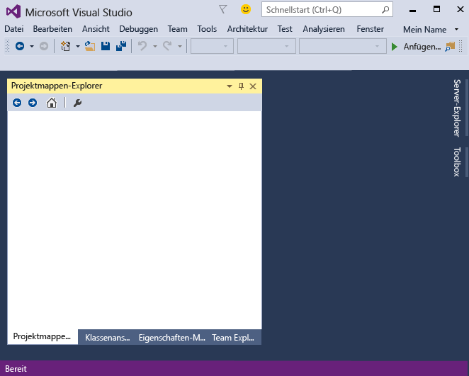
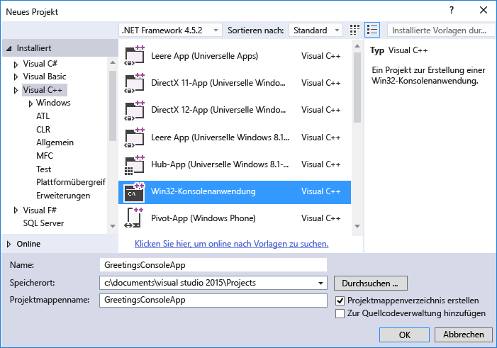
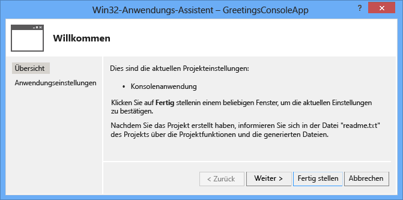
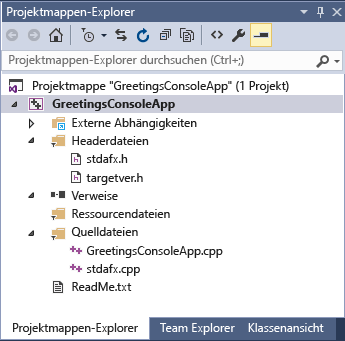
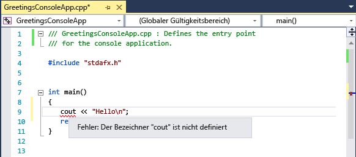
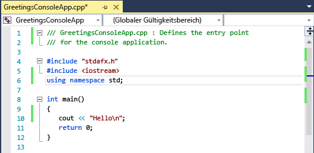
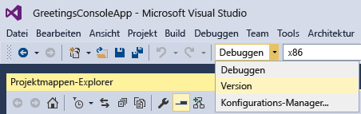

# <a name="getting-started-with-c-in-visual-studio"></a>Erste Schritte mit C++ in Visual Studio
Wenn Sie diese exemplarische Vorgehensweise durcharbeiten, werden Sie mit vielen Tools und Dialogfeldern vertraut, die Sie für die Entwicklung von Anwendungen in Visual Studio verwenden können. Sie erstellen eine einfache „Hello, World“-Anwendung und lernen dabei das Arbeiten in der integrierten Entwicklungsumgebung (IDE) kennen.  
  
 Dieses Thema enthält folgende Abschnitte:  
  
 [Anmelden bei Visual Studio](../ide/getting-started-with-cpp-in-visual-studio.md#BKMK_Configure)  
  
 [Erstellen einer einfachen Anwendung](../ide/getting-started-with-cpp-in-visual-studio.md#BKMK_CreateApp)  
  
 [Hinzufügen von Code zur Anwendung](../ide/getting-started-with-cpp-in-visual-studio.md#BKMK_AddCode)  
  
 [Debuggen und Testen der Anwendung](../ide/getting-started-with-cpp-in-visual-studio.md#BKMK_DebugTest)  
  
 [Erstellen einer Releaseversion der App](../ide/getting-started-with-cpp-in-visual-studio.md#BKMK_BuildRelease)  
  
##  <a name="BKMK_Configure"></a> Anmelden bei Visual Studio  
 Wenn Sie Visual Studio zum ersten Mal starten, erhalten Sie die Möglichkeit, sich mit einem Microsoft-Konto, z. B. Live oder Outlook, anzumelden. Durch die Anmeldung können Sie Ihre Einstellungen mit allen Geräten synchronisieren. Weitere Informationen finden Sie unter [Signing in to Visual Studio](../ide/signing-in-to-visual-studio.md)  
  
 Abbildung 1: Visual Studio-IDE  
  
   
  
 Wenn Sie Visual Studio geöffnet haben, können Sie die drei grundlegenden Teile der IDE sehen: Toolsfenster, Menüs und Symbolleisten und den Hauptfensterbereich. Mit **Schnellstart**werden Toolfenster auf der linken und rechten Seite des Anwendungsfensters und die Menüleiste und die Standardsymbolleiste oben angedockt. In der Mitte des Anwendungsfensters befindet sich die **Startseite**. Wenn Sie eine Projektmappe oder ein Projekt öffnen, werden Editoren und Designer in diesem Bereich angezeigt. Wenn Sie eine Anwendung entwickeln, verbringen Sie die meiste Zeit in diesem zentralen Bereich.  
  
##  <a name="BKMK_CreateApp"></a> Erstellen einer einfachen Anwendung  
 Wenn Sie eine App in Visual Studio erstellen, erstellen Sie zunächst ein Projekt und eine Projektmappe. Für dieses Beispiel erstellen Sie eine Windows-Konsolenanwendung.  
  
#### <a name="to-create-a-console-app"></a>Erstellen einer Konsolen-App  
  
1.  Wählen Sie in der Menüleiste **Datei**, **Neu**, **Projekt**aus.  
  
       
  
2.  Wählen Sie in der **Visual C++** Kategorie die Vorlage **Win32-Konsolenanwendung** aus, und nennen Sie das Projekt `GreetingsConsoleApp`.  
  
       
     Möglicherweise werden in Ihrem Dialogfeld abweichende Optionen angezeigt, abhängig davon, was auf Ihrem System installiert ist. Wenn Sie keine Projektvorlagen für Visual C++ finden, müssen Sie zum Installationsprogramm zurückkehren und eine C++-Arbeitsauslastung installieren.
  
3.  Wenn der Win32-Anwendungs-Assistent angezeigt wird, wählen Sie die Schaltfläche **Fertig stellen** aus.  
  
       
  
 Das Projekt und die Projektmappe "GreetingsConsoleApp", mit den grundlegenden Dateien für eine Win32-Konsolen-App, werden erstellt und in **Projektmappen-Explorer**automatisch geladen. Die Datei "GreetingsConsoleApp.cpp" wird im Code-Editor geöffnet. Die folgenden Elemente werden in **Projektmappen-Explorer**angezeigt:  
  
 Abbildung 4: Projektelemente  
  
   
  
##  <a name="BKMK_AddCode"></a> Hinzufügen von Code zur Anwendung  
 Als Nächstes fügen Sie Code hinzu, um das Wort "Hello" im Konsolenfenster anzuzeigen.  
  
#### <a name="to-display-hello-in-the-console-window"></a>So zeigen Sie „Hello“ im Konsolenfenster an  
  
1.  Geben Sie in der Datei "GreetingsConsoleApp.cpp" vor der Zeile `return 0;` eine Leerzeile und dann den folgenden Code ein:  
  
    ```  
    cout << "Hello\n";  
    ```  
  
     Eine rote Wellenlinie wird unter `cout`angezeigt. Wenn Sie darauf zeigen, wird eine Fehlermeldung angezeigt.  
  
       
  
     Die Fehlermeldung wird auch im Fenster **Fehlerliste** angezeigt. Sie können das Fenster anzeigen, indem Sie in der Menüleiste **Ansicht**, **Fehlerliste** auswählen.  
  
     [cout](/cpp/standard-library/iostream) ist in der \<iostream>-Headerdatei enthalten.  
  
2.  Um den iostream-Header einzuschließen, geben Sie den folgenden Code nach `#include "stdafx.h"`ein:  
  
    ```  
    #include <iostream>  
    using namespace std;  
    ```  
  
     Wahrscheinlich haben Sie bemerkt, dass während der Codeeingabe ein Feld mit Empfehlungen für die Zeichen angezeigt wird, die Sie eingegeben haben. Dieses Feld ist Teil von C++-IntelliSense, das Code-Eingabeaufforderungen bietet, darunter Auflistungen der Klassen- oder Schnittstellen-Member sowie der Parameterinformationen. Außerdem können Sie Codeausschnitte verwenden, wobei es sich um vordefinierte Codeblöcke handelt. Weitere Informationen finden Sie unter [Using IntelliSense](../ide/using-intellisense.md) und [Code Snippets](../ide/code-snippets.md).  
  
     Die rote Wellenlinie unter `cout` wird ausgeblendet, wenn Sie den Fehler korrigieren.  
  
3.  Speichern Sie die Änderungen in der Datei.  
  
       
  
##  <a name="BKMK_DebugTest"></a>Debuggen und Testen der Anwendung  
 Sie können "GreetingsConsoleApp" debuggen, um festzustellen, ob das Wort "Hello" im Konsolenfenster angezeigt wird.  
  
#### <a name="to-debug-the-application"></a>So debuggen Sie die Anwendung  
  
-   Starten Sie den Debugger.  
  
       
  
     Die Debugger wird gestartet und führt den Code aus. Das Konsolenfenster (ein separates Fenster, das wie eine Eingabeaufforderung aussieht) wird ein paar Sekunden lang angezeigt, wird jedoch schnell geschlossen, wenn der Debugger anhält. Um den Text anzuzeigen, müssen Sie einen Haltepunkt festlegen, um die Ausführung des Programms zu beenden.  
  
#### <a name="to-add-a-breakpoint"></a>Hinzufügen eines Haltepunktes  
  
1.  Fügen Sie über die Menüleiste in der Zeile `return 0;`einen Haltepunkt hinzu. Sie können auch einfach in den linken Rand klicken, um einen Haltepunkt zu setzen.  
  
       
  
     Am äußeren linken Rand des Editorfensters wird ein roter Kreis neben der Codezeile angezeigt.  
  
2.  Drücken Sie die F5-TASTE, um das Debuggen zu starten.  
  
     Der Debugger wird gestartet, und ein Konsolenfenster mit dem Wort **Hello**wird angezeigt.  
  
       
  
3.  Drücken Sie UMSCHALT + F5, um den Debugvorgang zu beenden.  
  
 Weitere Informationen finden Sie unter [Konsolenprojekte](../debugger/debugging-preparation-console-projects.md).  
  
##  <a name="BKMK_BuildRelease"></a> Erstellen einer Releaseversion der App  
 Nachdem Sie überprüft haben, dass alles funktioniert, können Sie einen Releasebuild der Anwendung vorbereiten.  
  
#### <a name="to-clean-the-solution-files-and-build-a-release-version"></a>Bereinigen der Projektmappendateien und Erstellen einer Releaseversion  
  
1.  Löschen Sie in der Menüleiste Zwischendateien und Ausgabedateien, die bei vorherigen Builds erstellt wurden.  
  
       
  
2.  Ändern Sie die Buildkonfiguration für GreetingsConsoleApp von **Debuggen** zu **Version**.  
  
       
  
3.  Erstellen Sie die Projektmappe.  
  
       
  
 Herzlichen Glückwunsch, Sie haben diese exemplarischen Vorgehensweise abgeschlossen! Weitere Beispiele zum Durcharbeiten finden Sie unter [Visual Studio-Beispiele](../ide/visual-studio-samples.md).  
  
## <a name="see-also"></a>Siehe auch  
 [Verwenden der Visual Studio-IDE für C++-Desktopentwicklung](/cpp/ide/using-the-visual-studio-ide-for-cpp-desktop-development)   
 [Exemplarische Vorgehensweise: Erstellen einer einfachen Anwendung mit Visual C# oder Visual Basic](../ide/walkthrough-create-a-simple-application-with-visual-csharp-or-visual-basic.md)   
 [Produktivitätstipps für Visual Studio](../ide/productivity-tips-for-visual-studio.md)   
 [Visual Studio-Beispiele](../ide/visual-studio-samples.md)   
 [Erste Schritte mit der Entwicklung in Visual Studio](../ide/get-started-developing-with-visual-studio.md)