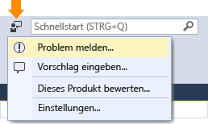

# Melden eines Problems mit Visual Studio 2017
Wenn ein Problem mit Visual Studio auftritt, möchten wir davon erfahren, damit wir das Problem diagnostizieren und beheben können.  Mithilfe des Tools **Problem melden** können Sie detaillierte Informationen zum Problem erfassen und mit wenigen Mausklicks an Microsoft senden.  

 Microsoft respektiert Ihre Privatsphäre. Weitere Informationen dazu, wie wir Daten behandeln, die Sie uns senden, finden Sie unter [Microsoft Visual Studio-Produktfamilie – Datenschutzbestimmungen](https://www.visualstudio.com/en-us/dn948229).  

## Öffnen Sie das Tool „Problem melden“  
 Klicken Sie auf das Benutzerfeedbacksymbol neben **Schnellstart** in der Titelleiste, oder klicken Sie auf **Hilfe &#124; Feedback senden &#124; Problem melden**.  

   

## Anmelden bei Visual Studio
 Melden Sie sich bei Visual Studio an, sofern Sie dies noch nicht getan haben, bevor Sie von einem Problem berichten. Auf diese Weise können Sie nicht nur von einem Problem berichten, mit dem Sie konfrontiert sind, sondern auch einen Kommentar zu diesem oder einem anderen Probleme abgeben, dessen Veröffentlichung Sie lesen.

  1. Klicken Sie auf der linken Seite des Tools auf **Anmelden**, wie im folgenden Screenshot gezeigt.
  2. Befolgen Sie die Anweisungen auf dem Bildschirm für die Anmeldung.

  

## Ähnliche Probleme suchen und für sie abstimmen  
###    

1.  Suchen Sie nach Ihrem Problem, und finden Sie heraus, ob andere es bereits gemeldet haben.
2.  Wenn es bereits gemeldet wurde, stimmen Sie dafür, um uns zu informieren.  

  

## Neues Problem melden
###  
1.  Klicken Sie unten links im Visual Studio-Tool **Problem melden** auf die Schaltfläche „**+**“.  
2.  Geben Sie einen aussagekräftigen Titel für das Problem an, der uns die Weiterleitung an das richtige Visual Studio-Team erleichtert.  
3.  Geben Sie zusätzliche Details und, wenn möglich, die Schritte zum Reproduzieren des Problems an.  

  

## Stellen Sie einen Screenshot und Anlagen bereit (optional)
###  
 Aktivieren Sie das Senden Ihres aktuellen Bildschirms an Microsoft. Sie können weitere Screenshots oder andere Dateien anfügen, indem Sie auf die Schaltfläche **Weitere Dateien anfügen** klicken.  

## Stellen Sie Ablaufverfolgungsdaten und Heapspeicherabbilder bereit (optional)  
###    

Ablaufverfolgungs- und Heapspeicherabbild-Dateien sind sehr nützlich für die Diagnose von Problemen.   Wir schätzen es sehr, wenn Sie das Tool **Problem melden** verwenden, um die Schritte zum Reproduzieren des Problems zu erfassen und die Daten an Microsoft zu senden.  Und so gehen Sie dabei vor.

1.  Klicken Sie auf die Registerkarte **Aufzeichnen**.
2.  Klicken Sie auf **Aufzeichnung starten**. Erteilen Sie die Berechtigung zum Ausführen des Tools.
3.  Wenn das Tool **Problemaufzeichnung** angezeigt wird, führen Sie die Schritte zum Reproduzieren des Problems aus.
4.  Wenn Sie fertig sind, klicken Sie im unverankerten Fenster auf die Schaltfläche **Aufzeichnung beenden**.
5.  Warten Sie einige Minuten, bis Visual Studio die aufgezeichneten Informationen erfasst und gepackt hat.  Wenn dies geschehen ist, wird ein Dialogfeld angezeigt, das so ähnlich wie das hier abgebildete aussieht.   

  

## Senden Sie den Bericht  
###    
 Klicken Sie auf die Schaltfläche **Senden**, um den Bericht zusammen mit allen Bildern, Ablaufverfolgungs- und Speicherabbilddateien zu senden. (Wenn die Schaltfläche **Senden** grau dargestellt ist, überprüfen Sie, ob Sie einen Titel und eine Beschreibung für den Bericht eingegeben haben.)  

## Siehe auch  
 [Sprechen Sie mit uns](../ide/talk-to-us.md)

