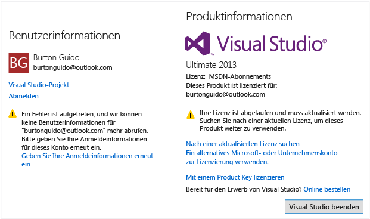

# Entsperren von Visual Studio
Sie können Visual Studio bis zu 30 Tage lang kostenlos testen. Bei der Anmeldung in bei der IDE-Schnittstelle können Sie den Testzeitraum bis auf 90 Tage erweitern. Um Visual Studio weiterhin zu verwenden, können Sie die IDE-Schnittstelle entsperren, indem Sie  
  
1.  ein Onlineabonnement verwenden.  
  
2.  einen Product Key eingeben.  
  
## So entsperren Sie Visual Studio mithilfe eines Onlineabonnements  
 So entsperren Sie Visual Studio mithilfe eines MSDN- oder Visual Studio-Onlineabonnements, das mit einem Microsoft-Konto, einem Geschäfts- oder Schulkonto verknüpft ist:  
  
1.  Klicken Sie auf die Schaltfläche „Anmelden“ in der rechten oberen Ecke der IDE-Schnittstelle (oder wechseln Sie zu „Datei“ > „Kontoeinstellungen“, um das Dialogfeld „Kontoeinstellungen“ zu öffnen, und klicken Sie auf die Schaltfläche „Anmelden“).  
  
2.  Geben Sie die Anmeldeinformationen für ein Microsoft-Konto oder ein Geschäfts- bzw. Schulkonto ein. Visual Studio sucht dann nach einem MSDN- oder Visual Studio Team Services-Abonnement, das mit Ihrem Konto verknüpft ist.  
  
> [!IMPORTANT]
>  Visual Studio sucht automatisch nach mit dem Konto verknüpften Onlineabonnements, wenn Sie eine Verbindung mit einem Visual Studio Team Services-Konto im Team Explorer-Toolfenster herstellen. Wenn Sie eine Verbindung mit einem Visual Studio Team Services-Konto herstellen, können Sie sich mithilfe von Microsoft- oder Geschäfts- bzw. Schulkonten anmelden. Wenn ein Onlineabonnement für dieses Benutzerkonto vorhanden ist, wird die IDE-Schnittstelle automatisch durch Visual Studio für Sie entsperrt.  
  
## So entsperren Sie Visual Studio mit einem Product Key  
  
1.  Wählen Sie **Datei > Kontoeinstellungen** aus, um das Dialogfeld „Kontoeinstellungen“ zu öffnen, und klicken Sie auf den Link „**Mit einem Product Key lizenzieren**“.  
  
2.  Geben Sie den Product Key an der dafür vorgesehenen Stelle ein.  
  
> [!TIP]
>  Vorabversionen von Visual Studio verfügen über keine Product Keys. Sie müssen sich bei der IDE-Schnittstelle anmelden, um Vorabversionen zu verwenden.  
  
## Beheben von Lizenzproblemen  
  
### Aktualisieren veralteter Lizenzen  
 Möglicherweise wurde die folgende Meldung angezeigt, dass Ihre Lizenz in Visual Studio abgelaufen ist.  
  
   
  
 Diese Meldung gibt an, dass Ihr Abonnement zwar ggf. noch immer gültig ist, das von Visual Studio für Ihr Abonnement verwendete Lizenztoken jedoch nicht aktualisiert wurde und aus einem der folgenden Gründe abgelaufen ist:  
  
1.  Sie haben Visual Studio nicht verwendet oder hatten für einen längeren Zeitraum keine Internetzugang.  
  
2.  Sie haben sich bei Visual Studio abgemeldet.  
  
 Bevor die Lizenz abläuft, zeigt Visual Studio eine Warnmeldung an, in der Sie aufgefordert werden, Ihre Anmeldeinformationen erneut einzugeben.  
  
 Wenn Sie Ihre Anmeldeinformationen nicht erneut eingeben, läuft Ihr Token ab. In diesem Fall wird Ihnen über das das Dialogfeld „Kontoeinstellungen“ mitgeteilt, in wie vielen Tagen Ihr Token endgültig abläuft. Nachdem das Token abgelaufen ist, müssen Sie Ihre Anmeldeinformationen für dieses Konto oder diese Lizenz mithilfe einer anderen der oben genannten Methoden erneut eingeben, bevor Sie Visual Studio weiterhin verwenden können.  
  
> [!IMPORTANT]
>  Bei Verwendung von Visual Studio für einen längeren Zeitraum in Umgebungen mit wenig oder keinem Internetzugang sollten Sie einen Product Key verwenden, um Visual Studio zu entsperren, um Unterbrechungen zu vermeiden.  
  
### Aktualisieren abgelaufener Lizenzen  
 Wenn Ihr Abonnement vollständig abgelaufen ist und Sie keine Zugriffsrechte mehr für Visual Studio besitzen, müssen Sie folgende Schritte ausführen:  
  
1.  Sie müssen Ihr Abonnement verlängern. Wechseln Sie für weitere Informationen über die verwendete Lizenz zu Datei > und dem Dialogfeld „Kontoeinstellungen“. Die Lizenzinformationen werden auf der rechten Seite dieses Dialogfensters angezeigt.  
  
2.  Wenn Sie über ein weiteres Abonnement verfügen, das mit einem anderen Konto verknüpft ist, fügen Sie dieses Konto der Liste „Alle Konten“ auf der linken Seite unter „Datei“ im Dialogfenster „Kontoeinstellungen“ hinzu, indem Sie auf den Link „Konto hinzufügen…“ klicken.  
  
## Siehe auch  
 [Anmelden bei Visual Studio](../ide/signing-in-to-visual-studio.md)

