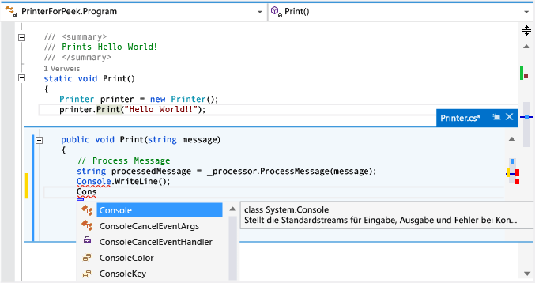

# Vorgehensweise: Anzeigen und Bearbeiten von Code mithilfe von „Definition einsehen“ (Alt+F12)

Mit dem Befehl **Definition einsehen** können Sie Code anzeigen und bearbeiten, ohne den Code zu verlassen, den Sie gerade schreiben. Mit **Definition einsehen** und **Gehe zu Definition** werden dieselben Informationen angezeigt, wobei mit **Definition einsehen** ein Popupfenster geöffnet wird, und mit **Gehe zu Definition** der Code in einem separaten Codefenster angezeigt wird. **Gehe zu Definition** verursacht einen Wechsel des Kontexts (also des aktiven Codefensters, der aktuellen Zeile und der Cursorposition) zum Codedefinitionsfenster. Mithilfe von **Definition einsehen** können Sie die Definition anzeigen und bearbeiten sowie innerhalb der Definitionsdatei navigieren, ohne Ihre Position in der ursprünglichen Codedatei zu verlassen.

Sie können **Definition einsehen** mit C#-, Visual Basic- und C++-Code verwenden. In Visual Basic enthält **Definition einsehen** einen Link zum **Objektkatalog** für Symbole ohne Definitionsmetadaten (z.B. integrierte .NET-Typen).

## Verwenden von „Definition einsehen“

### Öffnen eines Fensters „Definition einsehen“

1. Klicken Sie im Kontextmenü eines Typs oder Members auf **Definition einsehen**, um eine Definition einzusehen. Wenn die Option aktiviert ist,können Sie eine Definition auch mithilfe der Maus einsehen, indem Sie **STRG** (oder eine andere Zusatztaste) gedrückt halten und auf den Namen des Members klicken. Alternativ drücken Sie auf der Tastatur die Tasten **ALT**+**F12**.

     Diese Abbildung zeigt das Fenster **Definition einsehen** für eine Methode mit dem Namen `Print()`:

     

     Das Definitionsfenster wird unter der `printer.Print("Hello World!")`-Zeile in der ursprünglichen Datei angezeigt. Das Fenster blendet keinen Code in der ursprünglichen Datei aus. Die Zeilen, die auf den Aufruf `printer.Print("Hello World!")` folgen, werden unter dem Definitionsfenster angezeigt.

1. Sie können den Cursor im Fenster „Code einsehen“ an unterschiedliche Positionen bewegen. Zudem können Sie weiterhin im ursprünglichen Codefenster navigieren.

1. Sie können eine Zeichenfolge aus dem Definitionsfenster kopieren und in den ursprünglichen Code einfügen. Sie können die Zeichenfolge auch per Drag & Drop aus dem Definitionsfenster in den ursprünglichen Code verschieben. Sie wird allerdings nicht im Definitionsfenster gelöscht.

1. Sie können das Definitionsfenster schließen, indem Sie die **ESC-TASTE** drücken oder auf die Schaltfläche **Schließen** auf der Registerkarte „Definitionsfenster“ klicken.

### Öffnen eines Fensters „Definition einsehen“ in einem Fenster „Definition einsehen“

Wenn bereits ein Fenster **Definition einsehen** geöffnet ist, können Sie **Definition ansehen** für den Code in diesem Fenster erneut aufrufen. Ein weiteres Definitionsfenster wird geöffnet. Ein Satz von Breadcrumbpunkten wird neben der Definitionsfensterregisterkarte, die Sie zum Navigieren zwischen Definitionsfenstern verwenden können, angezeigt. Die QuickInfo für die einzelnen Punkte zeigt jeweils den Namen und den Pfad der von den Punkten dargestellten Definitionsdatei an.

   

### „Definition einsehen“ mit mehreren Ergebnissen

Wenn Sie **Definition einsehen** für Code verwenden, für den mehrere Definitionen vorliegen, (z.B. bei einer partiellen Klasse), wird rechts neben der Codedefinitionsansicht eine Ergebnisliste angezeigt. Sie können jedes Ergebnis in der Liste auswählen, um dessen Definition anzuzeigen.

   

### Bearbeitung im Fenster „Definition einsehen“

Wenn Sie die Bearbeitung innerhalb eines **Definition einsehen**-Fensters beginnen, wird die Datei, die Sie ändern, automatisch als separate Registerkarte im Code-Editor geöffnet. Die Datei spiegelt dann die von Ihnen vorgenommenen Änderungen wider. Sie können weiterhin Änderungen im **Definition einsehen**-Fenster vornehmen, rückgängig machen und speichern, und die Registerkarte spiegelt weiterhin diese Änderungen wider. Auch wenn Sie das Fenster **Definition einsehen** schließen, ohne die Änderungen zu speichern, können Sie weitere Änderungen auf der Registerkarte vornehmen, rückgängig machen und speichern, indem Sie genau da weitermachen, wo Sie im Fenster **Definition einsehen** aufgehört hatten.

   

### So ändern Sie die Optionen für „Definition einsehen“

1. Wechseln Sie zu **Extras** > **Optionen** > **Text-Editor** > **Allgemein**.

1. Klicken Sie auf die Option **Definition in der Vorschauansicht öffnen**.

1. Klicken Sie auf **OK**, um das Dialogfeld **Optionen** zu schließen.

   

### Tastenkombinationen für „Definition einsehen“

Im Fenster **Definition einsehen** können Sie diese Tastenkombinationen verwenden:

|Funktionalität|Tastenkombination|
|-------------------|:-----------------------:|
|Öffnen des Definitionsfensters|**ALT**+**F12**|
|Schließen des Definitionsfensters|**ESC**|
|Höherstufen des Definitionsfensters auf eine reguläre Dokumentregisterkarte|**STRG**+**Alt**+**Pos1**|
|Wechseln zwischen Definitionsfenstern|**STRG**+**ALT**+ **-** und **STRG**+**ALT**+ **=**|
|Zwischen mehreren Ergebnissen navigieren|**F8** und **UMSCHALT**+**F8**|
|Umschalten zwischen den Fenstern "Code-Editor" und "Definition"|**UMSCHALT**+**ESC**|

> [!NOTE]
> Sie können die gleichen Tastenkombinationen zum Bearbeiten in einem **Definition einsehen**-Fenster verwenden, die Sie an anderer Stelle in Visual Studio nutzen.

## Siehe auch

- [Navigieren durch den Code](../ide/navigating-code.md)
- [Go To Definition and Peek Definition („Gehe zu Definition“ und „Definition einsehen“)](../ide/go-to-and-peek-definition.md)
- [Produktivitätsfeatures in Visual Studio](../ide/productivity-features.md)
