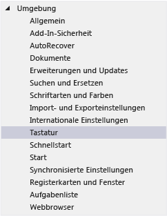
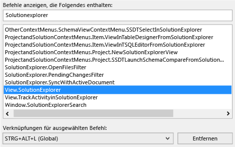
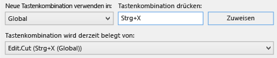
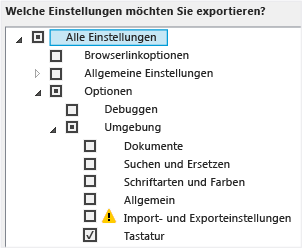
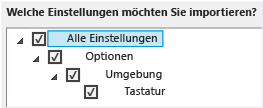

# Identifizieren und Anpassen von Tastenkombinationen in Visual Studio

Sie können Tastenkombinationen für Visual Studio-Befehle nachschlagen, diese Tastenkombinationen anpassen und sie dann exportieren, damit andere Benutzer sie verwenden können. Viele Tastenkombinationen rufen immer dieselben Befehle auf, aber das Verhalten einer Tastenkombination kann auf der Grundlage von Bedingungen unterschiedlich sein, die von folgenden Fragen abhängen:

- Welche Standardumgebungseinstellungen wurde bei der erstmaligen Ausführung von Visual Studio ausgewählt (beispielsweise "Allgemeine Entwicklungseinstellungen" oder Visual C#)?

- Wurde das Verhalten der Tastenkombination angepasst?

- In welchem Kontext wird die Tastenkombination angewendet? Beispielsweise ruft die Taste **F2** den Befehl `Edit.EditCell` auf, wenn Sie den **Einstellungs-Designer** verwenden, aber den Befehl `File.Rename`, wenn Sie mit **Team Explorer** arbeiten.

Unabhängig von Einstellungen, Anpassungen und Kontext können Sie eine Tastenkombination im Dialogfeld **Optionen** immer nachschlagen und ändern. Sie finden unter [Standardtastenkombinationen für häufig verwendete Befehle](../ide/default-keyboard-shortcuts-for-frequently-used-commands-in-visual-studio.md) die Standardtastenkombinationen für viele Befehle, und unter [Standardtastenkombinationen](../ide/default-keyboard-shortcuts-in-visual-studio.md) die vollständige Liste aller Standardtastenkombinationen für **Allgemeine Entwicklungseinstellungen**.

Wenn eine Tastenkombinationen einem Befehl im globalen Kontext und in keinem anderen zugewiesen ist, ruft diese Tastenkombination immer diesen Befehl auf. Aber eine Tastenkombination kann einem Befehl im globalen Kontext und einem anderen Befehl in einem speziellen Kontext zugewiesen werden. Wenn Sie eine solche Tastenkombination in dem speziellen Kontext verwenden, ruft sie den Befehl für diesen Kontext auf und nicht den Befehl für den globalen Kontext.

> [!NOTE]
> Je nach Ihren Einstellungen und der Edition von Visual Studio ändern sich möglicherweise auch die Namen und Positionen von Menübefehlen oder die Optionen in Dialogfeldern. Dieses Thema bezieht sich auf **Allgemeine Entwicklungseinstellungen**.

## Nachschlagen einer Tastenkombination

1. Wählen Sie in der Menüleiste **Extras** > **Optionen** aus.

2. Erweitern Sie **Umgebung**, und klicken Sie dann auf **Tastatur**.

   

3. Geben Sie in das Feld **Befehle mit folgendem Inhalt anzeigen** den gesamten Befehlsnamen ohne Leerzeichen ein.

   Beispielsweise können Sie Befehle für `solutionexplorer` suchen.

4. Wählen Sie in der Liste den richtigen Befehl aus.

    Sie können beispielsweise `View.SolutionExplorer` auswählen.

5. Wenn dem Befehl eine Tastenkombination zugeordnet ist, wird sie in der Liste **Shortcut(s) for selected command** (Tastenkombination für ausgewählten Befehl) aufgeführt.

   

## Anpassen einer Tastenkombination

1. Wählen Sie in der Menüleiste **Extras** > **Optionen** aus.

2. Erweitern Sie den Ordner **Umgebung**, und klicken Sie dann auf **Tastatur**.

3. Optional: Filtern Sie die Liste mit Befehlen, indem Sie in das Feld **Befehle mit folgendem Inhalt anzeigen** den gesamten Befehlsnamen oder Teile des Befehlsnamens ohne Leerzeichen eingeben.

4. Wählen Sie in der Liste den Befehl aus, dem Sie eine Tastenkombination zuweisen möchten.

    Wählen Sie in der Liste **Use new shortcut in** (Neue Tastenkombination verwenden in) den Funktionsbereich aus, in dem die Tastenkombination verwendet werden soll.

    Wählen Sie beispielsweise **Global** aus, wenn die Tastenkombination in allen Zusammenhängen funktionieren soll. Sie können jede Tastenkombination verwenden, die in keinem anderen Editor (als Global) zugeordnet ist. Andernfalls wird die Tastenkombination vom Editor überschrieben.

    > [!NOTE]
    > Folgende Tasten können im Gültigkeitsbereich **Global** nicht in einer Tastenkombination verwendet werden: DRUCK/S-ABF, ROLLEN, PAUSE/UNTBR, TAB, FESTSTELLTASTE, EINFG, POS1, ENDE, BILD-AUF, BILD-AB, die WINDOWS-TASTE, die ANWENDUNGSTASTE, alle PFEILTASTEN sowie die EINGABETASTE, NUM, ENTF bzw. ENTF im Tastenblock oder die Tastenkombination STRG+ALT+ENTF.

6. Geben Sie in das Feld **Press shortcut key(s)** (Tastenkombination drücken) die Tastenkombination ein, die Sie verwenden möchten.

    > [!NOTE]
    > Sie können eine Tastenkombination erstellen, die einen Buchstaben mit **ALT**, **STRG** oder mit beiden Tasten kombiniert. Sie können auch eine Tastenkombination erstellen, die **UMSCHALT** und einen Buchstaben mit **ALT**, **STRG** oder mit beiden Tasten kombiniert.

     Wenn eine Tastenkombination bereits einem anderen Befehl zugeordnet ist, wird sie im Feld **Tastenkombination wird momentan verwendet von** angezeigt. Löschen Sie in diesem Fall die Tastenkombination mit der **RÜCKTASTE**, und versuchen Sie es mit einer anderen Tastenkombination.

    

7. Klicken Sie auf **Zuweisen**.

    > [!NOTE]
    > Wenn Sie eine andere Tastenkombination für einen Befehl angeben, klicken Sie auf die Schaltfläche **Zuweisen** und dann auf **Abbrechen**. Damit wird das Dialogfeld geschlossen, aber die Änderung bleibt bestehen.

## Freigeben benutzerdefinierter Tastenkombinationen

Sie können Ihre selbstdefinierten Tastenkombinationen freigeben, indem Sie sie in eine Datei exportieren und die Datei dann anderen Benutzern zur Verfügung stellen, sodass diese die Daten importieren können.

### So exportieren Sie nur Tastenkombinationen

1. Klicken Sie in der Menüleiste auf **Extras** > **Einstellungen importieren und exportieren**.

2. Klicken Sie auf **Ausgewählte Umgebungseinstellungen exportieren** und dann auf **Weiter**.

3. Deaktivieren Sie unter **Welche Einstellungen sollen exportiert werden?** das Kontrollkästchen **Alle Einstellungen**, und erweitern Sie **Optionen** sowie **Umgebung**.

4. Aktivieren Sie das Kontrollkästchen **Tastatur**, und klicken Sie dann auf **Weiter**.

    

5. Übernehmen Sie in den Feldern **Geben Sie den Namen der Einstellungsdatei ein.** und **Einstellungsdatei in folgendem Verzeichnis speichern** entweder die Standardwerte, oder geben Sie andere Werte ein, und klicken Sie dann auf **Fertigstellen**.

    Standardmäßig werden die Tastenkombinationen in einer Datei im Ordner *%USERPROFILE%\Dokumente\Visual Studio 2017\Settings* gespeichert. Der Name der Datei entspricht dem Datum, an dem Sie die Einstellungen exportiert haben, und die Erweiterung ist *.vssettings*.

### So importieren Sie nur Tastenkombinationen

1. Klicken Sie in der Menüleiste auf **Extras** > **Einstellungen importieren und exportieren**.

2. Klicken Sie auf das Optionsfeld **Ausgewählte Umgebungseinstellungen importieren** und dann auf **Weiter**.

3. Klicken Sie auf das Optionsfeld **Nein, neue Einstellungen importieren und aktuelle Einstellungen überschreiben** und dann auf **Weiter**.

4. Wählen Sie unter **Meine Einstellungen** die Datei mit den Tastenkombinationen aus, die Sie importieren möchten, oder klicken Sie auf **Durchsuchen**, um die gewünschte Datei zu suchen.

5. Klicken Sie auf **Weiter**.

6.  Deaktivieren Sie unter **Welche Einstellungen sollen importiert werden?** das Kontrollkästchen **Alle Einstellungen**, und erweitern Sie dann **Optionen** sowie **Umgebung**.

7. Aktivieren Sie das Kontrollkästchen **Tastatur**, und klicken Sie dann auf **Fertigstellen**.

    

## Siehe auch

- [Barrierefreiheitsfeatures in Visual Studio](../ide/reference/accessibility-features-of-visual-studio.md)