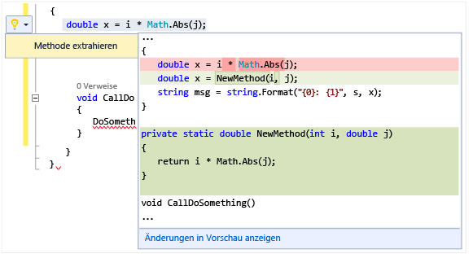

# Ausf&#252;hren von schnellen Aktionen mit Gl&#252;hbirnen
[!INCLUDE[vs2017banner](../code-quality/includes/vs2017banner.md)]

Glühbirnen sind ein neues Produktivitätsfeature in Visual Studio 2015 RC.  Es sind Symbole, die im Visual Studio\-Editor angezeigt werden und auf die Sie klicken können, um schnelle Aktionen auszuführen, einschließlich der Umgestaltung und Fehlerbehebung.  Glühbirnen bieten eine Fehlerbehebungs\- und Umgestaltungsunterstützung an einem einzelnen Blickpunkt, und zwar oftmals rechts von der Zeile, in der Sie Ihre Eingaben vornehmen.  
  
   
  
 In C\# und Visual Basic sehen Sie eine Glühbirne, wenn eine rote Wellenlinie vorhanden ist und Visual Studio über eine Empfehlung verfügt, um das Problem zu beheben.  Wenn beispielsweise ein Fehler durch eine rote Wellenlinie gekennzeichnet ist, wird eine Glühbirne angezeigt, wenn Behebungsmaßnahmen für diesen Fehler verfügbar sind.  Wenn Sie in C\+\+ einer Headerdatei eine neue Funktion hinzufügen, wird eine Glühbirne angezeigt, die das Erstellen einer Stubimplementierung dieser Funktion ermöglicht.  Für jede Sprache können Drittanbieter benutzerdefinierte Diagnosen und Empfehlungen bereitstellen, beispielsweise als Bestandteil eines SDKs. Anhand dieser Regeln leuchten Visual Studio\-Glühbirnen dann auf.  
  
## So zeigen Sie eine Glühbirne an  
  
1.  In vielen Fällen werden Glühbirnen spontan angezeigt, wenn Sie mit dem Mauszeiger auf die Position eines Fehlers zeigen, oder am linken Rand des Editors, wenn Sie die Einfügemarke in eine Zeile verschieben, die einen Fehler enthält.  Wenn eine rote Wellenlinie angezeigt wird, können Sie den Mauszeiger darüber bewegen, um die Glühbirne anzuzeigen.  Sie können auch veranlassen, dass eine Glühbirne angezeigt wird, wenn Sie die Maus oder Tastatur verwenden, um zu einem beliebigen Punkt in der Zeile zu wechseln, wo das Problem auftritt.  
  
2.  Drücken Sie die **STRG\-Taste \+ .** an einer beliebigen Stelle in einer Zeile, um die Glühbirne aufzurufen und direkt zur Liste mit den potenziellen Fehlerbehebungen zu wechseln.  
  
   
  
## So zeigen Sie potenzielle Fehlerbehebungen an  
 Klicken Sie entweder auf den Pfeil nach unten oder auf den Link zum Anzeigen von potenziellen Fehlerbehebungen, um eine Liste von schnellen Aktionen anzuzeigen, die die Glühbirne für Sie vornehmen kann.  
  
   
  
## So nehmen Sie eine Umgestaltung vor  
 Sie können weiterhin Umgestaltungen vornehmen, indem Sie mit der rechten Maustaste klicken, um das Kontextmenü anzuzeigen. Sie können dazu jedoch auch die STRG\-Taste \+ . drücken,  um Umgestaltungsoptionen anzuzeigen.  In der folgenden Abbildung wird die Umgestaltung "Methode extrahieren" nach dem Drücken auf die STRG\-Taste \+ . angezeigt,  und zwar auf einem beliebigen Punkt auf der Zeile, die den `Math.Abs`\-Aufruf enthält:  
  
 