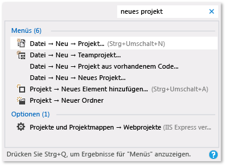

# Produktivitätstipps für Visual Studio

Wenn Sie diese Tipps befolgen, können Sie den Code in Visual Studio schneller und effizienter schreiben und debuggen sowie in diesem navigieren.

Weitere Informationen zu häufig verwendeten Tastenkombinationen finden Sie unter [Tipps und Tricks](../ide/tips-and-tricks-for-visual-studio.md). Eine detailliertere Liste finden Sie unter [Finden und Anpassen von Tastenkombinationen](../ide/identifying-and-customizing-keyboard-shortcuts-in-visual-studio.md) und [Standardtastenkombinationen](../ide/default-keyboard-shortcuts-in-visual-studio.md).

## Zugriff auf die Visual Studio-Tools

Sie können schnell auf die Developer-Eingabeaufforderung oder auf ein anderes Visual Studio-Tool zugreifen, wenn Sie diese bzw. dieses im Startmenü oder in der Taskleiste fixieren.

1. Navigieren Sie im Windows-Explorer zu `%ProgramData%\Microsoft\Windows\Start Menu\Programs\Visual Studio 2017\Visual Studio Tools`.

1. Klicken Sie mit der rechten Maustaste darauf, oder öffnen Sie das Kontextmenü, um **Developer-Eingabeaufforderung** auszuwählen. Wählen Sie dann **An "Start" anheften** oder **An Taskleiste anheften** aus.

## Schreiben von Code

Schreiben Sie Code schneller, indem Sie die folgenden Funktionen verwenden.

- **Verwenden von Beispielanwendungen**. Sie können Anwendungsentwicklung beschleunigen, indem Sie Beispielanwendungen von [Microsoft Developer Network](https://code.msdn.microsoft.com/) herunterladen und installieren. Sie können eine bestimmte Technologie oder ein Programmierkonzept auch kennenlernen, indem Sie ein Beispielpaket für diesen Bereich herunterladen und untersuchen.

- **Verwenden von IntelliSense**. Wie Sie Code im Editor eingeben, werden IntelliSense-Informationen, wie Listenmember, Parameterinformationen, QuickInfos, Signaturhilfe und Wortvervollständigung angezeigt. Diese Funktionen unterstützen Fuzzyübereinstimmung des Texts. So umfasst die Ergebnisliste für die Listenmember nicht nur Einträge, die mit dem Zeichen beginnen, das Sie eingegeben haben, sondern auch Einträge, die die Zeichenkombination an einer beliebigen Stelle im Namen enthalten. Weitere Informationen finden Sie unter [Verwenden von IntelliSense](../ide/using-intellisense.md).

- **Ändern der Optionen für Autoeinfügung von IntelliSense bei der Codeeingabe**. Wenn Sie den Vorschlagsmodus in IntelliSense umschalten, können Sie festlegen, dass IntelliSense-Optionen nur eingefügt werden, wenn Sie sie explizit auswählen.

     Um den Vorschlagsmodus zu aktivieren, drücken Sie die Tasten **STRG** + **ALT** + **LEERTASTE**, oder klicken Sie in der Menüleiste auf **Bearbeiten** > **IntelliSense** > **Beendigungsmodus umschalten**.

- **Verwenden von Codeausschnitten**. Sie können mithilfe der integrierten Ausschnitte eigene Ausschnitte erstellen.

     Zum Einfügen eines Ausschnittes wählen Sie in der Menüleiste **Bearbeiten**, **IntelliSense**, **Ausschnitt einfügen** aus, oder öffnen Sie das Kontextmenü in einer Datei, und wählen Sie **Ausschnitt einfügen** aus. Weitere Informationen finden Sie unter [Codeausschnitte](../ide/code-snippets.md).

- **Inline-Behebung von Codefehlern**. Mit schnellen Aktionen können Sie ganz leicht Code mit einer einzelnen Aktion umgestalten, generieren oder anderweitig ändern. Diese können mithilfe des Glühbirnensymbols  oder durch Drücken von **ALT+EINGABETASTE** oder **STRG+.** angewendet werden, wenn sich Ihr Cursor in der entsprechenden Codezeile befindet. Weitere Informationen finden Sie unter [Schnelle Aktionen](quick-actions.md).

- **Anzeigen und Bearbeiten der Definition eines Codeelements**. Sie können das Modul schnell anzeigen und bearbeiten, in dem ein Codeelement, wie ein Member, eine Variable oder eine lokale Variable, definiert ist.

    Um eine Definition in einem Popupfenster zu öffnen, markieren Sie das Element, und drücken Sie dann die Tasten **ALT+F12**, oder öffnen Sie das Kontextmenü für das Element, und klicken Sie dann auf **Definition einsehen**. Um eine Definition in einem separaten Codefenster zu öffnen, öffnen Sie das Kontextmenü für das Codeelement, und wählen Sie dann **Gehe zu Definition** aus.

## Navigieren innerhalb des Codes

 Sie können verschiedene Methoden verwenden, um bestimmte Positionen im Code schneller zu finden und dorthin zu wechseln.

- **Speichern von Codezeilen als Lesezeichen**. Sie können Lesezeichen verwenden, um schnell zu bestimmten Codezeilen in einer Datei zu navigieren.

    Wählen Sie zum Setzen eines Lesezeichens in der Menüleiste **Bearbeiten**, **Lesezeichen**, **Lesezeichen umschalten** aus. Sie können alle Lesezeichen für eine Projektmappe im Fenster **Lesezeichen** anzeigen. Weitere Informationen finden Sie unter [Festlegen von Lesezeichen im Code](../ide/setting-bookmarks-in-code.md).

- **Suchen nach Symboldefinitionen in einer Datei**. Sie können in einer Projektmappe nach Symboldefinitionen und Dateinamen suchen. Die Suchergebnisse enthalten jedoch keine Namespaces oder lokalen Variablen.

   Um auf diese Funktion zuzugreifen, wählen Sie in der Menüleiste **Bearbeiten**, **Navigieren zu** aus.

- **Durchsuchen der Gesamtstruktur des Codes**. Im **Projektmappen-Explorer** können Sie Klassen und ihre Typen und Member in den Projekten suchen. Sie können auch nach Symbolen suchen, die Aufrufhierarchie einer Methode anzeigen, Symbolverweise suchen und andere Aufgaben ausführen. Wenn Sie ein Codeelement im **Projektmappen-Explorer** auswählen, wird die dazugehörige Datei auf einer Registerkarte **Vorschau** angezeigt, und der Cursor wird auf das Element in der Datei verschoben. Weitere Informationen finden Sie unter [Anzeigen der Codestruktur](../ide/viewing-the-structure-of-code.md).

## Schnelleres Suchen von Elementen

Sie können in der IDE nach Befehlen, Dateien und Optionen suchen und gleichzeitig die Inhalte der Toolfenster filtern, um relevante Informationen nur für die aktuelle Aufgabe anzuzeigen.

- **Filtern der Inhalte von Toolfenstern**. Sie können in den Inhalten vieler Toolfenster, z. B. der Fenster **Toolbox**, **Eigenschaften** und im **Projektmappen-Explorer** suchen. Es werden aber nur Elemente angezeigt, deren Namen die Zeichen enthalten, die Sie angeben.

- **Zeigen Sie nur die Fehler an, die berücksichtigt werden sollen**. Wenn Sie die Schaltfläche **Filter** auf der Symbolleiste **Fehlerliste** auswählen, können Sie die Anzahl der Fehler reduzieren, die im Fenster **Fehlerliste** angezeigt werden. Sie können nur die Fehler in den Dateien anzeigen, die im Editor geöffnet sind, nur die Fehler in der aktuellen Datei oder nur die Fehler im aktuellen Projekt. Sie können im Fenster Fehlerliste auch nach bestimmten Fehlern suchen.

- **Suchen von Dialogfeldern, Menübefehlen und Optionen**. Geben Sie im Feld [Schnellstart](../ide/reference/quick-launch-environment-options-dialog-box.md) Schlüsselwörter oder Ausdrücke für die Elemente ein, die Sie suchen. Beispielsweise werden die folgenden Optionen angezeigt, wenn Sie `new project` eingeben:

    

    **Schnellstart** zeigt unter anderem Links zum Dialogfeld **Neues Projekt**, zum Dialogfeld **Neues Element hinzufügen** und zur Projekt- und Projektmappenseite im Dialogfeld **Optionen** an. Ergebnisse des Schnellstarts können auch Projektdateien und Toolfenster enthalten.

## Debuggen von Code

Debuggen kann viel Zeit in Anspruch nehmen, aber die folgenden Tipps können Ihnen helfen, den Prozess zu beschleunigen.

- **Testen Sie die gleiche Seite, Anwendung oder Website in unterschiedlichen Browsern**. Wenn Sie den Code debuggen, können Sie zwischen den installierten Webbrowsern, einschließlich [Seitenprüfung (Visual Studio)](http://msdn.microsoft.com/Library/65880969-1ad2-47be-85b9-bb12c81bf209), problemlos wechseln, ohne dass Sie das Dialogfeld **Browserauswahl** öffnen müssen. Sie können die Liste **Debugziel** verwenden, die auf der Symbolleiste **Standard** neben der Schaltfläche **Debuggen starten** zu finden ist, um beim Debuggen oder Anzeigen von Seiten schnell zu überprüfen, welchen Browser Sie verwenden.

    

- **Legen Sie temporäre Haltepunkte fest**. Sie können einen temporären Haltepunkt in der aktuellen Zeile des Codes erstellen und gleichzeitig den Debugger starten. Wenn Sie diese Codezeile erreicht haben, gibt der Debugger Unterbrechungsmodus ein. Weitere Informationen finden Sie unter [Navigieren im Code mit dem Debugger](../debugger/navigating-through-code-with-the-debugger.md).

    Drücken Sie die Tasten **STRG** + **F10**, um dieses Feature zu verwenden, oder öffnen Sie das Kontextmenü für die Codezeile, bei der Sie unterbrechen möchten, und klicken Sie dann auf **Ausführen bis Cursor**.

- **Verschieben Sie den Ausführungspunkt während des Debuggens**. Sie können den aktuellen Ausführungspunkt zu einem anderen Codeabschnitt verschieben und Debuggen von diesem Punkt neu starten. Diese Methode ist hilfreich, wenn Sie einen Codeabschnitt debuggen möchten, ohne alle Schritte neu erstellen zu müssen, die erforderlich sind, um diesen Abschnitt zu erreichen. Weitere Informationen finden Sie unter [Navigieren im Code mit dem Debugger](../debugger/navigating-through-code-with-the-debugger.md).

     Ziehen Sie die gelbe Pfeilspitze zu einer Position, an der Sie die folgende Anweisung in derselben Quelldatei festlegen möchten, um den Ausführungspunkt zu verschieben, und drücken Sie dann **F5**, um das Debuggen fortzusetzen.

- **Erfassen Sie Wertinformationen für Variablen**. Sie können einer Variablen im Code einen DataTip hinzufügen und diesen fixieren, damit Sie auf den letzten bekannten Wert für die Variable zugreifen können, nachdem der Debugvorgang abgeschlossen hat. Weitere Informationen finden Sie unter [Anzeigen von Datenwerten als Datentipps](../debugger/view-data-values-in-data-tips-in-the-code-editor.md).

     Zum Hinzufügen eines DataTips muss sich der Debugger im Unterbrechungsmodus befinden. Platzieren Sie den Cursor in der Variablen, und wählen Sie dann die Anheftschaltfläche auf dem angezeigten DataTip aus. Wenn das Debuggen beendet wird, wird in der Quelldatei ein blaues Anheftsymbol neben der Codezeile angezeigt, die die Variable enthält. Wenn Sie auf den blauen Pin zeigen, wird der Wert der Variablen aus der letzten Debugsitzung angezeigt.

- **Löschen Sie das Direktfenster**. Sie können den Inhalt des [Direktfensters](../ide/reference/immediate-window.md) zur Entwurfszeit löschen, indem Sie `>cls` oder `>Edit.ClearAll` eingeben.

     Weitere Informationen zu weiteren Befehlen finden Sie unter [Visual Studio-Befehlsaliase](../ide/reference/visual-studio-command-aliases.md).

## Verwalten von Dateien, Symbolleisten und Fenstern

 Bei der Entwicklung einer Anwendung möchten Sie jederzeit in mehreren Codedateien arbeiten und sich in mehreren Toolfenstern bewegen können. Mit folgenden Tipps behalten Sie die Übersicht.

- **Halten Sie Dateien, die Sie häufig verwenden, im Editor sichtbar**. Sie können die Dateien, die Sie häufig verwenden, an der linken Seite der Registerkartenreihe anheften, damit Sie unabhängig davon, wie viele Dateien im Editor geöffnet sind, sichtbar bleiben.

     Um eine Datei anzuheften, wählen Sie die Registerkarte der Datei, und wählen Sie dann die Schaltfläche **Anheftstatus umschalten** aus.

- **Verschieben Sie Dokumente und Fenster auf andere Bildschirme**. Wenn Sie bei der Entwicklung einer Anwendung mehr als einen Bildschirm verwenden, können Sie leichter an Teilen der Anwendung arbeiten, wenn Sie Dateien, die im Editor geöffnet sind, auf einen anderen Bildschirm verschieben. Sie können Toolfenster, wie z.B. Debuggerfenster, auf einen anderen Bildschirm verschieben und Dokument- und -Toolfenster miteinander verbinden, um „Flösse“ zu erstellen. Weitere Informationen finden Sie unter [Anpassen der Fensterlayouts in Visual Studio](../ide/customizing-window-layouts-in-visual-studio.md).

     Sie können Dateien auch einfacher verwalten, indem Sie eine weitere Instanz des **Projektmappen-Explorers** erstellen und sie auf einen anderen Bildschirm verschieben. Um eine andere Instanz des **Projektmappen-Explorers** zu erstellen, öffnen Sie ein Kontextmenü im **Projektmappen-Explorer**, und wählen Sie dann **Neue Projektmappen-Explorer-Ansicht** aus.

- **Passen Sie die Schriftarten an, die in Visual Studio angezeigt werden**. Sie können die Schriftart, Größe und Farbe ändern, die für Text in der IDE verwendet wird. Beispielsweise können Sie die Farbe von bestimmten Codeelementen im Editor und die Schriftart in Toolfenstern oder in der IDE anpassen. Weitere Informationen finden Sie unter [Gewusst wie: Ändern von Schriftarten und Farben](../ide/how-to-change-fonts-and-colors-in-visual-studio.md) und [Gewusst wie: Ändern der im Editor verwendeten Schriftarten und Farben](../ide/reference/how-to-change-fonts-and-colors-in-the-editor.md).

## Siehe auch

[Standardtastenkombinationen für häufig verwendete Befehle](../ide/default-keyboard-shortcuts-for-frequently-used-commands-in-visual-studio.md)  
[Vorgehensweise: Anpassen von Menüs und Symbolleisten](../ide/how-to-customize-menus-and-toolbars-in-visual-studio.md)  
[Exemplarische Vorgehensweise: Erstellen einer einfachen Anwendung](../ide/walkthrough-create-a-simple-application-with-visual-csharp-or-visual-basic.md)  
[Tipps und Tricks zu Barrierefreiheit](../ide/reference/accessibility-tips-and-tricks.md)