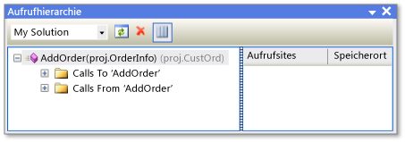

# Aufrufhierarchie
[!INCLUDE[vs2017banner](../../code-quality/includes/vs2017banner.md)]

Die Aufrufhierarchie ermöglicht es Ihnen, den Code zu navigieren, indem Sie alle Aufrufe von und zu ausgewählten Methoden, Eigenschaften oder Konstruktoren anzeigt.  Dies erleichtert das Verständnis des Codeflusses und die Einschätzung der Auswirkungen von Änderungen am Code.  Sie können mehrere Ebenen von Codes untersuchen, um komplexe Ketten von Methodenaufrufen und zusätzlichen Einstiegspunkten für den Code anzuzeigen. Auf diese Weise können Sie alle möglichen Ausführungspfade untersuchen.  
  
 Die Aufrufhierarchie ist, anders als die vom Debugger angezeigte Aufrufliste, zur Entwurfszeit verfügbar.  
  
## Verwenden der Aufrufhierarchie  
 Um das Fenster **Aufrufhierarchie** anzuzeigen, klicken Sie mit der rechten Maustaste auf den Namen eines Methoden\-, Eigenschafts\- oder Konstruktoraufrufs und klicken dann auf **Aufrufhierarchie anzeigen**.  
  
 Der Membername wird in einem Strukturansichtsbereich im Fenster **Aufrufhierarchie** angezeigt.  Wenn Sie den Memberknoten erweitern, werden die untergeordneten Knoten **Aufrufe an** *Membername* und **Aufrufe von** *Membername* angezeigt.  Die folgende Abbildung zeigt diese Knoten im Fenster **Aufrufhierarchie**.  
  
   
Fenster "Aufrufhierarchie"  
  
-   Wenn Sie den Knoten **Aufrufe an** erweitern, werden alle Member angezeigt, die den ausgewählten Member aufrufen.  
  
-   Wenn Sie den Knoten **Aufrufe von** erweitern, werden alle Member angezeigt, die von dem ausgewählten Member aufgerufen werden.  
  
 Sie können dann jeden dieser Member in untergeordneten Knoten für die Knoten **Aufrufe an** und **Aufrufe von** erweitern.  So können Sie im Stapel der Aufrufer navigieren, wie in der folgenden Abbildung gezeigt.  
  
   
Fenster "Aufrufhierarchie"  
  
 Für Member, die als virtuell oder als abstrakt definiert sind, wird der Knoten **Überschreibt \<Methodenname\>** angezeigt.  Für Schnittstellenmember wird ein **Implementiert \<Methodenname\>**\-Knoten angezeigt.  Diese erweiterbaren Knoten werden auf derselben Ebene wie die Knoten **Aufrufe an** und **Aufrufe von** angezeigt.  
  
 Das Feld **Suchbereich** auf der Symbolleiste enthält Optionen für **Meine Projektmappe**, **Aktuelles Projekt** und **Aktuelles Dokument**.  
  
 Wenn Sie im Strukturansichtsbereich **Aufrufhierarchie** einen untergeordneten Member auswählen, geschieht Folgendes:  
  
-   Im Detailbereich **Aufrufhierarchie** werden alle Codezeilen angezeigt, in denen dieser untergeordnete Member vom übergeordneten Member aufgerufen wird.  
  
-   **Codedefinitionsfenster**, wenn geöffnet, wird der Code für den ausgewählten Member an.  Dieses Fenster ist in C\# und C\+\+ verfügbar.  Weitere Informationen über dieses Fenster finden Sie unter [Anzeigen der Codestruktur](../../ide/viewing-the-structure-of-code.md).  
  
> [!NOTE]
>  Die Aufrufhierarchie findet keine Methodengruppenverweise, die Stellen enthalten, an denen eine Methode als Ereignishandler hinzugefügt oder einem Delegaten zugewiesen wird.  Um alle Verweise auf eine Methode zu finden, können Sie den Befehl **Alle Verweise suchen** verwenden.  
  
## Kontextmenüelemente  
 In der folgenden Tabelle sind verschiedene Kontextmenüoptionen beschrieben, die verfügbar sind, wenn Sie im Strukturansichtsbereich mit der rechten Maustaste auf einen Knoten klicken.  
  
|Kontextmenüelement|Beschreibung|  
|------------------------|------------------|  
|**Als neuen Stamm hinzufügen**|Damit wird der ausgewählte Knoten dem Strukturansichtsbereich als neuer Stammknoten hinzugefügt.  Dies ermöglicht es Ihnen, die Aufmerksamkeit auf eine bestimmte Teilstruktur zu richten.|  
|**Stamm entfernen**|Entfernt den ausgewählten Stammknoten aus dem Strukturansichtsbereich.  Diese Option ist nur bei einem Stammknoten verfügbar.   Den ausgewählten Stammknoten können Sie auch über die Symbolleistenschaltfläche **Stamm entfernen** entfernen.|  
|**Gehe zu Definition**|Damit wird der Befehl Gehe zu Definition im ausgewählten Knoten ausgeführt.  Sie werden dann zur ursprünglichen Definition für einen Memberaufruf oder eine Variablendefinition geführt.   Sie können auf den ausgewählten Knoten doppelklicken oder den Knoten auswählen und F12 drücken, um den Befehl "Gehe zu Definition" auszuführen.|  
|**Alle Verweise suchen**|Damit wird der Befehl Alle Verweise suchen im ausgewählten Knoten ausgeführt.  Es werden alle Codezeilen im Projekt gesucht, die auf eine Klasse oder einen Member verweisen.   Sie können auch UMSCHALT\+F12 drücken, um den Befehl Alle Verweise suchen im ausgewählten Knoten auszuführen.|  
|**Kopieren**|Damit wird der Inhalt des ausgewählten Knotens kopiert \(aber nicht dessen untergeordnete Knoten\).|  
|**Aktualisieren**|Damit wird der ausgewählte Knoten reduziert. Beim erneuten Erweitern werden die aktuellen Informationen angezeigt.|