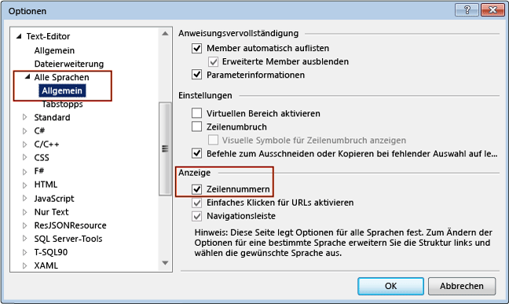

# Gewusst wie: Anzeigen von Zeilennummern im Editor
Sie können die Zeilennummerierung im Code ein- oder ausblenden.

> [!NOTE]
> Abhängig von den aktiven Einstellungen unterscheiden sich die Dialogfelder und Menübefehle auf dem Bildschirm unter Umständen von den hier beschriebenen Dialogfeldern und Menübefehlen. Klicken Sie im Menü **Extras > Einstellungen importieren und exportieren**, um die Einstellungen zu ändern. Weitere Informationen finden Sie unter [Personalisieren von Visual Studio-IDE](../../ide/personalizing-the-visual-studio-ide.md).

## Anzeigen von Zeilennummern im Code
 Die Zeilennummern werden nicht in den Code eingefügt; sie dienen lediglich als Anhaltspunkte. Wenn Zeilennummern ausgedruckt werden sollen, müssen Sie im Dialogfeld **Drucken** das Kontrollkästchen **Zeilennummern einschließen** aktivieren.

#### So lassen Sie Zeilennummern für den Code anzeigen

1.  Wählen Sie in der Menüleiste **Extras**, **Optionen**. Erweitern Sie den Knoten **Text-Editor**, und wählen Sie entweder den Knoten für die Sprache, die Sie verwenden, oder **Alle Sprachen** aus, um die Zeilennummern in allen Sprachen zu aktivieren. Sie können die **Zeilennummer** auch im Feld **Schnellstart** eingeben.

2.  Aktivieren Sie das Kontrollkästchen **Zeilennummer**.

    

> [!NOTE]
> Abhängig von der Sprache oder den Einstellungen müssen Sie möglicherweise im Dialogfeld **Optionen** das Kontrollkästchen **Alle Einstellungen anzeigen** aktivieren, um den Unterknoten **Alle Sprachen** anzuzeigen.

## Siehe auch

- [Anpassen des Editors](../../ide/customizing-the-editor.md)
- [Text-Editor, Dialogfeld „Optionen“](../../ide/reference/text-editor-options-dialog-box.md)
- [Features des Code-Editors](../../ide/writing-code-in-the-code-and-text-editor.md)