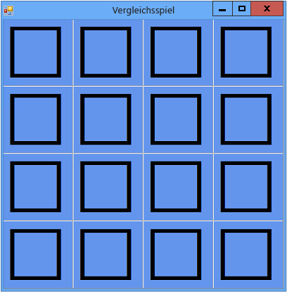

# Schritt 1: Erstellen eines Projekts und Hinzufügen einer Tabelle zum Formular

Der erste Schritt beim Erstellen eines Vergleichsspiels besteht darin, das Projekt zu erstellen und dem Formular eine Tabelle hinzuzufügen. Die Tabelle dient dazu, die Symbole in einem regelmäßigen 4x4-Raster auszurichten. Sie legen außerdem einige Eigenschaften fest, um die Darstellung des Spielfelds zu verbessern.

## So erstellen Sie ein Projekt und fügen dem Formular eine Tabelle hinzu

1. Klicken Sie in der Menüleiste auf **Datei** > **Neu** > **Projekt**.

2. Wenn Sie nicht Visual Studio Express verwenden, müssen Sie zuerst eine Programmiersprache auswählen. Wählen Sie in der Liste **Installierte Vorlagen** entweder **Visual C#** oder **Visual Basic** aus.

3. Wählen Sie in der Liste der Projektvorlagen die Vorlage **Windows Forms-Anwendung** aus, nennen Sie das Projekt **MatchingGame**, und wählen Sie anschließend die Schaltfläche **OK** aus.

4. Legen Sie im Fenster **Eigenschaften** die folgenden Formulareigenschaften fest.

   1.  Ändern Sie die Eigenschaft **Text** des Formulars von **Form1** in **Matching Game** (Gesellschaftsspiel). Dieser Text wird oben im Spielfenster angezeigt.

   2.  Legen Sie die Größe des Formulars auf eine Breite von 550 Pixeln und eine Höhe von 550 Pixeln fest. Hierzu können Sie entweder die Eigenschaft **Size** (Größe) auf **550, 550** festlegen oder die Ecke des Formulars ziehen, bis die richtige Größe in der rechten unteren Ecke der integrierten Entwicklungsumgebung (IDE) angezeigt wird.

5. Zeigen Sie die Toolbox an, indem Sie die Registerkarte **Toolbox** auf der linken Seite der IDE auswählen.

6. Ziehen Sie ein <xref:System.Windows.Forms.TableLayoutPanel>-Steuerelement aus der Kategorie **Container** der Toolbox, und legen Sie dann die folgenden Eigenschaften dafür fest.

   1. Legen Sie die Eigenschaft **BackColor** (Hintergrundfarbe) auf **CornflowerBlue** (CornflowerBlue) fest. Dazu öffnen Sie mit dem Dropdownpfeil neben der Eigenschaft **BackColor** im Fenster **Eigenschaften** das Dialogfeld **BackColor**.  Wählen Sie anschließend die Registerkarte **Web** im Dialogfeld **BackColor**, um eine Liste verfügbarer Farbnamen anzuzeigen.

      > [!NOTE]
      > Die Farben sind nicht alphabetisch geordnet, und **CornflowerBlue** steht fast am Ende der Liste.

   2. Legen Sie die Eigenschaft **Dock** (Andocken) auf **Fill** (Ausfüllen) fest, indem Sie neben der Eigenschaft die Dropdownschaltfläche und dann die große mittlere Schaltfläche wählen. Dadurch wird die Tabelle so vergrößert, dass sie das gesamte Formular ausfüllt.

   3. Legen Sie die Eigenschaft **CellBorderStyle** (Stil des Zellenrahmens) auf **Inset** (Abgesenkt) fest. Dadurch werden die Zellen auf dem Spielfeld mit Rahmen angezeigt.

   4. Wählen Sie in der oberen rechten Ecke von TableLayoutPanel die dreieckige Schaltfläche, um das Aufgabenmenü anzuzeigen.

   5. Wählen Sie im Aufgabenmenü zweimal **Zeile hinzufügen** aus, um zwei weitere Zeilen hinzuzufügen, und wählen Sie dann zweimal **Spalte hinzufügen**, um zwei weitere Spalten hinzuzufügen.

   6. Wählen Sie im Aufgabenmenü **Zeilen und Spalten bearbeiten** aus, um das Fenster **Spalten- und Zeilenstile** anzuzeigen. Wählen Sie jede einzelne Spalten aus, wählen Sie dann die Schaltfläche **Prozent** aus, und legen Sie die Breite jeder Spalte auf 25 Prozent der Gesamtbreite fest. Wählen Sie anschließend am oberen Fensterrand im Dropdownfeld die Option **Zeilen** aus, und legen Sie die Höhe der einzelnen Zeilen auf 25 Prozent fest. Wählen Sie anschließend die Schaltfläche **OK** aus.

      TableLayoutPanel sollte nun ein 4x4-Raster sein, mit sechzehn quadratischen Zellen gleicher Größe. In diesen Zeilen und Spalten werden später die Symbolbilder angezeigt.

7. Stellen Sie sicher, dass TableLayoutPanel im Formular-Editor ausgewählt ist. **tableLayoutPanel1** sollte dann oben im Fenster **Eigenschaften** angezeigt werden. Wenn das TableLayoutPanel-Steuerelement nicht ausgewählt ist, wählen Sie es auf dem Formular oder im Dropdown-Steuerelement oben in **Eigenschaften** aus.

    Während das TableLayoutPanel-Steuerelement ausgewählt ist, öffnen Sie die Toolbox, und fügen Sie ein <xref:System.Windows.Forms.Label>-Steuerelement (aus der Kategorie **Allgemeine Steuerelemente**) in der oberen linken TableLayoutPanel-Zelle hinzu. Das Label-Steuerelement sollte jetzt in der IDE ausgewählt sein. Legen Sie die folgenden Eigenschaften für das Bezeichnungsfeld fest:

   1.  Stellen Sie sicher, dass die Eigenschaft **BackColor** des Bezeichnungsfelds auf **CornflowerBlue** festgelegt ist.

   2.  Legen Sie die **AutoSize**-Eigenschaft auf **False** fest.

   3.  Legen Sie die Eigenschaft **Dock** auf **Fill** fest.

   4.  Legen Sie die Eigenschaft **TextAlign** (Textausrichtung) auf **MiddleCenter** (Zellenmitte) fest, indem Sie neben der Eigenschaft erst die Dropdownschaltfläche und dann die mittlere Schaltfläche wählen. Dadurch wird sichergestellt, dass das Symbol in der Mitte der Zelle angezeigt wird

   5.  Wählen Sie die Eigenschaft **Font** (Schriftart) aus. Eine Schaltfläche mit einem Auslassungszeichen (**…**) wird angezeigt.

   6.  Klicken Sie auf die Schaltfläche mit Auslassungspunkten, und legen Sie **Schrift** auf **Webdings**, **Schriftschnitt** auf **Fett** und **Größe** auf **48** fest.

   7.  Legen Sie die Eigenschaft **Text** der Bezeichnung auf den Buchstaben **c** fest.

        Die linke obere Zelle im TableLayoutPanel sollte jetzt einen großen schwarzen Kasten enthalten, der mittig in einem blauen Hintergrund zentriert ist.

       > [!NOTE]
       > Die Schriftart Webdings ist eine Symbolschriftart, die mit dem Betriebssystem Windows geliefert wird. Im Vergleichsspiel muss der Spieler Symbolpaare finden, und deshalb zeigen Sie die entsprechenden Symbole mithilfe dieser Schriftart an. Probieren Sie anstelle von **c** für die Eigenschaft **Text** andere Buchstaben aus, um herauszufinden, welche Symbole angezeigt werden. Ein Ausrufezeichen ist eine Spinne, ein großes N ist ein Auge, und ein Komma ist eine Chilischote.

8. Wählen Sie das Label-Steuerelement aus und kopieren Sie es in die nächste Zelle im TableLayoutPanel. (Drücken Sie **STRG**+**C**, oder klicken Sie in der Menüleiste auf **Bearbeiten** > **Kopieren**.) Fügen Sie das Steuerelement anschließend ein. (Drücken Sie **STRG**+**V**, oder klicken Sie in der Menüleiste auf **Bearbeiten** > **Einfügen**.) Eine Kopie der ersten Bezeichnung wird in der zweiten Zelle im TableLayoutPanel angezeigt. Fügen Sie das Steuerelement erneut ein. In der dritten Zelle wird eine weitere Bezeichnung angezeigt. Fahren Sie mit dem Einfügen der Label-Steuerelemente fort, bis alle Zellen ausgefüllt sind.

   > [!NOTE]
   > Wenn Sie zu viele Einfügungen vornehmen, fügt die IDE dem TableLayoutPanel eine neue Zeile für das neue Label-Steuerelement hinzu. Sie können dies rückgängig machen. Drücken Sie die Tasten **STRG**+**Z**, oder klicken Sie in der Menüleiste auf **Bearbeiten** > **Rückgängig**.

    Als Nächstes wird das Formular angelegt. Es sollte aussehen wie die folgende Abbildung.

     Anfangszustand des Gedächtnisspiels

## So fahren Sie fort oder überprüfen die Angaben

-   Den nächsten Schritt des Tutorials finden Sie unter [Schritt 2: Hinzufügen eines zufällig ausgewählten Objekts und einer Liste von Symbolen](../ide/step-2-add-a-random-object-and-a-list-of-icons.md).

-   Um zum Übersichtsthema zurückzukehren, beachten Sie [Tutorial 3: Erstellen eines Vergleichsspiels](../ide/tutorial-3-create-a-matching-game.md).
