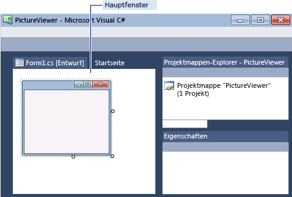

# Schritt&#160;1: Erstellen eines Windows&#160;Forms-Anwendungsprojekts
[!INCLUDE[vs2017banner](../code-quality/includes/vs2017banner.md)]

Beim Erstellen einer Bildanzeige erstellen Sie im ersten Schritt ein Windows Forms\-Anwendungsprojekt.  
  
  Eine Videoversion dieses Themas finden Sie im [Video 1 zum Lernprogramm 1: Erstellen eines Bildanzeigeprogramms in Visual Basic](http://go.microsoft.com/fwlink/?LinkId=205209) oder im [Video 1 zum Lernprogramm 1: Erstellen eines Bildanzeigeprogramms in C\#](http://go.microsoft.com/fwlink/?LinkId=205199).  Diese Videos verwenden eine frühere Version von Visual Studio, sodass Menübefehle und andere Benutzeroberflächenelemente geringfügig abweichen können.  Allerdings funktionieren die Konzepte und Prozeduren in der aktuellen Version von Visual Studio auf ähnliche Weise.  
  
### So erstellen Sie ein Windows Forms\-Anwendungsprojekt  
  
1.  Wählen Sie in der Menüleiste **Datei**, **Neu**, **Projekt** aus.  Das Dialogfeld sollte wie folgt aussehen.  
  
       
Dialogfeld "Neues Projekt"  
  
2.  Wählen Sie in der Liste **Installierte Vorlagen** entweder **Visual C\#** oder **Visual Basic** aus.  
  
3.  Wählen Sie in der Liste der Vorlagen das Symbol **Windows Forms\-Anwendung** aus.  Geben Sie dem neuen Formular den Namen "PictureViewer", und wählen Sie dann die Schaltfläche **OK** aus.  
  
     Visual Studio erstellt eine Projektmappe für das Programm.  Eine Projektmappe fungiert als Container für alle Projekte und Dateien, die vom Programm benötigt werden.  Diese Begriffe werden später ausführlicher in diesem Lernprogramm erläutert.  
  
4.  Die folgende Abbildung zeigt, was auf der Benutzeroberfläche von Visual Studio nun angezeigt werden sollte.  
  
    > [!NOTE]
    >  Ihr Fensterlayout weicht möglicherweise von dieser Abbildung ab.  Das genaue Fensterlayout hängt von der Version von Visual Studio, der verwendeten Programmiersprache und von anderen Faktoren ab.  Sie sollten jedoch sicherstellen, dass alle drei Fenster angezeigt werden.  
  
       
IDE\-Fenster  
  
     Die Schnittstelle enthält drei Fenster: ein Hauptfenster, den **Projektmappen\-Explorer** und das Fenster **Eigenschaften**.  
  
     Wenn eines der Fenster fehlt, stellen Sie das Standardfensterlayout wieder her. Wählen Sie dazu in der Menüleiste die Optionen **Fenster**, **Fensterlayout zurücksetzen** aus.  Sie können Fenster auch mit den Menübefehlen anzeigen.  Wählen Sie in der Menüleiste **Anzeigen**, **Eigenschaftenfenster** oder **Projektmappen\-Explorer** aus.  Wenn andere Fenster geöffnet sind, schließen Sie diese mit der Schaltfläche **Schließen** \(x\), die sich jeweils in der rechten oberen Ecke befindet.  
  
5.  Die Abbildung zeigt die folgenden Fenster \(ab der linken oberen Ecke im Uhrzeigersinn\):  
  
    -   **Hauptfenster:** In diesem Fenster führen Sie die meisten Schritte aus, z. B. Arbeiten mit Formularen oder Bearbeiten von Code.  In der Abbildung wird im Fenster ein Formular im Formular\-Editor angezeigt.  Oben im Fenster werden die Registerkarte **Startseite** und die Registerkarte **Form1.cs \[Entwurf\]** angezeigt. \(In Visual Basic endet der Registerkartenname mit ".vb" und nicht mit ".cs".\)  
  
    -   **Projektmappen\-Explorer \-Fenster:** In diesem Fenster können Sie alle Elemente in der Projektmappe anzeigen und dorthin navigieren.  Wenn Sie eine Datei auswählen, ändert sich der Inhalt im Fenster **Eigenschaften**.  Wenn Sie eine Codedatei \(die in Visual C\# mit ".cs" und in Visual Basic mit ".vb" endet\) öffnen, wird die Codedatei oder ein Designer für die Codedatei angezeigt.  Ein Designer ist eine visuelle Oberfläche, der Sie Steuerelemente wie Schaltflächen und Listen hinzufügen können.  Für Visual Studio\-Formulare wird der Designer als "Windows Forms\-Designer" bezeichnet.  
  
    -   **Eigenschaften \-Fenster:** In diesem Fenster können Sie die Eigenschaften von Elementen ändern, die Sie in den anderen Fenstern auswählen.  Wenn Sie z. B. Form1 auswählen, können Sie den Titel ändern, indem Sie die Eigenschaft **Text** festlegen, und die Hintergrundfarbe ändern, indem Sie die Eigenschaft **Hintergrundfarbe** festlegen.  
  
    > [!NOTE]
    >  In der obersten Zeile im **Projektmappen\-Explorer** wird **Projektmappe 'PictureViewer' \(1 Projekt\)** angezeigt, was bedeutet, dass Visual Studio eine Projektmappe für Sie erstellt hat.  Eine Projektmappe kann mehr als ein Projekt enthalten. Vorerst arbeiten Sie jedoch mit Projektmappen, die nur ein Projekt enthalten.  
  
6.  Wählen Sie in der Menüleiste die Option **Datei**, **Alle speichern** aus.  
  
     Wählen Sie alternativ die Schaltfläche **Alle speichern** auf der Symbolleiste aus, die in der folgenden Abbildung dargestellt ist.  
  
       
Symbolleistenschaltfläche "Alle speichern"  
  
     Visual Studio fügt automatisch den Ordnernamen und den Projektnamen ein und speichert das Projekt dann im Projektordner.  
  
### So fahren Sie fort oder überprüfen die Angaben  
  
-   Um zum nächsten Schritt des Lernprogramms zu wechseln, klicken Sie auf [Schritt 2: Ausführen des Programms](../ide/step-2-run-your-program.md).  
  
-   Um zum Thema mit der Übersicht zurückzukehren, klicken Sie auf [Lernprogramm 1: Erstellen eines Bildanzeigeprogramms](../ide/tutorial-1-create-a-picture-viewer.md).